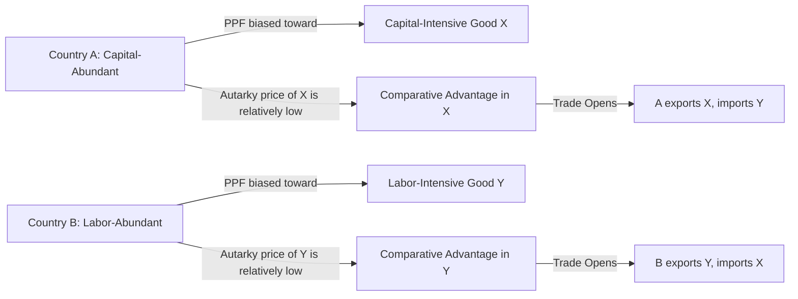

## Heckscher-Ohlin Model and Factor Endowments

### Overview

The Heckscher-Ohlin (H-O) model is a general equilibrium theory of international trade developed by Eli Heckscher (1919) and expanded by Bertil Ohlin (1933), later formalized mathematically by Paul Samuelson. It explains the pattern of trade between countries based on differences in relative factor endowments (labor, capital, land) rather than differences in technology, which was the basis of the Ricardian model. The model is often called the **Factor Proportions Theory**.

The central proposition: **a country will export the good that uses its relatively abundant factor intensively, and import the good that uses its relatively scarce factor intensively.**

### Core Assumptions

- **Two countries, two goods, two factors (2x2x2 model)**: typically Home and Foreign; goods X and Y; factors capital (K) and labor (L)
- Identical production technology (production functions) across countries
- Different relative factor endowments between countries
- Factors are perfectly mobile between industries within a country, but immobile between countries
- Goods differ in **factor intensity**: one good is capital-intensive, the other labor-intensive, and this ranking holds at all relative factor prices (no factor-intensity reversal)
- Identical and homothetic consumer preferences across countries
- Perfect competition in both goods and factor markets
- No transportation costs, tariffs, or other trade barriers
- Constant returns to scale in production
- Full employment of resources

### Factor Abundance: Two Definitions

**Physical (quantity) definition:**

Country A is capital-abundant relative to Country B if:

$$\frac{K_A}{L_A} > \frac{K_B}{L_B}$$

This compares the physical ratio of total capital stock to total labor stock.

**Price definition:**

Country A is capital-abundant if the relative price (rental rate) of capital to wage is lower than in Country B:

$$\left(\frac{r}{w}\right)_A < \left(\frac{r}{w}\right)_B$$

The price definition is considered more rigorous because it accounts for both supply and demand conditions for factors, whereas the physical definition only accounts for supply.

### Factor Intensity

A good is **capital-intensive** if it uses a higher ratio of capital to labor in production compared to another good, regardless of the country producing it:

$$\left(\frac{K}{L}\right)_X > \left(\frac{K}{L}\right)_Y \implies X \text{ is capital-intensive}$$

This ranking must be consistent across all factor price ratios for the model's clean predictions to hold (violation of this is called **factor-intensity reversal**, discussed below).

### The Heckscher-Ohlin Theorem

**Statement**: A country will export the good whose production is intensive in the factor with which the country is relatively well-endowed, and import the good intensive in its relatively scarce factor.

**Example:**

- Country A (capital-abundant, e.g., Germany) exports capital-intensive goods (e.g., machinery)
- Country B (labor-abundant, e.g., Bangladesh) exports labor-intensive goods (e.g., textiles)

**Intuition**: Abundant factors are relatively cheap domestically. Cheap factors lower the production cost of goods that use them intensively, giving that country a comparative advantage in producing and exporting those goods.

### Diagrammatic Representation (Edgeworth Box and PPF)

Differences in factor endowments generate differently shaped Production Possibility Frontiers (PPFs). The capital-abundant country's PPF is biased toward the capital-intensive good; the labor-abundant country's PPF is biased toward the labor-intensive good. Under identical, homothetic preferences, relative autarky prices differ across countries purely due to these endowment-driven PPF shapes — this price difference is the basis for trade.

**Diagram description (svg_diagram):** A bowed-out PPF diagram would show Country A's curve stretched further along the X-axis (capital-intensive good) and Country B's curve stretched further along the Y-axis (labor-intensive good), with autarky equilibrium tangency points at different relative price lines.

<svg xmlns="http://www.w3.org/2000/svg" viewBox="0 0 640 380">
<text x="320" y="24" text-anchor="middle" font-size="16" font-weight="bold" fill="#1a1a1a">PPF Comparison: Capital-Abundant vs Labor-Abundant Country (svg_diagram)</text>

<g>
<line x1="60" y1="320" x2="60" y2="60" stroke="#333" stroke-width="2" />
<line x1="60" y1="320" x2="290" y2="320" stroke="#333" stroke-width="2" />
<text x="30" y="60" font-size="12" fill="#333">Y</text>
<text x="295" y="335" font-size="12" fill="#333">X (capital-int.)</text>
<path d="M 60 320 C 90 300, 260 260, 285 80" fill="none" stroke="#2563eb" stroke-width="3" />
<text x="130" y="360" font-size="13" font-weight="bold" fill="#2563eb" text-anchor="middle">Country A (Capital-Abundant)</text>
<text x="130" y="375" font-size="11" fill="#555" text-anchor="middle">PPF stretched toward Good X</text>
</g>

<g transform="translate(340,0)">
<line x1="60" y1="320" x2="60" y2="60" stroke="#333" stroke-width="2" />
<line x1="60" y1="320" x2="290" y2="320" stroke="#333" stroke-width="2" />
<text x="30" y="60" font-size="12" fill="#333">Y (labor-int.)</text>
<text x="240" y="335" font-size="12" fill="#333">X</text>
<path d="M 60 320 C 65 140, 100 90, 285 80" fill="none" stroke="#dc2626" stroke-width="3" />
<text x="170" y="360" font-size="13" font-weight="bold" fill="#dc2626" text-anchor="middle">Country B (Labor-Abundant)</text>
<text x="170" y="375" font-size="11" fill="#555" text-anchor="middle">PPF stretched toward Good Y</text>
</g>
</svg>

### Mathematical Formalization

Using a simplified two-factor, two-good, constant-returns setup with Cobb-Douglas-type production:

$$Q_X = f(K_X, L_X), \quad Q_Y = g(K_Y, L_Y)$$

Full employment conditions:

$$K_X + K_Y = K, \quad L_X + L_Y = L$$

Zero-profit (perfect competition) conditions link goods prices to factor prices:

$$P_X = a_{KX} \cdot r + a_{LX} \cdot w$$

$$P_Y = a_{KY} \cdot r + a_{LY} \cdot w$$

where $a_{KX}$, $a_{LX}$ are the capital and labor input requirements per unit of good X (and similarly for Y). This system underlies the **Stolper-Samuelson** and **factor price equalization** results discussed below.

### The Four Key Corollary Theorems

The H-O framework produces four interrelated theorems, often tested together:

**1. Heckscher-Ohlin Theorem** (trade pattern)

Countries export goods that use their abundant factors intensively (stated above).

**2. Factor Price Equalization (FPE) Theorem** (Samuelson, 1948)

Free trade in goods, even with zero factor mobility, tends to equalize relative and absolute factor prices ($w$ and $r$) across trading countries. Trade in goods acts as an indirect substitute for factor mobility.

$$w_A = w_B, \quad r_A = r_B \quad \text{(in the idealized model, under strict assumptions)}$$

**3. Stolper-Samuelson Theorem** (1941)

An increase in the relative price of a good raises the real return to the factor used intensively in that good's production, and lowers the real return to the other factor.

$$\hat{P}_X \uparrow \implies \hat{r} \uparrow > \hat{P}_X > \hat{w} \downarrow \quad \text{(if X is capital-intensive)}$$

This is the theoretical foundation for the political economy of trade protection: it explains why scarce-factor owners lobby for tariffs (trade hurts them) while abundant-factor owners favor free trade.

**4. Rybczynski Theorem** (1955)

At constant relative goods prices, an increase in the endowment of one factor will increase the output of the good that uses that factor intensively (by more than proportionally) and decrease the output of the other good.

$$\hat{K} \uparrow \implies \hat{Q}_X \uparrow \uparrow, \quad \hat{Q}_Y \downarrow \quad \text{(if X is capital-intensive)}$$

### Key Points

- H-O explains trade patterns via **factor endowment differences**, not technology differences (contrast with Ricardian model)
- Comparative advantage arises endogenously from relative factor scarcity/abundance and resulting relative autarky prices
- The model predicts **income redistribution effects** from trade (Stolper-Samuelson), unlike the Ricardian model which shows gains for all
- FPE is a strong theoretical result rarely observed in practice due to violated assumptions (below)
- Rybczynski's theorem underlies analysis of the **Dutch Disease** phenomenon (resource booms shrinking manufacturing)

### Worked Example

Consider Home (capital-abundant) and Foreign (labor-abundant), producing Machinery (capital-intensive) and Textiles (labor-intensive).

| Country | Capital Stock | Labor Stock | K/L Ratio |
| --- | --- | --- | --- |
| Home | 800 | 200 | 4.0 |
| Foreign | 300 | 900 | 0.33 |

Since $(K/L)_{Home} = 4.0 > (K/L)_{Foreign} = 0.33$, Home is capital-abundant by the physical definition.

**Prediction**: Home exports Machinery (capital-intensive good); Foreign exports Textiles (labor-intensive good).

**Stolper-Samuelson application**: If Home opens to trade, the relative price of Machinery rises domestically toward the world price (since Home was relatively cheap in machinery pre-trade, but under free trade, price converges toward Foreign's world-influenced level, or Home specializes and exports more). This raises the real return to capital owners in Home and lowers the real wage of labor in Home — even though Home's aggregate gains from trade are positive. Owners of the scarce factor (labor, in Home) are made worse off in relative/real terms.

### The Leontief Paradox

**Wassily Leontief (1953)** tested the H-O model empirically using 1947 U.S. input-output data. Since the U.S. was widely considered the most capital-abundant country in the world at the time, H-O predicted the U.S. should export capital-intensive goods and import labor-intensive goods.

**Finding**: Leontief found the opposite — U.S. exports were **less** capital-intensive (and more labor-intensive) than U.S. import-competing goods. This became known as the **Leontief Paradox**.

**Proposed explanations:**

- **Human capital**: U.S. labor is highly skilled ("human capital-intensive"); if skill is treated as a form of capital, the paradox weakens or disappears (Kenen and others)
- **Natural resources**: Omission of land/natural resources as a third factor distorts two-factor comparisons
- **Factor-intensity reversal**: possible reversal of intensity rankings between countries undermines cross-country comparison validity
- **Tariff structure**: U.S. tariffs at the time protected labor-intensive industries more, distorting the trade pattern away from free-trade predictions
- **Demand-reversal**: unusually strong U.S. domestic demand for capital-intensive goods could offset supply-side comparative advantage

[Inference] Many economists consider the paradox at least partially resolved once human capital and skill differentials are incorporated, though this remains a matter of ongoing empirical debate depending on methodology and time period studied.

### Factor-Intensity Reversal

Factor-intensity reversal occurs when the ranking of capital/labor intensity between two goods is not consistent across different relative factor prices — i.e., Good X is capital-intensive relative to Good Y at one wage-rental ratio, but labor-intensive relative to Y at another wage-rental ratio. This can happen when goods have very different elasticities of substitution between capital and labor.

If reversal occurs:

- The H-O theorem's clean predictions break down
- FPE need not hold
- Empirical tests of H-O become unreliable, since intensity rankings differ by country

### Extensions of the Model

**1. Specific Factors Model (Ricardo-Viner)**

Relaxes the assumption of perfect factor mobility between sectors in the short run; some factors are "specific" to an industry. This produces different distributional predictions than long-run Stolper-Samuelson results.

**2. Multi-good, multi-factor generalizations**

Extending beyond 2x2x2 introduces additional complexity (e.g., the "Heckscher-Ohlin-Vanek" (HOV) formulation), which restates the theorem in terms of the **factor content of trade**:

$$F_{ic} = \sum_j a_{ij} \cdot T_{jc}$$

where $F_{ic}$ is the net factor content of factor $i$ embodied in country $c$'s trade.

**3. Vanek's Factor Content Theorem**

Predicts that a country's net exports of factor services (embodied in goods) will reflect its relative factor abundance, even in a multi-good, multi-factor world — this is the basis for most modern empirical tests of H-O-type predictions.

**4. New Trade Theory Contrast**

Krugman-style New Trade Theory explains intra-industry trade between similarly-endowed countries via economies of scale and product differentiation, addressing empirical trade patterns (like EU-US trade) that H-O struggles to explain, since H-O predicts only inter-industry trade based on endowment differences.

### Comparison: Ricardian vs Heckscher-Ohlin Models

| Feature | Ricardian Model | Heckscher-Ohlin Model |
| --- | --- | --- |
| Source of comparative advantage | Technology (labor productivity) differences | Factor endowment differences |
| Number of factors | One (labor) | Two or more (capital, labor, land) |
| Factor mobility | Perfectly mobile within country | Perfectly mobile within country, immobile across countries |
| Production possibilities | Linear PPF (constant opportunity cost) | Bowed/concave PPF (increasing opportunity cost) |
| Income distribution effects | Trade benefits all (no redistribution within country in simplest form) | Trade has winners and losers (Stolper-Samuelson) |
| Predicts | Trade pattern only | Trade pattern, factor prices, income distribution, output response to endowment changes |

### Empirical Status and Criticisms

- The Leontief Paradox significantly weakened confidence in the strict 2x2x2 H-O model as an empirical description of U.S. trade
- **Bowen, Leamer, and Sveikauskas (1987)** tested the generalized (HOV) version across many countries and factors, finding it performed poorly for most countries — matching predicted sign of factor trade less than 50% of the time in some specifications [Unverified — exact statistics vary by dataset and methodology]
- **Trefler (1995)** introduced "productivity-adjusted" factor endowments (accounting for cross-country technology/productivity differences), substantially improving the model's empirical fit — suggesting the *pure* H-O assumption of identical technologies across countries is a major driver of the model's earlier empirical failures
- Despite empirical shortcomings in strict form, H-O remains foundational for understanding **why** trade generates distributional conflict domestically (Stolper-Samuelson logic) and remains widely used in trade policy analysis (e.g., analyzing NAFTA, US-China trade effects on wage inequality)

### Policy Relevance

- **Trade and wage inequality**: Stolper-Samuelson logic is commonly invoked to explain rising skill premiums in developed countries following trade liberalization with labor-abundant developing countries (trade increases returns to abundant factor — skilled labor/capital — in developed countries, and reduces returns to their scarce factor — unskilled labor)
- **Political economy of protectionism**: predicts that scarce-factor owners (e.g., unskilled labor in capital-abundant countries) will lobby for tariffs, while abundant-factor owners favor liberalization
- **Resource curse / Dutch Disease**: Rybczynski-theorem logic explains how a boom in a resource-intensive sector (e.g., oil) can draw factors away from manufacturing, shrinking that sector even without a shift in relative prices

### Related Topics

- Ricardian Model of Comparative Advantage
- Specific Factors (Ricardo-Viner) Model
- Stolper-Samuelson Theorem and Wage Inequality
- Factor Price Equalization Theorem
- Rybczynski Theorem and Dutch Disease
- Leontief Paradox and Its Resolutions
- Heckscher-Ohlin-Vanek Model and Factor Content of Trade
- New Trade Theory (Krugman) and Intra-Industry Trade
- Gravity Model of International Trade
- Terms of Trade and Gains from Trade
- Trade Policy: Tariffs, Quotas, and Political Economy of Protection
- Human Capital Theory and Skill-Biased Technical Change