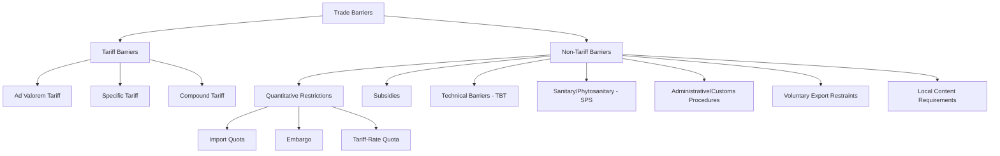
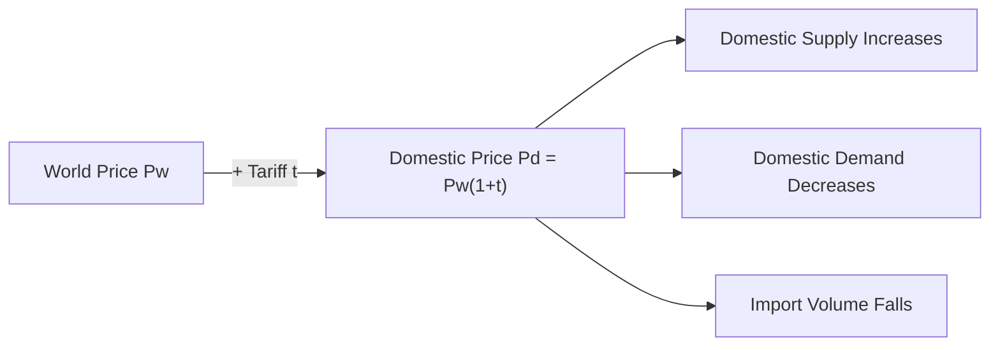

## Trade Barriers: Tariffs, Quotas, and Non-Tariff Measures

### Overview

Trade barriers are government-imposed restrictions on the free flow of goods and services across international borders. They are used to protect domestic industries, raise government revenue, correct perceived unfair trade practices, address national security concerns, or pursue non-economic objectives (environmental, health, cultural). Trade barriers are broadly classified into **tariff barriers** (taxes on imports/exports) and **non-tariff barriers (NTBs)**, which include quotas, subsidies, standards, and administrative measures.

### Classification of Trade Barriers

### Part 1: Tariffs

A **tariff** is a tax imposed by a government on imported (or, less commonly, exported) goods.

**Types of Tariffs:**

1. **Ad valorem tariff**: a fixed percentage of the good's value

   $$T = t \times P_w$$

   where $t$ is the tariff rate and $P_w$ is the world price
2. **Specific tariff**: a fixed monetary amount per physical unit (e.g., $2 per kilogram), independent of value
3. **Compound tariff**: a combination of ad valorem and specific components

   $$T = t \times P_w + s$$
4. **Mixed/alternative tariff**: the higher (or lower) of an ad valorem or specific rate, whichever binds

**Tariff Rate Effect on Domestic Price:**

$$P_d = P_w (1 + t)$$

where $P_d$ is the domestic price after tariff, $P_w$ is the world price, and $t$ is the ad valorem tariff rate.

### Partial Equilibrium Analysis of a Tariff (Small Country Case)

In a small country (price taker in world markets), a tariff raises the domestic price by the full amount of the tariff, since the country cannot influence the world price.

**Diagram: Tariff Welfare Effects (svg_diagram)**

<svg xmlns="http://www.w3.org/2000/svg" viewBox="0 0 640 420">
<text x="320" y="22" text-anchor="middle" font-size="16" font-weight="bold" fill="#1a1a1a">Partial Equilibrium Effects of a Tariff (svg_diagram)</text>
<line x1="80" y1="360" x2="80" y2="40" stroke="#333" stroke-width="2" />
<line x1="80" y1="360" x2="580" y2="360" stroke="#333" stroke-width="2" />
<text x="50" y="45" font-size="12" fill="#333">Price</text>
<text x="590" y="365" font-size="12" fill="#333">Quantity</text>

<path d="M 120 340 L 480 80" stroke="#2563eb" stroke-width="2.5" fill="none" />
<text x="490" y="75" font-size="12" fill="#2563eb">S (domestic)</text>

<path d="M 120 80 L 480 340" stroke="#dc2626" stroke-width="2.5" fill="none" />
<text x="490" y="345" font-size="12" fill="#dc2626">D (domestic)</text>

<line x1="80" y1="260" x2="560" y2="260" stroke="#16a34a" stroke-width="2" stroke-dasharray="6,3" />
<text x="565" y="264" font-size="11" fill="#16a34a">Pw</text>

<line x1="80" y1="200" x2="560" y2="200" stroke="#ea580c" stroke-width="2" stroke-dasharray="6,3" />
<text x="565" y="204" font-size="11" fill="#ea580c">Pw + t</text>

<circle cx="220" cy="260" r="3" fill="#000" />
<circle cx="380" cy="260" r="3" fill="#000" />
<circle cx="255" cy="200" r="3" fill="#000" />
<circle cx="340" cy="200" r="3" fill="#000" />

<text x="210" y="280" font-size="10" fill="#333">S1</text>

<text x="385" y="280" font-size="10" fill="#333">D1</text>

<text x="245" y="190" font-size="10" fill="#333">S2</text>

<text x="345" y="190" font-size="10" fill="#333">D2</text>

<polygon points="220,260 255,260 255,200" fill="#93c5fd" opacity="0.6" />
<text x="215" y="290" font-size="10" fill="#1e40af">a (Producer Surplus gain)</text>
<polygon points="255,200 340,200 340,260 255,260" fill="#fca5a5" opacity="0.5" />
<text x="270" y="310" font-size="10" fill="#7f1d1d">b + d (Deadweight Loss)</text>
<polygon points="255,200 340,200 340,260 255,260" fill="none" />
<polygon points="255,200 255,260 340,260" fill="#fde68a" opacity="0.7" />
<text x="380" y="230" font-size="10" fill="#92400e">c (Govt Tariff Revenue)</text>

<text x="80" y="380" font-size="11" fill="#555">Regions: a = producer surplus gain, c = tariff revenue, b+d = deadweight loss (efficiency loss)</text>

</svg>

**Welfare Effects (Small Country):**

| Effect | Direction | Region on Diagram |
| --- | --- | --- |
| Consumer Surplus | Decreases | −(a+b+c+d) |
| Producer Surplus | Increases | +a |
| Government Revenue | Increases | +c |
| Net National Welfare | **Decreases** | −(b+d) |

The net welfare loss consists of:

- **Production distortion loss (b)**: resources shift into relatively inefficient domestic production
- **Consumption distortion loss (d)**: consumers forgo units they valued more than the world price

$$\text{Deadweight Loss} = \frac{1}{2} \times t \times \Delta Q_{supply} + \frac{1}{2} \times t \times \Delta Q_{demand}$$

**Key Points**

- In the small-country case, a tariff **always reduces national welfare** — there is no terms-of-trade gain to offset the deadweight loss
- The four areas (a, b, c, d) sum to the total change in surplus; b and d are pure efficiency losses to society

### Large Country Case: Optimal Tariff

If the country is large enough to affect world prices (a "large country"), a tariff can improve the country's terms of trade by reducing the world price of the imported good (since the country's reduced demand lowers the price foreign exporters receive).

$$P_w^{new} < P_w^{old}$$

This creates a **terms-of-trade gain** that can, in principle, offset the deadweight loss, producing a net national welfare *gain* — though this comes at the expense of the trading partner (a beggar-thy-neighbor effect), and invites retaliation.

**Optimal Tariff Formula:**

$$t^* = \frac{1}{e^* - 1}$$

where $e^*$ is the foreign export supply elasticity. A higher optimal tariff rate is associated with a less elastic (steeper) foreign export supply curve. [Inference] In practice, estimating $e^*$ precisely is difficult, and retaliation risk typically limits the practical use of this formula as a policy tool.

**Key Points**

- Large-country tariffs redistribute welfare from the trade partner to the tariff-imposing country (terms-of-trade gain) but reduce global welfare overall
- Retaliation risk (trade wars) can erode or reverse the initial gain, as both countries end up worse off than under free trade (a Prisoner's Dilemma-like outcome)

### Effective Rate of Protection (ERP)

The **nominal tariff rate** measures protection on the final good price, but the **Effective Rate of Protection** measures protection of *value added* in an industry, accounting for tariffs on both outputs and imported inputs.

$$ERP = \frac{V' - V}{V}$$

where $V$ is value added at world (free-trade) prices and $V'$ is value added at domestic (post-tariff) prices. A simplified formula with one imported input:

$$ERP = \frac{t_f - a \cdot t_i}{1 - a}$$

where $t_f$ = nominal tariff on the final good, $t_i$ = nominal tariff on the imported input, and $a$ = the input's share of the final good's value at world prices.

**Tariff Escalation**: many countries impose higher tariffs on finished/processed goods than on raw materials, which raises the ERP for domestic processing industries well above the nominal tariff rate — a practice often criticized for disadvantaging developing-country exporters of processed goods.

### Part 2: Import Quotas

A **quota** is a direct quantitative limit on the volume (or value) of a good that may be imported during a given period.

**Comparison: Tariff vs Quota (Equivalent Restriction)**

A tariff and a quota can be set to produce the *same* price and quantity outcome under perfect competition (a "quota-equivalent tariff"), but they differ critically in other respects:

| Dimension | Tariff | Quota |
| --- | --- | --- |
| Government revenue | Yes (tariff revenue, area c) | No, unless quota licenses are auctioned |
| Who captures the "rent"? | Government | License holders (importers/exporters) — this is "quota rent" |
| Response to demand growth | Import volume adjusts (price fixed by tariff) | Price adjusts (quantity is fixed) — more distortionary under demand growth |
| Under monopoly domestic supply | Tariff still allows some competitive discipline from imports at margin | Quota can fully insulate a domestic monopolist, allowing monopoly pricing |
| Administrative complexity | Lower | Higher (licensing, allocation, enforcement) |
| Transparency | More transparent (published rate) | Less transparent, prone to corruption/rent-seeking in license allocation |

**Quota Rent**: the price gap ($P_d - P_w$) times the quota quantity, captured by whoever holds the import license (domestic importers, or foreign exporters if the quota is a Voluntary Export Restraint).

$$\text{Quota Rent} = (P_d - P_w) \times Q_{quota}$$

**Tariff-Rate Quota (TRQ)**: a hybrid instrument — a lower tariff rate applies to imports up to a specified quota volume, and a higher tariff rate applies to imports beyond that volume. Common in agricultural trade under WTO commitments.

### Voluntary Export Restraint (VER)

A VER is a quota administered by the *exporting* country, typically under political pressure from the importing country, limiting the volume of exports. Because the exporting country's producers (rather than the importing country's government or importers) capture the quota rent, VERs are generally more costly to the importing country than an equivalent tariff. Classic historical examples include the U.S.-Japan automobile VER of the early 1980s.

### Part 3: Non-Tariff Measures (NTMs) / Non-Tariff Barriers (NTBs)

Non-tariff measures encompass all trade-restricting policy measures other than ordinary customs tariffs. The WTO and UNCTAD maintain formal classification systems (e.g., the **MAST classification**) covering the following major categories:

**1. Sanitary and Phytosanitary Measures (SPS)**

Regulations protecting human, animal, or plant health/life (e.g., food safety standards, pesticide residue limits, animal health certifications). Governed by the WTO **SPS Agreement**, requiring measures to be based on scientific evidence and risk assessment.

**2. Technical Barriers to Trade (TBT)**

Product standards, technical regulations, labeling requirements, and conformity assessment procedures (e.g., electrical safety standards, packaging requirements). Governed by the WTO **TBT Agreement**.

**3. Subsidies**

Government financial assistance to domestic producers (direct payments, tax breaks, low-interest loans) that lowers their costs relative to foreign competitors, distorting trade without directly restricting imports.

**4. Local Content Requirements (LCRs)**

Rules mandating that a specified percentage of a final product's components or value be sourced domestically.

**5. Government Procurement Restrictions**

Preferences for domestic firms in public sector purchasing contracts.

**6. Customs and Administrative Procedures**

Complex documentation requirements, slow customs clearance, arbitrary customs valuation, or excessive inspection requirements that raise the effective cost of importing (sometimes called "red-tape barriers").

**7. Rules of Origin**

Criteria determining the "nationality" of a good for tariff purposes; can be manipulated to restrict eligibility for preferential tariff treatment under trade agreements.

**8. Anti-Dumping and Countervailing Duties (AD/CVD)**

- **Anti-dumping duties**: imposed when a foreign firm is found to be exporting at a price below its "normal value" (home market price or cost of production), causing material injury to the domestic industry
- **Countervailing duties**: imposed to offset the effect of a foreign government subsidy that unfairly injures domestic producers

$$\text{Dumping Margin} = \frac{\text{Normal Value} - \text{Export Price}}{\text{Export Price}} \times 100\%$$

**9. Embargoes**

A complete prohibition on trade with a specific country or in a specific good, often for political or national security reasons rather than economic protection.

### Comparative Summary Table

| Barrier Type | Mechanism | Revenue Captured By | Typical Justification |
| --- | --- | --- | --- |
| Ad Valorem Tariff | % tax on import value | Government | Revenue, protection |
| Specific Tariff | Fixed $ per unit | Government | Protection, simplicity |
| Import Quota | Quantity limit | License holder | Protection, balance of payments |
| VER | Export-side quantity limit | Foreign exporter | Political pressure avoidance |
| TRQ | Tiered tariff by volume | Government (partial) | Managed liberalization (agriculture) |
| Subsidy | Domestic cost reduction | N/A (cost to taxpayer) | Infant industry, strategic sectors |
| SPS/TBT | Standards/regulations | N/A | Health, safety, environment |
| Anti-dumping duty | Additional duty on "unfairly priced" imports | Government | Fair trade remedy |

### Worked Example: Tariff Welfare Calculation

Suppose the world price of steel is $P_w = \$500$/ton. A country imposes a 20% ad valorem tariff.

$$P_d = 500 \times (1 + 0.20) = \$600/\text{ton}$$

If, at $P_w = \$500$, domestic demand is 100,000 tons and domestic supply is 40,000 tons (imports = 60,000 tons), and at $P_d = \$600$, domestic demand falls to 90,000 tons and domestic supply rises to 55,000 tons (imports fall to 35,000 tons):

- **Government tariff revenue** = $t \times P_w \times Q_{imports}^{new}$ = $0.20 \times 500 \times 35{,}000 = \$3{,}500{,}000$
- **Deadweight loss (approx., using triangle approximation)**:

  $$DWL \approx \frac{1}{2} \times (P_d - P_w) \times [(Q_{S,new} - Q_{S,old}) + (Q_{D,old} - Q_{D,new})]$$

  $$DWL \approx \frac{1}{2} \times 100 \times [(55{,}000-40{,}000) + (100{,}000-90{,}000)] = \frac{1}{2} \times 100 \times 25{,}000 = \$1{,}250{,}000$$

### Institutional and Policy Context

- **WTO framework**: tariffs are the "preferred" and most transparent form of protection under WTO rules; members generally commit to tariff "bindings" (maximum rates) via schedules of concessions, and are discouraged from using quotas except in specific circumstances (balance-of-payments crises, agriculture transition periods, safeguard actions)
- **GATT Article XI**: generally prohibits quantitative restrictions (quotas) in favor of tariffs, reflecting the post-WWII consensus that tariffs are more transparent and less distortionary than quotas
- **Safeguard measures**: WTO members may temporarily impose tariffs or quotas to protect a domestic industry facing a sudden surge in imports causing serious injury, under the **Agreement on Safeguards**
- [Inference] The relative prevalence of NTBs versus tariffs has increased over recent decades as average bound tariff rates have fallen through successive GATT/WTO negotiating rounds, since governments seeking to protect domestic industries have increasingly turned to less-transparent NTMs — this shift is well documented in trade policy literature though exact magnitudes vary by country and sector.

### Related Topics

- Effective Rate of Protection and Tariff Escalation
- Optimal Tariff Theory and Terms-of-Trade Effects
- WTO Dispute Settlement and Trade Remedies (AD/CVD, Safeguards)
- Regional Trade Agreements and Preferential Rules of Origin
- Infant Industry Argument for Protection
- Strategic Trade Policy and Export Subsidies
- Balance of Payments and Trade Policy
- Non-Tariff Measures Database (UNCTAD TRAINS, WTO I-TIP)
- Trade Wars and Retaliation Dynamics
- Heckscher-Ohlin Model and Factor Endowments