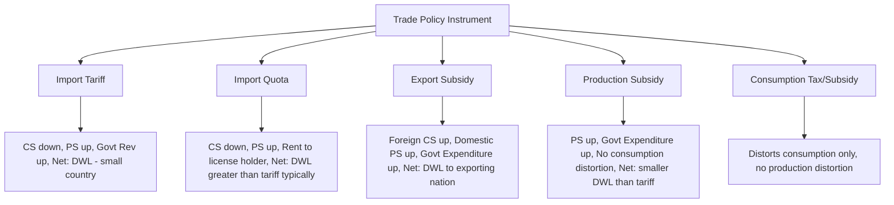

## Effects of Trade Policy on Welfare

### Overview

Trade policy welfare analysis evaluates how instruments such as tariffs, quotas, subsidies, and free trade agreements affect the economic well-being of consumers, producers, government, and the nation as a whole. The standard toolkit uses **consumer surplus (CS)**, **producer surplus (PS)**, and **government revenue (GR)** to decompose the net effect of a policy into distributional and efficiency components. This topic synthesizes and extends the welfare analysis introduced under tariffs and quotas into a general framework applicable to all trade policy instruments.

### Foundational Concepts

**Consumer Surplus**: the area below the demand curve and above the market price, representing the difference between what consumers are willing to pay and what they actually pay.

$$CS = \int_{0}^{Q_d} [D^{-1}(q) - P] \, dq$$

**Producer Surplus**: the area above the supply curve and below the market price, representing revenue in excess of marginal cost.

$$PS = \int_{0}^{Q_s} [P - S^{-1}(q)] \, dq$$

**National Welfare**: the sum of consumer surplus, producer surplus, and net government revenue (or minus net government expenditure).

$$W = CS + PS + GR$$

### General Welfare Effects Framework by Policy Instrument

### Welfare Effects by Policy Instrument (Small Country / Price-Taker Case)

| Instrument | Consumer Surplus | Producer Surplus | Government Budget | Net National Welfare |
| --- | --- | --- | --- | --- |
| Import Tariff | ↓ | ↑ | ↑ (revenue) | ↓ (DWL = production + consumption distortion) |
| Import Quota | ↓ | ↑ | 0 (unless auctioned) | ↓ (DWL, often larger — includes rent-seeking risk) |
| Export Subsidy | ↓ (domestic price rises) | ↑ | ↓ (expenditure) | ↓ (DWL on both production and consumption sides, larger than tariff's) |
| Production Subsidy | 0 (no change) | ↑ | ↓ (expenditure) | ↓ (smaller DWL — only production distortion, no consumption distortion) |
| VER | ↓ | ↑ | 0 (rent to foreign exporter) | ↓ (largest DWL — rent leaves the country) |
| Import Ban/Embargo | ↓↓ | ↑↑ | 0 | ↓↓ (largest distortion — autarky-level loss) |

**Key Points**

- A **production subsidy** is the most efficient way to support a domestic industry among protectionist tools, because it avoids the consumption-side distortion entirely — it only creates a production distortion
- An **import quota** with unallocated rents (given away to license holders, especially foreign firms as in a VER) generates a larger national welfare loss than an equivalent tariff, because the tariff at least returns area "c" to the domestic government as revenue
- **Export subsidies** are generally the most welfare-reducing instrument for the subsidizing country, since they simultaneously worsen the terms of trade (by increasing world supply and lowering the world price the country's own exporters receive) and cost the government budget directly

### Ranking of Policy Instruments by Efficiency (Domestic Welfare, Small Country)

From least to most distortionary, for achieving an equivalent increase in domestic output of the protected good:

$$\text{Production Subsidy} < \text{Tariff} < \text{Import Quota} \leq \text{VER}$$

[Inference] This ranking is the standard theoretical result under the assumption of perfect competition and no rent-seeking costs; in practice, administrative costs of subsidies (raised via distortionary taxation) can offset some of this theoretical efficiency advantage, a point raised in public finance-oriented critiques of the "subsidy is always best" conclusion.

### Diagrammatic Comparison: Tariff vs Production Subsidy (Equivalent Output Effect)

<svg xmlns="http://www.w3.org/2000/svg" viewBox="0 0 640 420">
<text x="320" y="22" text-anchor="middle" font-size="15" font-weight="bold" fill="#1a1a1a">Tariff vs Production Subsidy: Welfare Comparison (svg_diagram)</text>
<line x1="80" y1="360" x2="80" y2="40" stroke="#333" stroke-width="2" />
<line x1="80" y1="360" x2="580" y2="360" stroke="#333" stroke-width="2" />
<text x="50" y="45" font-size="12" fill="#333">Price</text>
<text x="590" y="365" font-size="12" fill="#333">Quantity</text>
<path d="M 120 340 L 480 80" stroke="#2563eb" stroke-width="2.5" fill="none" />
<text x="490" y="75" font-size="12" fill="#2563eb">S (domestic)</text>
<path d="M 120 80 L 480 340" stroke="#dc2626" stroke-width="2.5" fill="none" />
<text x="490" y="345" font-size="12" fill="#dc2626">D (domestic)</text>
<line x1="80" y1="260" x2="560" y2="260" stroke="#16a34a" stroke-width="2" stroke-dasharray="6,3" />
<text x="565" y="264" font-size="11" fill="#16a34a">Pw</text>
<line x1="80" y1="200" x2="560" y2="200" stroke="#ea580c" stroke-width="2" stroke-dasharray="6,3" />
<text x="565" y="204" font-size="11" fill="#ea580c">Pw+t (tariff price to producer AND consumer)</text>

<line x1="220" y1="200" x2="220" y2="260" stroke="#7c3aed" stroke-width="2" stroke-dasharray="2,2" />
<text x="140" y="230" font-size="9" fill="#7c3aed">Subsidy gap (Govt cost, no consumer effect)</text>

<text x="80" y="385" font-size="11" fill="#555">Tariff: producer AND consumer price rise to Pw+t (both distortions)</text>

<text x="80" y="400" font-size="11" fill="#555">Subsidy: producer price rises to Pw+t, consumer price stays at Pw (one distortion only)</text>

</svg>

Under a **production subsidy**, only the domestic supply curve responds to the higher effective producer price; consumers continue to pay the world price $P_w$, so there is no consumption-side deadweight loss triangle — only the production-side triangle remains, financed by the government budget rather than by consumers.

### Large-Country Considerations: Terms-of-Trade Effects

For a **large country** capable of affecting world prices, trade policy welfare analysis must also account for the **terms-of-trade (ToT) effect**:

$$W_{large} = W_{small} + \Delta ToT$$

- An import **tariff** by a large country lowers the world price of the imported good (improves the tariff-imposer's terms of trade), providing a potential welfare gain that can offset (or exceed) the domestic deadweight loss — this is the basis of the **optimal tariff** argument
- An export **subsidy** by a large country *worsens* its own terms of trade (it increases world supply of its export good, lowering the world price its exporters receive), compounding the direct budgetary cost — this is why export subsidies are almost always welfare-reducing for a large exporting country, even before considering foreign retaliation
- An **export tax** by a large country can improve its terms of trade (analogous to an optimal tariff on exports) by restricting export supply and raising the world price

$$\text{Optimal Export Tax} = \frac{1}{e_f - 1}$$

where $e_f$ is the foreign import demand elasticity.

### General Equilibrium / Global Welfare Considerations

- Any unilateral trade intervention by a large country that improves its own welfare via terms-of-trade manipulation **necessarily worsens the welfare of its trading partners** by an even larger amount in aggregate (global welfare falls), since the intervention introduces a real distortion into world resource allocation
- **Retaliation dynamics**: if trading partners respond with their own tariffs (a trade war), both countries typically end up worse off than under free trade — modeled as a Prisoner's Dilemma in game-theoretic trade policy analysis, and the empirical/theoretical motivation for multilateral cooperation via the WTO
- **Free trade as a (constrained) global welfare optimum**: absent externalities, market failures, or strategic terms-of-trade considerations, free trade maximizes aggregate global welfare (though not necessarily each country's or each group's welfare individually)

### Distributional and Political Economy Dimensions

Trade policy welfare analysis distinguishes **efficiency effects** (aggregate welfare, deadweight loss) from **distributional effects** (who gains, who loses):

- **Stolper-Samuelson logic**: trade liberalization benefits the economy's abundant factor and harms the scarce factor in relative real-income terms, even when aggregate national welfare rises — explaining persistent political resistance to trade liberalization from scarce-factor owners
- **Specific Factors Model implication**: in the short run, factors tied to the import-competing sector lose from liberalization regardless of overall factor abundance, while factors in the export sector gain — a more granular, sector-specific view than the long-run Stolper-Samuelson result
- **Compensation principle (Kaldor-Hicks)**: since aggregate gains from trade liberalization typically exceed aggregate losses, winners could in principle compensate losers and still be better off, though actual compensation mechanisms (trade adjustment assistance) are often incomplete or politically contested in real economies

### Market Failure Rationales for Deviating from Free Trade

Despite the general efficiency case for free trade, several recognized market-failure arguments can justify welfare-improving intervention:

**1. Infant Industry Argument**

Temporary protection can allow a developing industry to achieve scale/learning economies it could not reach while exposed to immediate foreign competition, potentially yielding long-run welfare gains that outweigh short-run costs. [Inference] Empirical support is mixed and historically contested — success appears to depend heavily on whether protection is time-limited and paired with mechanisms forcing eventual competitiveness, rather than protection being open-ended.

**2. Externalities**

Production or consumption externalities (e.g., environmental damage, knowledge spillovers from R&D-intensive export sectors) can justify a **domestic** policy (tax/subsidy) targeted directly at the externality — trade policy is generally a second-best tool compared to a targeted domestic instrument (the "**targeting principle**").

**3. Strategic Trade Policy**

In oligopolistic markets with few global firms (e.g., aircraft manufacturing), a government subsidy can shift excess returns ("rents") from a foreign competitor to a domestic firm, a result associated with Brander-Spencer models. [Inference] This argument is theoretically valid under specific oligopoly assumptions but is highly sensitive to model specification and invites retaliation, so its practical policy applicability is debated among economists.

**4. Revenue Considerations (Developing Economies)**

In economies with weak domestic tax administration, tariffs may remain an administratively convenient revenue source despite their efficiency costs — a second-best argument rooted in public finance constraints rather than trade theory per se.

### The Targeting Principle

When market failures exist, welfare economics recommends addressing the distortion as close to its source as possible:

$$\text{Domestic Production Externality} \implies \text{Production Subsidy/Tax (not tariff)}$$

$$\text{Domestic Consumption Externality} \implies \text{Consumption Tax/Subsidy (not tariff)}$$

Using a trade policy (tariff) to correct a purely domestic distortion is generally welfare-inferior to a domestic policy instrument targeted directly at the source, because the tariff introduces an *additional*, unnecessary distortion (e.g., a consumption distortion when only a production externality exists).

### Worked Numerical Example: Comparing Tariff and Subsidy for Equal Output Gain

Suppose a small country's domestic supply and demand for a good are:

$$Q_S = 20 + 0.5P, \quad Q_D = 100 - 0.5P$$

World price $P_w = \$40$.

At $P_w = 40$: $Q_S = 40$, $Q_D = 80$, imports = 40.

**Policy goal**: raise domestic output to $Q_S = 50$, requiring effective producer price of $P' = 60$ (since $50 = 20 + 0.5(60)$).

**Option A — Tariff of $20** (raises both producer and consumer price to $60):

- New $Q_S = 50$, new $Q_D = 100 - 0.5(60) = 70$
- Consumer surplus loss $\approx \frac{1}{2}(20)(80-70) + 20 \times 70$ portion attributable to transfer; deadweight loss triangle from both production ($\frac{1}{2} \times 20 \times 10 = 100$) and consumption ($\frac{1}{2} \times 20 \times 10 = 100$) sides
- **Total DWL ≈ $200**

**Option B — Production subsidy of $20/unit** (producer price rises to $60, consumer price stays at $40):

- New $Q_S = 50$ (same as tariff), $Q_D$ remains 80 (unchanged, since consumer price is unaffected)
- Only a production-side deadweight loss: $\frac{1}{2} \times 20 \times 10 = \$100$
- Government cost = $20 \times 50 = \$1000$ (larger direct budget cost, but smaller efficiency loss)
- **Total DWL ≈ $100**

This confirms the theoretical ranking: the subsidy achieves the identical output objective with **half the deadweight loss** of the tariff, though it requires explicit government expenditure rather than generating revenue.

### Key Points

- Welfare analysis of trade policy always separates **efficiency effects** (net national welfare, DWL) from **distributional effects** (CS vs PS vs government budget)
- For a small country, any trade restriction (tariff, quota, VER) reduces national welfare relative to free trade; only market failures or large-country terms-of-trade power can justify a welfare-improving intervention
- Production subsidies dominate tariffs in efficiency terms when the policy goal is purely to support domestic output, because they avoid the consumption-side distortion
- Quotas and VERs are generally less efficient than equivalent tariffs because they transfer the "rent" away from the domestic government (or, in the case of a VER, out of the country entirely)
- Large-country tariffs can theoretically raise national welfare via terms-of-trade improvement, but at the expense of trade partners and global welfare, and with retaliation risk

### Related Topics

- Trade Barriers: Tariffs, Quotas, and Non-Tariff Measures
- Heckscher-Ohlin Model and Factor Endowments
- Optimal Tariff Theory and Terms-of-Trade Manipulation
- Strategic Trade Policy and Brander-Spencer Models
- Infant Industry Protection: Theory and Evidence
- Stolper-Samuelson Theorem and Income Distribution
- WTO Rules, Trade Remedies, and Dispute Settlement
- Trade Adjustment Assistance and Compensation Mechanisms
- Externalities and the Targeting Principle in Trade Policy
- Regional Trade Agreements and Preferential Liberalization