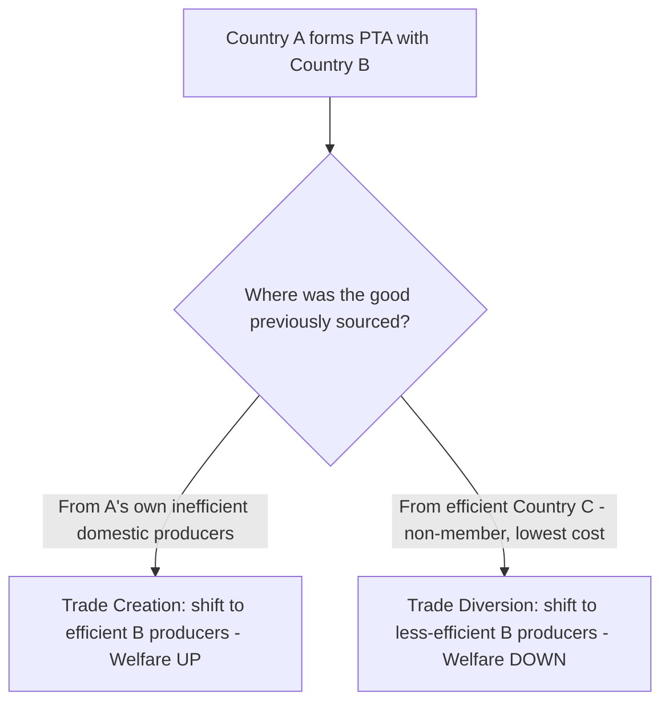
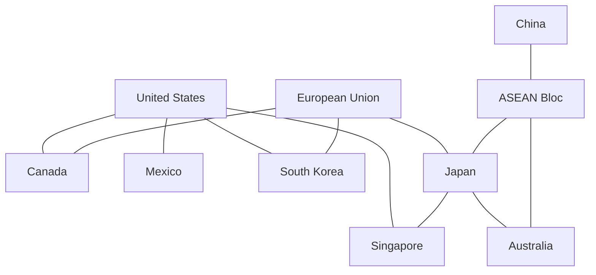

## Trade Agreements and Economic Integration

### Overview

Economic integration refers to the process by which countries reduce or eliminate barriers to trade and factor movements between them, ranging from simple tariff reductions to full political and monetary union. Trade agreements are the legal instruments through which this integration occurs, spanning bilateral, regional, and multilateral levels. This topic covers the **Balassa stages of integration**, the economics of preferential trade agreements (trade creation vs. trade diversion), and the institutional landscape of global and regional trade governance.

### Balassa's Stages of Economic Integration

Bela Balassa (1961) proposed a widely used five-stage taxonomy of increasing integration depth:

| Stage | Internal Tariffs | Common External Tariff | Factor Mobility | Policy Harmonization | Example |
| --- | --- | --- | --- | --- | --- |
| Preferential Trade Area (PTA) | Reduced (not zero) | No | No | No | Early ASEAN, Global System of Trade Preferences |
| Free Trade Area (FTA) | Eliminated | No (each keeps own external tariff) | No | No | NAFTA/USMCA, EFTA |
| Customs Union (CU) | Eliminated | Yes | No | No | Mercosur, EU Customs Union (1968) |
| Common Market | Eliminated | Yes | Yes (labor, capital) | No | EU Single Market (1993–) |
| Economic Union | Eliminated | Yes | Yes | Yes (some macro/fiscal policy) | European Union (partial), Eurozone (monetary) |
| Political Union | Eliminated | Yes | Yes | Full (single government) | [Hypothetical/rare — no full contemporary example] |

**Key distinguishing feature — Free Trade Area vs. Customs Union**: In an FTA, each member retains its own independent external tariff schedule against non-members, which necessitates **rules of origin** to prevent trade deflection (importing through the lowest-tariff member and re-exporting tariff-free to other members). A Customs Union eliminates this problem by adopting a **Common External Tariff (CET)**, removing the need for rules of origin on internal trade.

### Trade Creation and Trade Diversion (Viner, 1950)

Jacob Viner's analysis of customs unions identifies two opposing effects of preferential trade agreements (PTAs), determining whether an agreement is welfare-improving or welfare-reducing.

**Trade Creation**: occurs when a member country shifts its consumption from a higher-cost domestic producer to a lower-cost producer within the union, as tariffs between members are eliminated. This is welfare-**improving**, as it moves production toward the true lowest-cost source.

**Trade Diversion**: occurs when a member country shifts its imports from a lower-cost producer outside the union to a higher-cost producer inside the union, purely because of the preferential tariff elimination (while the external tariff against the non-member remains). This is welfare-**reducing**, as it moves production away from the true lowest-cost source.

**Diagram: Trade Creation vs Trade Diversion (svg_diagram)**

<svg xmlns="http://www.w3.org/2000/svg" viewBox="0 0 640 380">
<text x="320" y="22" text-anchor="middle" font-size="15" font-weight="bold" fill="#1a1a1a">Trade Creation vs Trade Diversion: Cost Comparison (svg_diagram)</text>

<g>
<text x="150" y="55" font-size="13" font-weight="bold" fill="#16a34a" text-anchor="middle">Trade Creation (Welfare-Improving)</text>
<rect x="60" y="80" width="80" height="120" fill="#93c5fd" opacity="0.7" />
<text x="100" y="210" font-size="11" text-anchor="middle">Home Cost: \$50</text>
<rect x="180" y="120" width="80" height="80" fill="#86efac" opacity="0.7" />
<text x="220" y="210" font-size="11" text-anchor="middle">Partner Cost: \$35</text>
<text x="160" y="235" font-size="10" text-anchor="middle" fill="#333">Shift from \$50 (home, inefficient)</text>
<text x="160" y="248" font-size="10" text-anchor="middle" fill="#333">to \$35 (partner) → true efficiency gain</text>
</g>

<g transform="translate(330,0)">
<text x="150" y="55" font-size="13" font-weight="bold" fill="#dc2626" text-anchor="middle">Trade Diversion (Welfare-Reducing)</text>
<rect x="60" y="140" width="80" height="60" fill="#fde68a" opacity="0.8" />
<text x="100" y="215" font-size="11" text-anchor="middle">Rest-of-World Cost: \$30</text>
<rect x="180" y="110" width="80" height="90" fill="#fca5a5" opacity="0.8" />
<text x="220" y="215" font-size="11" text-anchor="middle">Partner Cost: \$38 (with pref.)</text>
<text x="160" y="240" font-size="10" text-anchor="middle" fill="#333">Shift from \$30 (world, efficient)</text>
<text x="160" y="253" font-size="10" text-anchor="middle" fill="#333">to \$38 (partner) → efficiency loss</text>
</g>

<text x="320" y="300" font-size="11" text-anchor="middle" fill="#555">Net welfare effect of a PTA depends on the relative magnitude of creation vs diversion</text>

</svg>

**Net Welfare Effect:**

$$\Delta W_{PTA} = (\text{Trade Creation Gain}) - (\text{Trade Diversion Loss})$$

A customs union or FTA is welfare-improving for the world (and typically for the member) only if trade creation effects dominate trade diversion effects.

### Factors Favoring Net Trade Creation (More Likely Beneficial PTA)

- Members have **similar, competing** production structures pre-union (more scope for efficiency-driven reallocation within the bloc)
- Members are **large relative to the rest of the world** in the relevant sector, and geographically/economically natural trading partners
- **Pre-union tariffs are high** (larger initial distortion to correct)
- The **common external tariff is low** (limits the incentive to divert trade away from efficient non-member producers)
- Many, rather than few, potential member countries (larger union captures more of global trade creation potential — this underlies arguments for multilateralism over narrow regionalism)

### Static vs Dynamic Effects of Integration

**Static effects**: the once-and-for-all resource reallocation captured by trade creation/diversion analysis above (comparative statics of moving from one equilibrium to another).

**Dynamic effects** (harder to quantify, but often argued to be larger in magnitude):

- **Economies of scale**: firms gain access to a larger market, enabling scale economies previously unavailable domestically
- **Increased competition**: reduces domestic monopoly/oligopoly power, lowering prices and X-inefficiency
- **Investment effects**: integration can attract increased foreign direct investment (FDI) into the bloc, both from members and from outside firms seeking "tariff-jumping" access
- **Technology transfer and productivity spillovers**: closer integration facilitates knowledge diffusion across borders
- [Inference] Empirical trade literature (e.g., gravity model estimates of the EU Single Market and NAFTA) generally finds dynamic gains from deep integration to be economically significant, though precise magnitudes vary substantially by study, time period, and methodology.

### Preferential Trade Agreements: Types and Scope Beyond Tariffs

Modern trade agreements ("deep" PTAs) increasingly extend beyond tariff elimination to cover:

- **Services trade liberalization**
- **Investment protection and dispute settlement** (Investor-State Dispute Settlement, ISDS)
- **Intellectual property rights** (often "TRIPS-plus" provisions exceeding WTO minimums)
- **Regulatory harmonization / mutual recognition** of standards
- **Labor and environmental standards**
- **Digital trade and e-commerce provisions**
- **Government procurement access**

### Major Real-World Examples

| Agreement | Type | Members (approx.) | Notes |
| --- | --- | --- | --- |
| European Union (EU) | Economic Union (+ partial political) | 27 countries | Deepest integration; common market, customs union, Eurozone subset |
| USMCA (formerly NAFTA) | Free Trade Area | US, Canada, Mexico | No common external tariff; strict rules of origin (esp. autos) |
| Mercosur | Customs Union (imperfect) | Argentina, Brazil, Paraguay, Uruguay (+ associates) | CET with numerous exceptions |
| ASEAN Free Trade Area (AFTA) | Free Trade Area | 10 Southeast Asian nations | Basis for broader RCEP |
| RCEP | Free Trade Area | 15 Asia-Pacific countries (incl. ASEAN, China, Japan, South Korea, Australia, NZ) | World's largest FTA by population/GDP as of signing |
| CPTPP | Free Trade Area (deep) | 11 Pacific Rim countries | High-standard rules on IP, labor, state-owned enterprises |
| African Continental Free Trade Area (AfCFTA) | Free Trade Area (in progress) | 54+ African Union members | Aims for continent-wide market integration |

[Unverified] Membership counts and ratification status for agreements such as AfCFTA and RCEP can change; consult current WTO or agreement-specific sources for the latest status.

### Rules of Origin (RoO)

Because FTAs (unlike customs unions) lack a common external tariff, rules of origin are required to determine which goods qualify for preferential tariff treatment, preventing "trade deflection" (routing imports through the lowest-tariff member).

**Common RoO criteria:**

- **Change in Tariff Classification (CTC)**: the good must undergo a specified shift in its Harmonized System (HS) code during processing within the FTA
- **Regional Value Content (RVC)**: a minimum percentage of the good's value must originate within the FTA

  $$RVC = \frac{\text{Transaction Value} - \text{Value of Non-Originating Materials}}{\text{Transaction Value}} \times 100\%$$
- **Specific process requirements**: certain manufacturing steps must occur within the FTA (common in textiles and automobiles)

**Key Points**

- Strict rules of origin can themselves act as a hidden protectionist device, limiting the benefit of tariff preferences to goods with high domestic/regional content
- The USMCA's automotive rules of origin (requiring higher regional value content and specific labor-value content thresholds versus original NAFTA) are a widely cited example of RoO being used for protectionist/labor-standard objectives beyond pure trade facilitation

### Multilateral Trading System: The WTO

The **World Trade Organization** (established 1995, successor to GATT) provides the multilateral framework underpinning global trade rules, distinct from but interacting with regional/bilateral PTAs.

**Core WTO principles:**

- **Most-Favored-Nation (MFN) Treatment**: a trade advantage granted to one member must be extended to all members (Article I, GATT) — **PTAs are a formal, WTO-sanctioned exception to MFN**, permitted under **GATT Article XXIV** (goods) and **GATS Article V** (services), subject to conditions (substantially all trade covered, transition periods, no net rise in barriers against non-members)
- **National Treatment**: imported goods, once past the border, must be treated no less favorably than domestic goods for internal taxation/regulation
- **Transparency**: publication of trade regulations and notification of trade measures
- **Special and Differential Treatment (S&DT)**: allows developing countries longer implementation periods and other flexibilities

### The "Spaghetti Bowl" Problem

Coined by Jagdish Bhagwati, this term describes the complexity arising from overlapping bilateral and regional trade agreements, each with distinct tariff schedules, rules of origin, and phase-in periods. This can:

- Raise compliance costs for businesses navigating multiple, inconsistent RoO regimes
- Create trade diversion risk across overlapping agreements
- Complicate customs administration
- Potentially undermine progress toward deeper multilateral liberalization by reducing the incentive for further MFN tariff cuts

### Regionalism vs Multilateralism Debate

**Building blocs view**: PTAs can serve as stepping stones toward broader multilateral liberalization, by demonstrating the benefits of trade opening, building domestic political coalitions supportive of freer trade, and providing templates for later multilateral agreements.

**Stumbling blocs view**: PTAs can undermine multilateral progress by satisfying exporters' market-access demands bilaterally, reducing their incentive to lobby for further MFN liberalization at the WTO level, and by diverting negotiating resources and political capital away from multilateral rounds.

[Inference] The empirical and theoretical trade literature remains genuinely divided on which effect dominates in practice, with outcomes appearing to depend on the specific design and depth of the PTAs involved, rather than supporting a single universal conclusion.

### Monetary Union as a Deeper Stage: Optimal Currency Area (OCA) Theory

When integration proceeds to a shared currency (e.g., the Eurozone within the EU), **Optimal Currency Area theory** (Mundell, 1961) identifies the conditions under which adopting a common currency is welfare-improving:

- High labor mobility across the union (to absorb asymmetric shocks without exchange rate adjustment)
- Wage and price flexibility
- Fiscal transfer mechanisms across the union to cushion regionally asymmetric shocks
- High degree of trade integration and business cycle synchronization among members
- Similar economic structures (reducing the likelihood of asymmetric shocks requiring different monetary responses)

**Key Points**

- Monetary union eliminates the exchange rate as an adjustment tool for country-specific (asymmetric) shocks, making the other OCA criteria (labor mobility, fiscal transfers, wage flexibility) critical substitutes
- The Eurozone sovereign debt crisis (2010s) is frequently cited as a case study in the costs of monetary union absent sufficient fiscal integration and labor mobility to meet OCA criteria [Inference — widely-cited interpretation in macroeconomic literature, though the crisis had multiple contributing causes beyond OCA theory alone]

### Worked Example: Trade Creation/Diversion Numerical Illustration

Country A's pre-union tariff = 50% on all imports. World price of good X from efficient producer (Country C, non-member) = $10; from Country B (prospective union partner) = $12.

**Pre-union**: Country A imports from Country C (cheapest after tariff): $10 \times 1.5 = \$15$ delivered price, vs. $12 \times 1.5 = \$18$ from B. A imports from C.

**Post-union with B (tariff eliminated on B, retained on C)**: Price from B = $12 (no tariff); price from C = $10 \times 1.5 = \$15$ (tariff retained). Now B's $12 is cheaper than C's $15-delivered price.

**Result**: Country A shifts its import source from C ($10 true cost) to B ($12 true cost) — this is **trade diversion**, since the underlying resource cost of production actually *rose* from $10 to $12, even though the price A pays fell from $15 to $12. The government also loses the tariff revenue it previously collected on these units. Whether this reduces A's own national welfare depends on whether the consumer price reduction ($15 to $12) outweighs the lost tariff revenue and cost of shifting away from the truly lowest-cost producer.

### Key Points

- The Balassa stages provide a standard taxonomy: PTA → FTA → Customs Union → Common Market → Economic Union → Political Union, with increasing depth of tariff elimination, factor mobility, and policy harmonization at each stage
- Viner's trade creation/diversion framework is the central analytical tool for evaluating whether a preferential agreement raises or lowers welfare, in contrast to the unambiguous efficiency case for non-discriminatory (MFN) multilateral liberalization
- FTAs require rules of origin (due to no common external tariff); customs unions do not
- PTAs are a WTO-sanctioned exception to the MFN principle under GATT Article XXIV, provided certain conditions are met
- Dynamic effects (scale economies, competition, investment, technology transfer) are often considered as or more important than static trade creation/diversion effects, though harder to measure precisely
- Monetary union represents the deepest economic integration commonly observed and requires additional Optimal Currency Area conditions (labor mobility, fiscal transfers) to function well

### Related Topics

- Trade Barriers: Tariffs, Quotas, and Non-Tariff Measures
- Effects of Trade Policy on Welfare
- Heckscher-Ohlin Model and Factor Endowments
- Optimal Currency Area Theory and Monetary Union
- WTO Dispute Settlement Mechanism
- Rules of Origin and Trade Deflection
- Foreign Direct Investment and Regional Integration
- Gravity Model of International Trade
- Balance of Payments Adjustment Mechanisms
- Globalization and Global Value Chains