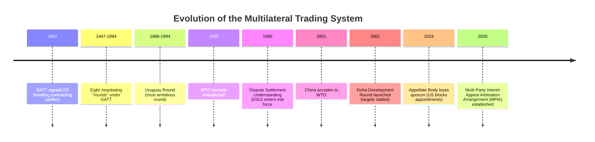
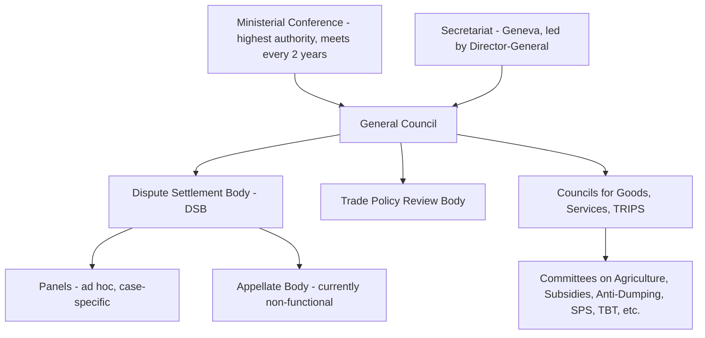
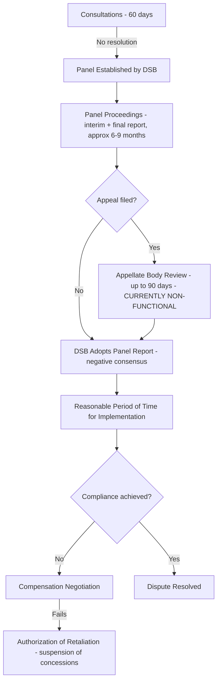

## The World Trade Organization and Dispute Resolution

### Overview

The **World Trade Organization (WTO)**, established on January 1, 1995, as the successor to the General Agreement on Tariffs and Trade (GATT, 1947), is the principal international institution governing rules of trade between nations. It provides the legal and institutional framework for negotiating trade agreements, monitoring trade policies, and — distinctively — resolving trade disputes through a structured, rules-based mechanism widely regarded as one of the most active international adjudicatory systems in existence.

### Historical Background: From GATT to WTO

**Key institutional shift from GATT to WTO:**

- GATT was a provisional, treaty-based arrangement covering only goods; the WTO is a permanent international organization with full legal personality
- The WTO extended coverage beyond goods to **services** (GATS — General Agreement on Trade in Services) and **intellectual property** (TRIPS — Trade-Related Aspects of Intellectual Property Rights)
- The WTO introduced a unified, binding **Dispute Settlement Understanding (DSU)**, replacing GATT's weaker, consensus-blockable dispute process
- WTO decisions on adopting panel/Appellate Body reports use **"negative consensus"** (reverse consensus) — a report is adopted automatically unless *all* members, including the winning party, agree to block it — a structural change from GATT's positive-consensus rule, which had allowed a losing party to block adverse rulings

### Core WTO Principles

**1. Most-Favored-Nation (MFN) Treatment (GATT Article I)**

Any trade advantage, favor, privilege, or immunity granted by a member to any country must be extended immediately and unconditionally to all other WTO members. Formal exceptions exist for regional trade agreements (Article XXIV) and for developing-country preferences under the Enabling Clause.

**2. National Treatment (GATT Article III)**

Once imported goods have cleared customs and paid applicable duties, they must be treated no less favorably than domestically produced like goods with respect to internal taxes and regulations.

**3. Transparency**

Members must publish trade regulations and notify the WTO of trade measures, enabling monitoring by other members and the Secretariat.

**4. Reciprocity**

Trade concessions are negotiated on a mutually advantageous basis, historically the basis for successive rounds of tariff reduction.

**5. Special and Differential Treatment (S&DT)**

Developing and least-developed country members receive longer implementation timelines, technical assistance, and other flexibilities across various WTO agreements.

### Institutional Structure

- **Ministerial Conference**: the top decision-making body, comprising all members, meeting at least once every two years (e.g., MC12 Geneva 2022, MC13 Abu Dhabi 2024)
- **General Council**: conducts the WTO's business between Ministerial Conferences; also convenes as the Dispute Settlement Body and the Trade Policy Review Body
- **Secretariat**: based in Geneva, Switzerland, headed by the Director-General (Ngozi Okonjo-Iweala, in office since March 2021, confirmed for a second term running through 2029)
- Decision-making is nominally by **consensus** among all members (one country, one vote in formal terms, though consensus practice dominates), a structural feature that makes new multilateral rule-making difficult to achieve

### The Dispute Settlement Understanding (DSU): Process Overview

The DSU (formally the "Understanding on Rules and Procedures Governing the Settlement of Disputes") governs how WTO members resolve disputes over alleged violations of WTO agreements.

**Stage-by-stage detail:**

**1. Consultations (Article 4, DSU)**

The complaining member requests consultations with the responding member; a mandatory 60-day period (or 20 days for urgent/perishable goods cases) is provided for bilateral resolution before a panel can be requested.

**2. Panel Establishment and Proceedings (Articles 6–16)**

If consultations fail, the complainant requests the DSB establish a panel (typically 3 individuals, sometimes 5) to examine the dispute. Panels issue an interim report to the parties, followed by a final report circulated to all members. The DSU sets a target timeline of roughly **9 months** from panel establishment to final report (12 months if appealed), though actual practice frequently exceeds these targets.

**3. Adoption by the Dispute Settlement Body**

Under the **negative consensus rule**, the panel report is automatically adopted by the DSB unless all members, including the prevailing party, agree to reject it — in practice guaranteeing adoption.

**4. Appeal (Article 17)**

Either party may appeal the panel's legal findings (not factual findings) to the **Appellate Body**, a standing body of seven members that hears appeals in divisions of three. Appeals were designed to be resolved within **90 days**.

**5. Implementation and the "Reasonable Period of Time" (Article 21)**

If a measure is found WTO-inconsistent, the losing member must bring it into compliance within a "reasonable period of time," determined by mutual agreement or binding arbitration if the parties disagree.

**6. Compensation and Retaliation (Article 22)**

If the losing member fails to comply, the complainant may negotiate compensation (voluntary trade concessions) or, failing that, seek DSB authorization to **suspend concessions** (impose retaliatory tariffs) against the non-complying member, calibrated to the level of nullification or impairment caused by the original violation.

### The Appellate Body Crisis (Ongoing Structural Issue)

Since **December 11, 2019**, the Appellate Body has been unable to hear new appeals because it lost the minimum three sitting members required for a division, following the United States' sustained blocking of new member appointments (a practice ongoing since 2016, over U.S. concerns regarding matters such as adherence to appeal deadlines, alleged overreach into domestic policy space, and the practice of expired-term members completing pending cases). As a structural feature of the DSU, an appeal filed against a panel report — even absent a functioning Appellate Body — legally suspends adoption of that report, creating what practitioners term an **"appeal into the void,"** where a losing party can block enforcement indefinitely simply by filing an appeal that can never be heard.

**Workaround — Multi-Party Interim Appeal Arbitration Arrangement (MPIA):**

In response, a subset of WTO members (including the EU and other participants, though notably not the United States) established the MPIA in 2020, an arbitration mechanism under DSU Article 25 that replicates appellate review among consenting members, allowing binding two-stage dispute resolution to continue *between MPIA participants* even without a functioning Appellate Body.

[Unverified] As of this writing, the Appellate Body impasse remains unresolved and reform negotiations (part of the broader "DSU reform" agenda under WTO Ministerial mandates) are ongoing; the precise status and membership of the MPIA may have changed and should be verified against current WTO sources for time-sensitive analysis.

**Key Points**

- The Appellate Body's non-functionality does **not** halt the WTO dispute system entirely — panels continue to hear and issue first-instance rulings, and disputes not appealed (or appealed only among MPIA participants) can still reach binding resolution
- This crisis is frequently cited as the most significant challenge to the WTO's institutional credibility since its founding, and has intensified debate over WTO reform

### Remedies in WTO Dispute Settlement

**Key Points**

- WTO remedies are **prospective, not punitive or retrospective** — a losing member is required to bring its measure into future compliance; there is no mechanism for compensating for past damages incurred while the illegal measure was in effect
- **Retaliation (suspension of concessions)** is calibrated to be *equivalent* to the level of trade damage (nullification/impairment) caused, not punitive in scale
- Retaliation is typically authorized in the same sector as the violation, but **cross-retaliation** (suspending concessions in a different sector or agreement) may be authorized in specific circumstances, particularly when same-sector retaliation would be impractical or ineffective (invoked, for example, in disputes involving smaller economies against larger ones)

### Types of Disputes Commonly Brought to the WTO

| Dispute Category | Example Legal Basis | Illustrative Issue |
| --- | --- | --- |
| Tariff/customs disputes | GATT Article II | Exceeding bound tariff rate commitments |
| Anti-dumping/countervailing duties | Anti-Dumping Agreement, SCM Agreement | Improper dumping margin calculation methodology |
| Subsidies | Agreement on Subsidies and Countervailing Measures (SCM) | Prohibited export subsidies, actionable domestic subsidies |
| Safeguards | Agreement on Safeguards | Import surge protections applied without required injury findings |
| Sanitary/Phytosanitary | SPS Agreement | Import bans not based on scientific risk assessment |
| Technical barriers | TBT Agreement | Discriminatory or unnecessarily trade-restrictive product standards |
| Intellectual property | TRIPS Agreement | Inadequate patent protection enforcement |
| Services | GATS | Market access restrictions on foreign service suppliers |

### Notable Categories of Landmark Disputes

Without reproducing specific case narratives in detail, several dispute *categories* have shaped WTO jurisprudence and are commonly studied:

- **US–EU disputes over aircraft subsidies** (concerning large civil aircraft manufacturers), among the largest and longest-running disputes in WTO history, involving billions of dollars in authorized retaliation
- **Disputes over agricultural subsidies and market access**, reflecting the broader, long-stalled Doha Round agricultural negotiations
- **National security exception invocations** (GATT Article XXI), which gained prominence when certain members applied tariffs citing national security grounds, raising novel questions about the justiciability of security exceptions that had rarely been tested before panels
- **Steel and aluminum tariff disputes**, involving safeguard and security-exception justifications for import restrictions

[Inference] Detailed case names, parties, and outcomes for specific disputes are numerous and continually updated; for current case status, the WTO's official dispute settlement database should be consulted directly rather than relying on general summaries.

### The Doha Development Round: A Case Study in Multilateral Negotiation Difficulty

Launched in 2001, the **Doha Development Round** aimed to address agricultural subsidies, non-agricultural market access, services liberalization, and development issues. It has never been formally concluded as a single comprehensive package, illustrating the broader difficulty of achieving consensus among the WTO's large and diverse membership (currently 160+ members) under its consensus-based decision rule.

**Partial outcomes salvaged from Doha-era negotiations:**

- **Trade Facilitation Agreement (TFA)**, entered into force 2017 — streamlining customs procedures
- **Agreement on Fisheries Subsidies** (2022) — the WTO's first agreement primarily focused on environmental sustainability, targeting subsidies contributing to overfishing and illegal fishing

**Key Points**

- The shift from single-undertaking, comprehensive rounds (like Doha) toward smaller **plurilateral agreements** among willing subsets of members (e.g., on e-commerce, investment facilitation) reflects a broader institutional adaptation to consensus gridlock at the full-membership level

### Special and Differential Treatment for Developing Countries

WTO agreements incorporate numerous S&DT provisions:

- Longer transition periods for implementing obligations
- Technical assistance and capacity-building support
- Best-endeavor provisions encouraging developed members to grant preferential market access
- Reduced or flexible commitments under certain agreements (e.g., subsidy disciplines, agricultural support caps)

[Inference] The scope and effectiveness of S&DT remain contested in WTO reform discussions, particularly regarding self-designation of "developing country" status, which some developed members have argued should be reformed with more objective criteria.

### Criticisms and Reform Debates

- **Appellate Body paralysis** (discussed above) — the central institutional crisis
- **Consensus-based decision-making** — makes new multilateral rulemaking exceedingly difficult given 160+ diverse members with divergent interests, contributing to the shift toward plurilateral and regional approaches
- **Special and differential treatment disputes** — disagreement over which members should qualify for developing-country flexibilities
- **Adequacy for digital trade and modern issues** — critics argue WTO rules, largely designed for goods trade in the 1990s, have struggled to keep pace with e-commerce, digital services, and data flow governance
- **Enforcement effectiveness** — even with a functioning Appellate Body, critics note that retaliation-based enforcement favors larger economies (which can impose meaningful retaliatory tariffs) over smaller ones (for whom retaliation may be economically self-damaging or ineffective)

### Key Points

- The WTO's dispute settlement mechanism is distinguished from most international legal regimes by its **binding, quasi-automatic enforcement** via the negative consensus rule — a structural strength when functioning as designed
- The Appellate Body's loss of quorum since December 2019 represents the most significant operational disruption to this system, though panel-level dispute resolution and voluntary arbitration mechanisms (MPIA) continue to function among participating members
- WTO remedies are prospective and proportionate (calibrated retaliation), not punitive or retroactive
- Multilateral rule-making progress has slowed markedly since the Uruguay Round, with the Doha Round remaining largely unconcluded, pushing negotiating activity toward narrower plurilateral tracks

### Related Topics

- Trade Agreements and Economic Integration
- Trade Barriers: Tariffs, Quotas, and Non-Tariff Measures
- Effects of Trade Policy on Welfare
- GATT Article XXIV and Regional Trade Agreement Exceptions
- Anti-Dumping and Countervailing Duty Procedures
- Agreement on Subsidies and Countervailing Measures (SCM)
- Trade Facilitation Agreement and Customs Reform
- Doha Development Round and Agricultural Trade Negotiations
- National Security Exceptions in Trade Law (GATT Article XXI)
- Plurilateral Agreements and the Future of Multilateral Trade Governance