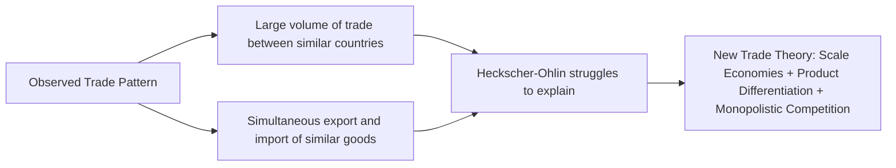
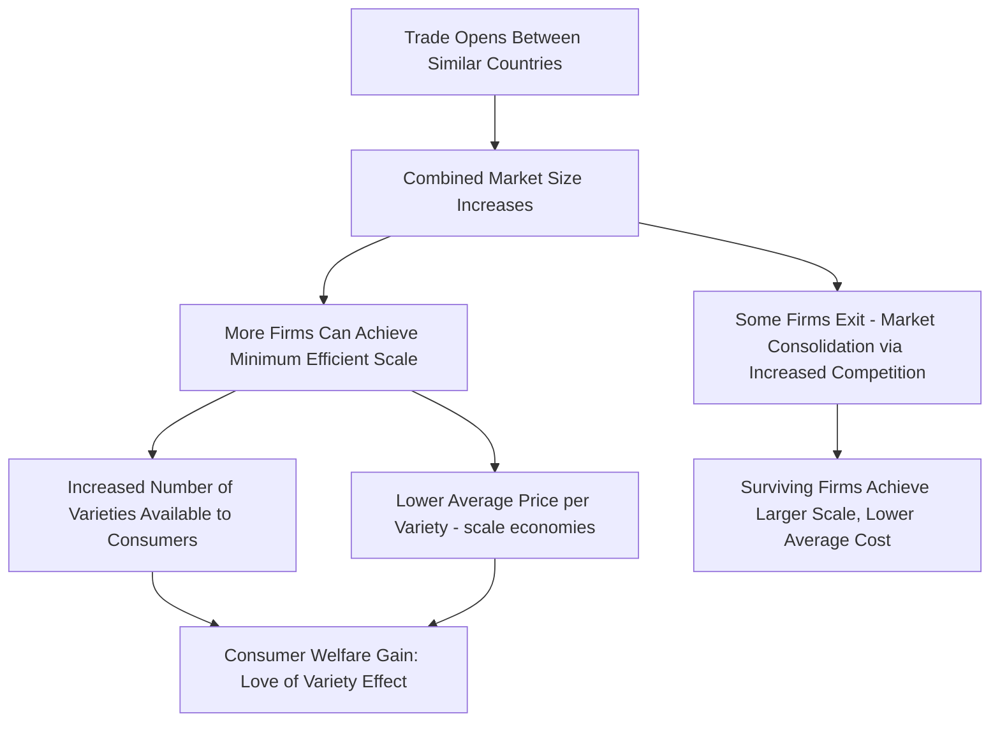
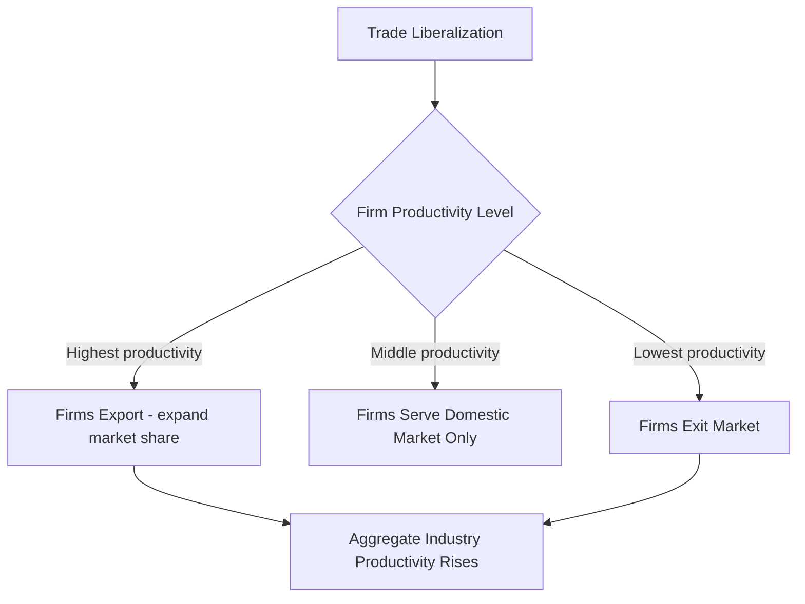

## New Trade Theory and Intra-Industry Trade

### Overview

**New Trade Theory (NTT)**, developed principally by Paul Krugman, Elhanan Helpman, and others beginning in the late 1970s, explains patterns of international trade that classical models (Ricardian, Heckscher-Ohlin) cannot account for — particularly large volumes of trade between *similar* countries in *similar* products. It rests on two departures from traditional trade theory: **increasing returns to scale (economies of scale)** and **imperfect competition** (typically monopolistic competition), combined with consumer preference for product variety. Krugman was awarded the 2008 Nobel Memorial Prize in Economic Sciences substantially for this body of work.

### The Empirical Puzzle: Why Traditional Theory Falls Short

Heckscher-Ohlin predicts trade arises from factor endowment *differences*, implying trade should be largest between dissimilar countries (e.g., capital-abundant vs. labor-abundant) and should take the form of **inter-industry trade** (exchanging entirely different categories of goods). However, observed trade patterns — especially among developed, similarly-endowed economies (e.g., intra-EU trade, US-Germany trade) — show:

- A very large share of world trade occurs between **similar, developed countries** with comparable factor endowments
- Much of this trade is **intra-industry**: countries simultaneously export and import goods within the *same* industry classification (e.g., Germany exports cars to France while importing cars from France)

### Inter-Industry vs. Intra-Industry Trade

| Feature | Inter-Industry Trade | Intra-Industry Trade |
| --- | --- | --- |
| Definition | Exchange of goods from different industries | Exchange of goods within the same industry classification |
| Theoretical driver | Comparative advantage from factor endowment or technology differences | Product differentiation, economies of scale, consumer preference for variety |
| Typical country pairing | Dissimilar countries (different factor endowments) | Similar countries (comparable factor endowments and income levels) |
| Example | Bangladesh exports textiles, imports machinery | Germany exports BMWs, imports Renaults from France |
| Underlying model | Ricardian, Heckscher-Ohlin | New Trade Theory (Krugman monopolistic competition model) |
| Distributional implications | Can generate significant winners/losers (Stolper-Samuelson) | Adjustment costs generally smaller, since factors can often shift within the same broad industry |

### Measuring Intra-Industry Trade: The Grubel-Lloyd Index

The most widely used measure of intra-industry trade intensity for a given industry $i$ is the **Grubel-Lloyd (GL) Index**:

$$GL_i = 1 - \frac{|X_i - M_i|}{X_i + M_i}$$

where $X_i$ is exports and $M_i$ is imports of industry $i$'s products.

- $GL_i = 0$: trade is purely inter-industry (only exports or only imports occur)
- $GL_i = 1$: trade is purely intra-industry (exports exactly equal imports within the industry)

**Worked Example:**

Suppose a country's automobile industry exports $50 billion and imports $30 billion in a given year.

$$GL_{auto} = 1 - \frac{|50 - 30|}{50 + 30} = 1 - \frac{20}{80} = 1 - 0.25 = 0.75$$

A GL index of 0.75 indicates a high degree of intra-industry trade in automobiles — the industry trades heavily in both directions rather than specializing exclusively as a net exporter or net importer.

[Inference] The GL index's value is sensitive to how narrowly or broadly "industry" is defined (aggregation level); highly aggregated categories tend to mechanically inflate the measured GL index because they lump together genuinely different products, a well-known methodological caveat in applied intra-industry trade research.

### Two Types of Intra-Industry Trade

**1. Horizontal Intra-Industry Trade**

Trade in products that are differentiated by *characteristics/features* but are roughly similar in quality and price (e.g., different brands/models of passenger cars, different styles of clothing). This is the type most directly explained by the Krugman monopolistic competition model, driven by consumer preference for variety.

**2. Vertical Intra-Industry Trade**

Trade in products within the same industry classification but differentiated by *quality* and *price* tier (e.g., a country exports high-end textiles while importing low-end textiles). This type is often better explained by factor-proportions-style reasoning applied *within* an industry (different quality tiers may be produced with different factor intensities), or by product-cycle/vertical specialization in global value chains.

### The Krugman Monopolistic Competition Model

**Core assumptions:**

- Firms produce **differentiated products** within an industry (consumers value variety — captured formally via a "love of variety" utility function)
- **Increasing returns to scale (IRS)** at the firm level: average cost falls as output rises, due to fixed costs (R&D, product design, plant setup) spread over more units
- **Monopolistic competition**: many firms, free entry/exit, each firm has some pricing power over its differentiated variant, but earns zero economic profit in long-run equilibrium
- Firms are symmetric in cost structure

**Firm-level cost structure:**

$$TC = F + c \cdot Q$$

where $F$ is the fixed cost and $c$ is constant marginal cost.

**Average cost declines with output:**

$$AC = \frac{F}{Q} + c$$

**Pricing rule** (monopolistically competitive firms set price as a markup over marginal cost, given a demand elasticity $\varepsilon$ that depends on the number of competing firms $n$):

$$P = \frac{c}{1 - \frac{1}{\varepsilon}}$$

**Zero-profit long-run equilibrium condition:**

$$P = AC \implies \pi = 0$$

### Effect of Trade Opening in the Krugman Model

**Diagram: Effect of Market Size on Firm Scale and Price (svg_diagram)**

<svg xmlns="http://www.w3.org/2000/svg" viewBox="0 0 640 380">
<text x="320" y="22" text-anchor="middle" font-size="15" font-weight="bold" fill="#1a1a1a">Trade Opening Effect: Larger Market, Lower Average Cost (svg_diagram)</text>
<line x1="80" y1="330" x2="80" y2="50" stroke="#333" stroke-width="2" />
<line x1="80" y1="330" x2="580" y2="330" stroke="#333" stroke-width="2" />
<text x="50" y="55" font-size="12" fill="#333">Price / Cost</text>
<text x="590" y="335" font-size="12" fill="#333">Output per firm</text>

<path d="M 110 90 Q 250 180, 560 300" stroke="#2563eb" stroke-width="2.5" fill="none" />
<text x="420" y="270" font-size="12" fill="#2563eb">AC (declining, scale economies)</text>

<circle cx="220" cy="180" r="4" fill="#dc2626" />
<text x="150" y="170" font-size="11" fill="#dc2626">Autarky: small market, high price P(A)</text>

<circle cx="420" cy="250" r="4" fill="#16a34a" />
<text x="430" y="245" font-size="11" fill="#16a34a">Post-Trade: larger market, lower price P(T)</text>
<line x1="220" y1="180" x2="220" y2="330" stroke="#dc2626" stroke-width="1" stroke-dasharray="3,3" />
<line x1="420" y1="250" x2="420" y2="330" stroke="#16a34a" stroke-width="1" stroke-dasharray="3,3" />

<text x="80" y="360" font-size="11" fill="#555">Trade expands effective market size, allowing surviving firms to move further down the AC curve</text>

</svg>

**Key Points**

- Trade among similar countries expands the effective size of the market each firm serves, allowing firms to spread fixed costs over greater output, lowering average cost and price
- Consumers gain both from **lower prices** (scale efficiency) and from **greater product variety** (since firms across both trading countries continue producing differentiated varieties, and consumers gain access to both) — this "pro-competitive" and "variety" effect is a source of gains from trade **distinct from** the comparative-advantage-based gains of traditional trade models
- Some firms exit due to intensified competition post-trade-opening, but the total number of varieties available to consumers in the combined market rises (even though the number of *domestically produced* varieties may fall)

### Gains from Trade Under New Trade Theory vs. Traditional Theory

| Source of Gains | Traditional Theory (Ricardian/H-O) | New Trade Theory |
| --- | --- | --- |
| Mechanism | Reallocation toward comparative advantage | Larger market → scale economies + more variety |
| Requires country differences? | Yes (technology or endowments) | No — gains occur even between identical countries |
| Distributional effects | Can be significant (Stolper-Samuelson) | Generally smaller, more diffuse adjustment |
| Consumer benefit type | Lower prices via efficient specialization | Lower prices AND increased product variety |
| Trade pattern predicted | Inter-industry | Intra-industry |

[Inference] These two channels of gains from trade are generally understood as complementary rather than competing explanations — most real-world trade reflects a combination of comparative-advantage-driven inter-industry trade and scale/variety-driven intra-industry trade, with the relative importance of each varying by country pair and sector.

### The Gravity Model Connection

New Trade Theory provides a theoretical microfoundation for the empirically successful **Gravity Model of Trade**, which predicts bilateral trade volume as a function of the two countries' economic size and the distance between them:

$$T_{ij} = G \cdot \frac{Y_i^{\alpha} \cdot Y_j^{\beta}}{D_{ij}^{\theta}}$​

where $T_{ij}$ is trade flow between countries $i$ and $j$, $Y_i, Y_j$ are their GDPs, $D_{ij}$ is the distance between them, and $G$ is a constant. The Krugman model helps explain *why* larger economies trade proportionally more with each other (more varieties produced, more varieties demanded) — a result that fits naturally with the empirical gravity relationship, whereas traditional comparative-advantage models do not straightforwardly generate this size-based prediction.

### Firm Heterogeneity Extension: The Melitz Model

A significant later extension (Melitz, 2003) relaxes the assumption that all firms within an industry are identical, introducing **firm-level productivity heterogeneity**:

- Firms differ in underlying productivity; only the **most productive firms** find it profitable to pay the fixed costs of exporting
- Less productive firms may serve only the domestic market, while the least productive firms exit entirely
- Trade liberalization triggers **within-industry reallocation**: resources shift from less productive to more productive firms as the least efficient firms are forced to exit and the most productive expand into export markets
- This generates an **aggregate industry productivity gain** from trade liberalization, distinct from both the classical comparative-advantage gains and the original Krugman variety/scale gains

**Key Points**

- The Melitz model is now considered a foundational component of modern "New New Trade Theory," widely used in empirical trade and productivity research
- It helps explain firm-level empirical regularities not addressed by either classical trade theory or the original homogeneous-firm Krugman model — notably, that only a minority of firms within any industry actually export, and exporting firms are systematically more productive than non-exporting firms in the same industry [well-documented empirical regularity across many country studies]

### Worked Numerical Example: Grubel-Lloyd and Trade Pattern Interpretation

A country's electronics sector has the following annual trade data:

| Sub-category | Exports ($bn) | Imports ($bn) | GL Index |
| --- | --- | --- | --- |
| Semiconductors | 40 | 35 | $1 - \|40-35\|/(40+35) = 0.93$ |
| Consumer electronics | 60 | 10 | $1 - \|60-10\|/(60+10) = 0.29$ |
| Industrial electronics | 5 | 45 | $1 - \|5-45\|/(5+45) = 0.20$ |

**Interpretation**: Semiconductors show a very high GL index (0.93), suggesting substantial intra-industry trade — consistent with product differentiation (different chip specifications, applications) and scale economies in semiconductor fabrication (high fixed costs of fabs favor specialization by firms across countries, with mutual exchange of differentiated outputs). Consumer electronics and industrial electronics show lower GL indices, suggesting these sub-sectors are closer to inter-industry trade patterns, potentially reflecting comparative-advantage-based specialization.

### Empirical Evidence

- Intra-industry trade shares are empirically **higher** among developed economies with similar income levels and similar capital-labor ratios (e.g., within the EU, between the US and other OECD countries), consistent with NTT's prediction that scale/variety-driven trade is most prominent between similar countries
- Intra-industry trade shares are empirically **lower** in trade between developed and developing countries, where classical comparative-advantage (factor-endowment) forces tend to dominate
- [Inference] Since the 1990s, a substantial share of measured "intra-industry trade" in manufacturing, especially in electronics and automobiles, actually reflects **vertical specialization within global value chains** (e.g., components crossing borders multiple times during production) rather than purely horizontal product differentiation — a nuance requiring careful interpretation of trade statistics, since GL indices computed from aggregate customs data cannot fully distinguish these different underlying causes.

### Key Points

- New Trade Theory explains trade between *similar* countries via **economies of scale** and **product differentiation**, mechanisms entirely absent from Ricardian and Heckscher-Ohlin models
- The **Grubel-Lloyd Index** is the standard empirical measure of intra-industry trade intensity, ranging from 0 (pure inter-industry) to 1 (pure intra-industry)
- Gains from trade under NTT arise from **larger effective market size**, enabling scale economies (lower prices) and greater product variety — distinct from, and complementary to, classical comparative-advantage gains
- The **Melitz model** extends NTT by introducing firm heterogeneity, explaining within-industry reallocation toward more productive firms as an additional source of productivity gains from trade liberalization
- NTT provides theoretical grounding for the empirically robust **gravity model** of bilateral trade flows

### Related Topics

- Heckscher-Ohlin Model and Factor Endowments
- Gravity Model of International Trade
- Melitz Model and Firm Heterogeneity in Trade
- Economies of Scale and Monopolistic Competition
- Trade Agreements and Economic Integration
- Global Value Chains and Vertical Specialization
- Product Differentiation and Consumer Welfare
- Effects of Trade Policy on Welfare
- Regional Integration and the European Single Market
- Trade and Firm-Level Productivity