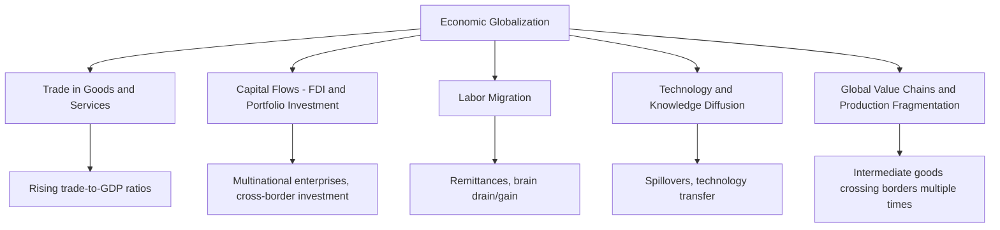
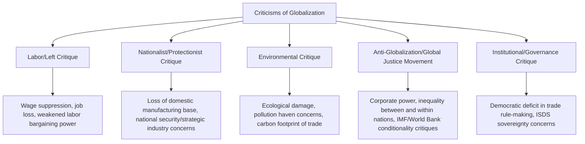

## Globalization: Benefits, Costs, and Criticisms

### Overview

Globalization refers to the increasing economic, technological, cultural, and political integration and interdependence of countries worldwide, driven by falling transportation and communication costs, trade and investment liberalization, and the expansion of multinational production networks. In economics, globalization is most precisely analyzed through its component channels: trade in goods and services, capital flows (foreign direct investment and portfolio investment), labor migration, and the diffusion of technology and ideas. This topic surveys the economic case for globalization's benefits, the well-documented costs and distributional effects, and the major schools of criticism.

### Dimensions of Economic Globalization

### Historical Waves of Globalization

Economic historians commonly identify distinct waves of globalization, each with different drivers and reversals:

| Wave | Approximate Period | Key Drivers | Reversal/Interruption |
| --- | --- | --- | --- |
| First Wave | ~1870–1914 | Steamship, railroad, telegraph; gold standard; colonial trade networks | World War I, interwar protectionism, Great Depression |
| Second Wave | ~1945–1980 | GATT tariff rounds, Bretton Woods institutions, post-war reconstruction | Oil shocks, stagflation (partial slowdown, not full reversal) |
| Third Wave | ~1980–2008 | Containerization, ICT revolution, WTO formation, China's WTO accession (2001), capital account liberalization | 2008 Global Financial Crisis |
| Contemporary Period | ~2008–present | Digital trade, global value chains maturing, alongside rising protectionism, "reshoring," and geopolitical fragmentation | US-China trade tensions, COVID-19 supply chain disruptions, industrial policy resurgence |

[Inference] Whether the contemporary period constitutes a genuine "slowbalization" or partial reversal of globalization, versus a restructuring toward different trade patterns (e.g., "friend-shoring," regional value chains), remains an actively debated question among trade economists and international policy analysts, without a settled consensus.

### The Standard Economic Case for Globalization (Benefits)

**1. Gains from Comparative Advantage**

As formalized by Ricardian and Heckscher-Ohlin models, specialization according to comparative advantage allows countries to consume beyond their own production possibility frontier, raising aggregate consumption possibilities for participating countries.

**2. Economies of Scale and Product Variety**

As formalized in New Trade Theory (Krugman), globalization allows firms to serve larger combined markets, achieving scale economies and offering consumers greater product variety than would be possible in autarky.

**3. Productivity Gains via Competition and Reallocation**

Exposure to international competition can force inefficient firms to improve or exit, reallocating resources toward more productive uses (as formalized in the Melitz model of firm heterogeneity). Access to larger export markets can allow the most productive firms to expand further, raising aggregate industry productivity.

**4. Technology and Knowledge Diffusion**

Trade and FDI serve as channels for technology transfer, management practice diffusion, and knowledge spillovers, particularly benefiting developing economies importing capital goods and foreign expertise. [Inference] The magnitude of these spillovers varies substantially by country, sector, and the receiving economy's absorptive capacity (e.g., existing human capital, institutional quality), and is not automatic or uniform across all contexts.

**5. Poverty Reduction and Income Convergence**

Export-oriented growth strategies pursued by several East Asian economies (South Korea, Taiwan, and more recently China and Vietnam) are widely associated with rapid poverty reduction and income convergence toward developed-country levels over recent decades. The World Bank and other international development institutions have documented substantial declines in global extreme poverty rates over the period of intensified globalization since the 1990s, coinciding with — though not solely attributable to — expanded international trade and investment.

**6. Consumer Welfare via Lower Prices and Greater Choice**

Access to imported goods (often produced more cheaply abroad) lowers consumer prices, effectively raising real purchasing power, particularly benefiting lower-income households that spend a higher share of their budget on tradable goods such as clothing and basic manufactured products.

**7. Risk Diversification via Capital Flows**

Cross-border capital flows can, in principle, allow countries to smooth consumption against domestic economic shocks and allow investors to diversify risk internationally, though this benefit is contingent on sound domestic financial regulation (see costs section below).

### Diagrammatic Summary: Static and Dynamic Gains

<svg xmlns="http://www.w3.org/2000/svg" viewBox="0 0 640 380">
<text x="320" y="22" text-anchor="middle" font-size="15" font-weight="bold" fill="#1a1a1a">Channels of Gains from Globalization (svg_diagram)</text>
<rect x="40" y="60" width="260" height="130" rx="8" fill="#dbeafe" stroke="#2563eb" stroke-width="1.5" />
<text x="170" y="85" font-size="13" font-weight="bold" text-anchor="middle" fill="#1e3a8a">Static Gains</text>
<text x="170" y="110" font-size="11" text-anchor="middle" fill="#333">Comparative advantage</text>
<text x="170" y="128" font-size="11" text-anchor="middle" fill="#333">reallocation (once-off)</text>
<text x="170" y="146" font-size="11" text-anchor="middle" fill="#333">Consumption beyond</text>
<text x="170" y="164" font-size="11" text-anchor="middle" fill="#333">domestic PPF</text>
<rect x="340" y="60" width="260" height="130" rx="8" fill="#dcfce7" stroke="#16a34a" stroke-width="1.5" />
<text x="470" y="85" font-size="13" font-weight="bold" text-anchor="middle" fill="#14532d">Dynamic Gains</text>
<text x="470" y="110" font-size="11" text-anchor="middle" fill="#333">Scale economies, variety</text>
<text x="470" y="128" font-size="11" text-anchor="middle" fill="#333">Productivity reallocation</text>
<text x="470" y="146" font-size="11" text-anchor="middle" fill="#333">Technology diffusion</text>
<text x="470" y="164" font-size="11" text-anchor="middle" fill="#333">Long-run growth effects</text>

<text x="320" y="230" font-size="12" text-anchor="middle" fill="#555">Both channels are generally understood as complementary in explaining observed gains</text>

<text x="320" y="250" font-size="11" text-anchor="middle" fill="#777">Dynamic gains are theoretically larger but harder to precisely measure/attribute</text>

</svg>

### The Costs and Distributional Consequences of Globalization

**1. Trade-Induced Income Redistribution (Stolper-Samuelson Effects)**

As formalized by the Heckscher-Ohlin framework, trade liberalization raises returns to a country's abundant factor and lowers returns to its scarce factor. In developed economies, this has been widely associated with declining relative demand for low-skilled labor, contributing to **rising wage inequality between skilled and unskilled workers**.

**2. The "China Shock" Literature**

A substantial body of empirical labor economics research (notably by Autor, Dorn, and Hanson, and collaborators) has documented significant, geographically concentrated, and persistent negative labor market effects on U.S. manufacturing-dependent local labor markets from a rapid surge in Chinese import competition following China's 2001 WTO accession, including:

- Significant manufacturing employment losses concentrated in specific regions
- Slower-than-expected worker reallocation to other sectors or regions (lower labor mobility than classical trade theory assumes)
- Effects that persisted for over a decade in affected communities, rather than resolving quickly through market adjustment

[Inference] This literature substantially updated economists' priors regarding the speed and completeness of labor market adjustment to trade shocks — earlier textbook treatments often assumed relatively frictionless reallocation, whereas empirical findings point to meaningfully slower and geographically concentrated adjustment costs, a point now widely incorporated into modern trade policy discussions, though the precise magnitude and generalizability beyond the specific China-shock episode remain subjects of ongoing research.

**3. Job Displacement and Adjustment Costs**

Even when aggregate national welfare rises from trade liberalization, the transition involves real adjustment costs: job search, retraining, geographic relocation, and potentially permanent income losses for displaced workers whose skills do not transfer easily to expanding sectors.

**4. Race to the Bottom Concerns (Regulatory Competition)**

A frequently raised criticism holds that globalization creates competitive pressure among countries to lower labor, environmental, or tax standards to attract mobile capital and multinational investment. [Inference] Empirical evidence on the scale and generality of this "race to the bottom" is mixed; some studies find limited systematic evidence of a broad regulatory race to the bottom in environmental standards among developed economies, while others document more targeted instances, particularly regarding corporate tax competition, so this remains a genuinely contested empirical question rather than a settled finding.

**5. Financial Contagion and Capital Flow Volatility**

Increased financial globalization exposes economies to cross-border contagion risk: capital flow reversals ("sudden stops"), currency crises, and financial contagion, as seen in episodes such as the 1997–98 Asian Financial Crisis and aspects of the 2008 Global Financial Crisis. Poorly sequenced capital account liberalization (opening to volatile short-term portfolio flows before developing adequate domestic financial regulation) is widely cited by international economists as a contributing factor to several historical emerging-market financial crises.

**6. Environmental Costs**

Concerns include increased carbon emissions from expanded international shipping and production, potential "pollution haven" effects (production shifting to jurisdictions with laxer environmental regulation), and biodiversity/resource pressures from globally integrated supply chains and commodity extraction. [Inference] Empirical evidence for the pollution haven hypothesis specifically is mixed and appears to depend heavily on the pollutant, industry, and country pair studied, rather than supporting a single uniform conclusion.

**7. Erosion of National Policy Autonomy**

Deep trade and investment agreements can constrain domestic policy space (e.g., through investor-state dispute settlement mechanisms, intellectual property harmonization requirements, or competitive pressure against unilateral regulatory action), a concern raised by critics across the political spectrum regarding sovereignty and democratic accountability.

**8. Cultural Homogenization Concerns**

Non-economic but frequently raised criticism: globalization is associated by some critics with the erosion of local cultural practices, languages, and traditions in favor of globally dominant (often Western) commercial culture and media.

**9. Supply Chain Fragility**

The COVID-19 pandemic and subsequent geopolitical tensions exposed vulnerabilities in highly globalized, just-in-time global value chains, including semiconductor shortages, shipping disruptions, and concentrated single-source dependencies for critical goods (e.g., pharmaceuticals, rare earth minerals) — prompting renewed policy interest in "reshoring," "friend-shoring," and supply chain diversification.

### Major Schools of Criticism of Globalization

**1. Labor/Left Critique**

Emphasizes downward pressure on wages and labor bargaining power in developed economies, job displacement in import-competing sectors, and concerns that labor standards in developing-country supply chains (e.g., factory safety, working conditions) are inadequately addressed by trade agreements.

**2. Nationalist/Protectionist Critique**

Emphasizes loss of domestic manufacturing capacity, strategic/national security vulnerabilities from dependence on foreign supply chains (e.g., semiconductors, pharmaceuticals, critical minerals), and calls for industrial policy and trade barriers to rebuild domestic production capability.

**3. Environmental Critique**

Emphasizes the ecological costs of globally dispersed production and long-distance shipping, and argues that trade rules should more directly incorporate environmental standards and carbon pricing (e.g., proposals for carbon border adjustment mechanisms).

**4. Global Justice / Anti-Globalization Movement**

Associated with protests against institutions such as the WTO, IMF, and World Bank (notably the 1999 "Battle of Seattle" WTO protests), this critique emphasizes concerns about corporate power, structural adjustment conditionality imposed on developing countries, and rising inequality between and within nations despite aggregate global growth.

**5. Institutional/Governance Critique**

Raises concerns about the "democratic deficit" in international trade rule-making (negotiated by technocrats and trade ministries with limited direct public accountability), and specific criticism of Investor-State Dispute Settlement (ISDS) provisions allowing foreign investors to sue governments over regulatory changes affecting their investments.

### Distinguishing Aggregate Gains from Distributional Effects

A central analytical point in modern trade economics is the distinction between:

$$\text{Aggregate National Welfare Gain} \neq \text{Uniform Individual-Level Benefit}$$

The standard theoretical result — that trade liberalization raises aggregate national welfare (subject to caveats around large-country terms-of-trade effects and market failures) — is **compatible with** significant losses for specific groups (scarce-factor owners, import-competing sector workers, geographically concentrated communities). The **Kaldor-Hicks compensation principle** notes that aggregate gains are large enough that winners could in principle compensate losers and still be better off, but this compensation is not automatic and requires deliberate policy mechanisms.

**Key Points**

- This distinction is central to understanding why globalization can simultaneously be "good for the economy" in aggregate terms while generating genuine, well-documented harm to specific communities and demographic groups — both claims can be factually consistent rather than contradictory
- Policy debates over globalization are often, at their core, disagreements about how much weight to give aggregate efficiency gains versus distributional and adjustment costs, rather than disagreements over the underlying economic mechanisms themselves

### Policy Responses to Globalization's Costs

**Trade Adjustment Assistance (TAA)**: government programs (e.g., in the United States) providing retraining, income support, and relocation assistance to workers displaced by import competition. [Inference] Evaluations of TAA program effectiveness have produced mixed results regarding whether such programs adequately compensate displaced workers or facilitate successful re-employment at comparable wages, and this remains a genuinely debated area of active policy research.

**Industrial Policy and Reshoring Incentives**: government support (subsidies, tax incentives, procurement preferences) for domestic production of strategically important goods (e.g., semiconductors, clean energy technology), representing a partial policy shift from pure free-trade orientation toward selective national production capacity building.

**Carbon Border Adjustment Mechanisms (CBAM)**: tariff-like charges applied to imports based on their embedded carbon content, intended to address both competitiveness concerns (preventing "carbon leakage" to jurisdictions with laxer climate policy) and environmental critique of globalization, with the EU's CBAM being a prominent example under phased implementation.

**Labor and Environmental Provisions in Trade Agreements**: an increasing number of modern trade agreements include enforceable labor rights and environmental standard provisions, responding directly to labor and environmental critiques of earlier-generation trade agreements.

### Empirical Summary: What the Evidence Broadly Supports

| Claim | Empirical Support |
| --- | --- |
| Trade liberalization raises aggregate national income/GDP | Broadly supported across extensive empirical trade literature |
| Global extreme poverty has declined substantially during the era of intensified globalization | Well-documented in World Bank and international development data |
| Trade contributes to increased wage/skill inequality in some developed economies | Substantial supporting evidence, particularly from the "China shock" literature |
| Labor market adjustment to trade shocks is often slower and more geographically concentrated than classical models assume | Substantial supporting evidence from recent labor economics research |
| Globalization causes a uniform "race to the bottom" in labor/environmental standards | Contested; evidence is mixed and context-dependent |
| Financial globalization increases exposure to cross-border contagion risk absent adequate domestic regulation | Broadly supported, particularly from emerging-market crisis case studies |

### Key Points

- Globalization's economic benefits (comparative advantage gains, scale economies, poverty reduction, technology diffusion) and its costs (distributional effects, labor market disruption, financial contagion risk, environmental concerns) are not mutually exclusive claims — modern trade economics increasingly emphasizes documenting and addressing both simultaneously, rather than treating globalization as an unambiguous good or unambiguous harm
- The "China shock" literature significantly shifted mainstream economic understanding of the speed and completeness of labor market adjustment to trade-induced disruption
- Criticism of globalization spans multiple distinct ideological traditions (labor/left, nationalist/protectionist, environmental, global justice, institutional/governance), each emphasizing different mechanisms and proposing different policy remedies
- Contemporary policy responses (Trade Adjustment Assistance, industrial policy, carbon border adjustments, enforceable labor/environmental trade provisions) reflect an evolving attempt to preserve aggregate efficiency gains from international integration while more directly addressing documented distributional and environmental costs

### Related Topics

- Heckscher-Ohlin Model and Factor Endowments
- New Trade Theory and Intra-Industry Trade
- Trade Agreements and Economic Integration
- Effects of Trade Policy on Welfare
- The World Trade Organization and Dispute Resolution
- Global Value Chains and Vertical Specialization
- Foreign Direct Investment and Multinational Enterprises
- Financial Globalization and Capital Account Liberalization
- Trade Adjustment Assistance and Labor Market Policy
- Carbon Border Adjustment Mechanisms and Trade-Environment Policy