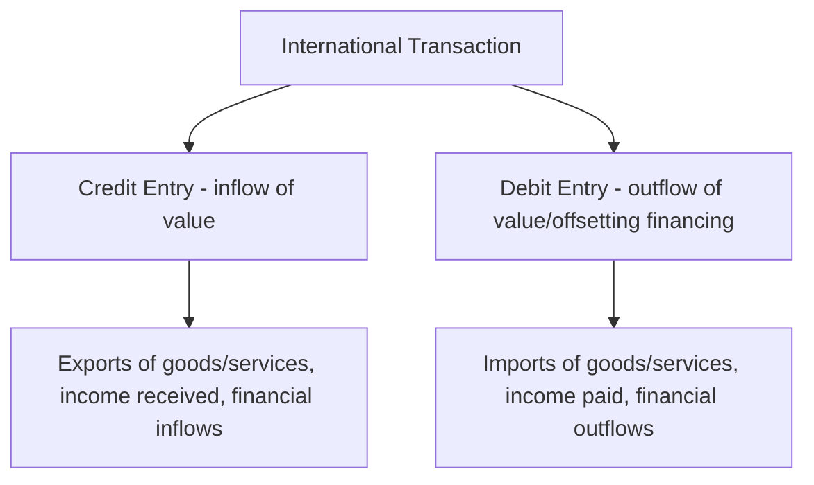
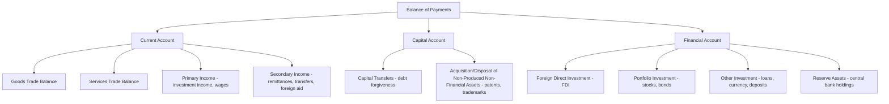
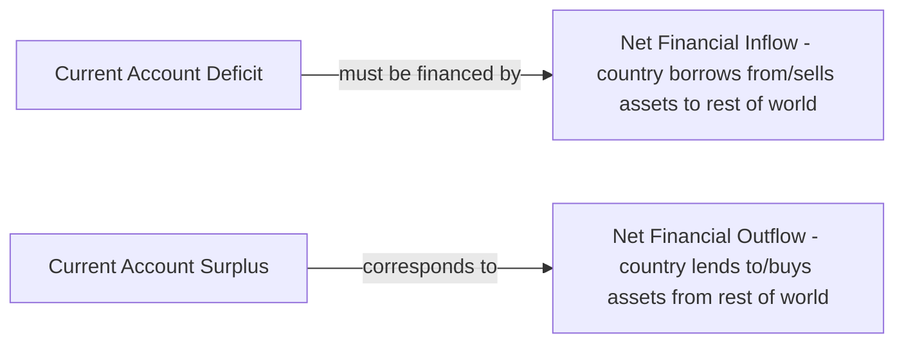

## Balance of Payments Accounting

### Overview

The **Balance of Payments (BOP)** is a systematic accounting record of all economic transactions between a country's residents and the rest of the world over a specific period (typically a quarter or year). It follows **double-entry bookkeeping** principles, meaning every transaction generates two offsetting entries, so that the BOP always balances in an accounting sense (though its major sub-accounts can and do show surpluses or deficits). The standard international methodology is codified in the IMF's **Balance of Payments and International Investment Position Manual (BPM6)**.

### The Fundamental Accounting Identity

$$\text{Current Account} + \text{Capital Account} + \text{Financial Account} + \text{Net Errors and Omissions} = 0$$

This identity holds by construction: it is not an economic prediction but a bookkeeping fact arising from double-entry recording, analogous to how a firm's balance sheet must balance.

### Double-Entry Bookkeeping Principle

Every international transaction is recorded twice: once as a **credit** (+) and once as a **debit** (−).

**Worked Example**: A U.S. firm exports $1 million of machinery to Germany, paid via wire transfer to the exporter's U.S. bank account.

| Entry | Account | Amount |
| --- | --- | --- |
| Credit | Current Account (Goods Exports) | +$1,000,000 |
| Debit | Financial Account (increase in foreign-held claims on U.S. bank, i.e., a U.S. financial liability/foreign deposit) | −$1,000,000 |

The export itself is a credit (real resource flow out, but a claim/payment flow in); the corresponding financing (the payment received) is recorded as a financial account transaction, since it represents a change in cross-border financial claims.

**General credit/debit convention:**

| Transaction Type | Recorded As |
| --- | --- |
| Export of goods/services | Credit (+) |
| Import of goods/services | Debit (−) |
| Income received from abroad | Credit (+) |
| Income paid abroad | Debit (−) |
| Increase in foreign assets held by residents | Debit (−) (capital outflow) |
| Increase in domestic assets held by foreigners | Credit (+) (capital inflow) |
| Decrease in foreign assets held by residents | Credit (+) |
| Decrease in domestic assets held by foreigners | Debit (−) |

### The Three Major Components

### 1. The Current Account

The current account records trade in currently produced goods and services, income flows, and unilateral transfers.

**Sub-components:**

**a) Goods (Merchandise Trade) Balance**

$$\text{Goods Balance} = \text{Exports of Goods} - \text{Imports of Goods}$$

Also commonly called the **trade balance**, though strictly the trade balance often refers to goods and services combined in modern usage.

**b) Services Balance**

Covers transportation, travel/tourism, financial services, insurance, intellectual property royalties, telecommunications, and other cross-border services trade.

$$\text{Services Balance} = \text{Exports of Services} - \text{Imports of Services}$$

**c) Primary Income**

Covers compensation of employees (cross-border wages) and, more significantly, **investment income**: dividends, interest, and reinvested earnings on foreign direct investment and portfolio holdings.

$$\text{Primary Income Balance} = \text{Income Receipts from Abroad} - \text{Income Payments Abroad}$$

**d) Secondary Income**

Covers unilateral (one-way) transfers with no corresponding economic value received in return: workers' remittances, foreign aid, pension payments to residents abroad, and international organization contributions.

$$\text{Current Account Balance} = \text{Goods Balance} + \text{Services Balance} + \text{Primary Income} + \text{Secondary Income}$$

### 2. The Capital Account

A relatively small component in most countries' BOP, covering:

- **Capital transfers**: debt forgiveness, migrants' transfers of financial assets when relocating, investment grants
- **Acquisition or disposal of non-produced, non-financial assets**: sales/purchases of patents, copyrights, trademarks, and franchises, and land sales to/from foreign embassies

**Key Points**

- The capital account is often confused colloquially with the financial account (and even mislabeled as such in popular media), but under BPM6 methodology they are formally distinct categories serving different accounting purposes

### 3. The Financial Account

Records net changes in ownership of financial assets and liabilities between residents and non-residents.

**Sub-components:**

**a) Foreign Direct Investment (FDI)**

Cross-border investment where the investor obtains a lasting interest and significant degree of influence over an enterprise (conventionally, ownership of 10% or more of voting equity).

**b) Portfolio Investment**

Cross-border investment in equity and debt securities (stocks and bonds) that does not meet the FDI ownership threshold — typically more liquid and volatile than FDI.

**c) Other Investment**

A residual category covering trade credits, loans, currency and deposits, and other financial claims not classified as FDI, portfolio investment, or reserve assets.

**d) Reserve Assets**

Foreign currency, gold, Special Drawing Rights (SDRs), and other reserve assets held by the monetary authority (central bank), used for balance of payments financing needs and exchange rate intervention.

$$\text{Financial Account Balance} = \Delta(\text{Foreign assets held by residents}) - \Delta(\text{Domestic assets held by foreigners})$$

**Sign convention note**: Under BPM6, the financial account is presented on a **net acquisition of assets minus net incurrence of liabilities** basis, meaning a *positive* financial account balance corresponds to the country being a **net lender** to the rest of the world (net capital outflow), while a *negative* balance corresponds to the country being a **net borrower** (net capital inflow). [Inference] This sign convention differs from some older textbook presentations that used the opposite sign convention (treating capital inflows as positive/credit entries analogous to exports); readers should always check which convention a specific data source or textbook uses, since both remain in circulation in practice.

### The Current Account – Financial Account Relationship

Because the overall BOP must balance (by double-entry construction), the current account and financial account are mirror images of each other (approximately, net of the small capital account and errors/omissions term):

$$\text{Current Account Balance} \approx -(\text{Financial Account Balance})$$

**Economic interpretation:**

- A **current account deficit** (importing more goods/services/income than exporting) must be financed by a corresponding **net financial inflow** (net borrowing from abroad, or net sale of domestic assets to foreigners) — the country is a **net borrower**
- A **current account surplus** corresponds to a **net financial outflow** (net lending to the rest of the world, net acquisition of foreign assets) — the country is a **net lender**

### Net Errors and Omissions

$$\text{Net Errors and Omissions} = -(\text{Current Account} + \text{Capital Account} + \text{Financial Account})$$

Because BOP data is compiled from numerous, imperfectly reconciled sources (customs records, bank reporting, survey data), a balancing/residual item — **Net Errors and Omissions** — is included to force the accounting identity to hold exactly. A persistently large errors and omissions term can indicate significant unrecorded transactions (e.g., unreported capital flight, informal trade, or measurement gaps in a country's statistical system).

### Worked Example: Simplified National BOP Statement

Assume a hypothetical country's transactions for a year (all figures in $ billions):

| Item | Credit (+) | Debit (−) |
| --- | --- | --- |
| Exports of goods | 500 |  |
| Imports of goods |  | 550 |
| Exports of services | 100 |  |
| Imports of services |  | 80 |
| Investment income received | 40 |  |
| Investment income paid |  | 60 |
| Remittances received | 20 |  |
| Remittances paid |  | 10 |
| Foreign purchases of domestic bonds (financial inflow) | 60 |  |
| Domestic purchases of foreign equity (financial outflow) |  | 25 |
| Change in central bank reserves (increase = debit/use of reserves is a credit; here reserves decrease) | 5 |  |

**Current Account Calculation:**

$$CA = (500 - 550) + (100 - 80) + (40 - 60) + (20 - 10)$$

$$CA = -50 + 20 - 20 + 10 = -40$$

The country runs a **current account deficit of $40 billion**.

**Financial Account Calculation (net inflow basis for illustration):**

$$FA_{net\ inflow} = 60 - 25 + 5 = 40$$

The country has a net financial inflow of $40 billion (foreign net lending to this country), which — subject to rounding, sign convention, and the small omitted capital account — offsets the $40 billion current account deficit, consistent with the fundamental identity.

### Distinguishing Stocks from Flows: BOP vs. International Investment Position (IIP)

**Key Points**

- The **Balance of Payments** is a **flow** concept: it records transactions occurring *during* a specific period (a year or quarter)
- The **International Investment Position (IIP)** is a **stock** concept: it records the *level* of a country's external financial assets and liabilities *at a point in time* (a snapshot, like a balance sheet)
- The financial account (a flow) is the primary driver of period-to-period changes in the IIP (a stock), analogous to how a firm's income statement flows affect its balance sheet stocks, though valuation changes (exchange rate movements, asset price changes) also affect the IIP without corresponding financial account transactions

$$IIP_{t} = IIP_{t-1} + \text{Financial Account Transactions}_t + \text{Valuation Changes}_t$$

A country with a persistently negative IIP (external liabilities exceeding external assets) is termed a **net international debtor**; a country with a positive IIP is a **net international creditor**.

### The Net International Investment Position and Cumulative Current Account Deficits

$$\Delta IIP \approx -\text{Cumulative Current Account Deficits (net of valuation effects)}$$

A country that persistently runs current account deficits is, by the accounting identity, persistently borrowing from (or selling assets to) the rest of the world, and its net international investment position will tend to deteriorate over time (become more negative), absent offsetting valuation gains.

### Common Misinterpretations to Avoid

**Key Points**

- A current account "deficit" is **not inherently a sign of economic weakness** — it may reflect a young, fast-growing economy attracting substantial foreign investment inflows to fund productive domestic capital formation (a widely cited example historically being certain emerging-market growth episodes), rather than necessarily reflecting excessive consumption or lack of competitiveness
- A current account "surplus" is **not inherently a sign of economic strength** — it can reflect weak domestic investment demand, high domestic saving rates relative to investment opportunities, or, in some interpretations, currency undervaluation and demand-suppressing domestic policies
- The BOP "always balances" in an accounting sense; when policymakers or media refer to a "BOP crisis" or "BOP deficit," they are typically referring to unsustainable *pressure* on reserve assets or the exchange rate arising from the composition and financing of the current and financial accounts (e.g., a country rapidly depleting reserve assets to defend a fixed exchange rate against sustained current account deficits and capital outflow pressure), not to a violation of the fundamental accounting identity itself

### The Saving-Investment Identity and the Current Account

The current account balance can also be derived from the national income accounting identity, connecting BOP analysis to macroeconomic saving-investment behavior:

$$CA = (S_{private} - I) + (T - G)$$

where $S_{private}$ is private saving, $I$ is domestic investment, $T$ is government tax revenue, and $G$ is government spending. This identity shows that a current account deficit is equivalent, by national accounting, to the sum of a private saving-investment gap and a government budget deficit (this is sometimes referred to in policy discussion as the "twin deficits" framework, linking fiscal deficits and current account deficits, though the empirical strength of this link varies by country and time period and is not a strict one-to-one causal relationship).

### Key Points

- The BOP always balances by construction (double-entry bookkeeping); apparent "imbalances" refer to sub-account surpluses/deficits (particularly the current account), not a violation of the overall identity
- The current account and financial account are mirror images of each other: a current account deficit implies a financial account net inflow (net borrowing), and vice versa
- FDI, portfolio investment, and reserve assets are distinct financial account categories with different volatility characteristics and policy implications (FDI is generally the most stable, portfolio flows the most volatile, reserve assets reflect central bank/policy actions)
- BOP is a flow concept over a period; the International Investment Position is a stock concept at a point in time, with the financial account as the primary (but not sole) driver of period-to-period IIP changes
- Current account deficits/surpluses are not inherently "good" or "bad" — their economic interpretation depends on underlying drivers (investment-financing growth vs. unsustainable consumption, for instance) and financing composition (stable FDI vs. volatile short-term portfolio flows)

### Related Topics

- Exchange Rate Systems and Determination
- Foreign Direct Investment and Multinational Enterprises
- The Twin Deficits Hypothesis
- International Investment Position and External Debt Sustainability
- Currency Crises and Sudden Stops in Capital Flows
- Purchasing Power Parity and Real Exchange Rates
- Central Bank Reserve Management and Exchange Rate Intervention
- Capital Account Liberalization and Financial Globalization
- Trade Barriers: Tariffs, Quotas, and Non-Tariff Measures
- Globalization: Benefits, Costs, and Criticisms