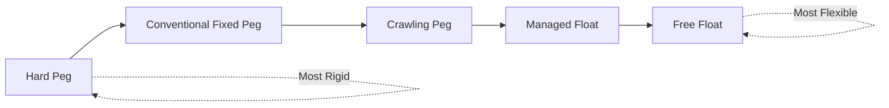
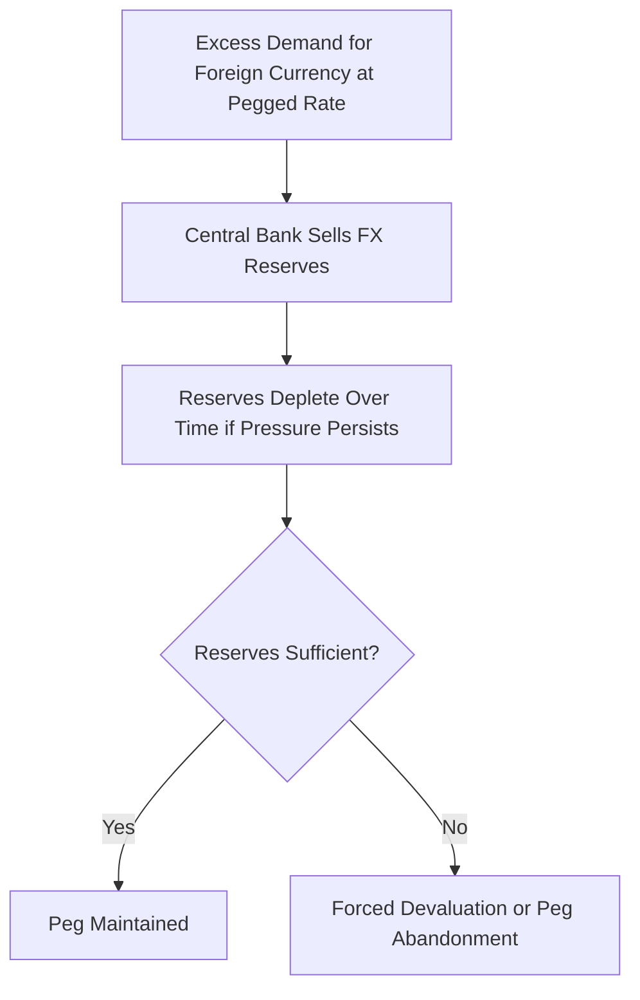
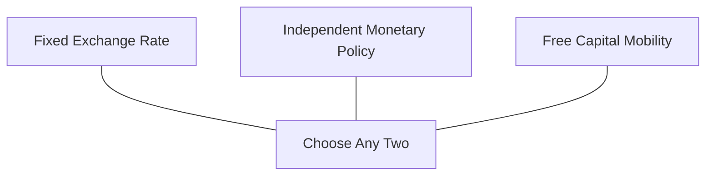

## Exchange Rate Systems: Fixed, Floating, and Managed

### Overview

An **exchange rate system** (or exchange rate regime) is the framework a country's monetary authority uses to determine and manage the value of its domestic currency relative to foreign currencies. Regimes span a spectrum from fully fixed to fully floating, with numerous intermediate arrangements. The choice of regime has profound implications for monetary policy autonomy, macroeconomic stability, and vulnerability to currency crises, formalized in trade theory and open-economy macroeconomics through frameworks such as the **Impossible Trinity (Trilemma)**.

### The Exchange Rate Regime Spectrum

| Regime Type | Flexibility | Examples |
| --- | --- | --- |
| Currency Union / Dollarization | None (no independent currency) | Eurozone members, Ecuador (USD), Panama (USD) |
| Currency Board | Near-zero (legally fixed, fully backed by reserves) | Hong Kong (HKD pegged to USD), historically Argentina (1991–2002) |
| Conventional Fixed Peg | Low (fixed but adjustable in crisis) | Saudi Arabia (SAR pegged to USD), historically Bretton Woods system |
| Crawling Peg / Band | Low-Moderate (pre-announced gradual adjustment) | Historically Chile, China's pre-2005 gradual adjustments |
| Managed Float ("Dirty Float") | Moderate-High (market-determined with periodic intervention) | India, China (post-2005), Singapore |
| Free (Independent) Float | Full (market-determined, minimal/no intervention) | United States, Eurozone (external rate), United Kingdom, Japan, Australia |

### 1. Fixed Exchange Rate Systems

Under a **fixed exchange rate**, the central bank commits to maintaining the currency's value at (or within a narrow band around) a specific rate relative to another currency (or a basket of currencies), typically by standing ready to buy or sell foreign currency reserves to defend the peg.

**Mechanics of Peg Defense:**

$$\bar{E} = \text{Fixed announced rate}$$

If market demand for foreign currency exceeds supply at the pegged rate (creating depreciation pressure), the central bank must **sell foreign reserves** and buy domestic currency to maintain $\bar{E}$. If market supply of foreign currency exceeds demand (appreciation pressure), the central bank must **buy foreign reserves** (accumulate reserves) and sell domestic currency.

**Advantages of Fixed Rates:**

- **Reduced exchange rate uncertainty** for international trade and investment, lowering transaction costs and hedging needs for firms engaged in cross-border commerce
- **Nominal anchor for inflation expectations**, particularly valuable for economies with a history of high inflation or weak monetary policy credibility (a fixed rate to a stable currency, such as the USD or EUR, can "import" the credibility of the anchor currency's central bank)
- **Discipline effect**: constrains domestic policymakers from pursuing excessively expansionary monetary policy, since sustained monetary expansion would generate depreciation pressure incompatible with the peg

**Disadvantages of Fixed Rates:**

- **Loss of independent monetary policy** (formalized in the Trilemma below): interest rates must be set to defend the peg rather than to address domestic macroeconomic conditions (e.g., unemployment, domestic inflation)
- **Vulnerability to speculative attack**: if markets doubt the sustainability of a peg (due to insufficient reserves, unsustainable current account deficits, or political constraints), speculators may sell the currency en masse, forcing costly reserve depletion and potentially a disorderly devaluation
- **No automatic adjustment to asymmetric shocks**: a country experiencing an adverse terms-of-trade or demand shock cannot use exchange rate depreciation to restore competitiveness, forcing adjustment through more painful channels (wage/price deflation, unemployment) — this is a core concern of Optimal Currency Area theory
- **Reserve accumulation costs**: maintaining adequate reserves to credibly defend a peg carries an opportunity cost, as reserves are typically held in lower-yielding, highly liquid foreign assets

### 2. Floating (Flexible) Exchange Rate Systems

Under a **free float**, the exchange rate is determined by market supply and demand for the currency, with the central bank generally not intervening (or intervening only rarely, in exceptional circumstances).

**Determinants of a floating exchange rate** (short-run, asset-market approach):

$$E = f(i_d - i_f, \text{expected future } E, \text{risk premium})$$

where $i_d$ and $i_f$ are domestic and foreign interest rates. This reflects the **uncovered interest rate parity (UIP)** condition:

$$i_d = i_f + \frac{E^e_{t+1} - E_t}{E_t}$$

**Advantages of Floating Rates:**

- **Automatic adjustment mechanism**: the exchange rate can depreciate in response to adverse shocks (e.g., a negative terms-of-trade shock, a current account deficit), helping restore external competitiveness without requiring painful internal wage/price deflation
- **Monetary policy independence**: the central bank can set interest rates according to domestic macroeconomic objectives without needing to defend a specific exchange rate level
- **Absorbs external shocks**: acts as a "shock absorber," insulating the domestic economy somewhat from foreign monetary policy changes and external demand fluctuations
- **No large reserve stockpile required** for exchange rate defense (though reserves may still be held for other precautionary purposes)

**Disadvantages of Floating Rates:**

- **Exchange rate volatility and uncertainty**, raising transaction costs and hedging needs for exporters, importers, and international investors
- **Potential for excessive volatility or misalignment** driven by speculative capital flows, herding behavior, or shifts in market sentiment, sometimes deviating meaningfully from levels justified by economic fundamentals over extended periods
- **Pass-through to domestic inflation**: currency depreciation raises the domestic-currency price of imports, which can meaningfully fuel inflation, particularly in economies heavily reliant on imported inputs or with significant foreign-currency-denominated debt
- **Balance sheet risk ("original sin")**: firms, banks, or governments in emerging markets with foreign-currency-denominated debt face a sharply increased debt-servicing burden (in domestic currency terms) when the currency depreciates, a major contributing factor in several historical emerging-market financial crises

### 3. Managed Float ("Dirty Float") Systems

A **managed float** is a hybrid regime: the exchange rate is primarily market-determined, but the central bank periodically intervenes (buying or selling foreign currency) to smooth excessive volatility, resist rapid appreciation/depreciation, or nudge the rate toward a policy-preferred level, without committing to a specific fixed target.

**Common managed float interventions:**

- **Sterilized intervention**: the central bank buys/sells foreign currency to influence the exchange rate while simultaneously conducting offsetting domestic open market operations to keep the domestic money supply (and thus interest rates) unchanged
- **Unsterilized intervention**: foreign currency intervention is allowed to directly affect the domestic money supply, effectively linking exchange rate management to monetary policy

**Key Points**

- Managed floats represent the most common real-world regime among major emerging-market and several developed economies, since they retain most of the flexibility benefits of floating while allowing policymakers to moderate excessive short-term volatility or address specific competitiveness concerns
- The classification of countries' actual (de facto) exchange rate regimes often differs from their officially announced (de jure) regime; the IMF maintains a widely used de facto classification system precisely because announced regimes do not always reflect actual central bank behavior

### The Impossible Trinity (Trilemma)

A foundational concept in open-economy macroeconomics: a country **cannot simultaneously maintain all three** of the following policy objectives — it can achieve at most **two out of three**.

**Diagram: The Impossible Trinity (svg_diagram)**

<svg xmlns="http://www.w3.org/2000/svg" viewBox="0 0 500 460">
<text x="250" y="26" text-anchor="middle" font-size="15" font-weight="bold" fill="#1a1a1a">The Impossible Trinity / Trilemma (svg_diagram)</text>
<polygon points="250,60 100,340 400,340" fill="none" stroke="#333" stroke-width="2" />
<circle cx="250" cy="60" r="8" fill="#2563eb" />
<text x="250" y="45" font-size="12" text-anchor="middle" fill="#2563eb" font-weight="bold">Fixed Exchange Rate</text>
<circle cx="100" cy="340" r="8" fill="#16a34a" />
<text x="100" y="365" font-size="12" text-anchor="middle" fill="#16a34a" font-weight="bold">Independent</text>
<text x="100" y="380" font-size="12" text-anchor="middle" fill="#16a34a" font-weight="bold">Monetary Policy</text>
<circle cx="400" cy="340" r="8" fill="#dc2626" />
<text x="400" y="365" font-size="12" text-anchor="middle" fill="#dc2626" font-weight="bold">Free Capital</text>
<text x="400" y="380" font-size="12" text-anchor="middle" fill="#dc2626" font-weight="bold">Mobility</text>

<text x="250" y="230" font-size="11" text-anchor="middle" fill="#555">Choose only 2 of 3</text>

<text x="130" y="200" font-size="10" fill="#333" transform="rotate(-63 130 200)">Currency Board / Union</text>

<text x="330" y="200" font-size="10" fill="#333" transform="rotate(63 330 200)">Closed Capital Account</text>

<text x="250" y="355" font-size="10" fill="#333" text-anchor="middle">Free Float</text>

</svg>

**The three corner solutions:**

| Combination | Achieves | Sacrifices | Example |
| --- | --- | --- | --- |
| Fixed rate + Free capital mobility | Exchange rate stability, integration | Independent monetary policy | Hong Kong currency board, Eurozone members |
| Independent monetary policy + Free capital mobility | Policy autonomy, financial integration | Fixed exchange rate (must float) | United States, United Kingdom, Japan |
| Fixed rate + Independent monetary policy | Exchange rate stability, policy autonomy | Free capital mobility (requires capital controls) | China (historically, to varying degrees), Bretton Woods era generally |

**Formal logic**: Under free capital mobility, uncovered interest parity ties the domestic interest rate to the foreign interest rate plus expected depreciation. If the exchange rate is fixed (expected depreciation = 0), the domestic interest rate is forced to equal the foreign interest rate, eliminating independent monetary policy. The only way to set domestic interest rates independently *while* maintaining a fixed rate is to restrict capital mobility (capital controls), preventing arbitrage from equalizing rates.

### Currency Crises and Speculative Attacks

**First-Generation Models (Krugman, 1979)**

A currency crisis emerges from a fundamental inconsistency between a fixed exchange rate commitment and expansionary domestic policy (e.g., persistent fiscal deficits monetized by the central bank). As reserves gradually and predictably deplete to finance the resulting balance of payments deficit, speculators rationally attack the currency *before* reserves are fully exhausted, forcing an earlier collapse of the peg than the fundamentals alone would suggest.

**Second-Generation Models (Obstfeld, 1994)**

Emphasizes **self-fulfilling crises**: even without unsustainable fundamentals, if enough market participants *believe* a peg will be abandoned (e.g., anticipating the government will prioritize domestic objectives like reducing unemployment over defending the peg once defense costs rise), a speculative attack itself can make peg abandonment the rational policy response, creating multiple possible equilibria (peg survives vs. peg collapses) depending on market expectations alone.

**Third-Generation Models (post-Asian Financial Crisis, 1997–98)**

Emphasize the role of **financial sector vulnerabilities** — particularly currency and maturity mismatches on bank and corporate balance sheets (foreign-currency-denominated short-term debt funding longer-term domestic-currency assets) — as amplifying mechanisms that transform exchange rate pressure into full-blown banking and financial crises, beyond what pure currency-market dynamics alone would predict.

### Historical Case Study Summary: Major Exchange Rate Regime Episodes

| Episode | Regime Feature | Outcome |
| --- | --- | --- |
| Bretton Woods System (1944–1973) | Fixed rates pegged to USD, USD convertible to gold | Collapsed 1971–73 amid US inflation and gold convertibility pressures ("Nixon Shock") |
| European Exchange Rate Mechanism (ERM) crisis, 1992 | Fixed bands within pre-Euro European system | UK and Italy forced out ("Black Wednesday," September 1992) amid speculative attacks |
| Mexican Peso Crisis, 1994–95 | Managed peg with capital account openness | Sharp devaluation, "Tequila Crisis" contagion to other emerging markets |
| Asian Financial Crisis, 1997–98 | Various pegs (Thailand, Indonesia, South Korea, others) combined with financial sector vulnerabilities | Multiple currency collapses, IMF intervention programs |
| Argentine Currency Board Collapse, 2001–02 | Hard peg (currency board) to USD | Abandoned amid fiscal/debt unsustainability, severe economic contraction |

[Inference] These historical episodes are extensively studied case examples in international finance curricula; specific quantitative details (magnitude of devaluation, reserve levels, dates of specific interventions) vary across sources and should be verified against primary IMF or central bank documentation for precise figures.

### Choosing an Exchange Rate Regime: Key Considerations

- **Economic size and openness**: smaller, highly open economies often favor greater exchange rate stability (fixed or managed) to reduce transaction cost burdens on trade; larger, more diversified economies can better absorb the costs of floating
- **Trade partner concentration**: economies with a dominant trading partner may favor pegging to that partner's currency to stabilize the most economically important bilateral exchange rate
- **Financial market development and institutional credibility**: countries with weak monetary policy credibility or underdeveloped financial markets may benefit from the discipline and anchoring effect of a fixed rate, while countries with strong institutions can better manage the responsibilities of independent monetary policy under a float
- **Vulnerability to asymmetric shocks**: economies frequently subject to country-specific shocks (e.g., commodity exporters facing volatile terms of trade) generally benefit more from exchange rate flexibility as an adjustment mechanism (a core OCA consideration)
- **Capital account openness**: the Trilemma dictates that highly open capital accounts are difficult to combine with a credible fixed rate and independent monetary policy simultaneously

### Key Points

- Exchange rate regimes exist on a spectrum from fully fixed (currency unions, currency boards) to fully floating, with managed floats representing the empirically most common real-world arrangement
- The Impossible Trinity (Trilemma) establishes that a country can achieve at most two of: fixed exchange rate, independent monetary policy, and free capital mobility — a foundational constraint in open-economy macroeconomic policy design
- Fixed rates offer stability and a credible inflation anchor but sacrifice monetary policy independence and automatic shock-adjustment capacity, and are vulnerable to speculative attack
- Floating rates preserve monetary policy independence and provide automatic adjustment to shocks but introduce exchange rate volatility and inflation pass-through risk
- Currency crisis models have evolved across three "generations," progressively incorporating self-fulfilling expectations dynamics and financial sector balance sheet vulnerabilities beyond simple fundamentals-driven analysis

### Related Topics

- Balance of Payments Accounting
- Purchasing Power Parity and Real Exchange Rates
- Interest Rate Parity (Covered and Uncovered)
- Optimal Currency Area Theory and Monetary Union
- Currency Crises and Speculative Attacks
- Capital Controls and Financial Account Management
- Central Bank Reserve Management and Sterilized Intervention
- The Mundell-Fleming Model (IS-LM-BOP Framework)
- Dollarization and Currency Boards
- Emerging Market Debt and "Original Sin" in International Finance