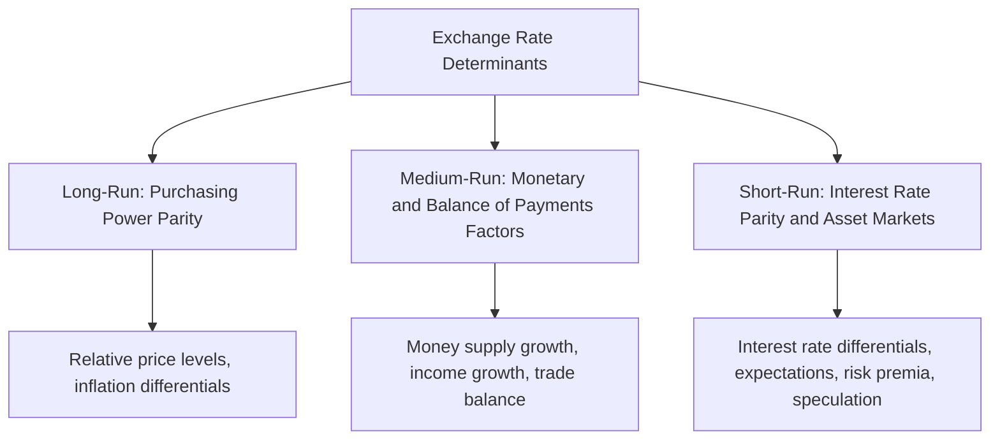
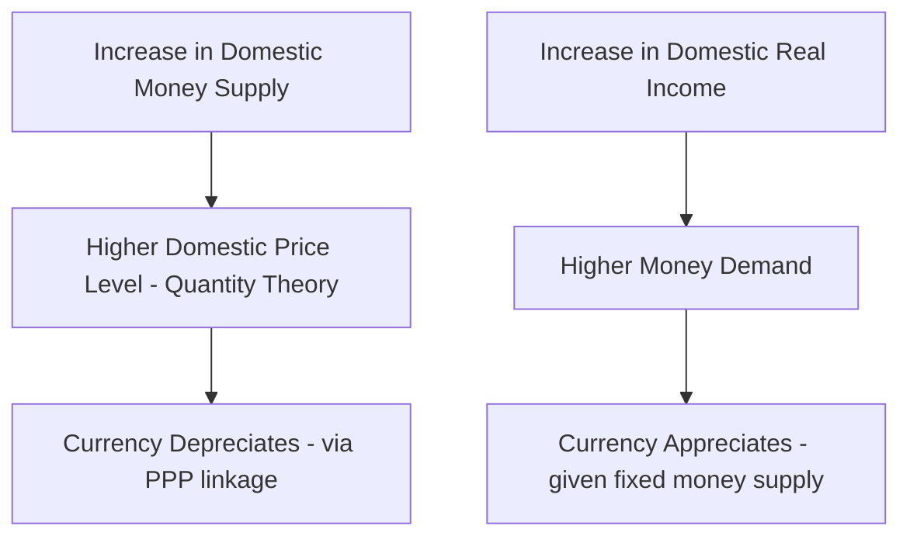
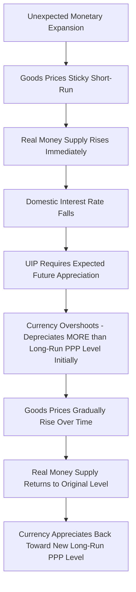

## Determinants of Exchange Rates

### Overview

Exchange rate determination theory explains how the relative price of two currencies is established and what factors drive its movement over different time horizons. No single model fully explains exchange rate behavior at all time horizons; instead, economists rely on a hierarchy of complementary frameworks: **Purchasing Power Parity (PPP)** for long-run price-level-driven movements, **Interest Rate Parity** for short-run capital-flow-driven movements, the **Monetary Approach** and **Asset Market Approach** for broader macroeconomic linkages, and the **Balance of Payments (flow) Approach** for trade-driven pressures.

### Time Horizon Framework for Exchange Rate Determinants

### 1. Purchasing Power Parity (PPP)

**Absolute PPP**: the exchange rate between two currencies should equal the ratio of the two countries' price levels for an identical basket of goods, ensuring the **Law of One Price** holds internationally.

$$E = \frac{P_d}{P_f}$$

where $E$ is the exchange rate (domestic currency per unit of foreign currency), $P_d$ is the domestic price level, and $P_f$ is the foreign price level.

**Relative PPP**: the *percentage change* in the exchange rate over time equals the *difference* in inflation rates between the two countries.

$$\frac{\Delta E}{E} \approx \pi_d - \pi_f$$

where $\pi_d$ and $\pi_f$ are domestic and foreign inflation rates. If domestic inflation exceeds foreign inflation, the domestic currency should depreciate proportionally to preserve relative purchasing power.

**Worked Example**: Suppose the U.S. inflation rate is 5% and the Eurozone inflation rate is 2% over a year. Relative PPP predicts:

$$\frac{\Delta E}{E} \approx 0.05 - 0.02 = 0.03$$

The U.S. dollar should depreciate approximately 3% against the euro over the year to preserve purchasing power parity.

**The Big Mac Index**: a well-known informal illustration of PPP developed by *The Economist*, comparing the price of a McDonald's Big Mac across countries (converted to a common currency) as a rough gauge of currency over/undervaluation relative to PPP-implied levels.

$$\text{Implied PPP Exchange Rate} = \frac{\text{Big Mac Price}_{domestic}}{\text{Big Mac Price}_{foreign}}$$

**Why PPP Holds Only in the Long Run (Key Deviations):**

- **Non-tradable goods and services**: PPP theory strictly applies to tradable goods; services like haircuts, housing, and many local services are not internationally traded, so their prices need not equalize across countries, weakening aggregate price-level convergence
- **Transportation costs and trade barriers**: tariffs, quotas, and shipping costs prevent full price arbitrage, allowing persistent price gaps
- **Imperfect competition and pricing-to-market**: firms with market power may set different prices in different national markets rather than passing through exchange rate changes fully (incomplete "pass-through")
- **Different consumption baskets**: countries consume different weighted baskets of goods, and price indices (CPI, etc.) reflect these differing baskets rather than a truly identical basket
- **The Balassa-Samuelson Effect**: systematic productivity differences in tradable-goods sectors across countries lead richer countries to have persistently higher price levels than PPP alone would predict — because higher tradable-sector productivity bids up wages economy-wide (including in the non-tradable sector), raising non-tradable goods prices even without a currency misalignment

[Inference] Empirical PPP research generally finds it holds reasonably well as a *long-run anchor* (over periods of many years to decades) but has very limited predictive power for short-to-medium-run exchange rate movements, a widely replicated finding across the exchange rate economics literature, sometimes referred to as the "PPP puzzle" given the slow speed of empirical convergence relative to what standard models would predict.

### 2. Interest Rate Parity (IRP)

Interest rate parity conditions link exchange rate expectations to cross-country interest rate differentials, forming the dominant framework for short-run exchange rate determination in modern open-economy macroeconomics.

**Covered Interest Rate Parity (CIRP)**

Links spot and forward exchange rates to the interest rate differential, holding *without* exchange rate risk (since the forward contract locks in the future exchange rate):

$$F = S \times \frac{(1 + i_d)}{(1 + i_f)}$$

where $F$ is the forward rate, $S$ is the spot rate, $i_d$ is the domestic interest rate, and $i_f$ is the foreign interest rate. CIRP is maintained by **covered interest arbitrage**: if the relationship does not hold, riskless arbitrage profit opportunities exist, which market participants exploit until the parity condition is restored. Because it can be enforced via nearly riskless arbitrage, CIRP tends to hold very closely in liquid, well-functioning financial markets under normal conditions.

**Uncovered Interest Rate Parity (UIP)**

Links the *expected* future spot rate (rather than a contractually locked forward rate) to the interest rate differential, and therefore involves exchange rate risk:

$$i_d = i_f + \frac{E^e_{t+1} - E_t}{E_t}$$

Intuitively: if domestic interest rates exceed foreign interest rates, the domestic currency must be *expected to depreciate* by an amount that exactly offsets the interest rate advantage, so that expected returns are equalized across currencies for a risk-neutral investor.

**Worked Example**: If the U.S. interest rate is 5% and the Eurozone interest rate is 2%, UIP predicts the dollar must be expected to depreciate by approximately 3% against the euro over the relevant period — otherwise, investors would have an incentive to borrow in euros and invest in dollars for a risk-free gain (absent risk premia), a trade that would itself put pressure on the exchange rate until the parity condition is restored.

**Key Points**

- UIP is a substantially weaker empirical relationship than CIRP, because it depends on *expectations* (which are unobservable and can be systematically biased) and requires investors to be risk-neutral with respect to currency risk, an assumption frequently violated in practice
- The persistent empirical failure of UIP (higher-interest-rate currencies often do *not* depreciate as UIP predicts, and sometimes even appreciate) is a well-documented anomaly known as the **"forward premium puzzle"** or **UIP puzzle**, motivating the **carry trade** — a strategy of borrowing in low-interest-rate currencies and investing in high-interest-rate currencies to capture the interest differential without the offsetting depreciation UIP would predict, at the risk of a sudden sharp reversal ("carry trade unwind")

### 3. The Monetary Approach to Exchange Rate Determination

Building on PPP and the quantity theory of money, the monetary approach models the exchange rate as determined by relative money supplies and money demands across two countries.

**Flexible-Price Monetary Model:**

$$E = \frac{M_d / L(Y_d, i_d)}{M_f / L(Y_f, i_f)}$$

where $M$ is money supply, $Y$ is real income, $i$ is the interest rate, and $L(\cdot)$ is real money demand as a function of income and the interest rate. Key predictions:

- An **increase in domestic money supply** (relative to foreign) causes the domestic currency to **depreciate**, since it raises the domestic price level (via the quantity theory) and, per PPP, a higher price level requires a weaker currency to maintain purchasing power parity
- An **increase in domestic real income** (relative to foreign) increases domestic real money demand, which — holding money supply constant — tends to cause the domestic currency to **appreciate** (since higher money demand relative to supply is deflationary, or equivalently requires a stronger currency under PPP)
- **Higher domestic interest rates** reduce domestic real money demand (money is less attractive relative to interest-bearing assets), which tends to cause the domestic currency to **depreciate** under this framework — notably the *opposite* directional prediction from the interest-rate-parity/asset-market framework below, illustrating that different models can generate different (even conflicting) predictions for the same variable depending on which channel dominates

### 4. The Asset Market (Portfolio Balance) Approach

Recognizing that currencies are, in modern financial markets, predominantly traded as **assets** rather than merely as a medium for goods transactions, the asset market approach emphasizes that exchange rates are determined by the relative demand for domestic versus foreign financial assets, incorporating:

- **Interest rate differentials** (as in UIP)
- **Relative risk and risk premia**: investors demand compensation for holding riskier currencies/assets, and shifts in global risk appetite ("risk-on" vs. "risk-off" sentiment) can drive significant exchange rate movements independent of interest rate differentials or fundamentals
- **Expected future economic conditions**: since exchange rates, like other asset prices, are forward-looking, they respond immediately to *news* about expected future money supply, growth, or policy changes, not just to current period fundamentals
- **Wealth effects and portfolio rebalancing**: changes in relative national wealth or asset supplies (e.g., large-scale government bond issuance) can shift portfolio demand and affect exchange rates through non-interest-rate channels

**Key Points**

- The asset market approach explains why exchange rates are typically far **more volatile** than underlying macroeconomic fundamentals (like relative money supplies or trade balances) would suggest under the simpler monetary approach — because exchange rates, as forward-looking asset prices, react instantly and sometimes sharply to changing expectations and shifting risk sentiment, similar to stock or bond price volatility
- This volatility is central to the well-known **Dornbusch Overshooting Model** (1976), discussed below

### The Dornbusch Overshooting Model

A highly influential model reconciling short-run exchange rate volatility with long-run PPP-consistent behavior, based on the idea that **goods prices adjust slowly ("sticky") while asset/financial markets adjust instantaneously**.

**Mechanism:**

1. A monetary expansion (e.g., an unexpected increase in domestic money supply) immediately lowers the domestic interest rate (since goods prices are sticky in the short run, the real money supply increases immediately)
2. By UIP, a lower domestic interest rate requires the currency to be **expected to appreciate** going forward to equalize returns — meaning the currency must **immediately depreciate now, beyond its eventual long-run PPP-consistent level**, so that subsequent expected appreciation back toward the long-run level satisfies the UIP condition
3. Over time, as sticky goods prices gradually adjust upward (reflecting the higher money supply), the real money supply returns to its original level, domestic interest rates rise back toward the foreign rate, and the exchange rate gradually appreciates back toward its new (depreciated relative to before the shock, but less depreciated than the initial overshoot) long-run PPP-consistent level

**Diagram: Exchange Rate Overshooting Path (svg_diagram)**

<svg xmlns="http://www.w3.org/2000/svg" viewBox="0 0 640 380">
<text x="320" y="22" text-anchor="middle" font-size="15" font-weight="bold" fill="#1a1a1a">Dornbusch Overshooting: Exchange Rate Path After Monetary Shock (svg_diagram)</text>
<line x1="80" y1="330" x2="80" y2="50" stroke="#333" stroke-width="2" />
<line x1="80" y1="330" x2="580" y2="330" stroke="#333" stroke-width="2" />
<text x="40" y="55" font-size="12" fill="#333">Exchange Rate (E)</text>
<text x="590" y="335" font-size="12" fill="#333">Time</text>

<line x1="80" y1="200" x2="180" y2="200" stroke="#666" stroke-width="2" />
<text x="90" y="190" font-size="10" fill="#666">Initial E0</text>

<line x1="180" y1="160" x2="580" y2="160" stroke="#16a34a" stroke-width="2" stroke-dasharray="5,3" />
<text x="500" y="150" font-size="10" fill="#16a34a">New Long-Run PPP Level E∞</text>

<path d="M 180 200 L 200 280" stroke="#dc2626" stroke-width="2.5" fill="none" />
<path d="M 200 280 Q 350 220, 580 160" stroke="#dc2626" stroke-width="2.5" fill="none" />
<text x="210" y="300" font-size="10" fill="#dc2626">Overshoot (immediate depreciation beyond E∞)</text>
<line x1="180" y1="160" x2="180" y2="280" stroke="#999" stroke-width="1" stroke-dasharray="2,2" />
<text x="185" y="330" font-size="10" fill="#333">t = 0 (shock)</text>
</svg>

### The Balance of Payments (Flow Market) Approach

An older, more traditional framework viewing the exchange rate as the price that equilibrates the flow supply and demand for foreign exchange arising from current account (trade) and financial account transactions.

- A **current account surplus** (more export earnings than import payments) generates net foreign currency inflow, creating appreciation pressure
- A **current account deficit** generates net foreign currency outflow demand, creating depreciation pressure
- Similarly, **net financial account inflows** (foreign investment into the country) create appreciation pressure, while **net outflows** create depreciation pressure

**Key Points**

- This flow-based framework is intuitive and useful for understanding *directional* pressures from trade and investment flows, but modern exchange rate economics generally views the **asset market approach** as more empirically relevant for explaining short-run exchange rate levels and volatility, since daily/weekly foreign exchange trading volume vastly exceeds the volume attributable to underlying trade flows — implying that portfolio and speculative capital movements, not merely goods trade financing needs, dominate short-run price determination in currency markets

### Summary Table: Determinants Across Frameworks

| Framework | Key Driving Variable(s) | Time Horizon | Predicted Effect of Higher Domestic Interest Rates |
| --- | --- | --- | --- |
| PPP | Relative price levels/inflation | Long-run | N/A (not directly addressed) |
| Monetary Approach | Relative money supply, income | Medium-run | Currency depreciates (via reduced money demand) |
| UIP / Asset Market | Interest differentials, expectations, risk premia | Short-run | Currency appreciates initially (attracts capital), consistent with the currency needing to be expected to depreciate subsequently |
| Dornbusch Overshooting | Sticky prices + UIP interaction | Short-to-medium transition | Currency initially depreciates sharply (overshoots) following expansionary shock, then gradually appreciates |
| BOP Flow Approach | Trade balance, net capital flows | Short-run (directional) | Higher rates attract capital inflow → appreciation pressure |

[Inference] Reconciling the monetary approach's prediction (higher rates → depreciation, via reduced money demand) with the asset-market/UIP-consistent prediction (higher rates → often observed short-run appreciation, as capital is attracted before offsetting expected depreciation) is a recognized tension in exchange rate theory; the asset-market framework is generally considered more relevant for explaining actual observed short-run currency movements in modern floating-rate systems, since financial capital flows dominate short-run currency market activity.

### Additional Real-World Influences Not Fully Captured in Formal Models

- **Central bank policy signaling and forward guidance**: markets react strongly to anticipated future policy shifts, not just current rate levels
- **Political and geopolitical risk**: elections, sanctions, conflict, and policy uncertainty can drive substantial currency movements via shifting risk premia
- **Commodity price movements**: for commodity-exporting economies (e.g., Australia, Canada, many emerging markets), currency values are often closely linked to key export commodity prices (terms-of-trade channel)
- **Speculative positioning and market sentiment**: large derivative and futures market positioning by speculative traders can amplify or dampen exchange rate movements beyond what fundamentals alone would predict
- **Central bank intervention** (discussed in the exchange rate systems topic): direct market operations by monetary authorities to influence the rate

### Key Points

- No single model fully explains exchange rate behavior; different frameworks (PPP, monetary approach, interest rate parity, asset market approach) are complementary, each more relevant at different time horizons
- PPP is a reasonable long-run anchor but has weak short-run predictive power, due to non-tradables, trade costs, imperfect competition, and productivity-driven price level differences (Balassa-Samuelson)
- Covered Interest Rate Parity holds closely due to riskless arbitrage; Uncovered Interest Rate Parity is empirically weaker and its persistent failure (the "forward premium puzzle") underlies the carry trade strategy
- The Dornbusch Overshooting Model reconciles short-run exchange rate volatility with long-run PPP consistency via the interaction of sticky goods prices and flexible asset markets
- Modern exchange rate economics emphasizes the asset market approach as most relevant for short-run currency movements, given that financial capital flows vastly exceed trade-related currency flows in volume

### Related Topics

- Exchange Rate Systems: Fixed, Floating, and Managed
- Balance of Payments Accounting
- The Impossible Trinity and Monetary Policy Autonomy
- Carry Trade Strategies and the Forward Premium Puzzle
- The Dornbusch Overshooting Model
- Balassa-Samuelson Effect and Cross-Country Price Levels
- Currency Crises and Speculative Attacks
- Central Bank Intervention and Sterilization
- The Mundell-Fleming Model (IS-LM-BOP Framework)
- Commodity Currencies and Terms-of-Trade Effects