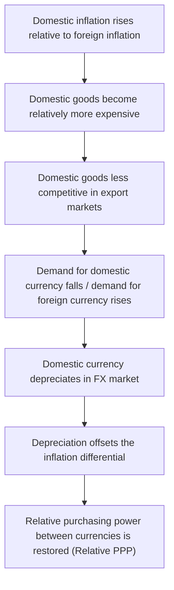

## Purchasing Power Parity

### Definition and Core Concept

Purchasing Power Parity (PPP) is an economic theory stating that, in the absence of transaction costs and trade barriers, identical goods should have the same price when expressed in a common currency across different countries. PPP links exchange rate movements to relative price levels between two economies, providing a framework for determining the "fair value" or equilibrium level of an exchange rate based on the relative purchasing power of each currency.

The theory rests on the **law of one price**: if a good can be freely traded and there are no transportation costs or trade barriers, that good should sell for the same price everywhere once prices are converted into a common currency. If this were not the case, arbitrageurs could profit by buying the good where it is cheap and selling it where it is expensive, and this activity would drive prices back into alignment.

### Absolute PPP

Absolute PPP states that the exchange rate between two currencies should equal the ratio of the price levels of a common basket of goods in the two countries.

$$S = \frac{P_d}{P_f}$$

Where:

- $S$ = spot exchange rate (domestic currency per unit of foreign currency)
- $P_d$ = domestic price level (price of the basket in domestic currency)
- $P_f$ = foreign price level (price of the same basket in foreign currency)

**Example**

If a basket of goods costs $200 in the United States and the same basket costs €180 in the Eurozone, absolute PPP predicts the exchange rate should be:

$$S = \frac{200}{180} = 1.111 \text{ USD/EUR}$$

Meaning 1 euro should be worth approximately $1.11. If the actual market exchange rate deviates significantly from this, absolute PPP suggests the currency is either overvalued or undervalued relative to its purchasing-power-implied value.

Absolute PPP rarely holds precisely in practice due to non-tradable goods, trade barriers, taxes, transportation costs, and differences in consumption baskets across countries. [Inference] The magnitude and persistence of these deviations vary by country pair and time period, and empirical studies have found mixed support for absolute PPP holding even over long horizons.

### Relative PPP

Relative PPP is a weaker and more empirically useful version of the theory. Rather than claiming price levels must be equal, it states that the *percentage change* in the exchange rate over a period should equal the *difference in inflation rates* between the two countries.

$$\frac{S_1 - S_0}{S_0} \approx \pi_d - \pi_f$$

Where:

- $S_0$ = exchange rate at the start of the period
- $S_1$ = exchange rate at the end of the period
- $\pi_d$ = domestic inflation rate
- $\pi_f$ = foreign inflation rate

An approximate and commonly used form expresses the expected future spot rate as:

$$E(S_1) = S_0 \times \frac{1 + \pi_d}{1 + \pi_f}$$

**Example**

Suppose the current USD/GBP exchange rate is $S_0 = 1.30$ (i.e., $1.30 per £1). If US inflation is expected to be 5% over the next year and UK inflation is expected to be 2%, relative PPP predicts:

$$E(S_1) = 1.30 \times \frac{1.05}{1.02} = 1.338$$

The dollar is expected to depreciate against the pound (more dollars needed per pound), because US inflation is higher than UK inflation. This is intuitive: a currency experiencing more rapid domestic price increases should lose purchasing power relative to a currency in a lower-inflation country, and this loss should be reflected in currency depreciation.

### Derivation from the Law of One Price

Relative PPP can be derived by assuming absolute PPP holds at two points in time and taking the ratio:

- At time 0: $S_0 = P_{d,0} / P_{f,0}$
- At time 1: $S_1 = P_{d,1} / P_{f,1}$

Dividing:

$$\frac{S_1}{S_0} = \frac{P_{d,1}/P_{d,0}}{P_{f,1}/P_{f,0}} = \frac{1 + \pi_d}{1 + \pi_f}$$

This shows relative PPP is a direct algebraic consequence of absolute PPP holding at two different time points, even though relative PPP is often treated as a separate, more flexible hypothesis that can hold even when absolute PPP does not (e.g., due to a constant proportional gap between price levels caused by non-tradables).

### Real Exchange Rate and PPP Deviations

The **real exchange rate** measures the relative purchasing power of two currencies after adjusting the nominal exchange rate for price level differences, and is the key metric for testing PPP deviations.

$$Q = \frac{S \times P_f}{P_d}$$

Where $Q$ is the real exchange rate. If PPP holds exactly, $Q = 1$ (or a constant), meaning purchasing power is equalized across countries. Persistent deviations of $Q$ from 1 indicate:

- Currency overvaluation ($Q < 1$ relative to baseline, in this formulation domestic goods are relatively expensive)
- Currency undervaluation ($Q > 1$, domestic goods relatively cheap)

[Inference] Empirical research on real exchange rates generally finds that they exhibit mean reversion toward PPP-implied levels over long horizons (often cited as multi-year half-lives in academic studies), but deviations can be large and persistent in the short-to-medium run, a phenomenon sometimes referred to in the literature as the "PPP puzzle."

### The Big Mac Index: A Practical Application

The Big Mac Index, developed by *The Economist*, is an informal but widely cited illustration of absolute PPP. It compares the price of a McDonald's Big Mac across countries (converted to a common currency) to gauge whether currencies are over- or undervalued relative to the US dollar.

**Example calculation**

If a Big Mac costs $5.50 in the US and ¥450 in Japan, with a market exchange rate of ¥110/$:

1. Implied PPP exchange rate: $450 / 5.50 = 81.8$ JPY/USD
2. Market exchange rate: 110 JPY/USD
3. Since the market rate (110) is higher than the PPP-implied rate (81.8), the yen is undervalued against the dollar by approximately:

$$\frac{81.8 - 110}{110} \times 100\% \approx -25.6\%$$

This suggests the yen is roughly 25.6% undervalued relative to the dollar, based on Big Mac prices. The index is a simplified pedagogical tool rather than a rigorous PPP measure, since it uses a single good rather than a broad basket and does not account for non-tradable input costs (rent, labor) that vary systematically with income levels across countries — an issue closely related to the Balassa-Samuelson effect discussed below.

### Balassa-Samuelson Effect

The Balassa-Samuelson effect explains a systematic reason why absolute PPP fails to hold, particularly between richer and poorer countries. It argues that:

1. Productivity in the tradable goods sector tends to be higher in richer countries than in poorer countries, while productivity differences in the non-tradable sector (services, haircuts, rent) are smaller.
2. Higher productivity in tradables allows wages to rise in that sector without pushing up traded goods prices (since prices are internationally arbitraged).
3. Wages in the non-tradable sector must also rise to retain workers, but without a corresponding productivity gain, so non-tradable goods prices rise.
4. The overall price level (which includes both tradables and non-tradables) is therefore higher in richer, more productive countries, even though the exchange rate is determined largely by tradable goods prices.

This effect implies that richer countries will systematically have higher price levels than PPP alone would predict, and their currencies will appear "overvalued" relative to simple PPP benchmarks, which is a well-documented empirical regularity.

### Diagram: PPP Adjustment Mechanism

### Why PPP Fails to Hold Perfectly in Practice

**Key Points**

- **Non-tradable goods**: Services like haircuts, rent, and healthcare cannot be arbitraged internationally, so their prices are not equalized across borders.
- **Transportation costs and tariffs**: These create price wedges that prevent the law of one price from holding exactly, even for tradable goods.
- **Differentiated products and market segmentation**: Firms often engage in pricing-to-market, charging different prices in different countries for branded or differentiated goods based on local demand elasticity.
- **Basket composition differences**: Countries consume different baskets of goods (reflecting different tastes, climates, and income levels), making cross-country price index comparisons imperfect.
- **Capital flows and interest rate differentials**: In the short run, exchange rates are heavily influenced by capital flows, speculation, and interest rate differentials (see uncovered interest rate parity), which can dominate goods-market-driven PPP forces.
- **Government intervention**: Capital controls, managed exchange rate regimes, and central bank intervention can prevent exchange rates from adjusting to PPP-implied levels.
- **Sticky prices**: Nominal prices, especially for non-tradables and contracts, adjust slowly, so short-run exchange rate movements can diverge substantially from relative PPP predictions.

### PPP versus Nominal Exchange Rates in Practice

[Inference] Most empirical studies find that relative PPP performs poorly as a short-run (month-to-month or quarter-to-quarter) predictor of exchange rate movements, since exchange rates are dominated in the short run by capital flows, interest rate differentials, and speculative positioning rather than goods-market price differentials. However, PPP tends to perform better as a long-run anchor, with some studies finding real exchange rates revert toward PPP-consistent levels over multi-year horizons. This distinction is central to how PPP is used in practice: it is generally treated as a long-run equilibrium concept rather than a short-run forecasting tool.

### Applications of PPP

**Key Points**

- **Comparing living standards and GDP across countries**: International organizations such as the IMF and World Bank use PPP-adjusted exchange rates (rather than market exchange rates) to compare GDP and living standards across countries, because market exchange rates can be distorted by capital flows and do not reflect local purchasing power for non-tradables.
- **Identifying currency misalignment**: Policymakers and analysts use deviations from PPP as one input (among many) for assessing whether a currency is overvalued or undervalued.
- **Long-run exchange rate forecasting**: PPP is used as an anchor in long-horizon macroeconomic models, even though it is a poor short-run predictor.
- **Inflation-adjusted trade competitiveness analysis**: Real effective exchange rate indices, which build on PPP logic, are used to assess a country's export competitiveness.

### PPP-Adjusted GDP: A Numerical Illustration

**Example**

Suppose Country A has nominal GDP per capita of $10,000 at market exchange rates, but the cost of a representative basket of goods in Country A is only 40% of the cost of the same basket in the United States. Using PPP conversion factors instead of market exchange rates:

$$\text{GDP per capita (PPP)} = \frac{10{,}000}{0.40} = 25{,}000$$

This adjustment reflects that $10,000 in Country A buys significantly more goods and services domestically than $10,000 would buy in the United States, so PPP-adjusted GDP ($25,000) gives a more accurate picture of real living standards than the unadjusted market-exchange-rate figure.

### Relationship to Other International Finance Parity Conditions

PPP is one of several parity conditions used together to model exchange rate and interest rate relationships in open economies:

- **Interest Rate Parity (IRP)**: Links interest rate differentials to forward exchange rate premiums/discounts.
- **Fisher Effect**: Links nominal interest rates to real interest rates and expected inflation within a single country.
- **International Fisher Effect (IFE)**: Combines PPP and the Fisher Effect to link interest rate differentials directly to expected exchange rate changes, effectively substituting expected inflation differentials (from PPP) with interest rate differentials.

$$\frac{E(S_1) - S_0}{S_0} \approx i_d - i_f$$

This parity web (PPP, IRP, Fisher Effect, IFE) forms the theoretical core of open-economy exchange rate determination models and is a standard component of international finance curricula.

**Related Topics**

- Interest Rate Parity (Covered and Uncovered)
- The International Fisher Effect
- Real Effective Exchange Rate (REER) and Nominal Effective Exchange Rate (NEER)
- Balassa-Samuelson Effect (in depth)
- Exchange Rate Regimes (fixed, floating, managed float)
- Foreign Exchange Market Efficiency and Arbitrage
- The J-Curve Effect and Trade Balance Adjustment
- Triffin Dilemma and Reserve Currency Dynamics
- Currency Crises and Speculative Attacks