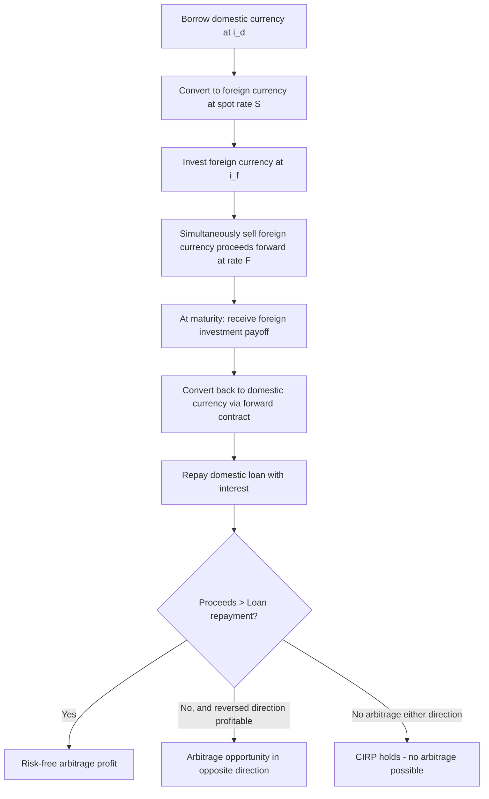

## Interest Rate Parity and Covered Interest Arbitrage

### Definition and Core Concept

Interest Rate Parity (IRP) is a no-arbitrage condition in international finance stating that the difference in interest rates between two countries should be equal to the differential between the forward exchange rate and the spot exchange rate. IRP explains why investors cannot earn risk-free arbitrage profits by borrowing in a low-interest-rate currency, converting to a high-interest-rate currency, investing there, and simultaneously locking in a forward contract to convert back — because the forward rate should already adjust to eliminate that opportunity.

IRP comes in two forms:

- **Covered Interest Rate Parity (CIRP)**: Holds when a forward contract is used to hedge exchange rate risk, making the arbitrage condition risk-free.
- **Uncovered Interest Rate Parity (UIRP)**: Holds when no forward contract is used, relying instead on the *expected* future spot rate, making the condition subject to exchange rate risk.

### Covered Interest Rate Parity: The Formula

Covered interest rate parity states that the forward exchange rate premium or discount should offset the interest rate differential between two currencies, such that a hedged investment in either currency yields the same return.

$$F = S \times \frac{1 + i_d}{1 + i_f}$$

Where:

- $F$ = forward exchange rate (domestic currency per unit of foreign currency)
- $S$ = spot exchange rate (domestic currency per unit of foreign currency)
- $i_d$ = domestic interest rate (for the relevant maturity)
- $i_f$ = foreign interest rate (for the relevant maturity)

An approximate linear version, commonly used when interest rates are relatively low, is:

$$\frac{F - S}{S} \approx i_d - i_f$$

This shows that the forward premium (or discount) on the foreign currency should approximately equal the interest rate differential between the domestic and foreign country.

### Derivation of Covered Interest Rate Parity

The derivation follows from constructing two theoretically equivalent investment strategies and requiring that they yield identical payoffs under no-arbitrage:

**Strategy 1 (Domestic investment)**: Invest 1 unit of domestic currency at the domestic interest rate for one period.

$$\text{Payoff} = 1 \times (1 + i_d)$$

**Strategy 2 (Covered foreign investment)**: Convert 1 unit of domestic currency into foreign currency at the spot rate, invest at the foreign interest rate, and simultaneously sell the foreign currency proceeds forward at rate $F$ to lock in the domestic-currency value.

$$\text{Payoff} = \frac{1}{S} \times (1 + i_f) \times F$$

Setting the two payoffs equal (since both strategies are risk-free and should yield identical returns under no-arbitrage):

$$1 + i_d = \frac{F}{S} \times (1 + i_f)$$

Solving for $F$:

$$F = S \times \frac{1 + i_d}{1 + i_f}$$

This is the covered interest rate parity condition. Because both legs of Strategy 2 are contracted at known rates today (spot conversion and forward sale), there is no exchange rate risk involved, which is why CIRP is considered a genuine risk-free arbitrage condition rather than an expectations-based relationship.

### Numerical Example: Verifying CIRP

Suppose:

- Spot rate: $S = 1.20$ USD/EUR
- US interest rate (1-year): $i_d = 5\%$
- Eurozone interest rate (1-year): $i_f = 2\%$

The CIRP-implied forward rate should be:

$$F = 1.20 \times \frac{1.05}{1.02} = 1.20 \times 1.0294 = 1.2353 \text{ USD/EUR}$$

This means the 1-year forward rate should trade at a premium to the spot rate (more dollars per euro), because the dollar carries the higher interest rate. Intuitively, the currency with the *higher* interest rate should trade at a forward *discount* relative to its own future value is a common point of confusion — precisely stated: the higher-interest-rate currency (USD here) should depreciate in the forward market relative to the lower-interest-rate currency (EUR), meaning EUR trades at a forward premium against USD, consistent with $F > S$ above.

### Covered Interest Arbitrage: Step-by-Step Mechanics

When the actual market forward rate deviates from the CIRP-implied forward rate, a **covered interest arbitrage** opportunity exists. The arbitrage process eliminates the discrepancy by shifting capital flows and exchange rate quotes until parity is restored.

**Example scenario**

Assume the same rates as above ($S = 1.20$, $i_d = 5\%$, $i_f = 2\%$), but the actual market forward rate is quoted at $F_{market} = 1.2500$ USD/EUR, which is *higher* than the CIRP-implied forward of 1.2353. This means the euro is priced too high in the forward market relative to what interest rate differentials justify, creating an arbitrage opportunity.

**Arbitrage steps:**

1. **Borrow** in the currency that is relatively cheap to borrow given the mispricing — here, borrow $1,000,000 domestically at 5%.
2. **Convert** the borrowed dollars to euros at the spot rate: $1{,}000{,}000 / 1.20 = €833{,}333.33$.
3. **Invest** the euros at the foreign interest rate of 2% for one year: $€833{,}333.33 \times 1.02 = €850{,}000.00$.
4. **Sell the euro proceeds forward** today at the mispriced market forward rate of 1.25 to lock in the future dollar conversion: $€850{,}000.00 \times 1.25 = \$1{,}062{,}500.00$.
5. **Repay the dollar loan** with interest: $\$1{,}000{,}000 \times 1.05 = \$1{,}050{,}000.00$.
6. **Arbitrage profit** = $\$1{,}062{,}500.00 - \$1{,}050{,}000.00 = \$12{,}500.00$, risk-free, on a $1,000,000 notional.

**Key Points**

- The profit arises entirely because the market forward rate (1.2500) diverges from the no-arbitrage CIRP rate (1.2353).
- The arbitrage is "covered" because the forward contract locks in the exchange rate for repatriating funds, eliminating currency risk.
- The transaction requires no net investment of the arbitrageur's own capital (fully financed by borrowing), which is why any positive payoff represents pure arbitrage profit.

### Market Adjustment Mechanism

As arbitrageurs execute this trade at scale, several market prices adjust simultaneously to close the gap:

**Key Points**

- **Spot market**: Increased demand for euros (to convert borrowed dollars) causes the euro to appreciate spot, or increased dollar borrowing raises $i_d$.
- **Foreign deposit market**: Increased euro deposits from arbitrageurs seeking to invest can drive $i_f$ down (via increased supply of loanable funds in euros).
- **Forward market**: Increased selling of euros forward (to lock in dollar repatriation) pushes the forward euro price down, moving $F_{market}$ back toward the CIRP-implied level.
- **Domestic borrowing market**: Increased demand for dollar loans (to fund the arbitrage) can push $i_d$ upward.

These simultaneous adjustments continue until $F_{market}$ converges to the CIRP-implied forward rate, at which point the arbitrage opportunity is eliminated. [Inference] In practice, because these trades can be executed at very large scale with modern electronic trading, covered interest arbitrage opportunities in major currency pairs tend to be small and short-lived, though transaction costs, bid-ask spreads, capital requirements, and counterparty credit risk can allow small persistent deviations to exist without being fully arbitraged away.

### Diagram: Covered Interest Arbitrage Cash Flow

### Forward Premium and Discount Terminology

**Key Points**

- A currency is said to trade at a **forward premium** when its forward rate is higher than its spot rate (in indirect/domestic-currency-per-foreign-unit terms), which under CIRP implies that currency has a *lower* interest rate than the counterpart currency.
- A currency is said to trade at a **forward discount** when its forward rate is lower than its spot rate, which under CIRP implies that currency has a *higher* interest rate than the counterpart currency.
- The annualized forward premium/discount is calculated as:

$$\text{Forward Premium (Annualized)} = \frac{F - S}{S} \times \frac{360}{n} \times 100\%$$

Where $n$ is the number of days until forward contract maturity (using a 360-day convention common in money markets; some markets use 365).

### Uncovered Interest Rate Parity (Contrast)

Uncovered Interest Rate Parity (UIRP) replaces the contractually fixed forward rate $F$ with the *expected* future spot rate $E(S_1)$, and removes the hedge:

$$E(S_1) = S \times \frac{1 + i_d}{1 + i_f}$$

**Key Points**

- Under UIRP, an investor does not lock in a forward rate and instead bears exchange rate risk, betting that the actual future spot rate will move in line with interest rate differentials.
- UIRP is a behavioral/expectational hypothesis, not a strict no-arbitrage condition, because the future spot rate is uncertain at the time the investment decision is made.
- [Inference] Empirical tests of UIRP have generally found weak or even contradictory support in short-run data (a finding often referred to in academic literature as the "forward premium puzzle" or "forward premium anomaly"), where high-interest-rate currencies have sometimes tended to appreciate rather than depreciate as UIRP would predict, contrary to the theory's basic prediction.
- CIRP, by contrast, is very well supported by empirical data among major convertible currencies with open capital accounts, since it constitutes a genuine risk-free arbitrage relationship enforceable by market participants with access to funding.

### Conditions Required for CIRP to Hold

**Key Points**

- **Free capital mobility**: No capital controls restricting the flow of funds across borders.
- **No significant transaction costs**: Bid-ask spreads, brokerage fees, and taxes must be low enough not to erode the arbitrage profit.
- **Comparable credit/default risk**: The domestic and foreign investments must carry similar credit risk (typically assumed using government securities or interbank rates of similar maturities, such as LIBOR/SOFR-equivalent reference rates, to control for this).
- **Availability of forward contracts**: A liquid forward (or equivalent synthetic, e.g., via currency swaps) market must exist for the currency pair and maturity in question.
- **No capital constraints on arbitrageurs**: Sufficient access to funding/borrowing at the assumed interest rates, without balance-sheet constraints limiting trade size.

[Inference] Deviations from CIRP became more empirically notable following the 2008 global financial crisis, when increased counterparty risk, balance sheet costs (regulatory capital charges), and funding constraints on banks introduced persistent cross-currency basis spreads that are not fully explained by the simple CIRP formula, an area of ongoing research in international finance.

### Applications of Interest Rate Parity

**Key Points**

- **Pricing forward contracts**: CIRP is the standard method banks and traders use to derive theoretical forward exchange rates from spot rates and interest rate differentials.
- **Currency hedging decisions**: Corporations use IRP logic to evaluate the cost of hedging foreign currency exposure via forwards versus leaving exposure uncovered.
- **Carry trade analysis**: Traders use deviations from UIRP (the forward premium anomaly) to justify carry trade strategies — borrowing in low-interest-rate currencies to invest in high-interest-rate currencies, accepting exchange rate risk in pursuit of the interest differential.
- **Detecting capital controls or market segmentation**: Persistent, large deviations from CIRP can signal capital controls, sovereign risk premiums, or financial market frictions between two countries.
- **Money market instrument pricing**: IRP underlies the pricing of currency swaps, cross-currency basis swaps, and non-deliverable forwards (NDFs).

### Relationship to Other Parity Conditions

Interest Rate Parity is one node in the broader web of international parity conditions:

- **Purchasing Power Parity (PPP)**: Links inflation differentials to *expected* exchange rate changes.
- **Fisher Effect**: Links nominal interest rates to expected inflation within a country.
- **International Fisher Effect (IFE)**: Combines PPP and the Fisher Effect to link interest rate differentials to expected exchange rate changes — effectively the "uncovered" analogue built from inflation-based reasoning rather than direct interest-rate arbitrage.

$$i_d - i_f \approx \pi_d - \pi_f \approx \frac{E(S_1) - S_0}{S_0} \approx \frac{F - S_0}{S_0}$$

This chain of approximate equalities illustrates how, in a fully efficient and frictionless world, interest rate differentials, inflation differentials, forward premiums, and expected exchange rate changes should all move together — though empirically the covered (CIRP) leg holds far more reliably than the uncovered (UIRP/IFE) legs.

**Related Topics**

- Purchasing Power Parity
- The International Fisher Effect
- Uncovered Interest Rate Parity and the Forward Premium Puzzle
- Currency Swaps and Cross-Currency Basis
- Carry Trade Strategies and Risk
- Forward and Futures Contracts in FX Markets
- Money Market Hedging Techniques
- Eurocurrency Markets and LIBOR/SOFR Benchmarks