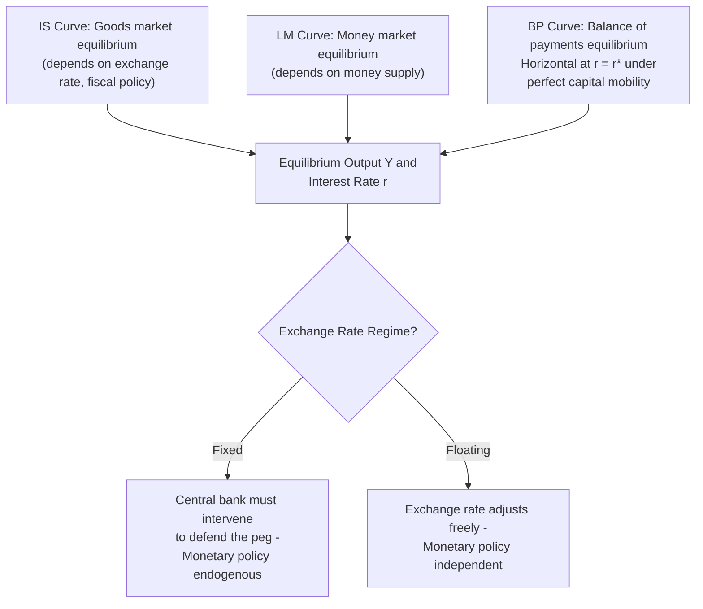

## The Mundell-Fleming Model

### Definition and Core Concept

The Mundell-Fleming model is an extension of the closed-economy IS-LM framework to an open economy, designed to analyze the interaction between the goods market, the money market, and the balance of payments (or foreign exchange market) under different exchange rate regimes and degrees of capital mobility. Developed by Robert Mundell and Marcus Fleming in the early 1960s, the model shows how the effectiveness of fiscal and monetary policy depends critically on whether a country operates a fixed or floating exchange rate and whether capital is mobile across borders.

The model's central insight, often summarized as the **"impossible trinity"** or **"trilemma,"** is that a country cannot simultaneously maintain all three of the following: a fixed exchange rate, free capital mobility, and independent monetary policy. A country can choose at most two of the three.

### The Three Building Blocks

The Mundell-Fleming model extends the closed-economy IS-LM model with three equilibrium relationships:

**Key Points**

- **IS curve (Goods market equilibrium)**: Represents combinations of interest rate and output where planned expenditure (consumption, investment, government spending, and net exports) equals actual output. In the open economy, net exports depend on the real exchange rate, so the IS curve shifts with exchange rate movements.
- **LM curve (Money market equilibrium)**: Represents combinations of interest rate and output where money demand equals money supply, identical in form to the closed-economy LM curve.
- **BP curve (Balance of payments equilibrium)** or **FE curve (Foreign Exchange equilibrium)**: Represents combinations of interest rate and output for which the balance of payments (current account plus capital account) is zero, i.e., external balance is achieved.

### The IS Curve in an Open Economy

$$Y = C(Y - T) + I(r) + G + NX(e, Y, Y^*)$$

Where:

- $Y$ = domestic output/income
- $C$ = consumption function
- $I(r)$ = investment as a function of the domestic interest rate $r$
- $G$ = government spending
- $NX$ = net exports, a function of the real exchange rate $e$, domestic income $Y$ (imports rise with domestic income), and foreign income $Y^*$ (exports rise with foreign income)

A depreciation of the domestic currency (rise in $e$, using the convention where higher $e$ means more competitive/cheaper domestic currency) makes domestic goods cheaper for foreigners, increasing net exports and shifting the IS curve to the right.

### The BP Curve and Capital Mobility

The BP curve reflects the condition that the balance of payments is in equilibrium:

$$CA(e, Y, Y^*) + KA(r - r^*) = 0$$

Where:

- $CA$ = current account balance, depending on the exchange rate and relative incomes
- $KA$ = capital account balance, depending on the domestic-foreign interest rate differential $(r - r^*)$

The **slope of the BP curve** depends entirely on the degree of capital mobility, which is the key parameter differentiating model outcomes:

**Key Points**

- **Perfect capital mobility**: Capital flows instantaneously and in unlimited amounts in response to any interest rate differential. The BP curve is **horizontal** at $r = r^*$ (domestic interest rate must equal the world interest rate; any deviation triggers infinite capital flows that immediately restore equality).
- **Zero capital mobility (capital controls)**: No capital flows respond to interest rate differentials; the balance of payments is determined entirely by the current account. The BP curve is **vertical**, since only the level of output (which determines imports) affects external balance.
- **Imperfect (partial) capital mobility**: Capital flows respond to interest differentials but not infinitely. The BP curve is **upward-sloping**: higher output raises imports (worsening the current account), requiring a higher interest rate to attract offsetting capital inflows and restore balance.

The Mundell-Fleming model is most commonly taught and analyzed under the **perfect capital mobility** assumption, as this yields the model's sharpest and most quoted policy conclusions.

### Diagram: IS-LM-BP Framework (Perfect Capital Mobility)

### Case 1: Fixed Exchange Rates with Perfect Capital Mobility

Under a fixed exchange rate regime with perfect capital mobility, the central bank commits to buying/selling foreign currency to maintain the peg, which has profound implications for policy effectiveness.

**Fiscal Policy (Effective)**

1. Expansionary fiscal policy (increase in $G$) shifts the IS curve rightward, which would initially push the domestic interest rate above the world rate $r^*$.
2. This creates a large capital inflow (perfect capital mobility), putting *upward* pressure on the domestic currency.
3. To maintain the fixed exchange rate, the central bank must *sell* domestic currency and *buy* foreign currency, which increases the domestic money supply.
4. The increase in money supply shifts the LM curve rightward, further increasing output, until the domestic interest rate returns to $r^*$.
5. **Net result**: Output rises substantially (larger than the closed-economy multiplier effect would suggest) because the monetary expansion is automatic and validates the fiscal expansion. Fiscal policy is highly effective under fixed rates with perfect capital mobility.

**Monetary Policy (Ineffective)**

1. Expansionary monetary policy (increase in money supply) shifts the LM curve rightward, initially lowering the domestic interest rate below $r^*$.
2. This triggers a massive capital outflow (perfect capital mobility) as investors seek the higher world interest rate, putting *downward* pressure on the domestic currency.
3. To defend the fixed exchange rate, the central bank must *buy* domestic currency (using foreign reserves) and *sell* foreign currency, which *reduces* the domestic money supply.
4. This continues until the LM curve shifts back to its original position and the domestic interest rate returns to $r^*$.
5. **Net result**: The initial monetary expansion is completely reversed by the central bank's own defense of the peg. Output and interest rates end up unchanged. Monetary policy is **completely ineffective** under fixed rates with perfect capital mobility.

### Case 2: Floating Exchange Rates with Perfect Capital Mobility

**Monetary Policy (Effective)**

1. Expansionary monetary policy shifts the LM curve rightward, lowering the domestic interest rate below $r^*$.
2. This triggers capital outflows, causing the domestic currency to depreciate (since the central bank does not intervene under a float).
3. Currency depreciation makes domestic goods more competitive, increasing net exports and shifting the IS curve rightward.
4. This continues until the domestic interest rate returns to $r^*$, at a higher level of output.
5. **Net result**: Output rises significantly. Monetary policy is highly effective under floating rates with perfect capital mobility.

**Fiscal Policy (Ineffective, or "Crowded Out")**

1. Expansionary fiscal policy shifts the IS curve rightward, initially pushing the domestic interest rate above $r^*$.
2. This attracts capital inflows, causing the domestic currency to *appreciate*.
3. Currency appreciation makes domestic goods less competitive internationally, reducing net exports and shifting the IS curve back *leftward*.
4. This continues until the IS curve returns to a position where the interest rate is back at $r^*$, and output returns to its original level.
5. **Net result**: The fiscal expansion is completely offset ("crowded out") by the deterioration in net exports caused by currency appreciation. Output ends up unchanged. Fiscal policy is **completely ineffective** under floating rates with perfect capital mobility (a result of pure crowding out via the exchange rate channel, rather than the interest-rate-based crowding out of the closed-economy IS-LM model).

### Summary Table of Policy Effectiveness

| Exchange Rate Regime | Fiscal Policy | Monetary Policy |
| --- | --- | --- |
| Fixed (perfect capital mobility) | Highly effective | Completely ineffective |
| Floating (perfect capital mobility) | Completely ineffective (crowded out) | Highly effective |

[Inference] These are the model's textbook polar-case predictions under the simplifying assumption of *perfect* capital mobility and a *small open economy* (one whose policies do not affect world interest rates); with imperfect capital mobility, both policies retain some degree of effectiveness under either regime, and the magnitude of crowding out or monetary effectiveness depends on the relative slopes of the LM and BP curves.

### The Trilemma (Impossible Trinity)

The Mundell-Fleming framework directly generates the open-economy trilemma: a country can achieve at most two of the following three policy goals simultaneously:

1. **Fixed exchange rate**
2. **Free capital mobility**
3. **Independent monetary policy**

**Key Points**

- **Fixed rate + capital mobility** (e.g., Hong Kong's currency board, Eurozone members): Monetary policy is sacrificed and effectively imported from the anchor currency or determined jointly (as in a currency union).
- **Independent monetary policy + capital mobility** (e.g., US, UK, Japan, most large developed economies): The exchange rate must be allowed to float.
- **Fixed rate + independent monetary policy**: Requires capital controls to prevent arbitrage-driven capital flows from undermining the peg (e.g., China's managed exchange rate regime, historically).

### Diagram: The Trilemma (svg_diagram)

<svg xmlns="http://www.w3.org/2000/svg" viewBox="0 0 500 460">
<text x="250" y="30" text-anchor="middle" font-size="18" font-weight="bold" fill="#1a1a1a">The Impossible Trinity (svg_diagram)</text>
<polygon points="250,70 90,370 410,370" fill="none" stroke="#2c3e50" stroke-width="2" />
<circle cx="250" cy="70" r="8" fill="#3498db" />
<text x="250" y="55" text-anchor="middle" font-size="13" font-weight="bold" fill="#2c3e50">Fixed Exchange Rate</text>
<circle cx="90" cy="370" r="8" fill="#e74c3c" />
<text x="90" y="400" text-anchor="middle" font-size="13" font-weight="bold" fill="#2c3e50">Free Capital</text>
<text x="90" y="416" text-anchor="middle" font-size="13" font-weight="bold" fill="#2c3e50">Mobility</text>
<circle cx="410" cy="370" r="8" fill="#27ae60" />
<text x="410" y="400" text-anchor="middle" font-size="13" font-weight="bold" fill="#2c3e50">Independent</text>
<text x="410" y="416" text-anchor="middle" font-size="13" font-weight="bold" fill="#2c3e50">Monetary Policy</text>
<text x="170" y="205" text-anchor="middle" font-size="11.5" fill="#34495e" transform="rotate(-58 170 205)">Sacrifice: Monetary Policy</text>
<text x="330" y="205" text-anchor="middle" font-size="11.5" fill="#34495e" transform="rotate(58 330 205)">Sacrifice: Fixed Rate (must float)</text>
<text x="250" y="360" text-anchor="middle" font-size="11.5" fill="#34495e">Sacrifice: Capital Mobility (controls)</text>
<text x="140" y="140" font-size="11" fill="#7f8c8d">e.g. Eurozone,</text>
<text x="140" y="154" font-size="11" fill="#7f8c8d">Hong Kong currency board</text>
<text x="290" y="140" font-size="11" fill="#7f8c8d">e.g. US, UK,</text>
<text x="290" y="154" font-size="11" fill="#7f8c8d">Japan (floating)</text>
<text x="180" y="330" font-size="11" fill="#7f8c8d">e.g. China</text>
<text x="180" y="344" font-size="11" fill="#7f8c8d">(managed peg + controls)</text>
</svg>

### Mundell-Fleming and Devaluation

Under a fixed exchange rate regime, a one-time **devaluation** (an official reduction in the currency's fixed value) has effects analogous to expansionary fiscal policy in the floating-rate model:

1. Devaluation makes domestic goods cheaper for foreigners, increasing net exports and shifting the IS curve rightward.
2. This raises the domestic interest rate above $r^*$, attracting capital inflows.
3. To maintain the *new* (lower) fixed rate, the central bank must sell domestic currency, expanding the money supply and shifting the LM curve rightward.
4. **Net result**: Output rises substantially, similar to the fixed-rate fiscal policy case, since the monetary expansion validates the initial competitiveness gain.

[Inference] This result underlies the common policy argument that currency devaluation can serve as a substitute for monetary/fiscal stimulus under a fixed exchange rate regime, though repeated or anticipated devaluations can trigger speculative capital flight in advance (a dynamic central to models of currency crises), and the analysis assumes the devaluation is not immediately offset by domestic inflation (an assumption more likely to hold for small, credible, one-time adjustments than for chronic devaluation cycles).

### Extensions and Limitations of the Basic Model

**Key Points**

- **Price level assumed fixed**: The basic Mundell-Fleming model assumes prices are sticky/fixed in the short run, similar to the closed-economy IS-LM model; it is a short-run model and does not incorporate the gradual price adjustments captured in models like the Dornbusch overshooting model, which extends Mundell-Fleming to explain exchange rate overshooting under rational expectations and sticky prices.
- **Static expectations**: The basic model does not incorporate forward-looking expectations about future exchange rates or policy, which more modern open-economy macro models (e.g., the New Open Economy Macroeconomics literature) address explicitly.
- **Small open economy assumption**: The model typically assumes the country being analyzed is too small to affect the world interest rate $r^*$; extensions relax this for large open economies (e.g., the US), where domestic policy can influence world interest rates.
- **No explicit role for expected exchange rate changes in capital flows**: The basic BP curve relates capital flows to the *level* of interest rate differentials, whereas more refined models (building on uncovered interest rate parity) recognize that capital flows depend on interest differentials *relative to expected exchange rate changes*.
- **Perfect capital mobility is a polar case**: Most real-world economies exhibit imperfect capital mobility, so real-world policy effectiveness typically falls between the extreme "highly effective" and "completely ineffective" results described above.

### Applications of the Mundell-Fleming Model

**Key Points**

- **Explaining historical exchange rate regime choices**: The trilemma is frequently invoked to explain the collapse of the Bretton Woods system (which attempted fixed rates with increasing capital mobility) and the shift to floating rates among major economies in the 1970s.
- **Eurozone monetary policy analysis**: Explains why individual Eurozone members sacrificed independent monetary policy (fixed intra-Eurozone rates plus free capital mobility) in favor of a common currency.
- **Emerging market capital control debates**: Frequently used to analyze why some emerging markets impose capital controls to preserve monetary policy autonomy while maintaining a managed exchange rate.
- **Assessing fiscal stimulus effectiveness**: Used to explain why fiscal stimulus in economies with floating exchange rates and open capital accounts (e.g., analyzing currency appreciation effects on net exports) may have muted output effects compared to closed-economy Keynesian multiplier predictions.

**Related Topics**

- The Dornbusch Overshooting Model
- Purchasing Power Parity
- Interest Rate Parity and Covered Interest Arbitrage
- The Trilemma and Historical Exchange Rate Regimes (Bretton Woods, Gold Standard)
- Currency Crises and Speculative Attacks (First and Second Generation Models)
- IS-LM Model (Closed Economy)
- Capital Controls: Theory and Case Studies
- Exchange Rate Regimes: Fixed, Floating, and Managed Float