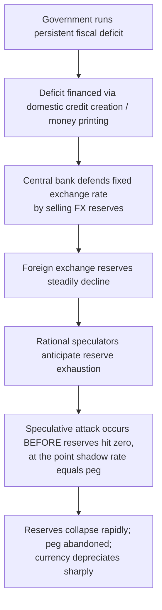
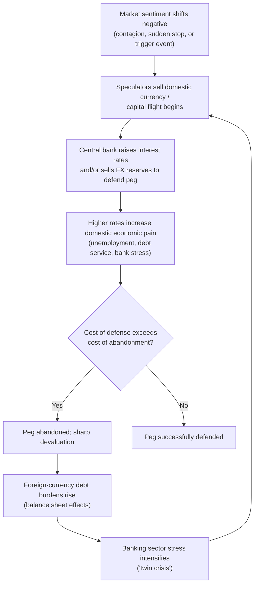

## Currency Crises and Speculative Attacks

### Definition and Core Concept

A currency crisis is a sudden and severe loss of confidence in a country's currency, typically resulting in a sharp, unanticipated depreciation or forced abandonment of a fixed or pegged exchange rate. A speculative attack occurs when investors, anticipating that a central bank will be unable or unwilling to defend its currency peg, aggressively sell the domestic currency (often financed by short-selling or capital flight) in order to profit from an expected devaluation. Currency crises are typically studied through a progression of theoretical models — first, second, and third generation — each developed in response to real-world crises that the prior generation of models could not adequately explain.

### First-Generation Models (Krugman, 1979)

First-generation models, pioneered by Paul Krugman, explain currency crises as the inevitable and predictable consequence of **inconsistent macroeconomic fundamentals**, specifically a government running persistent fiscal deficits financed by domestic credit creation while simultaneously trying to maintain a fixed exchange rate.

**Mechanism**

1. A government runs a persistent budget deficit and finances it by having the central bank print money (domestic credit expansion) rather than through fully sterilized borrowing.
2. Under a fixed exchange rate, this excess money creation would normally cause inflation and currency depreciation, but the peg is maintained by the central bank selling foreign exchange reserves to absorb the excess domestic currency.
3. Foreign exchange reserves are a *finite stock*, so this process cannot continue indefinitely; reserves steadily decline as the central bank defends the peg.
4. Rational speculators, understanding that reserves will eventually be exhausted, will not wait until the reserves hit zero. Instead, they attack the currency *before* depletion, at the moment when the shadow (post-collapse) exchange rate equals the current fixed rate, because holding depreciating reserves until the last moment is a losing proposition.
5. This attack causes a sudden, discrete collapse of the peg — reserves are exhausted in a rapid speculative run rather than a gradual decline, even though the underlying cause was slow-moving fiscal profligacy.

**Key Points**

- The crisis is fundamentally **deterministic**: given the fiscal and monetary fundamentals, a crisis is inevitable, and the model can theoretically predict its approximate timing.
- The trigger is **excessive domestic credit growth** driven by monetized fiscal deficits, making it a "fundamentals-driven" crisis model.
- The attack itself is rational and self-interested: no speculator can profit by attacking too early (before the shadow rate diverges from the peg) or too late (after others have already exhausted reserves), so the equilibrium timing of the attack is pinned down precisely by the model.
- First-generation models are widely cited as best explaining crises such as the 1994 Mexican peso crisis ("Tequila Crisis"), which followed sustained fiscal and current account imbalances.

### Diagram: First-Generation Crisis Mechanism

### Second-Generation Models (Obstfeld, 1994-1996)

Second-generation models, developed largely by Maurice Obstfeld, explain crises that occur even when fundamentals do not make abandonment of the peg *inevitable*, but where the government faces a **trade-off** between defending the peg and pursuing other domestic policy objectives (such as reducing unemployment or lowering debt-servicing costs). These models emphasize **multiple equilibria** and **self-fulfilling expectations**.

**Mechanism**

1. A government's commitment to defending a fixed exchange rate is **not absolute** — it weighs the costs of defense (e.g., raising interest rates, which slows growth and raises unemployment or increases debt burdens) against the costs of abandoning the peg (e.g., loss of credibility, imported inflation).
2. If speculators believe the peg will hold, they do not attack, borrowing costs remain low, and the government finds it relatively cheap to maintain the peg — this is a **"good" equilibrium**.
3. If speculators believe the peg will *not* hold (for any reason, including shifts in market sentiment or contagion from other countries), they attack the currency, forcing the central bank to raise interest rates sharply to defend it.
4. Higher interest rates increase the domestic economic and fiscal costs of defense (e.g., higher unemployment, higher debt service on government bonds), which may make it *rational* for the government to abandon the peg rather than continue defending it — this is a **"bad" equilibrium**.
5. Crucially, **both equilibria can be consistent with the same underlying fundamentals** — the crisis is not caused by a fundamental economic deterioration alone, but by a shift in market expectations that becomes self-fulfilling.

**Key Points**

- Second-generation models are characterized by **multiple equilibria**: the same fundamentals can support either a stable peg or a collapsing one, depending on market expectations.
- Crises are **self-fulfilling**: the mere belief that a crisis will occur can cause the very policy responses (rate hikes, fiscal strain) that make the crisis rational.
- These models introduce the possibility of a "sunspot" trigger — a seemingly unrelated event or shift in sentiment (rather than a change in fundamentals) that coordinates speculators on the "bad" equilibrium.
- Second-generation models are widely cited as best explaining the 1992 European Exchange Rate Mechanism (ERM) crisis, particularly the UK's "Black Wednesday" exit from the ERM, where the UK's fundamentals were arguably not so weak as to make abandonment inevitable, but the costs of defending the pound via high interest rates became politically and economically unpalatable once speculative pressure mounted.

### Contrasting First- and Second-Generation Models

| Feature | First-Generation | Second-Generation |
| --- | --- | --- |
| Primary cause | Inconsistent fundamentals (fiscal deficits + fixed rate) | Policy trade-offs + shifting expectations |
| Equilibrium | Unique, deterministic | Multiple equilibria possible |
| Crisis predictability | Theoretically predictable timing | Can be sudden, driven by sentiment shifts |
| Government behavior | Passive; peg collapses mechanically as reserves run out | Active; government weighs costs and chooses to abandon or defend |
| Classic example cited | 1994 Mexican peso crisis | 1992 UK/ERM crisis |

### Third-Generation Models (Post-1997 Asian Financial Crisis)

Third-generation models emerged in response to the 1997-1998 Asian Financial Crisis, which exhibited features that neither first- nor second-generation models fully captured — notably, the crisis-hit countries (Thailand, Indonesia, South Korea, Malaysia) generally had sound fiscal positions and did not exhibit the large monetized deficits of first-generation crises, nor a straightforward interest-rate-defense trade-off as in second-generation models. Instead, the crisis centered on **private-sector balance sheet vulnerabilities**, particularly in the banking and corporate sectors.

**Key Mechanisms Identified**

**Key Points**

- **Currency and maturity mismatches**: Domestic banks and firms borrowed heavily in foreign currency (often short-term US dollar debt) to fund longer-term domestic-currency investments (e.g., real estate, infrastructure), creating a mismatch that became catastrophic once the domestic currency depreciated, since foreign-currency debt burdens rose sharply in domestic-currency terms.
- **Moral hazard and implicit guarantees**: Some models (e.g., McKinnon and Pill's "over-borrowing syndrome") argue that implicit government guarantees of bank liabilities encouraged excessive risk-taking and over-borrowing by domestic financial institutions, inflating asset bubbles that later collapsed.
- **Twin crises (banking and currency)**: Third-generation models often emphasize the interaction between banking sector fragility and currency crises — a weakening banking sector can trigger capital flight (currency crisis), while currency depreciation, in turn, worsens bank and corporate balance sheets denominated in foreign currency (a "twin crisis" feedback loop), amplifying the initial shock.
- **Contagion**: Third-generation frameworks also address why crises spread rapidly across countries with limited direct trade or financial linkages (e.g., the spread from Thailand to Indonesia, South Korea, and beyond), often attributed to herding behavior among international investors, common creditor linkages (e.g., shared foreign bank lenders), or reassessment of risk in an entire asset class/region following one country's crisis.
- **Sudden stops**: A sharp and sudden reversal of capital inflows (a "sudden stop," a term associated with economist Guillermo Calvo) can trigger a crisis even absent poor fundamentals, simply because an economy that has become reliant on continuous capital inflows to finance a current account deficit is vulnerable to any disruption in that inflow.

### Speculative Attack Mechanics: A Practical Illustration

**Example**

Consider a country with a currency pegged at 25 units per US dollar, with $20 billion in foreign exchange reserves. Hedge funds and speculators believe the peg is unsustainable given a large current account deficit and slowing growth.

1. Speculators begin **short-selling** the domestic currency in the forward and spot markets, or borrowing the domestic currency (often via offshore/non-deliverable forward markets) to sell it for dollars, betting on future depreciation.
2. To defend the peg, the central bank must buy up the domestic currency being sold, using its dollar reserves, which directly depletes reserves.
3. The central bank may also raise domestic interest rates sharply to make holding the domestic currency more attractive and to raise the cost of short-selling it (since shorting the currency typically requires borrowing it at the prevailing interest rate).
4. If the speculative pressure is large relative to available reserves (or if raising interest rates imposes unacceptable domestic economic costs), the central bank exhausts its capacity or willingness to defend the peg and is forced to devalue or float the currency.
5. Speculators who sold the currency short (or held dollar positions) profit substantially once the currency depreciates, as they can now buy back the domestic currency at a much cheaper rate to unwind their positions.

[Inference] The scale of hedge fund and institutional speculative positioning relative to a central bank's reserve base is often cited as a key determinant of whether a defense will succeed, though precise thresholds vary by episode and are difficult to generalize, as successful defenses have also occurred against large speculative pressure when reserves and political resolve were sufficient (e.g., the Hong Kong Monetary Authority's defense during the 1998 Asian crisis).

### Diagram: Second/Third-Generation Self-Fulfilling Crisis Loop

### Common Warning Indicators of Currency Crisis Vulnerability

**Key Points**

- **Large and persistent current account deficits**: Signal reliance on continuous capital inflows to finance consumption/investment in excess of domestic saving.
- **Rapid growth in foreign-currency-denominated debt**: Particularly short-term debt relative to foreign exchange reserves (often assessed via the "reserves-to-short-term-debt ratio," with ratios below 1 considered a red flag under the Greenspan-Guidotti rule of thumb).
- **Overvalued real exchange rate**: A currency that has appreciated substantially in real terms (often due to inflation exceeding trading partners' inflation under a fixed nominal rate) erodes export competitiveness and widens the current account deficit.
- **Rapid domestic credit/asset price growth**: Credit booms and asset bubbles (real estate, equities) financed by capital inflows are frequently identified as precursors to banking-currency twin crises.
- **Declining foreign exchange reserves relative to imports or debt obligations**: A shrinking reserve buffer reduces the central bank's capacity to defend the currency against speculative pressure.
- **Political instability or policy uncertainty**: Can undermine confidence in a government's willingness or ability to maintain sound macroeconomic policy, potentially coordinating market expectations onto a "bad" equilibrium as in second-generation models.

### Policy Responses to Currency Crises

**Key Points**

- **Interest rate defense**: Raising domestic interest rates to make holding the currency more attractive and to raise the cost of speculative short positions, though this risks worsening domestic recession and debt burdens.
- **Direct FX market intervention**: Using foreign exchange reserves to buy the domestic currency and support its value, though this is limited by the size of available reserves.
- **Capital controls**: Restricting the ability of capital to flow out of the country (e.g., Malaysia's capital controls during the 1998 Asian crisis), controversial but sometimes credited with limiting the depth of the crisis in specific cases.
- **IMF-supported stabilization programs**: Emergency lending conditional on fiscal austerity, structural reforms, and monetary tightening, as seen in Mexico (1994-95), Thailand, Indonesia, and South Korea (1997-98).
- **Orderly devaluation or float**: Proactively abandoning an unsustainable peg before reserves are fully exhausted, potentially reducing the disorderly nature of an eventual forced collapse.
- **Debt restructuring**: In cases where the crisis is deeply intertwined with unsustainable sovereign or private debt (e.g., Argentina 2001-2002), restructuring foreign-currency debt obligations may be necessary alongside currency adjustment.

### Notable Historical Currency Crises (Reference Summary)

**Key Points**

- **1992 European ERM Crisis ("Black Wednesday")**: UK forced to exit the ERM after failing to defend the pound against speculative pressure, widely cited as a canonical second-generation crisis.
- **1994-95 Mexican Peso Crisis ("Tequila Crisis")**: Triggered by unsustainable fiscal/current account deficits and short-term dollar-denominated debt (Tesobonos), often cited as a first-generation-style crisis with elements of investor panic.
- **1997-98 Asian Financial Crisis**: Affected Thailand, Indonesia, South Korea, Malaysia, and the Philippines; centered on private-sector foreign-currency debt, banking fragility, and contagion — the primary motivating case for third-generation models.
- **1998 Russian Financial Crisis**: Involved sovereign debt default alongside currency devaluation, exacerbated by contagion from the Asian crisis and falling oil prices.
- **2001-02 Argentine Crisis**: Collapse of the currency board (peso pegged 1:1 to the US dollar), combined with sovereign debt default, illustrating the fragility of rigid fixed exchange rate regimes under sustained fiscal and competitiveness pressures.

[Unverified] Specific quantitative details of each historical episode (exact reserve levels, precise dates of peg abandonment, magnitude of GDP contraction) vary across sources and are best confirmed against primary IMF or central bank documentation for any application requiring precise figures.

### Relationship to Other International Finance Concepts

Currency crisis models draw directly on and extend the parity and exchange rate frameworks covered elsewhere in international finance:

- **Fixed exchange rate regimes** (as analyzed in the Mundell-Fleming model) create the structural preconditions for the type of crisis described in first- and second-generation models, since floating regimes do not require reserve defense.
- **Interest Rate Parity** is directly implicated in the defense mechanism, as central banks raise domestic rates to counteract the interest-differential-driven capital outflows described in speculative attack episodes.
- **Purchasing Power Parity deviations** (real exchange rate overvaluation) frequently serve as a leading indicator of currency crisis vulnerability, as an overvalued currency erodes competitiveness and widens external imbalances.

**Related Topics**

- The Mundell-Fleming Model and the Trilemma
- Fixed vs. Floating Exchange Rate Regimes
- Sovereign Debt Crises and Restructuring
- Capital Controls: Theory and Case Studies
- The Asian Financial Crisis (1997-98): Detailed Case Study
- Banking Crises and Financial Contagion
- The Role of the IMF in Crisis Resolution
- Sudden Stops and Capital Flow Reversals