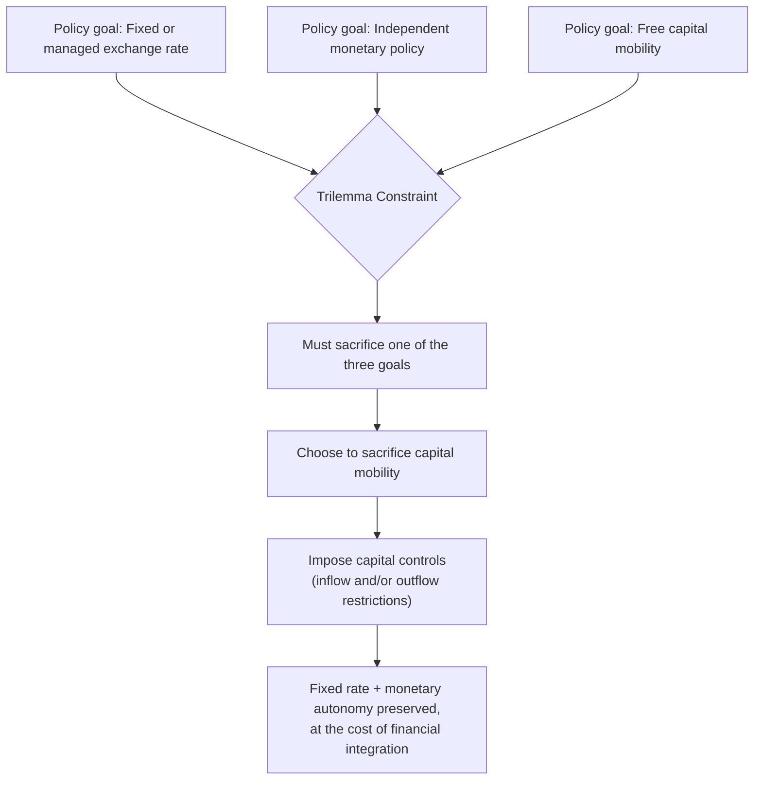

## Capital Controls and Financial Globalization

### Definition and Core Concept

Capital controls are government-imposed restrictions on the flow of financial capital across a country's borders, encompassing measures that limit, tax, or regulate foreign purchases of domestic assets (capital inflows) or domestic purchases of foreign assets and repatriation of funds (capital outflows). Financial globalization refers to the increasing integration of national financial markets through cross-border capital flows, foreign direct investment, portfolio investment, and international banking. The relationship between the two is central to open-economy macroeconomics: capital controls represent a deliberate policy choice to limit financial globalization's scope, typically in pursuit of macroeconomic stability, financial stability, or policy autonomy (as formalized in the Mundell-Fleming trilemma).

### Types of Capital Flows

**Key Points**

- **Foreign Direct Investment (FDI)**: Long-term investment involving significant ownership or control of a foreign enterprise (typically defined as 10% or more equity stake); generally considered the most stable form of capital flow due to its long-term, illiquid nature.
- **Portfolio investment**: Purchases of foreign equities, bonds, and other financial securities without a controlling stake; more liquid and volatile than FDI, as it can be reversed quickly.
- **Bank lending and other investment**: Cross-border loans, trade credit, and currency/deposits; historically associated with the short-term "hot money" flows implicated in several currency and banking crises.
- **Reserve assets**: Central bank holdings of foreign currency, gold, and Special Drawing Rights (SDRs), which serve as a buffer against capital flow volatility.

[Inference] Portfolio and short-term bank lending flows are generally regarded in the literature as more prone to sudden reversals ("sudden stops") than FDI, which is why many capital control regimes and macroprudential frameworks specifically target short-term or portfolio flows while leaving FDI relatively unrestricted, though the empirical stability ranking can vary by country and time period.

### Types and Instruments of Capital Controls

**Key Points**

- **Price-based (market-based) controls**: Taxes or levies on capital flows that alter the cost of moving capital without prohibiting it outright. The classic example is the **Tobin tax** (originally proposed by James Tobin in 1972), a small tax on foreign exchange transactions intended to discourage short-term speculative flows while leaving long-term investment largely unaffected.
- **Quantity-based (administrative) controls**: Direct restrictions or prohibitions on the volume or type of capital transactions, such as licensing requirements, quotas, or outright bans on certain categories of cross-border investment.
- **Unremunerated reserve requirements (URR)**: A requirement that a portion of capital inflows be deposited, without interest, at the central bank for a specified period — Chile's URR system in the 1990s is a widely cited example, designed to discourage short-term inflows while permitting longer-term investment.
- **Inflow controls**: Restrictions targeting capital entering the country, often used to prevent excessive currency appreciation, asset bubbles, or unsustainable credit booms during periods of surging foreign investor interest.
- **Outflow controls**: Restrictions targeting capital leaving the country, typically imposed during crises to prevent capital flight, defend a currency peg, or preserve foreign exchange reserves (e.g., Malaysia's 1998 capital controls, Argentina's "corralito" in 2001-02, Greece's 2015 capital controls).
- **Multiple exchange rate systems**: Different exchange rates applied to different categories of transactions (e.g., a more favorable rate for essential imports versus a less favorable rate for capital account transactions), used historically by several developing economies.

### The Trilemma Context

Capital controls are best understood through the Mundell-Fleming **trilemma**: a country cannot simultaneously maintain a fixed exchange rate, free capital mobility, and independent monetary policy. Capital controls are the policy instrument that allows a country to sacrifice *capital mobility* rather than exchange rate stability or monetary autonomy.

$$\text{Fixed Exchange Rate} + \text{Independent Monetary Policy} \implies \text{Capital Controls Required}$$

**Example**

China's managed exchange rate regime has historically relied on extensive capital account restrictions, allowing the People's Bank of China to maintain some independent influence over domestic interest rates and credit conditions while managing the renminbi's value against a basket of currencies, rather than allowing free capital flows to force a choice between a pure float and full monetary policy subordination.

### Diagram: Capital Controls Within the Trilemma Framework

### Arguments in Favor of Capital Controls

**Key Points**

- **Preserving monetary policy autonomy**: Allows a country to set interest rates according to domestic conditions (e.g., managing inflation or unemployment) without those rates being immediately arbitraged away by cross-border capital flows, particularly relevant under fixed or managed exchange rate regimes.
- **Preventing destabilizing "hot money" surges**: Limits sudden, large capital inflows that can cause currency overvaluation, asset bubbles, and unsustainable credit booms, followed by equally sudden and damaging reversals.
- **Crisis mitigation**: Outflow controls can slow capital flight during a crisis, buying time for policy adjustment and potentially preventing a self-fulfilling speculative attack of the type described in second-generation currency crisis models.
- **Macroprudential/financial stability rationale**: Post-2008, institutions including the IMF have increasingly recognized capital flow management measures (CFMs) as a legitimate component of the macroprudential policy toolkit, particularly for managing the risks associated with large and volatile short-term flows.
- **Preserving fiscal space and tax base**: Restricting capital flight can help preserve a government's ability to tax domestic capital and finance public spending, particularly relevant for economies with weak domestic financial markets and heavy reliance on capital income taxation.

### Arguments Against Capital Controls

**Key Points**

- **Efficiency losses from capital misallocation**: Free capital mobility, in principle, allows capital to flow toward its most productive uses globally, and restricting flows can prevent the efficient allocation of savings to investment opportunities across borders.
- **Reduced foreign investment and higher cost of capital**: Controls can discourage foreign investors from entering a market at all (rather than merely slowing inflows), raising the domestic cost of capital and potentially reducing long-run growth and investment.
- **Circumvention and enforcement costs**: Capital controls are frequently evaded through mechanisms such as trade misinvoicing, informal (parallel) exchange markets, or complex corporate structures, requiring costly enforcement and creating distortions and corruption opportunities.
- **Signaling effects and loss of credibility**: The imposition of capital controls, particularly outflow controls during a crisis, can signal policy weakness or desperation to international investors, potentially worsening rather than alleviating a loss of confidence.
- **Distortion of domestic financial development**: Extended reliance on capital controls can insulate domestic financial institutions from international competition and best practices, potentially retarding the development of sophisticated, well-regulated domestic capital markets.

### Financial Globalization: Benefits

**Key Points**

- **Consumption smoothing**: Access to international capital markets allows countries to borrow during downturns and save during booms, smoothing consumption relative to volatile domestic output (international risk-sharing).
- **Capital deepening and growth**: In principle, capital-scarce developing economies can access foreign savings to finance investment beyond what domestic saving alone would allow, accelerating capital accumulation and growth.
- **Technology and knowledge transfer**: FDI in particular is associated with spillovers in management practices, technology, and human capital development in recipient economies.
- **Market discipline on domestic policy**: Open capital markets can impose discipline on governments and central banks, as poor fiscal or monetary policy is quickly reflected in capital flight and higher borrowing costs, theoretically incentivizing sounder policy.
- **Portfolio diversification**: Investors gain access to a broader set of assets across countries, allowing for improved risk-adjusted returns through international diversification.

### Financial Globalization: Risks

**Key Points**

- **Volatility and contagion**: Open capital accounts expose economies to global financial market volatility and contagion from crises originating elsewhere, as demonstrated repeatedly (1997-98 Asian crisis, 2008 Global Financial Crisis, 2013 "Taper Tantrum").
- **Sudden stops**: Economies reliant on continuous capital inflows to finance current account deficits are vulnerable to abrupt reversals, which can trigger currency and banking crises (as discussed in third-generation crisis models).
- **Procyclicality**: Capital flows to emerging markets tend to be procyclical — surging during global boom periods (often associated with low interest rates in advanced economies) and reversing sharply during global downturns or monetary tightening cycles, amplifying rather than smoothing domestic business cycles.
- **Loss of policy autonomy**: As per the trilemma, full capital account openness combined with a desire for exchange rate stability necessarily constrains independent monetary policy.
- **The "original sin" problem**: Many emerging market economies have historically been unable to borrow internationally in their own currency, forcing them to accumulate foreign-currency-denominated debt that creates balance sheet vulnerabilities if the domestic currency depreciates (directly relevant to third-generation currency crisis dynamics).

### The IMF's Evolving Institutional View

[Inference] The IMF's official stance on capital controls has evolved substantially over recent decades: from a general presumption in favor of full capital account liberalization (particularly evident in IMF-supported programs during the 1980s-1990s), toward a more nuanced "Institutional View" (formally adopted in 2012) that recognizes capital flow management measures can be appropriate under specific circumstances — such as when a country faces surges of volatile inflows, has limited monetary policy space, or faces financial stability risks — while still generally favoring liberalization as a long-run objective once appropriate institutional and regulatory frameworks are in place. This shift is widely attributed to the lessons drawn from the 1997-98 Asian Financial Crisis and the 2008 Global Financial Crisis.

### Sequencing of Capital Account Liberalization

A prominent theme in the literature concerns the **proper sequencing** of financial liberalization, based on lessons from crises where premature or poorly sequenced liberalization contributed to instability.

**Key Points**

- **Domestic financial sector reform first**: Strengthening bank regulation, supervision, and capital adequacy standards before opening the capital account, to ensure the domestic financial system can safely intermediate large capital inflows.
- **Current account liberalization before capital account liberalization**: Conventional sequencing wisdom suggests trade liberalization should generally precede full financial account opening.
- **Long-term flows (FDI) liberalized before short-term flows**: Given the relative stability of FDI compared to portfolio and short-term bank flows, opening to FDI first while retaining some restrictions on volatile short-term flows is often recommended.
- **Exchange rate flexibility considerations**: Some frameworks suggest greater exchange rate flexibility should be established before full capital account liberalization, to avoid the fixed-rate-plus-open-capital-account combination that is particularly vulnerable to speculative attack (per the trilemma and first/second-generation crisis models).

[Inference] The 1997-98 Asian Financial Crisis is frequently cited as a cautionary example of the consequences of rapid, poorly sequenced capital account liberalization — several affected economies had liberalized capital inflows (particularly short-term bank borrowing) before adequately strengthening domestic financial sector regulation and supervision, contributing to the private-sector balance sheet vulnerabilities central to third-generation crisis models.

### Notable Case Studies

**Key Points**

- **Chile's Unremunerated Reserve Requirement (1991-1998)**: A widely studied price-based inflow control requiring a portion of certain capital inflows to be held as a non-interest-bearing deposit, generally credited with shifting the composition of inflows toward longer maturities, though its effect on the total volume of inflows and the exchange rate is more debated in the empirical literature.
- **Malaysia's 1998 Capital Controls**: Imposed outflow controls and pegged the ringgit during the Asian Financial Crisis, a controversial departure from the IMF-favored approach at the time (which emphasized interest rate defense and liberalization); subsequent assessments have been mixed but have contributed to a more favorable reassessment of capital controls as a crisis-management tool.
- **China's Managed Capital Account**: A long-standing example of extensive capital controls supporting a managed exchange rate and monetary policy autonomy, with gradual, selective liberalization over recent decades (e.g., Qualified Foreign Institutional Investor programs, Stock Connect schemes) rather than a rapid full liberalization.
- **Iceland's Post-2008 Capital Controls**: Imposed following the collapse of its banking sector and currency in the 2008 Global Financial Crisis, maintained for nearly a decade to stabilize the economy before gradual removal.
- **Greece's 2015 Capital Controls**: Imposed during the Greek sovereign debt crisis to prevent bank runs and capital flight amid fears of "Grexit" (Greek exit from the Eurozone), restricting cash withdrawals and cross-border transfers.

[Unverified] Precise dates, magnitudes, and outcome assessments for each case study vary across academic sources and should be verified against primary central bank or IMF documentation for applications requiring exact figures.

### Empirical Findings on Capital Controls Effectiveness

[Inference] The empirical literature on capital controls' effectiveness is mixed and sensitive to methodology, time period, and country context. Broadly, studies tend to find capital controls can be more effective at altering the *composition* of capital flows (e.g., shifting toward longer maturities) than at controlling the *total volume* of flows or achieving a sustained real exchange rate effect, and outflow controls implemented during acute crises are generally seen as more clearly beneficial in providing short-term breathing room than broad, sustained inflow controls are at fundamentally altering an economy's medium-term trajectory. Given the significant heterogeneity of country experiences and identification challenges in the underlying research, these findings should be treated as general tendencies rather than settled conclusions.

### Relationship to Other International Finance Concepts

- **Mundell-Fleming Model**: Provides the formal theoretical structure (the trilemma) explaining why capital controls are a necessary complement to fixed exchange rates paired with independent monetary policy.
- **Currency Crises**: Capital controls (particularly outflow controls) are a direct policy response to speculative attacks and sudden stops, as discussed in first-, second-, and third-generation currency crisis models.
- **Interest Rate Parity**: Capital controls are precisely the mechanism that prevents covered/uncovered interest rate parity from holding, since restrictions on capital mobility block the arbitrage flows that would otherwise equalize risk-adjusted returns across countries.

**Related Topics**

- The Mundell-Fleming Model and the Trilemma
- Currency Crises and Speculative Attacks
- Sudden Stops and Capital Flow Reversals
- Sovereign Wealth Funds and Reserve Management
- The IMF Institutional View on Capital Flows
- Macroprudential Regulation and Financial Stability
- Foreign Direct Investment: Determinants and Effects
- Exchange Rate Regimes: Fixed, Floating, and Managed Float