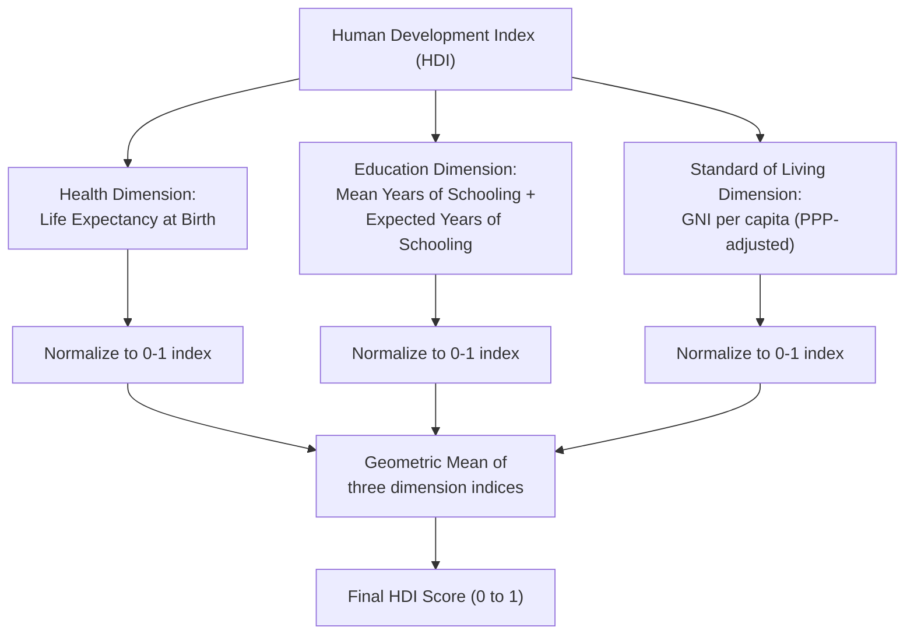

## Measuring Development: Beyond GDP per Capita

### Definition and Core Concept

Measuring development refers to the broader challenge of assessing a country's economic and social progress using indicators that capture dimensions of well-being not reflected in GDP per capita alone. While GDP per capita measures the average market value of goods and services produced per person, it does not account for how income is distributed, non-market activities, environmental degradation, health outcomes, education, political freedoms, or subjective well-being. Development economists have therefore constructed a range of alternative and supplementary indices designed to provide a more holistic picture of human welfare and economic development.

### Limitations of GDP per Capita as a Development Measure

**Key Points**

- **Ignores income distribution**: A country can have high average GDP per capita while a large share of the population lives in poverty, if income is highly concentrated among a small elite (captured instead by measures like the Gini coefficient).
- **Excludes non-market production**: Household labor, subsistence agriculture, informal sector activity, and unpaid caregiving are not captured in GDP, understating true economic activity, particularly in developing economies with large informal sectors.
- **Does not measure health or education outcomes**: A country could have relatively high income but poor life expectancy, high child mortality, or low literacy rates, none of which are directly reflected in GDP.
- **Does not account for environmental degradation and resource depletion**: GDP treats resource extraction and pollution-generating activity as positive contributions to output, without netting out the depletion of natural capital or environmental damage.
- **No adjustment for leisure time or work-life balance**: Two countries with identical GDP per capita could have very different average working hours, with GDP failing to capture the welfare value of leisure.
- **Ignores subjective well-being and happiness**: GDP is a purely material measure and does not directly capture self-reported life satisfaction, social trust, or psychological well-being.
- **Averages mask inequality within and across dimensions**: Even where distributional data exists for income, GDP per capita provides no information about disparities in health, education, or opportunity across genders, regions, or ethnic groups.
- **Does not capture the value of unpriced public goods and "bads"**: Externalities such as environmental quality, safety, and social cohesion are not priced in markets and are excluded from GDP calculations.

### The Human Development Index (HDI)

The Human Development Index, introduced by the United Nations Development Programme (UNDP) in 1990 (developed by economists Mahbub ul Haq and Amartya Sen), combines three dimensions of human development into a single composite index: health, education, and standard of living.

**Components**

1. **Health**: Measured by life expectancy at birth.
2. **Education**: Measured by a combination of expected years of schooling (for children entering school) and mean years of schooling (for adults aged 25 and older).
3. **Standard of living**: Measured by Gross National Income (GNI) per capita, adjusted for purchasing power parity (PPP).

**Calculation Methodology**

Each dimension is first normalized into an index ranging from 0 to 1 using minimum and maximum goalpost values:

$$\text{Dimension Index} = \frac{\text{Actual value} - \text{Minimum value}}{\text{Maximum value} - \text{Minimum value}}$$

The education dimension combines two sub-indicators via their arithmetic mean before normalization, and the overall HDI is calculated as the **geometric mean** of the three normalized dimension indices:

$$HDI = \sqrt[3]{I_{\text{Health}} \times I_{\text{Education}} \times I_{\text{Income}}}$$

**Key Points**

- The use of the **geometric mean** (rather than an arithmetic mean, used in earlier versions of the HDI prior to 2010) means that poor performance in any one dimension cannot be fully compensated for by strong performance in another — a country cannot achieve a high HDI through income alone if health and education outcomes are weak, reflecting an assumption of only partial (not perfect) substitutability across dimensions.
- HDI values range from 0 to 1, with the UNDP classifying countries into four tiers: **Very High**, **High**, **Medium**, and **Low** human development.
- [Inference] The specific minimum and maximum goalpost values used for normalization (e.g., for life expectancy and income) have been periodically revised by the UNDP, so historical HDI values are not always directly comparable across different UNDP Human Development Report editions without adjustment.

**Example**

Suppose a hypothetical country has: life expectancy of 70 years, mean years of schooling of 8, expected years of schooling of 13, and GNI per capita (PPP) of $15,000. Using illustrative UNDP-style goalposts (life expectancy: 20-85 years; mean/expected schooling: 0-18/0-15 years; income: $100-$75,000, log-transformed for income):

$$I_{\text{Health}} = \frac{70 - 20}{85 - 20} = 0.769$$

Education and income indices would be calculated similarly (with income using a logarithmic transformation to reflect diminishing marginal welfare returns to additional income), and the three resulting indices combined via geometric mean to produce the final HDI score.

### Extensions of the HDI

**Key Points**

- **Inequality-adjusted HDI (IHDI)**: Discounts each dimension of the HDI by the level of inequality in its distribution across the population, using a measure derived from the Atkinson inequality index; the gap between HDI and IHDI represents an estimate of the "loss" in human development due to inequality.
- **Gender Development Index (GDI)**: Compares HDI values calculated separately for females and males, measuring gender gaps in human development achievement.
- **Gender Inequality Index (GII)**: A distinct composite index (separate from the GDI) capturing gender-based disadvantage across reproductive health, empowerment (political representation and educational attainment), and labor market participation.
- **Multidimensional Poverty Index (MPI)**: Developed jointly by the UNDP and the Oxford Poverty and Human Development Initiative (OPHI), measuring poverty as overlapping deprivations experienced by households across health, education, and living standards indicators (e.g., nutrition, child mortality, years of schooling, access to electricity, sanitation, and drinking water), rather than a single income-based poverty line.

### Diagram: HDI Composite Structure

### Income Inequality Measures

**The Gini Coefficient**

The Gini coefficient measures income (or wealth) inequality within a population, derived from the **Lorenz curve**, which plots the cumulative share of total income received by the bottom $x\%$ of the population.

$$G = \frac{A}{A + B}$$

Where $A$ is the area between the line of perfect equality and the Lorenz curve, and $B$ is the area beneath the Lorenz curve. The Gini coefficient ranges from 0 (perfect equality, where every individual has identical income) to 1 (perfect inequality, where a single individual holds all income).

**Key Points**

- Commonly expressed as a percentage (0 to 100) rather than a decimal (0 to 1) in many international reporting contexts (e.g., World Bank data).
- Captures inequality across the *entire* income distribution, unlike simpler measures such as the ratio of top-to-bottom income deciles.
- [Inference] Cross-country Gini comparisons should be interpreted cautiously, as underlying survey methodologies (income versus consumption-based measures, household versus individual-level data) can differ substantially and affect comparability.
- The **Palma ratio** (ratio of the income share of the top 10% to the bottom 40%) has been proposed as a complementary measure, motivated by empirical observation that the middle deciles' income share tends to be relatively stable across countries, so most cross-country inequality variation is driven by the tails of the distribution.

### Diagram: Lorenz Curve and Gini Coefficient (svg_diagram)

<svg xmlns="http://www.w3.org/2000/svg" viewBox="0 0 420 400">
<text x="210" y="25" text-anchor="middle" font-size="16" font-weight="bold" fill="#1a1a1a">Lorenz Curve and Gini Coefficient (svg_diagram)</text>
<line x1="60" y1="340" x2="380" y2="340" stroke="#333" stroke-width="1.5" />
<line x1="60" y1="340" x2="60" y2="60" stroke="#333" stroke-width="1.5" />
<text x="220" y="370" text-anchor="middle" font-size="12" fill="#333">Cumulative % of Population</text>
<text x="25" y="200" text-anchor="middle" font-size="12" fill="#333" transform="rotate(-90 25 200)">Cumulative % of Income</text>
<line x1="60" y1="340" x2="380" y2="60" stroke="#7f8c8d" stroke-width="1.5" stroke-dasharray="5,4" />
<text x="330" y="90" font-size="11" fill="#7f8c8d">Line of Perfect Equality</text>
<path d="M 60 340 Q 150 330, 220 280 Q 300 220, 380 60" fill="none" stroke="#2980b9" stroke-width="2.5" />
<text x="230" y="230" font-size="11" fill="#2980b9">Lorenz Curve</text>
<text x="150" y="200" font-size="12" fill="#c0392b" font-weight="bold">Area A</text>
<text x="270" y="320" font-size="12" fill="#27ae60" font-weight="bold">Area B</text>
<text x="90" y="55" font-size="11" fill="#333">Gini = A / (A + B)</text>
</svg>

### Alternative and Supplementary Development Indicators

**Key Points**

- **Genuine Progress Indicator (GPI)**: Adjusts GDP by adding the value of non-market activities (household labor, volunteer work) and subtracting costs associated with pollution, resource depletion, crime, and income inequality, aiming to reflect sustainable economic welfare rather than gross transaction volume.
- **Gross National Happiness (GNH)**: A holistic development framework pioneered by Bhutan, incorporating psychological well-being, health, education, time use, cultural diversity, good governance, community vitality, ecological diversity, and living standards.
- **World Happiness Report / Subjective Well-Being Indices**: Rankings based on survey-based self-reported life satisfaction (e.g., the Cantril Ladder), combined with variables such as GDP per capita, social support, healthy life expectancy, freedom to make life choices, generosity, and perceptions of corruption used to explain cross-country variation.
- **Social Progress Index (SPI)**: Measures purely social and environmental outcomes (basic human needs, foundations of well-being, opportunity) explicitly excluding economic indicators, designed to be analyzed alongside (not blended with) GDP.
- **Green GDP / Adjusted Net Savings**: Attempts to account for natural capital depletion and environmental degradation within national accounting frameworks; the World Bank's Adjusted Net Savings measure, for example, subtracts resource depletion and pollution damage from traditional net savings figures.
- **Physical Quality of Life Index (PQLI)**: An earlier (1970s) composite measure combining infant mortality, life expectancy, and literacy rates, considered a historical precursor to the HDI.
- **Basic Needs Approach**: A development framework (prominent in the 1970s-80s) focused directly on ensuring minimum thresholds of food, shelter, healthcare, education, and sanitation are met, rather than relying on aggregate income growth to "trickle down" to the poor.

### The Capability Approach (Amartya Sen)

The theoretical foundation underlying the HDI and much of modern development economics is Amartya Sen's **capability approach**, which argues that development should be evaluated based on the expansion of people's real freedoms and capabilities to lead lives they have reason to value, rather than solely on income or utility.

**Key Points**

- **Functionings**: The various things a person may value doing or being (e.g., being well-nourished, being educated, participating in community life).
- **Capabilities**: The set of feasible functionings a person could achieve given their circumstances — representing their real freedom or opportunity to achieve valuable functionings, even if not all are actually chosen.
- **Development as Freedom**: Sen's influential framework (articulated in his 1999 book of the same name) argues that removing sources of "unfreedom" — poverty, tyranny, poor economic opportunities, social deprivation, neglect of public facilities, and intolerance — is both the primary means and the primary end of development.
- This framework directly motivated the shift away from pure income-based development measures toward the multidimensional approach embodied in the HDI, MPI, and related composite indices.

### Multidimensional Poverty Measurement

The Multidimensional Poverty Index (MPI) exemplifies the capability approach in practice, measuring poverty as the overlap of deprivations across multiple indicators rather than relying solely on an income poverty line.

**Methodology (Alkire-Foster Method)**

1. Select dimensions (typically health, education, living standards) and specific indicators within each (e.g., nutrition, child mortality, years of schooling, school attendance, cooking fuel, sanitation, drinking water, electricity, housing, and assets).
2. Establish a deprivation cutoff for each indicator (e.g., a household is considered deprived in "years of schooling" if no household member has completed six years of schooling).
3. Assign weights to each indicator (often equal weights within and across dimensions).
4. A person is identified as multidimensionally poor if their weighted sum of deprivations exceeds a specified poverty cutoff (commonly one-third of the weighted indicators).
5. The overall MPI is calculated as the product of the **incidence** of poverty (the headcount ratio, $H$, i.e., the share of the population identified as poor) and the **intensity** of poverty (the average proportion of weighted indicators in which poor people are deprived, $A$):

$$MPI = H \times A$$

**Key Points**

- This dual structure means the MPI captures both *how many* people are poor and *how poor* they are (in terms of the breadth of deprivations they experience simultaneously), a feature not captured by simple income-based headcount poverty ratios.
- The MPI allows for decomposition by region, ethnicity, or indicator, enabling policymakers to identify which specific deprivations contribute most to overall poverty in a given population.

### Comparative Overview of Development Measures

| Measure | Dimensions Captured | Key Limitation |
| --- | --- | --- |
| GDP per capita | Market income/output only | Ignores distribution, non-market activity, well-being |
| HDI | Health, education, income | Still relies on national averages; doesn't capture inequality directly |
| IHDI | HDI adjusted for within-country inequality | More complex; data-intensive |
| Gini coefficient | Income/wealth distribution only | Says nothing about absolute living standards or non-income welfare |
| MPI | Overlapping deprivations (health, education, living standards) | Dimension/indicator choices and weights are normative judgments |
| Genuine Progress Indicator | Economic welfare adjusted for social/environmental costs | Data-intensive; methodological choices are contested |
| World Happiness Report | Subjective well-being | Self-reported measures can be affected by cultural response bias |

[Inference] No single alternative index has fully displaced GDP per capita in practice, largely because GDP remains comparatively easier to measure consistently across countries and over time using established national accounting standards, whereas composite indices require normative choices about which dimensions to include and how to weight them — choices that are inherently contestable and can be sensitive to data availability, particularly in lower-income countries with weaker statistical infrastructure.

### Applications in Development Policy

**Key Points**

- **Aid allocation and eligibility**: International development institutions (World Bank, UN agencies) often use HDI classifications, per capita income thresholds, and multidimensional poverty data together to determine eligibility for concessional financing and classify "least developed countries."
- **Sustainable Development Goals (SDGs) monitoring**: The UN's SDG framework explicitly incorporates a wide range of non-GDP indicators (health, education, inequality, environmental sustainability, institutional quality) reflecting the broader measurement philosophy discussed here.
- **National policy prioritization**: Countries with relatively high GDP per capita but comparatively lower HDI rankings (or vice versa) can use the divergence to identify specific areas (e.g., education access, healthcare quality) requiring targeted policy attention beyond pure income growth strategies.
- **Cross-country comparative research**: Development economists use these varied indices together to study the relationship between economic growth and broader welfare improvements, informing debates about whether growth alone is sufficient for development or whether targeted social investment is also required.

**Related Topics**

- The Capability Approach and Amartya Sen's "Development as Freedom"
- Poverty Traps and the Economics of Extreme Poverty
- The Multidimensional Poverty Index in Depth
- Income Inequality: Causes, Measurement, and Policy Responses
- The Sustainable Development Goals (SDGs) Framework
- Purchasing Power Parity and Cross-Country Income Comparisons
- Environmental Sustainability and Green Accounting
- The Economics of Happiness and Subjective Well-Being