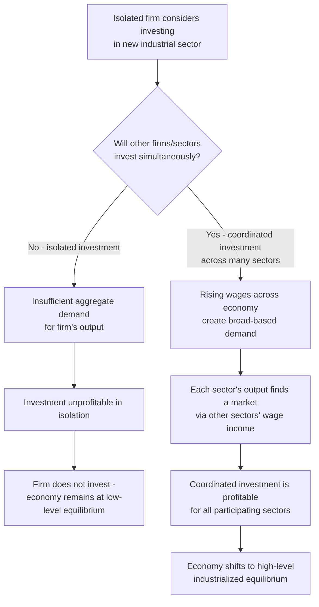

## The Poverty Trap and Big Push Models

### Definition and Core Concept

A poverty trap is a self-reinforcing mechanism that causes poverty, once present, to persist unless some external intervention pushes the affected individual, household, or economy past a critical threshold. Big Push models are a class of development theory arguing that escaping certain poverty traps requires large-scale, coordinated investment across multiple sectors simultaneously, because small, piecemeal investments are insufficient to overcome the coordination failures and increasing-returns dynamics that keep an economy trapped at a low-level equilibrium. Both concepts share a common theoretical foundation: the existence of **multiple equilibria**, where an economy or household can be stuck at a persistently low-welfare outcome even though a better, self-sustaining equilibrium exists and is reachable in principle.

### The Concept of Multiple Equilibria

The theoretical core of poverty trap models is that the relationship between an economy's (or household's) current state and its future state is not simply linear and convergent, but can exhibit multiple stable equilibria separated by an unstable threshold.

**Key Points**

- A **stable low-level equilibrium** exists where an economy or household, once there, has no internal tendency to escape without external intervention.
- A **stable high-level equilibrium** (or "escape" trajectory) exists where sustained growth or accumulation continues once a certain threshold is crossed.
- An **unstable threshold** (sometimes called a "tipping point" or "critical minimum effort") separates the two stable regions: below the threshold, the system converges back to the low-level trap; above it, the system converges toward the higher-level equilibrium.
- This structure implies that small, incremental aid or investment below the threshold may have **no lasting effect**, since the economy simply reverts to the low-level trap once the intervention ends, whereas investment sufficient to cross the threshold can trigger self-sustaining growth.

### Diagram: Multiple Equilibria and the Poverty Trap Threshold (svg_diagram)

<svg xmlns="http://www.w3.org/2000/svg" viewBox="0 0 480 380">
<text x="240" y="25" text-anchor="middle" font-size="15" font-weight="bold" fill="#1a1a1a">Multiple Equilibria: Poverty Trap Dynamics (svg_diagram)</text>
<line x1="60" y1="320" x2="440" y2="320" stroke="#333" stroke-width="1.5" />
<line x1="60" y1="320" x2="60" y2="50" stroke="#333" stroke-width="1.5" />
<text x="250" y="350" text-anchor="middle" font-size="12" fill="#333">Capital Stock / Income Today (K_t)</text>
<text x="25" y="185" text-anchor="middle" font-size="12" fill="#333" transform="rotate(-90 25 185)">Capital Stock Tomorrow (K_t+1)</text>
<line x1="60" y1="320" x2="440" y2="60" stroke="#7f8c8d" stroke-width="1.5" stroke-dasharray="5,4" />
<text x="380" y="90" font-size="10.5" fill="#7f8c8d">45-degree line (K_t+1 = K_t)</text>
<path d="M 60 320 C 130 300, 180 270, 210 230 C 240 190, 250 150, 260 130 C 290 90, 350 60, 440 70" fill="none" stroke="#2980b9" stroke-width="2.5" />
<circle cx="60" cy="320" r="6" fill="#27ae60" />
<text x="55" y="335" font-size="11" fill="#27ae60">Low-level trap (stable)</text>
<circle cx="228" cy="205" r="6" fill="#c0392b" />
<text x="228" y="245" text-anchor="middle" font-size="11" fill="#c0392b">Unstable threshold</text>
<text x="228" y="258" text-anchor="middle" font-size="11" fill="#c0392b">(critical minimum effort)</text>
<circle cx="420" cy="75" r="6" fill="#27ae60" />
<text x="380" y="55" font-size="11" fill="#27ae60">High-level equilibrium (stable)</text>
</svg>

### Sources of Poverty Traps

**Key Points**

- **Nutritional/health-based traps**: Undernutrition or poor health reduces labor productivity and earning capacity, which in turn limits the income needed to afford adequate nutrition or healthcare, creating a self-reinforcing cycle (associated with efficiency wage theory applied to nutrition in developing economies).
- **Credit market failures**: Without access to formal credit (often due to lack of collateral or information asymmetries that prevent lenders from assessing risk), poor households cannot borrow to finance productive investments (education, small business capital, improved agricultural inputs) that would raise future income, trapping them despite a positive expected return on such investments.
- **Human capital traps**: Low parental income and education reduce investment in children's education and health, perpetuating low human capital and low income across generations (an intergenerational poverty trap).
- **Behavioral/psychological traps**: Some literature in behavioral development economics argues that the psychological burden ("bandwidth tax") of persistent scarcity impairs decision-making and cognitive function, potentially reducing the ability to make optimal long-run investment decisions, though this remains a debated and actively researched area.
- **Geographic traps**: Remoteness from markets, poor infrastructure, or adverse agro-climatic conditions can trap entire regions in low productivity, as emphasized in Jeffrey Sachs's work on geography and development.
- **Institutional traps**: Weak property rights, corruption, or extractive institutions can prevent the accumulation and productive deployment of capital, a theme central to institutional economics explanations of persistent underdevelopment.

### Nutrition-Based Poverty Trap: Formal Illustration

A commonly used illustration models the relationship between nutritional intake and labor productivity as an S-shaped (sigmoid) function, generating multiple equilibria.

$$Y_{t+1} = f(N(Y_t))$$

Where $Y_t$ is current income, $N(Y_t)$ is nutritional intake as a function of income, and $f(\cdot)$ is a production function mapping nutritional status to labor productivity (and hence future income $Y_{t+1}$).

**Key Points**

- At very low income levels, small increases in income translate into minimal productivity gains, because caloric intake remains below the threshold needed to support meaningful physical labor capacity.
- Beyond a critical nutritional threshold, further income increases translate into substantial productivity gains (the steep, increasing-returns portion of the S-shaped curve), as improved nutrition significantly enhances the capacity for productive labor.
- At sufficiently high income levels, the relationship flattens again (diminishing returns), as nutritional needs become saturated and further income has little additional effect on labor productivity.
- This S-shaped relationship between income and future income can generate exactly the multiple-equilibria dynamic illustrated in the diagram above, with a low-level "hunger trap" equilibrium and a higher-level equilibrium separated by an unstable threshold.

### Credit Constraints and Investment Traps

**Example**

Consider a poor household deciding whether to invest in a small productive asset (e.g., a sewing machine, irrigation pump, or additional years of a child's schooling) costing $500, which would generate a stream of future income with a net present value well above $500 (i.e., a positive-NPV investment).

1. The household lacks $500 in savings and has no collateral acceptable to formal lenders.
2. Informal credit, where available, often carries very high interest rates (reflecting lenders' own capital scarcity and the absence of formal risk-pooling mechanisms), potentially making even a fundamentally profitable investment unviable after financing costs.
3. Without access to affordable credit, the household cannot make the investment despite its positive expected return, remaining at a lower income level than would be efficient.
4. This lower income level, in turn, makes it even harder to accumulate the savings needed to self-finance the investment in the future, reinforcing the trap.

[Inference] This mechanism is a central motivation behind the microfinance movement (pioneered by institutions such as the Grameen Bank), which sought to address credit market failures for the poor through innovations like group lending and joint liability, designed to substitute for the collateral requirements of conventional bank lending; the empirical effectiveness of microfinance in durably lifting households out of poverty traps has been the subject of extensive and mixed subsequent research, including several randomized controlled trials finding more modest average effects on income and consumption than initially hoped, alongside some positive effects on specific outcomes like business investment and female empowerment in certain contexts.

### The Big Push Theory: Origins

The Big Push theory was originally formulated by economist Paul Rosenstein-Rodan in 1943, arguing that industrialization in underdeveloped economies requires large-scale, simultaneous investment across multiple industries, because the profitability of investing in any single industry depends on complementary investments occurring in other industries at the same time.

**Core Mechanism: Coordination Failure**

**Key Points**

- **Demand-side complementarities**: If a single firm invests in a new factory and hires workers, those workers' wages create demand for goods produced by *other* industries. If no other firm invests simultaneously, this demand spillover fails to materialize, and the initial firm may not find a large enough market for its own output, since workers across the whole economy (not just its own workers) need to have rising incomes to create a large enough market.
- **Pecuniary externalities**: One firm's investment decision creates external benefits (via demand and input linkages) for other firms' profitability, but because these benefits are not captured by the investing firm itself (they are "external" to its private profit calculation), individual firms acting independently under-invest relative to what would be collectively optimal.
- **Coordination failure**: If all firms could coordinate to invest simultaneously, each would benefit from the others' demand and input spillovers, making joint investment profitable even though no individual firm find its own isolated investment profitable — this is the essence of the "Big Push" argument: many small, uncoordinated investments fail where one large, coordinated wave of investment succeeds.

### Formal Illustration: The Big Push Coordination Game

A simplified two-firm illustration captures the coordination failure logic:

|  | Firm B: Invest | Firm B: Don't Invest |
| --- | --- | --- |
| **Firm A: Invest** | (+10, +10) | (-5, 0) |
| **Firm A: Don't Invest** | (0, -5) | (0, 0) |

**Key Points**

- If both firms invest simultaneously, both benefit from the demand spillovers generated by the other's investment (payoff +10, +10) — a Pareto-superior outcome.
- If only one firm invests while the other does not, the investing firm loses money (its market is too small without the other firm's demand contribution) — payoff (-5, 0) or (0, -5).
- If neither invests, both remain at the status quo (0, 0) — a stable, if inferior, equilibrium.
- This structure has **two Nash equilibria**: (Invest, Invest) and (Don't Invest, Don't Invest), with the latter representing a coordination failure — a stable "trap" outcome that persists even though a mutually superior outcome exists, simply because no individual firm has an incentive to deviate unilaterally.
- Government intervention, external aid, or coordinated planning can, in principle, help an economy escape the (Don't Invest, Don't Invest) equilibrium by credibly coordinating simultaneous investment across sectors, which is the essential policy rationale behind the Big Push argument.

### Diagram: Big Push Coordination Mechanism

### Related Increasing-Returns Mechanisms

**Key Points**

- **Backward and forward linkages** (Albert Hirschman): Investment in one sector creates demand for inputs from "upstream" suppliers (backward linkages) and provides inputs that enable "downstream" processing industries (forward linkages); Hirschman argued development strategy should deliberately target sectors with strong linkage effects to maximize spillover investment, in contrast to the Big Push's emphasis on simultaneous investment across all sectors at once.
- **Balanced versus unbalanced growth debate**: Rosenstein-Rodan's Big Push and Ragnar Nurkse's "balanced growth" theories argued for broad, simultaneous investment across many sectors, while Hirschman's "unbalanced growth" approach argued that deliberately creating imbalances (over-investing in key linkage sectors) could be a more feasible and effective strategy for stimulating subsequent private investment in complementary sectors, given the practical resource constraints facing most developing economies.
- **Increasing returns to scale and market size**: Big Push models are closely related to theories of monopolistic competition and increasing returns (as formalized more rigorously in later New Economic Geography and endogenous growth literature), where market size itself is endogenous to the pattern of industrial investment, creating the potential for multiple self-fulfilling equilibria.
- **Infrastructure as a coordination-enabling public good**: Large-scale infrastructure investment (transportation, electricity, communications) is frequently cited as a natural candidate for state-led Big Push intervention, since infrastructure exhibits strong complementarities with private industrial investment but is often subject to underinvestment by private actors due to its public-good characteristics and large fixed costs.

### Policy Implications and Historical Applications

**Key Points**

- **State-led industrialization strategies**: Big Push logic provided part of the theoretical justification for state-directed industrial policy and import substitution industrialization strategies pursued across parts of Latin America, South Asia, and Africa from the 1950s through the 1970s-80s.
- **Foreign aid as a threshold-crossing mechanism**: Poverty trap theory provides a rationale for large-scale foreign aid packages (rather than small, incremental aid), on the argument that aid must be sufficient to push a country or region past the critical threshold separating the low-level trap from a self-sustaining growth path — a view prominently associated with economist Jeffrey Sachs's advocacy for substantially scaled-up development assistance.
- **Coordinated regional development programs**: Large infrastructure and industrialization programs targeting entire regions simultaneously (rather than isolated projects) are often justified using Big Push logic, on the premise that isolated projects will fail to generate sufficient complementary demand and input linkages.
- **Special Economic Zones and industrial clusters**: Can be understood partly as a mechanism for concentrating coordinated investment (infrastructure, favorable regulation, and multiple firms) within a defined geographic area to overcome the coordination failures that Big Push theory identifies as a barrier to broader national-level industrialization.

### Criticisms and Debates

**Key Points**

- **Empirical difficulty in identifying true poverty traps**: Distinguishing a genuine poverty trap (multiple stable equilibria) from a simple, single-equilibrium growth process characterized merely by *slow* convergence is empirically challenging, and some researchers argue that many apparent poverty traps in cross-country data may instead reflect ordinary (if slow) convergence dynamics rather than genuine multiple equilibria.
- **Government coordination capacity concerns**: Critics, particularly from more market-oriented traditions, argue that Big Push strategies assume a level of government planning capacity, information, and freedom from corruption or rent-seeking that many developing country governments may not possess, potentially leading to large-scale but poorly allocated investment (echoing broader criticisms of import substitution industrialization).
- **Aid effectiveness debates**: The "Big Push" case for substantially scaled-up foreign aid (associated with Jeffrey Sachs's Millennium Villages Project and related initiatives) has been directly challenged by economists such as William Easterly, who argue that historical evidence does not clearly support the claim that large aid inflows reliably generate self-sustaining growth, and who emphasize the risk of aid fostering dependency, weakening domestic institutions, or being poorly targeted absent strong accountability mechanisms.
- **Micro versus macro poverty trap evidence**: [Inference] Much of the more recent and rigorous empirical evidence for poverty traps (using randomized controlled trials) has focused on household- or village-level mechanisms (e.g., nutrition, credit constraints, specific asset thresholds in livestock or business capital), where identification is more tractable, whereas evidence for *national-level* or *aggregate* poverty traps of the kind Big Push theory addresses remains more contested and harder to establish with comparable rigor.

### Relationship to Other Development Economics Concepts

- **Dependency theory and structuralism**: Big Push theory shares structuralist economics' skepticism that market forces alone will reliably deliver industrialization in developing economies, providing complementary theoretical support for state-directed development strategies.
- **Modernization theory**: Big Push models can be seen as providing a more mechanism-specific (coordination failure) explanation for why the "take-off" stage in Rostow-style modernization theory might fail to occur without deliberate policy intervention.
- **Human Development Index and multidimensional poverty**: Poverty trap mechanisms operating through health, nutrition, and education (as discussed above) directly connect to the multidimensional deprivation concepts captured in indices like the MPI.

**Related Topics**

- Theories of Underdevelopment and Dependency
- Microfinance and Credit Market Failures in Developing Economies
- The Lewis Model of Economic Development (Dual Economy)
- Foreign Aid Effectiveness Debates (Sachs vs. Easterly)
- Randomized Controlled Trials in Development Economics
- Hirschman's Linkages and Unbalanced Growth
- Measuring Development: Beyond GDP per Capita
- Institutional Economics and Long-Run Development