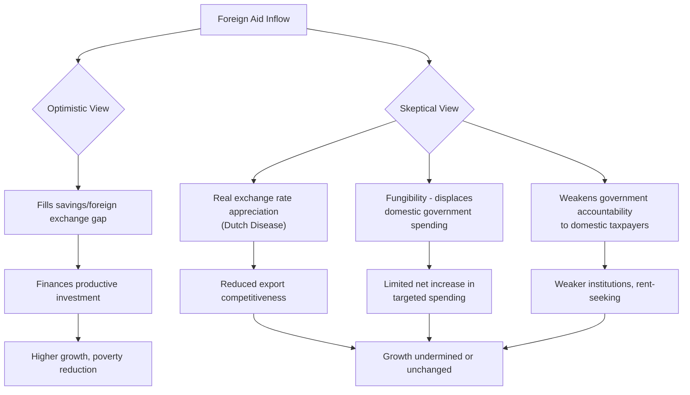

## Foreign Aid Effectiveness Debates

### Definition and Core Concept

Foreign aid effectiveness debates concern whether official development assistance (ODA) — grants, concessional loans, and technical assistance transferred from donor governments and multilateral institutions to developing countries — actually achieves its intended goals of promoting economic growth, reducing poverty, and improving human welfare. Despite decades of substantial aid flows, the relationship between aid and development outcomes has proven empirically contentious, giving rise to sharply divided schools of thought regarding whether aid helps, hinders, or has largely neutral effects on recipient economies, and under what conditions.

### Types of Foreign Aid

**Key Points**

- **Bilateral aid**: Direct government-to-government assistance, often tied to donor country strategic, commercial, or diplomatic interests (e.g., USAID, DFID/FCDO, JICA).
- **Multilateral aid**: Assistance channeled through international institutions (World Bank, IMF, regional development banks, UN agencies) that pool contributions from multiple donor countries.
- **Project aid**: Funding tied to specific, discrete projects (e.g., building a road, constructing a clinic, a school-feeding program).
- **Program/budget support aid**: Direct transfers to a recipient government's general budget, allowing greater recipient discretion over spending priorities, often conditioned on policy reforms.
- **Humanitarian/emergency aid**: Short-term assistance in response to disasters, conflict, or acute crises, distinct in purpose and evaluation criteria from long-term development aid.
- **Technical assistance**: Provision of expertise, training, and capacity-building support rather than direct financial transfers.
- **Tied versus untied aid**: Tied aid requires the recipient to spend funds on goods/services from the donor country, while untied aid allows recipients full discretion in procurement; tied aid is widely criticized in the literature for reducing aid's cost-effectiveness relative to its stated development value.

### The Optimistic View: Aid as Necessary Capital Injection

The traditional "Big Push" and "financing gap" perspective, closely associated with the Harrod-Domar growth model framework and economists such as Jeffrey Sachs, argues that developing countries are trapped in poverty primarily due to insufficient domestic savings to finance the investment needed for growth, and that foreign aid can fill this financing gap.

**The Two-Gap Model**

$$\text{Savings Gap} = I - S \quad \text{or} \quad \text{Foreign Exchange Gap} = M - X$$

Where $I$ is required investment, $S$ is domestic savings, $M$ is required imports (particularly capital goods), and $X$ is export earnings. The two-gap model argues that a developing economy may be constrained by whichever gap (savings or foreign exchange) is larger, and that foreign aid can relax whichever binding constraint prevents the economy from achieving its growth potential.

**Key Points**

- This framework directly underlies the poverty trap and Big Push argument that developing countries need a sufficiently large, coordinated capital injection to cross a critical investment threshold and achieve self-sustaining growth.
- Jeffrey Sachs's influential advocacy (notably in *The End of Poverty*, 2005, and the associated Millennium Villages Project) argued for substantially scaled-up international aid, framed as necessary to break persistent poverty traps in the poorest countries, particularly in sub-Saharan Africa.
- This view generally holds that aid *quantity* is the primary binding constraint, implying that scaling up aid volumes should translate relatively directly into improved development outcomes, provided the aid is directed toward addressing genuine capital or foreign exchange shortfalls.

### The Skeptical View: Aid as Ineffective or Counterproductive

A prominent counter-tradition, associated with economists including William Easterly, Dambisa Moyo, and Peter Bauer (an earlier critic), argues that the historical record does not support a strong positive causal relationship between aid volumes and growth, and identifies specific mechanisms through which aid can actively undermine development.

**Key Mechanisms of Aid Ineffectiveness**

**Key Points**

- **Dutch Disease effects**: Large aid inflows, like other large foreign currency inflows (e.g., resource booms), can cause real exchange rate appreciation, making the recipient country's tradable goods sectors (particularly manufacturing and agriculture) less competitive internationally, potentially undermining the very export sectors needed for long-run diversified growth.
- **Fungibility and displacement of domestic effort**: Aid earmarked for a specific purpose (e.g., health spending) may simply allow the recipient government to reduce its own domestic spending on that same purpose and reallocate freed-up domestic resources elsewhere (including, in the most severe critiques, toward military spending or elite consumption), such that aid's marginal effect on the targeted sector is smaller than the headline aid amount would suggest.
- **Weakening of governance and accountability**: When governments derive a substantial share of revenue from foreign aid rather than domestic taxation, the traditional accountability link between citizens (as taxpayers) and their government may be weakened, potentially reducing incentives for good governance, transparency, and responsiveness to citizen needs (an argument closely related to the broader "resource curse" literature on rentier states).
- **Aid dependency**: Sustained reliance on aid inflows can, in this view, reduce recipient governments' incentives to develop robust domestic tax systems, diversified economies, and effective institutions, creating a longer-run dependency dynamic rather than a transition to self-sufficiency.
- **Fostering corruption and rent-seeking**: Large, poorly monitored aid flows, particularly budget support aid to governments with weak institutions, can create opportunities for elite capture, corruption, and rent-seeking rather than reaching intended beneficiaries.
- **Undermining local markets**: In-kind aid (e.g., food aid) can, in some circumstances, depress local prices for the same goods, potentially harming local producers and undermining the development of domestic agricultural markets.

### Diagram: Competing Causal Pathways in the Aid Effectiveness Debate

### The Burnside-Dollar Hypothesis: Aid, Growth, and Policy Conditionality

A highly influential (and subsequently heavily contested) empirical study by Craig Burnside and David Dollar (World Bank, 2000) argued that aid's effect on growth is **conditional on recipient country policy quality** — specifically, that aid promotes growth only in countries with sound fiscal, monetary, and trade policies, while having little or no effect (or even negative effects) in countries with poor policy environments.

**Key Points**

- This finding provided influential empirical support for **conditionality-based aid allocation**, encouraging donors (including the World Bank) to direct aid preferentially toward countries already pursuing sound macroeconomic and structural policies, rather than distributing aid more uniformly based primarily on need.
- [Inference] Subsequent research has substantially challenged the robustness of the original Burnside-Dollar finding; several follow-up studies using different specifications, time periods, or econometric approaches have found the aid-policy-growth interaction result to be highly sensitive to model specification and not consistently replicable, contributing to a broader recognition in the literature that the aid-growth relationship is more empirically fragile and context-dependent than any single study can conclusively establish.
- The policy-conditionality debate raises a further tension: conditioning aid on "sound policy" can be criticized as reducing aid to the countries with the greatest apparent need (which may also have weaker institutions or policy environments), even if it improves the average effectiveness of aid that is disbursed.

### Cross-Country Growth Regressions: Methodological Challenges

A large body of empirical literature has attempted to estimate the aid-growth relationship using cross-country panel regressions, but this approach faces persistent methodological difficulties.

**Key Points**

- **Reverse causality/endogeneity**: Aid may be allocated *in response to* poor economic performance or crises (aid flowing toward countries with lower growth), which can bias simple correlational estimates toward finding a negative aid-growth relationship even if aid is genuinely helpful, since the counterfactual (growth without aid) is unobserved.
- **Heterogeneity across aid types**: Aggregating vastly different types of aid (emergency relief, infrastructure loans, technical assistance, budget support, military aid) into a single "aid" variable may obscure meaningful relationships that exist for specific aid categories but not others.
- **Diminishing returns to aid**: Some studies find evidence that aid's effectiveness diminishes at higher levels of aid relative to GDP, suggesting that a given absolute increase in aid may be more effective for economies currently receiving lower aid-to-GDP ratios than for heavily aid-dependent economies.
- **Publication and specification sensitivity**: [Inference] The aid-growth empirical literature has been characterized by substantial sensitivity of results to model specification choices (control variables, time periods, instrumental variables used to address endogeneity), such that the overall body of evidence does not yield a single, robust, universally agreed-upon estimate of aid's average effect on growth.

### The Randomized Controlled Trial (RCT) Turn in Development Economics

Partly in response to the identification challenges plaguing macro-level, cross-country aid-growth studies, a significant strand of development economics (associated with economists including Esther Duflo, Abhijit Banerjee, and Michael Kremer, recognized with the 2019 Nobel Memorial Prize in Economic Sciences) shifted focus toward **micro-level randomized controlled trials (RCTs)** evaluating the effectiveness of *specific* aid-funded interventions, rather than attempting to estimate the aggregate macroeconomic effect of aid volumes.

**Key Points**

- **Focus on specific interventions**: Rather than asking "does aid work?" in the aggregate, RCT-based research asks more precise questions such as "does providing free bed nets increase malaria prevention more effectively than selling subsidized bed nets?" or "does conditional cash transfer aid improve school attendance and health outcomes?"
- **Credible causal identification**: Random assignment of an intervention (e.g., a program, subsidy, or aid-funded good) to a treatment group versus a control group allows researchers to estimate the intervention's causal effect with much greater methodological confidence than cross-country regressions can provide.
- **Notable findings**: RCT-based research has generated influential (and sometimes counterintuitive) findings, such as evidence on the effectiveness of deworming programs for school attendance, the relative effectiveness of free versus subsidized distribution of health products, and the effects of unconditional versus conditional cash transfer programs.
- **Critique of the RCT approach**: Critics (including economist Angus Deaton, among others) argue that RCT findings, while internally valid for the specific context studied, often have limited **external validity** — meaning results from one specific village, region, or country may not generalize to different contexts, cultures, or scales of implementation, and that RCTs are poorly suited to evaluating aid's broader macroeconomic, institutional, or general-equilibrium effects.
- [Inference] The RCT movement has substantially shifted development economics research and, to a meaningful degree, donor practice toward evidence-based, intervention-specific evaluation, though debate continues regarding how much weight to place on RCT evidence relative to broader macroeconomic and institutional considerations in overall aid effectiveness assessments.

### Case Study Perspectives: Contrasting Regional Experiences

**Key Points**

- **East Asian growth with relatively limited aid dependence**: Several rapidly growing East Asian economies (South Korea, Taiwan) received substantial aid in earlier development phases but are often cited (with some debate about the specific causal weight of aid versus other factors such as export-oriented industrial policy) as examples where aid, land reform, and targeted industrial policy combined to support successful transitions, rather than aid alone driving growth.
- **Sub-Saharan Africa's mixed record**: Despite receiving substantial cumulative aid over multiple decades, many sub-Saharan African economies experienced slow or negative per-capita growth for extended periods (particularly the 1980s-1990s), a pattern frequently cited by aid skeptics, though proponents counter that this period also coincided with adverse terms of trade shocks, debt crises, conflict, and governance challenges that are difficult to attribute to aid itself.
- **China's development trajectory largely independent of aid**: China's dramatic poverty reduction since the late 1970s is generally attributed primarily to domestic market-oriented reforms, export-oriented industrialization, and massive internal capital mobilization rather than foreign aid, which was a comparatively minor factor, offering an example frequently invoked (on various sides of the debate) regarding the relative importance of domestic policy versus external assistance.
- [Unverified] Precise quantitative comparisons of aid-to-GDP ratios and growth outcomes across these regions vary by data source, time period, and aid classification methodology, and should be verified against primary OECD DAC or World Bank data for applications requiring specific figures.

### Aid Modality Debates: Cash Transfers, Conditionality, and Delivery Mechanisms

**Key Points**

- **Conditional versus unconditional cash transfers**: A substantial body of research compares cash transfers with behavioral conditions attached (e.g., school attendance, health clinic visits) against unconditional transfers, generally finding conditions can increase compliance with the specific targeted behavior, though unconditional transfers have also shown positive effects on broader welfare outcomes and impose lower administrative and compliance costs.
- **Direct cash transfers versus in-kind aid**: Advocates of direct cash transfers to individuals/households (associated with organizations such as GiveDirectly) argue that recipients typically have better information about their own needs than donors, and that cash transfers avoid distortions associated with in-kind aid (such as depressing local markets for the donated good); critics raise concerns about potential misuse of funds, though empirical RCT evidence on cash transfer misuse (e.g., on alcohol or tobacco) has generally found limited support for this concern in studied contexts.
- **Results-based aid/Cash on Delivery**: An approach (associated with economist Nancy Birdsall and the Center for Global Development) where donors pay recipient governments based on verified achievement of specific outcomes (e.g., number of children completing primary school) rather than funding inputs directly, intended to align incentives and reduce the fungibility and monitoring challenges associated with traditional input-based aid.
- **NGO/civil-society delivery versus government channels**: Aid delivered through non-governmental organizations can sometimes bypass weak or corrupt government institutions more effectively, but may also undermine the development of state capacity and public service delivery systems if used as a long-term substitute rather than a complement to government-led service provision.

### Summary of Key Positions in the Debate

| Position | Key Proponents | Core Argument |
| --- | --- | --- |
| Aid as necessary capital injection | Jeffrey Sachs | Aid fills savings/financing gaps, essential to escape poverty traps |
| Aid effectiveness conditional on policy | Craig Burnside, David Dollar | Aid works only with sound macroeconomic policy environments |
| Aid as largely ineffective/harmful | William Easterly, Dambisa Moyo | Aid creates dependency, weakens institutions, causes Dutch Disease |
| Focus on specific interventions via RCTs | Esther Duflo, Abhijit Banerjee, Michael Kremer | Aggregate aid-growth question is unanswerable; evaluate specific programs |
| External validity skepticism of RCTs | Angus Deaton | RCT findings often fail to generalize; macro/institutional context matters |

### Applications and Contemporary Relevance

**Key Points**

- **Sustainable Development Goals (SDG) financing debates**: Contemporary discussions of financing the SDGs directly engage aid effectiveness debates, particularly regarding the appropriate balance between aid, domestic resource mobilization, and private capital in financing development goals.
- **Humanitarian versus development aid distinctions**: Effectiveness debates differ meaningfully between emergency humanitarian aid (generally less contested, given its immediate life-saving purpose) and longer-term development aid aimed at structural economic transformation (where the effectiveness debates outlined above are most salient).
- **Debt relief and aid interactions**: Debates about debt relief initiatives (e.g., the Heavily Indebted Poor Countries, or HIPC, initiative) intersect with aid effectiveness debates regarding whether debt relief functions similarly to aid in terms of fungibility and governance effects.
- **Evolving donor practice**: Many bilateral and multilateral donors have incorporated lessons from these debates into practice, including greater use of results-based financing, increased reliance on rigorous impact evaluation before scaling programs, and more targeted, evidence-based intervention design rather than large, unconditional budget support in some contexts.

**Related Topics**

- The Poverty Trap and Big Push Models
- Theories of Underdevelopment and Dependency
- Randomized Controlled Trials in Development Economics
- The Resource Curse and Dutch Disease
- Microfinance and Credit Market Failures
- Sovereign Debt Relief Initiatives (HIPC, MDRI)
- Institutional Quality and Long-Run Economic Development
- Measuring Development: Beyond GDP per Capita