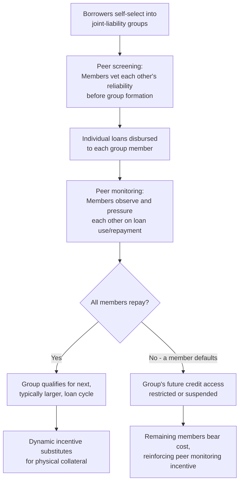

## Microfinance and Financial Inclusion

### Definition and Core Concept

Microfinance refers to the provision of small-scale financial services — including credit, savings, insurance, and payment services — to low-income individuals and households who lack access to traditional formal banking, typically because they cannot meet conventional collateral, documentation, or minimum-balance requirements. Financial inclusion is the broader policy and development goal of ensuring that individuals and businesses have access to useful, affordable financial products and services delivered responsibly and sustainably, of which microfinance is one important but not exclusive instrument. Both concepts emerged from the recognition that credit market failures — particularly information asymmetries and the absence of conventional collateral among the poor — systematically exclude low-income populations from formal financial systems, potentially reinforcing poverty traps.

### The Underlying Credit Market Failure

Formal banks are generally reluctant to lend to poor borrowers due to structural information and enforcement problems that make conventional lending unprofitable or excessively risky at small loan sizes.

**Key Points**

- **Lack of collateral**: Poor borrowers typically lack the physical or financial assets (land titles, property, savings) that banks require as security against default, making conventional secured lending unavailable to them regardless of the underlying quality of their investment opportunities.
- **Information asymmetry (adverse selection)**: Lenders cannot easily distinguish between low-risk and high-risk borrowers among the poor, and in the absence of a way to price risk accurately, banks may respond by declining to lend at all, or by requiring interest rates so high that they drive away precisely the safer borrowers who would be profitable to serve (a classic adverse selection problem).
- **Moral hazard**: Once a loan is disbursed, lenders cannot easily monitor whether borrowers exert appropriate effort or use funds as intended, raising the risk of strategic default, particularly where legal enforcement mechanisms for small loans are weak or costly relative to the loan size.
- **High transaction costs relative to loan size**: The fixed administrative costs of processing, monitoring, and collecting a loan are similar regardless of loan size, making very small loans (a defining feature of microfinance) unprofitable for conventional banks to originate and service using standard banking infrastructure and staff.

### The Grameen Bank Model and Group Lending

The modern microfinance movement is most closely associated with Muhammad Yunus and the **Grameen Bank**, founded in Bangladesh in 1983 (evolving from an experimental lending program Yunus began in the mid-1970s), which pioneered the **group lending with joint liability** model as a solution to the collateral and information problems described above.

**Core Mechanism**

1. Borrowers, typically women in rural communities, are organized into small groups (commonly five members) who apply for loans together.
2. Each member receives an individual loan, but the group as a whole is held **jointly liable**: if one member defaults, the remaining group members are typically prevented from receiving future loans, or must cover the shortfall, until the obligation is resolved.
3. This joint liability structure creates strong peer incentives for group members to screen each other for creditworthiness *before* group formation (since members bear consequences for a co-member's default), and to monitor and pressure each other to repay *after* loans are disbursed.
4. Loans are typically disbursed in escalating amounts across successive lending cycles, with continued access to credit conditioned on the group's repayment history — a **dynamic incentive** mechanism that substitutes for collateral by making future access to credit valuable enough to discourage default even without a physical asset at stake.

**Key Points**

- **Peer screening** addresses adverse selection: since group members have better information about each other's reliability than a distant bank loan officer would, joint liability effectively outsources credit screening to the borrowers themselves.
- **Peer monitoring and social pressure** addresses moral hazard: group members have a direct financial stake in each other's loan use and repayment behavior, reducing strategic default.
- **Dynamic incentives (progressive lending)** substitute for physical collateral: the threat of losing access to future, potentially larger loans creates a repayment incentive functionally similar to collateral, without requiring the borrower to possess a traditional asset.
- **Regular repayment schedules** (often weekly meetings) provide frequent monitoring touchpoints and, in some formulations, are argued to help instill financial discipline among first-time borrowers.

### Diagram: Group Lending Mechanism

### Global Expansion and Diversification of Microfinance

**Key Points**

- Following the success and visibility of the Grameen Bank model, microfinance institutions (MFIs) proliferated globally from the 1980s through the 2000s, including notable examples such as **BancoSol** (Bolivia), **BRAC** (Bangladesh), **Bank Rakyat Indonesia's microbanking unit**, and **Compartamos Banco** (Mexico).
- **Individual liability lending** has become increasingly common alongside or instead of group lending in many contexts, particularly as MFIs mature, borrowers build credit histories, and as some empirical research questioned whether joint liability's benefits outweighed its costs (including the social strain group liability can place on relationships and the tendency for it to disproportionately burden compliant members for others' defaults).
- **Commercialization of microfinance**: Many MFIs transitioned from donor-funded, non-profit structures toward commercially-oriented, for-profit institutions accessing capital markets — Compartamos Banco's 2007 initial public offering in Mexico is a widely cited and controversial example, raising debates about whether commercialization compromises microfinance's social mission by prioritizing profitability and high interest rates to attract commercial investors.
- **Muhammad Yunus and Grameen Bank were jointly awarded the 2006 Nobel Peace Prize**, reflecting the movement's prominence as a poverty-reduction strategy at that time.

### Beyond Credit: The Broader Financial Inclusion Agenda

While early microfinance focused heavily on credit, the financial inclusion agenda has broadened substantially to emphasize a wider range of financial services recognized as important for the poor's economic resilience and opportunity.

**Key Points**

- **Microsavings**: Providing accessible, often flexible-deposit savings products, recognized as valuable not only for capital accumulation but also for helping poor households smooth consumption and manage irregular income streams, without requiring the household to take on debt.
- **Microinsurance**: Insurance products (health, crop/weather-index insurance, life insurance) designed for low-income populations, intended to help households manage risk and avoid being forced to liquidate productive assets or take on high-interest debt in response to shocks (illness, crop failure, death of a household earner).
- **Digital financial services and mobile money**: The rise of mobile money platforms — most prominently **M-Pesa** in Kenya (launched 2007) — has dramatically expanded financial access by allowing users to store, send, and receive money via basic mobile phones, bypassing the need for traditional bank branch infrastructure.
- **Digital credit and "fintech" lending**: The use of mobile phone usage data, transaction histories, and alternative data sources to assess creditworthiness and disburse small, often short-term loans digitally, addressing information asymmetry through novel data sources rather than group-based peer screening.
- **Financial literacy and capability programs**: Complementary interventions aimed at improving financial decision-making skills, often paired with access-focused interventions on the premise that access alone is insufficient without the capability to use financial products effectively.

### Empirical Evidence: The RCT Turn in Microfinance Research

Following widespread early enthusiasm for microfinance's poverty-reduction potential, a substantial body of rigorous empirical research, particularly using randomized controlled trials (RCTs), has produced more nuanced and, in some respects, more modest findings than initial advocacy suggested.

**Key Points**

- **Modest average effects on income and consumption**: Several influential RCT studies evaluating microcredit expansion (conducted across multiple countries including India, Mexico, Bosnia, Mongolia, Morocco, and the Philippines, and later analyzed together in coordinated multi-country studies) generally found limited average effects on household income, consumption, or broader measures of well-being, in contrast to the transformative claims made by early microfinance advocacy.
- **Positive effects on specific outcomes**: Despite modest average effects, several studies found more consistent positive effects on specific outcomes, including business investment and scale among existing microenterprise owners, occupational choice, and in some contexts, indicators of female empowerment and decision-making authority within the household.
- **Heterogeneous effects across borrower types**: Some research suggests that microcredit may be more beneficial for borrowers with existing viable business opportunities or entrepreneurial aptitude, while having limited or even negative effects for borrowers without a clear productive use for the loan, suggesting microcredit is not a universal poverty-reduction tool for all recipients.
- **Over-indebtedness concerns**: In several markets with rapid microfinance expansion (notably Andhra Pradesh, India, in 2010), concerns emerged about borrowers taking multiple loans from different MFIs simultaneously ("multiple borrowing" or "over-lending"), leading to unsustainable debt burdens, aggressive collection practices, and in some highly publicized cases, borrower distress; this episode significantly influenced subsequent industry-wide discussions of responsible lending practices and credit bureau information-sharing among MFIs.
- [Inference] The overall shift in the empirical literature — from early, largely qualitative claims of transformative poverty-reduction impact toward more rigorously identified, generally modest average effects with some positive impacts concentrated among specific subgroups — is widely regarded as one of the more prominent examples of how RCT-based evidence has recalibrated expectations for a major development intervention, without necessarily concluding that microfinance is ineffective, but rather that its benefits are more targeted and modest than initially believed.

### Interest Rates in Microfinance: A Persistent Controversy

**Key Points**

- Microfinance interest rates are typically **substantially higher** than conventional commercial bank rates, often cited in the range of 20-40% annually or higher in various contexts, a fact that has generated significant public and academic controversy.
- **Cost-based justification**: MFI proponents argue high rates primarily reflect the genuinely high transaction costs of originating, monitoring, and collecting very small loans (relative to loan size), the costs of reaching geographically dispersed and often rural borrowers, and the absence of collateral requiring more intensive borrower vetting and monitoring.
- **Critique of excessive rates and mission drift**: Critics argue that in some cases, particularly among commercially-oriented and shareholder-driven MFIs, interest rates have exceeded what operational costs alone would justify, generating concerns about "mission drift" — a shift in institutional priorities from poverty alleviation toward profit maximization, most prominently debated in relation to the Compartamos Banco IPO.
- **Comparison to informal moneylender rates**: Proponents note that microfinance rates, while high in absolute terms, are typically substantially *lower* than the rates charged by informal moneylenders that many poor borrowers would otherwise rely upon, framing microfinance as an improvement over the existing informal credit market rather than as a substitute for low-cost formal banking.
- [Unverified] Precise typical interest rate ranges vary substantially by country, regulatory environment, and MFI type, and current figures should be verified against recent MFI transparency reporting (e.g., MIX Market data) for applications requiring specific numbers.

### Mobile Money and Digital Financial Inclusion: The M-Pesa Case

**Key Points**

- **Mechanism**: M-Pesa allows users to deposit cash with a network of local agents in exchange for electronic value stored on their mobile phone (via SIM-based technology), which can then be transferred to other users, used for bill payment, or withdrawn as cash from another agent, without requiring a traditional bank account.
- **Financial inclusion impact**: [Inference] Multiple studies of M-Pesa's expansion in Kenya have found evidence of positive effects on household consumption smoothing (particularly the ability to receive remittances quickly following income shocks), savings behavior, and in some research, measurable effects on poverty reduction, particularly for female-headed households, though the specific magnitude and generalizability of these findings to other mobile money deployments in different regulatory and infrastructure contexts remains an active area of research.
- **Agent network as key infrastructure**: The success of mobile money models depends heavily on a dense, reliable network of local cash-in/cash-out agents, effectively substituting for traditional bank branch infrastructure in areas where formal banking penetration is low.
- **Regulatory environment**: Mobile money's rapid growth in Kenya is frequently attributed partly to a relatively permissive early regulatory approach by Kenyan authorities, in contrast to more restrictive regulatory responses to similar mobile money innovations in some other countries, illustrating the importance of the regulatory environment in shaping financial inclusion technology adoption.

### Comparative Overview: Microfinance Models and Approaches

| Model/Approach | Key Mechanism | Primary Innovation |
| --- | --- | --- |
| Grameen-style group lending | Joint liability, peer screening/monitoring | Substitutes social capital for physical collateral |
| Individual liability microloans | Standard individual credit assessment (often digital) | Reduces social strain of group liability; scales via data |
| Microsavings | Accessible deposit accounts | Enables consumption smoothing without debt |
| Microinsurance | Risk pooling for low-income populations | Protects against shock-driven asset liquidation |
| Mobile money (e.g., M-Pesa) | Digital value storage/transfer via mobile phones | Bypasses physical banking infrastructure entirely |
| Digital/fintech credit | Alternative data-based credit scoring | Addresses information asymmetry without peer groups |

### Policy and Regulatory Considerations

**Key Points**

- **Balancing access and consumer protection**: Regulators face an ongoing challenge in expanding financial access to underserved populations while preventing over-indebtedness, predatory lending practices, and inadequate consumer disclosure, particularly in fast-growing digital credit markets.
- **Credit bureau and information-sharing infrastructure**: The Andhra Pradesh crisis and similar episodes elsewhere highlighted the importance of credit information-sharing mechanisms among lenders to prevent multiple, overlapping borrowing that individual lenders cannot observe in isolation.
- **Interest rate caps debate**: Some governments have imposed interest rate ceilings on microfinance lending to protect borrowers from excessive rates, though critics of such caps argue they can reduce the availability of credit to the poorest or most costly-to-serve borrowers by making such lending unprofitable for MFIs.
- **Data privacy and digital credit**: The expansion of alternative-data-based digital lending raises newer regulatory questions regarding data privacy, algorithmic transparency, and consumer protection that differ from the concerns associated with traditional group-lending microfinance.

### Relationship to Other Development Economics Concepts

- **Poverty traps and credit constraints**: Microfinance is directly motivated as a policy response to the credit-constraint-driven poverty trap mechanism, in which profitable investments go unmade due to the absence of accessible formal credit.
- **Information asymmetry and market failure theory**: The group lending model is a direct, real-world application of information economics concepts (adverse selection, moral hazard) to a development policy context.
- **Foreign aid effectiveness debates**: Microfinance has itself been subject to the same rigorous RCT-based evaluation approach that has reshaped broader foreign aid effectiveness debates, illustrating the shift toward evidence-based assessment of specific development interventions.

**Related Topics**

- The Poverty Trap and Big Push Models
- Randomized Controlled Trials in Development Economics
- Information Asymmetry: Adverse Selection and Moral Hazard
- Mobile Money and Digital Financial Services
- Foreign Aid Effectiveness Debates
- Consumer Protection in Financial Regulation
- Women's Economic Empowerment and Development
- Behavioral Economics of Poverty and Decision-Making