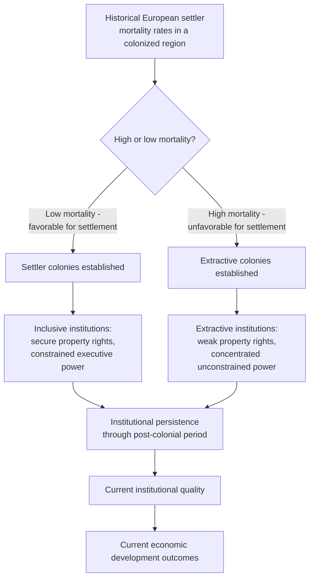
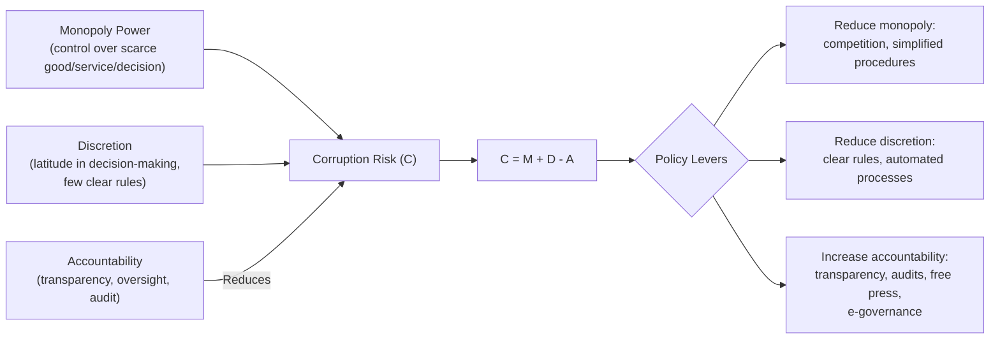

## Institutions, Governance, and Corruption

### Definition and Core Concept

Institutions, in economic terms, are the formal and informal "rules of the game" that structure human interaction — including property rights systems, contract enforcement mechanisms, political systems, regulatory frameworks, and social norms. Governance refers to the processes and institutions through which authority is exercised in a country, encompassing the capacity of government to formulate and implement sound policy, the rule of law, and accountability mechanisms. Corruption — commonly defined as the abuse of entrusted power for private gain — is widely studied as both a symptom of weak institutions and governance and an independent factor that further undermines economic development. This cluster of concepts forms the foundation of **New Institutional Economics**, which argues that institutional quality, rather than factor endowments or geography alone, is a primary determinant of long-run cross-country income differences.

### Douglass North and the Definition of Institutions

Economist Douglass North, a foundational figure in New Institutional Economics (awarded the 1993 Nobel Memorial Prize in Economic Sciences), defined institutions as the humanly devised constraints that structure political, economic, and social interaction, distinguishing between:

**Key Points**

- **Formal institutions**: Written laws, constitutions, property rights systems, regulatory codes, and formal contracts — explicit rules that are typically codified and enforced through legal or governmental mechanisms.
- **Informal institutions**: Unwritten social norms, customs, conventions, and codes of conduct that also constrain behavior but are enforced through social sanction rather than formal legal mechanisms.
- **Organizations versus institutions**: North distinguished institutions (the rules of the game) from organizations (the players operating within those rules, such as firms, political parties, and government agencies) — a distinction important for understanding that changing formal laws does not automatically change the deeper institutional environment if informal norms and organizational behavior lag behind.
- **Path dependence**: North's work emphasized that institutional change tends to be incremental and shaped by historical trajectories, such that current institutional arrangements are heavily influenced by past institutional choices, even when those original choices are no longer efficient.

### Institutions versus Geography versus Culture: Competing Explanations for Development

A central debate in development economics concerns which fundamental factor best explains persistent cross-country income differences.

**Key Points**

- **Geography hypothesis** (associated with Jeffrey Sachs and Jared Diamond): Argues that geographic and climatic factors — tropical disease burden, poor soil quality, distance from coasts and navigable rivers, and challenging agro-climatic conditions — directly constrain productivity and, historically, technological diffusion, independent of institutional quality.
- **Institutions hypothesis** (associated with Daron Acemoglu, Simon Johnson, and James Robinson, jointly awarded the 2024 Nobel Memorial Prize in Economic Sciences for related work): Argues that institutions — particularly secure property rights and constraints on elite/executive power — are the primary determinant of long-run development, and that any apparent geographic correlation with income is largely explained by geography's historical influence on which type of institutions colonial powers established, rather than a direct geographic effect on productivity.
- **Culture hypothesis** (with roots tracing to Max Weber's work on the Protestant ethic): Argues that deep cultural values, social trust, and norms regarding cooperation, thrift, and work ethic are the fundamental drivers of institutional quality and, in turn, economic development.
- [Inference] While each hypothesis has independent theoretical and empirical support, mainstream development economics since the early 2000s has generally placed greater emphasis on institutions as the more empirically robust explanatory factor, though the debate remains active, and most contemporary researchers acknowledge these factors are deeply interrelated rather than fully independent competing explanations (e.g., geography may have historically shaped which institutions were established, which in turn shaped cultural norms over time).

### The Acemoglu-Johnson-Robinson (AJR) Colonial Origins Framework

A highly influential body of research by Acemoglu, Johnson, and Robinson (particularly their widely cited 2001 paper "The Colonial Origins of Comparative Development") argues that differences in institutional quality across former colonies can be traced to the specific type of colonial institutions established, which in turn depended on conditions colonizers faced at the time of settlement.

**Core Argument**

1. In regions where European settlers faced **low mortality rates** from disease (favorable for European settlement), colonizers tended to establish **"settler colonies"** with institutions similar to their home countries — including secure property rights, constraints on executive power, and inclusive economic institutions designed to support long-term European settlement and productive economic activity.
2. In regions where European settlers faced **high mortality rates** (unfavorable for large-scale settlement, often due to tropical disease burden), colonizers instead established **"extractive colonies"** — institutions designed primarily to extract resources and transfer wealth to the colonizing power, with weak property rights protections for the local population and concentrated, unconstrained political power.
3. AJR argue that these early institutional choices exhibited strong **persistence** through the post-colonial period, such that former extractive colonies tend to have weaker institutions and lower income today, even though the original colonizers are long departed.
4. AJR use **historical settler mortality rates** as an instrumental variable for current institutional quality in their empirical analysis, arguing that settler mortality affected current income only through its historical effect on institutional choice, not through any direct ongoing channel — allowing them to argue for a causal (rather than merely correlational) effect of institutions on income.

**Key Points**

- This framework is widely regarded as one of the most influential empirical contributions to the institutions-versus-geography debate, providing a mechanism for institutional persistence that does not rely on geography's continuing direct effect on current productivity.
- [Inference] The AJR methodology and specific findings have generated substantial subsequent academic debate regarding the validity of the settler mortality instrument, the quality and reliability of the historical mortality data used, and alternative interpretations of the observed correlations, though the overall framework remains highly influential in the institutional economics literature.

### Diagram: The AJR Colonial Origins Causal Chain

### Inclusive versus Extractive Institutions (Acemoglu and Robinson)

Building on the colonial origins framework, Acemoglu and Robinson's influential book *Why Nations Fail* (2012) develops a broader theoretical distinction between two types of political and economic institutions as the master explanatory variable for long-run national success or failure.

**Key Points**

- **Inclusive economic institutions**: Secure private property rights, an unbiased legal system enforcing contracts, and a level playing field enabling broad participation in economic activity, which together provide strong incentives for investment, innovation, and productive effort across the population, not merely a narrow elite.
- **Extractive economic institutions**: Structures designed to extract resources and income from the broader population for the benefit of a narrow elite, typically through weak property rights protections, entry barriers protecting incumbents, and biased legal enforcement.
- **Inclusive political institutions**: Pluralistic political systems that distribute political power broadly and place meaningful constraints on the exercise of that power (checks and balances), which are argued to be a *necessary precondition* for durable inclusive economic institutions, since concentrated political power will eventually be used to establish extractive economic arrangements benefiting those in power.
- **Extractive political institutions**: Concentrated, unconstrained political power, typically associated with (and reinforcing) extractive economic institutions.
- **Critical juncture theory**: Acemoglu and Robinson argue that major historical events (wars, revolutions, colonization, pandemics) act as "critical junctures" that can shift a society's institutional trajectory onto either an inclusive or extractive path, with **institutional drift** and path dependence subsequently reinforcing that trajectory over long periods, absent another major disruption.
- [Inference] Critics of this framework, while generally acknowledging the importance of institutions, have argued that the inclusive/extractive dichotomy can be overly binary and may understate the role of specific policy choices, human capital, and geographic/historical contingency in explaining particular national trajectories, as well as raising questions about the framework's ability to generate precise, falsifiable predictions for specific cases beyond broad historical narrative.

### Measuring Institutional Quality and Governance

Given the abstract nature of "institutional quality," development economists and international organizations rely on a range of composite indices and survey-based measures to operationalize the concept empirically.

**Key Points**

- **Worldwide Governance Indicators (WGI)**, compiled by the World Bank, aggregate perceptions-based data across six dimensions: Voice and Accountability, Political Stability and Absence of Violence, Government Effectiveness, Regulatory Quality, Rule of Law, and Control of Corruption.
- **Corruption Perceptions Index (CPI)**, published annually by Transparency International, ranks countries based on perceived levels of public sector corruption, aggregating data from multiple expert assessments and business surveys.
- **International Country Risk Guide (ICRG)** and **Polity IV/Polity5** datasets provide long-running, historically consistent measures of institutional and political characteristics (including executive constraints), frequently used in academic research (including the AJR studies) due to their extended time coverage.
- **Ease of Doing Business Index** (formerly published by the World Bank, discontinued in 2021 following data irregularity concerns) measured specific regulatory and institutional friction points affecting business formation and operation, such as contract enforcement time and property registration procedures.
- [Inference] A persistent methodological concern across these indices is their heavy reliance on subjective perceptions (from experts, businesspeople, or households) rather than direct, objective measurement of institutional quality, which can introduce measurement error, cross-country comparability issues, and potential bias if perceptions are influenced by unrelated factors such as recent economic performance or media coverage.

### Types and Mechanisms of Corruption

**Key Points**

- **Bureaucratic (petty) corruption**: Small-scale bribery involving low- or mid-level public officials, often related to accessing basic public services (permits, licenses, utility connections) more quickly or at all.
- **Grand corruption**: Large-scale corruption involving senior officials or political elites, often related to major public procurement contracts, natural resource concessions, or large-scale embezzlement of public funds.
- **State capture**: A form of corruption in which private interests (firms, oligarchs) systematically influence the formation of laws, regulations, and policies to serve their own interests, effectively "capturing" the state's rule-making function itself, rather than merely violating existing rules.
- **Rent-seeking**: Behavior aimed at obtaining economic gain through manipulation of the economic or political environment (e.g., lobbying for protective tariffs, exclusive licenses, or monopoly privileges) rather than through the creation of new wealth via productive economic activity.
- **Clientelism and patronage**: Political systems in which access to public resources, jobs, or benefits is distributed based on political loyalty or personal relationships rather than need or merit, often reinforcing extractive political institutions.

### Economic Effects of Corruption: Theoretical Channels

**Key Points**

- **"Sand in the wheels" view**: The traditional and still-dominant view in development economics that corruption directly reduces investment (both domestic and foreign direct investment) by increasing costs and uncertainty for firms, distorts public spending toward projects that are more easily subject to bribery (e.g., large infrastructure projects over health/education spending), and reduces the overall efficiency of resource allocation.
- **"Grease the wheels" hypothesis**: A more contested, minority theoretical position arguing that in contexts with excessively rigid, poorly designed bureaucratic regulations, corruption (e.g., facilitation payments) can allow economic activity to proceed more efficiently than strict adherence to a dysfunctional regulatory system would permit, functioning as a costly but efficiency-improving workaround; [Inference] this view has found more limited empirical support than the "sand in the wheels" view in the broader literature and is generally treated as a secondary or context-specific effect rather than a general justification for corruption.
- **Corruption and public investment composition**: Empirical research has found evidence that higher corruption levels are associated with government spending being skewed toward large capital-intensive projects (which offer more scope for skimming) and away from investments in health, education, and maintenance of existing infrastructure.
- **Corruption and foreign direct investment**: Cross-country studies generally find corruption is associated with reduced FDI inflows, as it raises the effective cost and risk of doing business for foreign investors uncertain about the reliability of local contract enforcement and regulatory processes.
- **Corruption as a regressive "tax"**: Petty corruption in access to basic public services disproportionately burdens poorer households, who often lack the resources or connections to avoid bribery demands or to access alternative (private) service providers.

### The Principal-Agent Framework Applied to Corruption

Corruption is frequently modeled using **principal-agent theory**, where a public official (the agent) is entrusted with authority by the public or government (the principal) but may have incentives that diverge from faithfully serving the principal's interests.

$$\text{Corruption occurs when: } \quad \text{Benefit of corrupt act} > \text{Probability of detection} \times \text{Penalty if caught}$$

**Key Points**

- This framework, associated with economist Robert Klitgaard's influential formulation, identifies corruption as a function of **Monopoly power** (over a good or service) plus **Discretion** (in decision-making) minus **Accountability** (transparency and oversight mechanisms) — commonly summarized as $C = M + D - A$.
- **Policy implications drawn from this framework** include reducing officials' monopoly power (e.g., through competition or simplified procedures with fewer discretionary approval points), increasing transparency and independent oversight (raising the probability of detection), and increasing penalties for corrupt behavior (raising the cost if caught) — together aiming to make the expected cost of corruption exceed its expected benefit.
- **Efficiency wage arguments applied to corruption**: Some research argues that paying public officials wages above their outside labor market opportunity (efficiency wages) can reduce corruption incentives by raising the cost of job loss if caught engaging in corrupt behavior, though empirical support for this specific channel is mixed and context-dependent.

### Diagram: The Corruption Equation Framework

### Empirical Strategies for Measuring and Studying Corruption

**Key Points**

- **Perception surveys**: Widely used (e.g., the CPI) but subject to the limitations of subjective measurement discussed above, including potential inconsistency across respondents and time periods.
- **"Missing money" and discrepancy audits**: A notable empirical approach (associated with research by economist Benjamin Olken on Indonesian road-building projects) directly compares official project expenditure records against independent engineering estimates of the amount of material actually used, generating a more objective measure of resource leakage/corruption in specific public projects.
- **Randomized audits and enforcement experiments**: RCT-based studies have examined how the introduction of random government audits, increased grassroots community monitoring, or enhanced information disclosure to citizens affects corruption and resource leakage in specific public spending programs.
- **Trade data discrepancies**: Comparing reported export values from one country against reported import values recorded by trading partners can reveal "missing" trade value potentially indicative of customs corruption, capital flight, or trade misinvoicing.
- [Inference] The shift toward more direct, quantifiable corruption measurement methods (such as expenditure-tracking surveys and engineering audits) represents a methodological advance over reliance on perception-based indices alone, though such direct measurement approaches are typically feasible only for specific, well-defined projects or sectors rather than providing comprehensive national-level corruption estimates.

### Anti-Corruption Policy Approaches

**Key Points**

- **Transparency and e-governance reforms**: Digitizing public services and procurement processes to reduce direct discretionary human contact points where bribery can occur, and publishing budget and spending information to enable public and media scrutiny.
- **Independent anti-corruption agencies and judicial reform**: Establishing bodies with investigative and prosecutorial independence from the political executive, though the effectiveness of such agencies is heavily dependent on genuine political will and broader judicial system integrity.
- **Freedom of information and press freedom**: A free press and accessible public information laws are widely argued to increase the probability of corruption detection and the political costs of engaging in corrupt behavior.
- **Civil service reform**: Merit-based hiring and promotion, competitive and adequate compensation, and professionalization of the bureaucracy to reduce both the incentive and the socially accepted practice of corruption.
- **International anti-corruption frameworks**: Instruments such as the OECD Anti-Bribery Convention and the UN Convention against Corruption aim to address the demand side of cross-border corruption (e.g., bribery by multinational firms), recognizing that corruption in developing countries is often facilitated by actors based in wealthier countries.
- [Inference] The empirical literature on which specific anti-corruption interventions most reliably reduce corruption remains an active area of research, with substantial context-dependence observed across studies — an intervention effective in one institutional and cultural setting does not always generalize successfully to a different context, underscoring the broader theme (echoed in foreign aid effectiveness debates) that governance reforms are highly sensitive to local institutional conditions.

### Relationship to Other Development Economics Concepts

- **Foreign aid effectiveness**: Weak governance and corruption are frequently cited as key mechanisms through which aid can be diverted from intended purposes, directly connecting institutional quality to the aid effectiveness debates.
- **Theories of underdevelopment and dependency**: Extractive colonial institutions, as described in the AJR framework, share conceptual overlap with dependency theory's emphasis on how historical core-periphery relationships shaped current economic structures, though the two frameworks differ substantially in their proposed mechanisms and policy implications.
- **The resource curse**: Weak institutions are frequently identified as the critical conditioning factor determining whether natural resource wealth translates into a "resource curse" (rent-seeking, corruption, conflict) or a development opportunity, linking institutional quality directly to resource management outcomes.
- **Poverty traps**: Weak institutions and pervasive corruption can constitute an institutional poverty trap, in which the absence of secure property rights and reliable contract enforcement itself suppresses the investment and economic activity that might otherwise generate the political demand for institutional reform.

**Related Topics**

- Theories of Underdevelopment and Dependency
- The Resource Curse and Natural Resource Management
- Foreign Aid Effectiveness Debates
- Property Rights and Economic Development
- State Capacity and Fiscal Institutions
- Political Economy of Reform
- Rule of Law and Contract Enforcement
- Rent-Seeking and Public Choice Theory