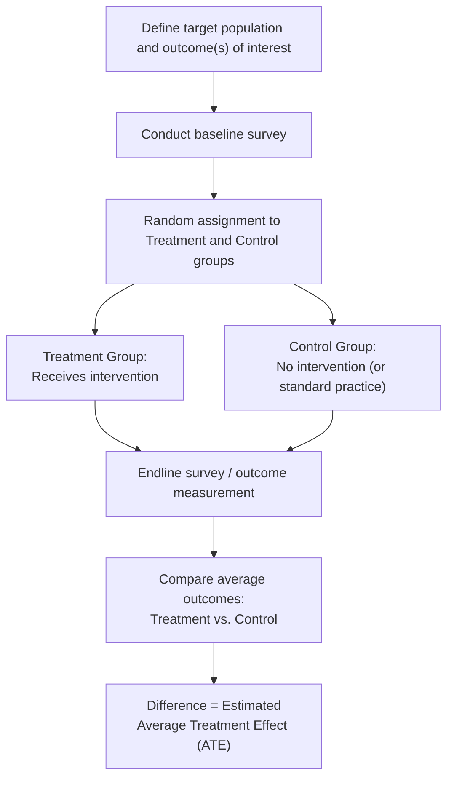

## Randomized Controlled Trials in Development Economics

### Definition and Core Concept

Randomized Controlled Trials (RCTs) are an empirical research method in which subjects (individuals, households, villages, schools, or firms) are randomly assigned to a treatment group (receiving an intervention) or a control group (not receiving it), enabling researchers to estimate the intervention's causal effect with high internal validity. In development economics, RCTs have become one of the dominant methodologies for evaluating the effectiveness of specific poverty-reduction interventions — a shift often referred to as the **"randomization revolution"** or the **"credibility revolution"** in development economics, most closely associated with economists Esther Duflo, Abhijit Banerjee, and Michael Kremer, who were jointly awarded the 2019 Nobel Memorial Prize in Economic Sciences for their experimental approach to alleviating global poverty.

### The Fundamental Problem of Causal Inference

RCTs address a foundational challenge in empirical economics: establishing that an observed correlation between an intervention and an outcome reflects a genuine **causal effect**, rather than resulting from confounding factors or reverse causality.

**Key Points**

- **The counterfactual problem**: To know the causal effect of a program on an individual, one would need to observe that same individual both *with* and *without* the program simultaneously — an impossibility. RCTs solve this by using the control group's outcomes as an estimate of what would have happened to the treatment group *absent* the intervention (the counterfactual).
- **Selection bias**: Non-randomized comparisons of program participants to non-participants are often confounded by selection bias, since individuals who choose to (or are chosen to) participate in a program frequently differ systematically from non-participants in ways that also affect the outcome of interest (e.g., more motivated farmers may both adopt a new technology *and* achieve higher yields, independent of the technology's actual effect).
- **Omitted variable bias in observational data**: Cross-country or cross-region regressions (as used extensively in earlier aid-effectiveness and growth literature) are vulnerable to unobserved factors that simultaneously affect both the variable of interest and the outcome, biasing estimated relationships in ways that are difficult to fully address with statistical controls alone.
- **Random assignment as the solution**: Because treatment status is assigned randomly (independent of any individual characteristic), the treatment and control groups are, in expectation, statistically identical in both observed *and unobserved* characteristics, so any subsequent difference in outcomes between the groups can be attributed to the intervention itself.

### Core Methodology and Design Principles

**Key Points**

- **Random assignment mechanism**: Assignment can occur at different levels — individual level, household level, or cluster level (villages, schools, health clinics) — with the appropriate level determined by the nature of the intervention and the risk of "spillover" effects between treatment and control units within the same cluster.
- **Baseline data collection**: Researchers typically collect data on relevant outcomes and characteristics *before* the intervention begins, both to verify that randomization successfully balanced the treatment and control groups on observable characteristics, and to enable difference-in-differences style analysis that can increase statistical precision.
- **Sample size and statistical power**: RCTs require sufficiently large samples to detect a treatment effect of a policy-relevant magnitude with acceptable statistical confidence; power calculations, conducted before the study begins, determine the minimum sample size needed given the expected effect size, outcome variability, and desired statistical power (commonly targeting 80% power at a 5% significance level).
- **Attrition and its risks**: If treatment and control group members drop out of the study (or become unreachable for follow-up data collection) at different rates, or for reasons related to the treatment itself, this **differential attrition** can reintroduce selection bias even in a properly randomized study, and is a key threat to validity that researchers must monitor and address.
- **Blinding (where feasible)**: Unlike medical RCTs, blinding participants to their treatment status is often impossible in development economics (e.g., a household clearly knows if it received a cash transfer), though blinding of data collectors/enumerators to treatment status is sometimes feasible and used to reduce measurement bias.

### Diagram: Basic RCT Design Structure

### Estimating the Treatment Effect

The most basic RCT estimator is the simple difference in mean outcomes between the treatment and control groups:

$$\hat{\tau} = \bar{Y}_T - \bar{Y}_C$$

Where $\bar{Y}_T$ is the average outcome in the treatment group and $\bar{Y}_C$ is the average outcome in the control group, and $\hat{\tau}$ is the estimated **Average Treatment Effect (ATE)**.

A more commonly used and more statistically efficient approach in practice is an **ANCOVA-style regression** specification that controls for baseline values of the outcome variable:

$$Y_{i,1} = \alpha + \tau \cdot T_i + \beta \cdot Y_{i,0} + \gamma X_i + \epsilon_i$$

Where:

- $Y_{i,1}$ = endline (post-intervention) outcome for individual $i$
- $T_i$ = treatment indicator (1 if treated, 0 if control)
- $Y_{i,0}$ = baseline (pre-intervention) value of the outcome variable
- $X_i$ = other baseline control variables
- $\tau$ = the coefficient of interest, representing the estimated treatment effect

**Key Points**

- Controlling for the baseline outcome value ($Y_{i,0}$) typically increases statistical precision (reduces standard errors) relative to a simple post-intervention-only comparison, particularly when the outcome variable is highly persistent or "sticky" over time at the individual level.
- **Cluster-robust standard errors**: When randomization occurs at a group level (e.g., villages) rather than the individual level, standard errors must be adjusted (clustered at the level of randomization) to account for the correlation of outcomes among individuals within the same treated or control cluster; failing to do so can substantially understate the true standard errors and lead to overstated statistical significance.

### Cluster Randomization and Spillover Effects

**Key Points**

- **Why cluster randomization is often necessary**: When individuals within the same geographic or social unit interact closely (e.g., villagers in the same market, students in the same classroom), individual-level randomization risks **contamination** — control group members may be indirectly affected by the treatment received by nearby treated individuals (e.g., learning about a new farming technique from a treated neighbor), which would bias the estimated treatment effect toward zero (understating the "true" isolated effect of the treatment).
- **General equilibrium and spillover effects**: Some interventions generate effects that extend beyond directly treated individuals — for example, a cash transfer program may raise local prices for goods and services, affecting untreated households in the same local economy; carefully designed studies sometimes randomize treatment intensity at different levels (e.g., varying the *saturation* of treatment within different villages) specifically to estimate and separate out these spillover and general equilibrium effects.
- **Cost of cluster randomization**: Clustering increases the required sample size to achieve a given level of statistical power (relative to individual-level randomization), since outcomes within a cluster tend to be correlated with each other, providing less independent statistical information per additional sampled individual within the same cluster.

### Notable Studies and Findings in Development RCTs

**Key Points**

- **Deworming programs (Kenya)**: A widely cited study by Michael Kremer and Edward Miguel found that school-based deworming treatments substantially reduced school absenteeism among treated *and* nearby untreated children (due to reduced disease transmission — a positive externality/spillover effect), with the treatment's cost-effectiveness in improving school attendance found to compare favorably against many alternative education interventions studied.
- **Free versus subsidized distribution of health products**: Multiple RCT studies (including on bed nets for malaria prevention and water purification products) have examined whether charging even small positive prices for health products reduces "wasteful" usage or screens for more motivated users, generally finding that free distribution substantially increases uptake without strong evidence that paying customers use the products more effectively, informing debates about optimal health product pricing policy in development contexts.
- **Microcredit expansion studies**: A series of coordinated RCTs across multiple countries (India, Mexico, Bosnia, Mongolia, Morocco, the Philippines) evaluating the impact of expanded access to microcredit generally found modest average effects on household income and consumption, though with more consistently positive effects on business investment among existing microenterprise owners (as discussed in microfinance research).
- **Conditional cash transfer evaluations**: RCT and quasi-experimental evaluations of large-scale conditional cash transfer programs (such as Mexico's Progresa/Oportunidades program) have provided influential evidence on the effects of cash transfers conditioned on school attendance and health clinic visits on educational and health outcomes, contributing to the widespread adoption of similar programs across Latin America and beyond.
- **Teacher incentive and accountability programs**: Various RCTs have examined the effects of performance-based teacher pay, contract (non-civil-service) teacher hiring, and increased parental/community school monitoring on student learning outcomes in different developing country contexts.

### External Validity: The Central Critique

The most substantial and persistent critique of the RCT-based approach concerns **external validity** — the extent to which a causal effect estimated in one specific context (a particular population, time period, program design, and implementing organization) can be generalized to different contexts, populations, or larger scales of implementation.

**Key Points**

- **Context-specificity of results**: An intervention's effectiveness may depend heavily on local infrastructure, cultural norms, existing institutions, or implementing organization capacity, none of which are necessarily present in a different setting where the same intervention might be considered for scale-up.
- **Angus Deaton's critique**: Economist Angus Deaton (2015 Nobel Memorial Prize laureate) has been a prominent critic, arguing that RCTs, despite their internal validity strengths, are not inherently more reliable for informing general policy than well-designed observational studies, particularly because RCTs typically cannot address the underlying structural or mechanism-based questions needed to predict how an intervention would perform in a different context, and because treatment effect heterogeneity across contexts is often the more policy-relevant question than a single average treatment effect from one study site.
- **General equilibrium critique**: Small-scale RCTs, by design, typically cannot capture the general equilibrium effects that might emerge if a program were scaled up to an entire economy or region (e.g., a small-scale job training program's effect on individual employment might not hold at national scale if job training simply reallocates a fixed number of available jobs among more qualified candidates rather than creating new employment).
- **Implementer effects and "voltage drop"**: Programs implemented by highly motivated, well-resourced NGOs or research teams in a pilot RCT setting frequently show more favorable results than the same program implemented by a government at national scale, a phenomenon sometimes referred to as a "voltage drop" or "scaling problem" in translating pilot evidence into large-scale policy.
- **Publication bias and researcher degrees of freedom**: As with other empirical fields, concerns exist regarding whether RCT studies with statistically significant or novel findings are more likely to be published, potentially biasing the overall body of published evidence, alongside broader methodological concerns about researcher discretion in outcome selection and analytical specification (a concern shared with other empirical methods, not unique to RCTs).

### Responses to the External Validity Critique

**Key Points**

- **Multi-site replication studies**: Running the same intervention design across multiple different countries or contexts (as was done with the microcredit RCT studies) allows researchers to assess whether findings are consistent across contexts or highly context-dependent, directly addressing rather than merely asserting external validity concerns.
- **Structural and mechanism-based analysis**: Combining RCT evidence with structural economic models or explicit theorizing about the underlying mechanism driving an observed effect can help researchers reason about how an intervention's effect might change in a different context, rather than relying on the average treatment effect from a single study site alone.
- **Meta-analysis and evidence aggregation**: Systematically combining results across many individual RCTs studying similar interventions (e.g., meta-analyses of cash transfer programs, deworming, or bed net distribution) can help identify more generalizable patterns and the sources of heterogeneity in treatment effects across different studies and contexts.
- **Scale-up studies and government partnership**: An increasing share of development RCT research now explicitly partners with government agencies to test interventions at a scale and through implementing channels closer to eventual real-world policy deployment, directly addressing the "voltage drop" concern rather than relying solely on small, researcher-led pilot studies.

### Ethical Considerations in Development RCTs

**Key Points**

- **Withholding beneficial treatment from the control group**: A core ethical tension in RCT design involves withholding a potentially beneficial intervention from a control group, generally justified on the grounds of **genuine uncertainty (equipoise)** about whether the intervention actually works, or by structuring the study so the control group receives the intervention at a later date (a "phase-in" or "rolling out" design) rather than being permanently excluded.
- **Informed consent challenges**: Ensuring genuinely informed consent from study participants in contexts with low literacy, limited familiarity with research methodology, or power imbalances between researchers and communities requires careful ethical protocol design and is subject to review by Institutional Review Boards (IRBs).
- **Community-level versus individual consent**: Where randomization occurs at a village or community level, questions arise regarding whether individual informed consent is sufficient or whether community-level engagement and consent processes are also ethically necessary.
- **Researcher-implementer power dynamics**: Critics have raised broader ethical concerns about power asymmetries between (often Western-based) research institutions and the developing-country communities and governments being studied, including debates about local research capacity building, data ownership, and ensuring research priorities reflect local needs rather than solely academic publication incentives.

### RCTs versus Other Empirical Methods in Development Economics

| Method | Key Strength | Key Limitation |
| --- | --- | --- |
| Randomized Controlled Trials | High internal validity via random assignment | External validity concerns; ethical/logistical constraints; scale |
| Cross-country growth regressions | Broad coverage across many countries/time periods | Severe endogeneity and omitted variable bias concerns |
| Instrumental variables (quasi-experimental) | Can establish causality using naturally occurring variation | Requires a valid, defensible instrument; often contested |
| Difference-in-differences | Uses natural policy variation over time and across groups | Requires parallel trends assumption; vulnerable to confounding shocks |
| Regression discontinuity | Exploits sharp eligibility cutoffs for causal identification | Only identifies effects near the cutoff, limiting generalizability |
| Structural modeling | Can simulate policy counterfactuals not directly observed in data | Requires strong theoretical/functional form assumptions |

### The Broader "Credibility Revolution" in Development Economics

**Key Points**

- The RCT movement in development economics is part of a broader **"credibility revolution"** in applied microeconomics more generally (a term associated with economists Joshua Angrist and Jörn-Steffen Pischke), emphasizing research designs with transparent, defensible identification strategies over reliance on complex structural models with less transparent underlying assumptions.
- **Pre-registration and pre-analysis plans**: An increasing methodological norm in development RCTs involves publicly registering the study design, hypotheses, and planned analysis *before* data collection or analysis begins, intended to reduce the risk of data mining or selective reporting of favorable results after seeing the data.
- **Institutional infrastructure**: Organizations such as **J-PAL (Abdul Latif Jameel Poverty Action Lab)**, co-founded by Banerjee, Duflo, and Sendhil Mullainathan, and **Innovations for Poverty Action (IPA)** have played a central institutional role in coordinating, funding, and disseminating RCT-based development research, as well as working directly with governments and NGOs to translate research findings into scaled policy.
- [Inference] The RCT movement's overall influence on development economics is widely regarded as transformative in terms of methodological rigor and the specificity of policy-relevant evidence generated, though the appropriate weight to place on RCT evidence relative to macroeconomic, institutional, and structural considerations in overall development strategy remains an active and unresolved debate within the discipline.

### Relationship to Other Development Economics Concepts

- **Foreign aid effectiveness debates**: The RCT approach emerged substantially as a methodological response to the identification difficulties plaguing macro-level, cross-country aid-effectiveness regressions, shifting the unit of analysis from aggregate aid flows to specific, evaluable interventions.
- **Microfinance research**: The body of coordinated microcredit RCTs represents one of the most prominent applications of this methodology, directly reshaping the empirical understanding of microfinance's effects discussed elsewhere in this chapter.
- **The Poverty Trap and Big Push Models**: RCT evidence has been used both to test specific micro-level poverty trap mechanisms (e.g., nutrition or credit-constraint thresholds) and, more contentiously, has been invoked in debates about the applicability of RCT-derived evidence to macro-level poverty trap and Big Push claims, which operate at a scale RCTs are less suited to directly test.

**Related Topics**

- Foreign Aid Effectiveness Debates
- Microfinance and Financial Inclusion
- The Poverty Trap and Big Push Models
- Quasi-Experimental Methods: Difference-in-Differences and Regression Discontinuity
- Behavioral Economics of Poverty and Decision-Making
- Impact Evaluation Design and Statistical Power
- Institutions, Governance, and Corruption
- Conditional Cash Transfer Programs: Design and Evidence