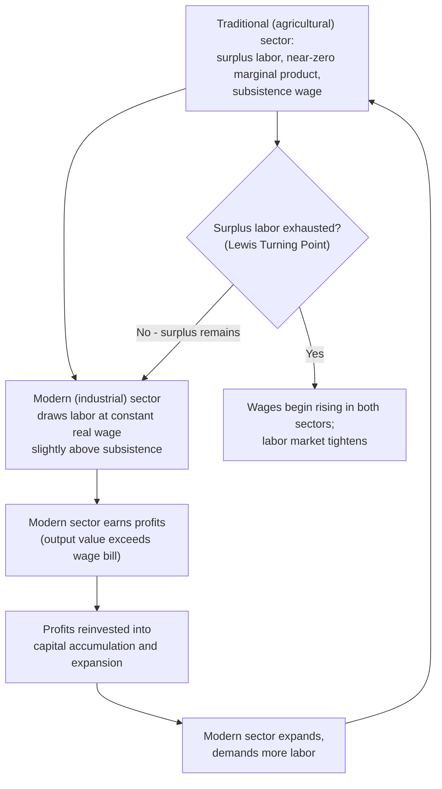

## Structural Transformation and Industrialization

### Definition and Core Concept

Structural transformation refers to the process by which an economy's composition of output and employment shifts over the course of development — typically from agriculture to manufacturing, and eventually to services — accompanied by rising labor productivity, urbanization, and demographic change. Industrialization, the expansion of the manufacturing sector's share of output and employment, has historically been viewed as the central engine of structural transformation and a near-universal feature of successful economic development, though its precise role and the possibility of alternative pathways (including "premature deindustrialization" and services-led growth) are subjects of active contemporary debate.

### Historical Patterns of Structural Change: Empirical Regularities

Development economists, drawing on cross-country historical data, have identified several broadly consistent patterns (sometimes called "stylized facts" of structural change) as economies grow.

**Key Points**

- **Declining agricultural share**: As countries develop, the share of both output and employment accounted for by agriculture declines steadily, even as agricultural output *per worker* typically rises due to productivity improvements and mechanization.
- **Rising, then declining, manufacturing share**: Manufacturing's share of output and employment typically rises during early-to-middle stages of development, reaches a peak, and then declines as an economy matures and services become dominant — a pattern often depicted as an inverted-U or "hump-shaped" curve when manufacturing share is plotted against income per capita.
- **Expanding services sector**: The services sector's share of output and employment rises throughout the development process and typically becomes the dominant sector in high-income, post-industrial economies.
- **Rural-to-urban migration**: Structural transformation is closely associated with urbanization, as labor moves from rural agricultural areas to urban centers where manufacturing and services activity is concentrated.
- **Rising average labor productivity**: Aggregate labor productivity growth during structural transformation reflects both productivity growth *within* sectors and the **reallocation effect** of labor moving from lower-productivity sectors (traditional agriculture) to higher-productivity sectors (industry and modern services).

### The Lewis Model: Dual Economy and Structural Change

The foundational theoretical model of structural transformation is the **Lewis model** (formally, the "Lewis model of economic development with unlimited supplies of labor"), developed by Nobel laureate W. Arthur Lewis in 1954, which explicitly models the process of labor reallocation from a traditional to a modern sector.

**Core Assumptions and Mechanism**

1. The economy is divided into two sectors: a **traditional (subsistence agricultural) sector** characterized by low productivity and, crucially, a large pool of surplus labor whose marginal product is assumed to be at or near zero (workers can be withdrawn from the traditional sector with little or no loss of total agricultural output), and a **modern (capitalist/industrial) sector** with higher productivity and profit-driven investment behavior.
2. Because surplus labor exists in the traditional sector, the modern sector can attract workers at a wage only modestly above the traditional sector's subsistence wage (rather than at the true, much higher marginal product wage that would prevail in the absence of surplus labor), without needing to raise wages to attract additional workers.
3. This effectively **perfectly elastic labor supply** at a roughly constant real wage allows capitalists in the modern sector to earn substantial profits on each additional unit of output produced, since output value exceeds the modest wage bill.
4. These profits are assumed to be **reinvested** by capitalists into further expansion of the modern sector, which requires more labor, which continues to be drawn from the traditional sector's surplus labor pool at the same roughly constant wage.
5. This self-reinforcing cycle of profit reinvestment, capital accumulation, and continued labor absorption from the traditional sector continues until the surplus labor pool in agriculture is exhausted — the **"Lewis turning point"** — after which further labor withdrawal from agriculture begins to reduce agricultural output, and wages in both sectors begin rising together as the labor market tightens.

### Diagram: The Lewis Dual Economy Model

**Key Points**

- The Lewis model provides a formal mechanism explaining how developing economies can achieve rapid capital accumulation and industrial growth even from a low initial savings base, since the source of investable surplus is modern-sector profits rather than aggregate household savings.
- The **Lewis turning point** concept has been widely applied in analyzing specific country experiences — most notably debates regarding whether and when China has approached or passed its own Lewis turning point, as evidenced by rising rural-to-urban migrant wages in recent decades.
- [Inference] The assumption of a literal zero marginal product of agricultural labor has been widely criticized and qualified in subsequent research, with many economists arguing that agricultural labor's marginal product, while low, is rarely truly zero; more recent formulations of dual economy models often relax this assumption to a more general claim of *low* (rather than zero) marginal product, or explain constant modern-sector wages through alternative mechanisms such as efficiency wage considerations or bargaining norms rather than a literal unlimited labor supply.

### Structural Change and Aggregate Productivity Growth: Decomposition

Economists frequently decompose aggregate labor productivity growth into "within-sector" and "structural change" (reallocation) components to assess how much of overall growth is attributable to labor moving between sectors versus productivity improvements within existing sectors.

$$\Delta P = \sum_i s_{i,0} \cdot \Delta p_i + \sum_i \Delta s_i \cdot p_{i,1}$$

Where:

- $\Delta P$ = change in aggregate labor productivity
- $s_{i,0}$ = initial employment share of sector $i$
- $\Delta p_i$ = change in productivity within sector $i$
- $\Delta s_i$ = change in employment share of sector $i$ (the reallocation term)
- $p_{i,1}$ = final productivity level of sector $i$

**Key Points**

- The first term captures the **"within-sector" effect** — productivity growth that would occur even if the employment shares across sectors remained fixed.
- The second term captures the **"structural change" (reallocation) effect** — the contribution to aggregate productivity growth from labor moving toward sectors with higher productivity levels.
- **"Growth-enhancing" versus "growth-reducing" structural change**: If labor moves toward sectors with above-average productivity (as in the classic Lewis-model pattern of agriculture-to-industry reallocation), the structural change term is positive and contributes to aggregate growth; if labor instead moves toward lower-productivity sectors (a pattern observed in some recent African and Latin American growth episodes, where labor has shifted from agriculture directly into low-productivity informal services rather than manufacturing), the reallocation effect can be negative, a phenomenon documented in influential research by economists Dani Rodrik, Margaret McMillan, and others.

### Import Substitution versus Export-Oriented Industrialization Strategies

Countries pursuing industrialization have historically adopted one of two broad strategic approaches, with sharply divergent recorded outcomes across regions.

**Key Points**

- **Import Substitution Industrialization (ISI)**: Protecting domestic "infant industries" behind tariff and quota barriers, aiming to build domestic manufacturing capacity by substituting imported manufactured goods with domestic production, primarily oriented toward the domestic market; widely adopted across Latin America, and parts of South Asia and Africa, from the 1950s through the 1970s-80s (discussed in greater depth in the context of dependency theory).
- **Export-Oriented Industrialization (EOI)**: Actively promoting manufacturing sectors oriented toward international export markets, often combining selective government support (targeted credit, tax incentives) with exposure to international competition and market discipline; most closely associated with the East Asian "Tiger" economies (South Korea, Taiwan, Hong Kong, Singapore) from the 1960s onward, followed later by China's export-oriented manufacturing expansion from the 1980s-90s.
- **Comparative outcomes**: [Inference] The East Asian export-oriented economies generally achieved substantially faster and more sustained per-capita income growth over the following decades compared to most economies that primarily pursued ISI strategies, a comparison widely (though not universally) interpreted as evidence favoring export orientation, though scholars continue to debate the relative contributions of export orientation *per se* versus other concurrent factors in the East Asian cases, including substantial state industrial policy, land reform, high savings and investment rates, and significant human capital investment.
- **State industrial policy debates**: A significant strand of research (associated with economists such as Alice Amsden and Robert Wade) argues that East Asian industrialization success involved extensive and selective state intervention — targeted credit allocation, export subsidies conditional on performance, and coordinated industrial planning — rather than pure market-driven, laissez-faire export orientation, complicating any simple narrative that success was purely a function of trade openness alone.

### Manufacturing as a Special Engine of Growth: Kaldor's Growth Laws

Economist Nicholas Kaldor proposed a set of empirical "growth laws" arguing that manufacturing possesses특별 (special) growth-promoting characteristics that justify its historical centrality to successful development strategies, distinct from agriculture or services.

**Key Points**

- **Kaldor's First Law**: Manufacturing growth is strongly positively correlated with overall GDP growth, reflecting manufacturing's role as an "engine of growth" for the wider economy.
- **Kaldor's Second Law (the Verdoorn Law)**: Manufacturing exhibits strong **dynamic increasing returns to scale** — as manufacturing output expands, productivity within manufacturing rises disproportionately, due to learning-by-doing, economies of scale, and technological spillovers that are argued to be more pronounced in manufacturing than in agriculture or many traditional service activities.
- **Kaldor's Third Law**: Manufacturing sector growth draws surplus labor from lower-productivity sectors (echoing the Lewis mechanism), and this labor reallocation itself contributes to faster overall productivity growth, independent of productivity gains within manufacturing alone.
- [Inference] Kaldor's growth laws provide a theoretical justification, distinct from simple comparative advantage arguments, for why development strategy has historically emphasized deliberate manufacturing sector promotion rather than treating all sectors as equivalent for growth purposes; however, the empirical robustness of these "laws" (particularly whether the correlations reflect genuine causal mechanisms specific to manufacturing, or simply manufacturing's historical correlation with other growth-supporting factors) remains debated in subsequent literature.

### Premature Deindustrialization: A Contemporary Challenge

A significant and influential contemporary critique, associated primarily with economist Dani Rodrik, argues that many developing economies today are experiencing **"premature deindustrialization"** — a decline in manufacturing's share of employment and output occurring at much lower levels of per-capita income than was historically observed in currently advanced economies at a comparable stage of their own development.

**Key Points**

- **Historical benchmark**: Advanced economies (such as the UK, US, and Western Europe) historically saw manufacturing employment shares peak at substantially higher levels of per-capita income than is now typical for developing economies experiencing manufacturing share peaks and subsequent declines.
- **Proposed causes**: Rodrik and others attribute premature deindustrialization to a combination of factors including trade liberalization and increased global competition (particularly from China's manufacturing export dominance), labor-saving technological change in manufacturing (automation reducing the labor-absorption capacity of a given level of manufacturing output), and the relative price effects of manufactured goods becoming cheaper over time relative to services.
- **Development policy implications**: If premature deindustrialization is a genuine and widespread phenomenon, it raises concerns about whether currently developing economies (particularly in Africa and parts of Latin America) can replicate the historical East Asian manufacturing-led growth path, given a global economic environment where manufacturing may absorb less labor at any given development stage than it did historically, potentially requiring alternative development strategies centered on services or agricultural productivity growth.
- **Services-led growth as an alternative pathway**: Some more recent research has explored whether certain tradable, higher-productivity service sectors (business process outsourcing, IT services, as exemplified by India's software services sector) can serve as an alternative structural transformation pathway to traditional labor-intensive manufacturing-led development, though the extent to which service-sector growth can replicate manufacturing's historical capacity for large-scale, relatively low-skill labor absorption remains a subject of ongoing research and debate.

### The Role of Agricultural Productivity in Enabling Structural Transformation

**Key Points**

- **Agricultural productivity as a precondition**: A substantial body of development economics argues that rising agricultural productivity is a *necessary precondition* for successful structural transformation, since it frees up labor from subsistence food production (enabling migration to industry/services) while simultaneously generating the food surplus needed to feed a growing non-agricultural, urban population.
- **The "Green Revolution"**: The widespread adoption of high-yield crop varieties, synthetic fertilizers, and irrigation technology across parts of Asia and Latin America from the 1960s-70s substantially increased agricultural yields, and is frequently cited as having enabled subsequent structural transformation and industrialization in several East and South Asian economies by releasing labor from agriculture while maintaining food security.
- **Risk of premature labor release without productivity gains**: If labor moves out of agriculture without corresponding agricultural productivity improvements, food price inflation and rural income stagnation can result, potentially undermining rather than supporting the broader structural transformation process — reinforcing why agricultural development is generally treated as a complement to, rather than a substitute for, industrial development strategy.

### Special Economic Zones and Export Processing Zones

**Key Points**

- **Special Economic Zones (SEZs)** and **Export Processing Zones (EPZs)** are geographically demarcated areas offering favorable regulatory treatment (tax incentives, streamlined customs procedures, relaxed labor or environmental regulations) intended to attract export-oriented manufacturing investment, often used as a policy tool to jump-start industrialization while limiting the scope of regulatory reform to a contained geographic area.
- **China's SEZs** (beginning with Shenzhen in 1980) are among the most widely cited examples, credited with playing a significant role in China's export-oriented manufacturing expansion and broader economic reform process from the 1980s onward.
- [Inference] The effectiveness of SEZs in generating broader, economy-wide industrialization (beyond the enclave itself) is debated in the literature; some research finds evidence of positive spillovers to surrounding regions and successful "demonstration effects" leading to broader reform, while other research finds many SEZs in various countries have functioned as relatively isolated enclaves with limited linkage to the broader domestic economy.

### Manufacturing versus Services: The Contemporary Debate

| Consideration | Traditional Manufacturing-Led View | Services-Led Alternative View |
| --- | --- | --- |
| Labor absorption capacity | High, particularly for low-skill labor (Lewis-style reallocation) | Variable; some tradable services are skill-intensive, limiting broad absorption |
| Productivity growth potential | Strong historical evidence of dynamic increasing returns (Kaldor) | Emerging evidence for specific tradable services (IT, business process outsourcing) |
| Historical precedent | Strong (UK, US, East Asian Tigers, China) | Limited but growing (India's software sector often cited) |
| Vulnerability to automation | Increasing concern given labor-saving technological change | Also subject to automation risk (e.g., AI in business process services) |
| Applicability given "premature deindustrialization" | Increasingly contested as a universal pathway | Proposed as a complementary or alternative pathway for some economies |

### Applications and Contemporary Policy Relevance

**Key Points**

- **Industrial policy design debates**: Contemporary development policy discussions continue to draw on the historical ISI-versus-EOI and state-intervention debates when designing modern industrial policy, including debates over targeted sector support, local content requirements, and export incentive programs.
- **Global value chain integration**: Rather than building fully integrated domestic manufacturing sectors (as in classical ISI or even early EOI models), many contemporary developing economies pursue structural transformation by integrating into specific stages of global value chains (e.g., assembly, component manufacturing), raising distinct policy questions about how to capture value-added and facilitate upgrading within these chains over time.
- **Automation and the future of labor-intensive industrialization**: Ongoing technological change in manufacturing (robotics, automation) raises questions about whether currently developing economies will be able to leverage low labor costs for labor-intensive manufacturing-led growth to the same extent that East Asian economies did in previous decades.
- **Urbanization and structural transformation policy coordination**: Given the close historical association between structural transformation and urbanization, development policy increasingly emphasizes the need to coordinate industrial policy with urban planning, housing, and infrastructure investment to support the rural-to-urban labor migration that structural transformation entails.

**Related Topics**

- The Lewis Model of Economic Development in Depth
- Theories of Underdevelopment and Dependency
- Institutions, Governance, and Corruption
- Global Value Chains and Unequal Exchange
- The Green Revolution and Agricultural Development
- Special Economic Zones: Case Studies and Design
- Automation, Technology, and the Future of Work in Developing Economies
- Urbanization and Development