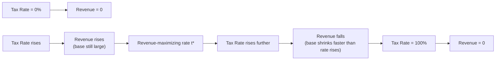

## Principles of Taxation: Equity and Efficiency

### Overview

Taxation theory addresses two central questions: how should the tax burden be distributed among members of society (equity), and how can taxes be designed to minimize their distortionary impact on economic decisions (efficiency). These two goals frequently conflict, and much of public economics is devoted to characterizing and navigating this trade-off.

### The Equity Principle

**Key Points**

- Equity concerns the fairness of the distribution of tax burdens across individuals or households.
- Two dominant standards exist: the benefit principle and the ability-to-pay principle.

#### Benefit Principle

The benefit principle holds that individuals should be taxed in proportion to the benefits they receive from government-provided goods and services. This mirrors market pricing: those who use a service more, pay more.

- **Example**: Gasoline taxes earmarked for road construction and maintenance follow the benefit principle, since road users (fuel consumers) fund the infrastructure they use.
- **Limitation**: The benefit principle is difficult to apply to pure public goods (e.g., national defense) where individual benefit is hard to measure and free-riding is pervasive.

#### Ability-to-Pay Principle

This principle holds that tax burdens should be distributed according to individuals' capacity to bear them, typically proxied by income, consumption, or wealth. It has two components:

- **Horizontal equity**: Individuals with equal ability to pay should bear equal tax burdens.
- **Vertical equity**: Individuals with greater ability to pay should bear proportionally greater tax burdens.

Vertical equity is operationalized through the rate structure of a tax:

| Rate Structure | Definition | Example |
| --- | --- | --- |
| Progressive | Average tax rate rises with income | Modern personal income tax schedules |
| Proportional | Average tax rate constant across income | Flat-rate consumption tax |
| Regressive | Average tax rate falls with income | Uniform excise tax on necessities, as a share of low incomes |

**[Inference]** Whether a tax is classified as progressive, proportional, or regressive in practice can depend on the incidence analysis used (statutory vs. economic incidence), since the party legally remitting a tax is not necessarily the party who bears its economic burden.

### The Efficiency Principle

**Key Points**

- Efficiency concerns the extent to which a tax distorts economic behavior relative to a lump-sum tax of equivalent revenue.
- The central efficiency cost of taxation is the **excess burden** (also called deadweight loss), which arises because most taxes alter relative prices and thus change behavior beyond simply transferring resources to the government.

#### Excess Burden (Deadweight Loss) of Taxation

When a tax is levied on a good, it drives a wedge between the price paid by consumers and the price received by producers, distorting the quantity transacted away from the efficient level.

For a market with linear supply and demand, the excess burden of a per-unit tax $t$ is approximated by:

$$DWL = \frac{1}{2} \cdot t \cdot \Delta Q$$

where $\Delta Q$ is the reduction in quantity traded due to the tax. This can also be expressed in terms of elasticities. For a tax on a good with demand elasticity $\varepsilon_D$ and supply elasticity $\varepsilon_S$:

$$DWL = \frac{1}{2} \cdot \frac{\varepsilon_D \varepsilon_S}{\varepsilon_D + \varepsilon_S} \cdot \frac{t^2}{P} \cdot Q$$

**Key Points from the formula**

- Excess burden rises with the **square** of the tax rate: doubling a tax rate more than doubles the deadweight loss (quadruples it, holding elasticities constant).
- Excess burden increases with the elasticities of supply and demand: taxing goods with more elastic responses causes larger behavioral distortions.
- A tax on a good with zero elasticity of demand or supply (perfectly inelastic) generates **no** excess burden, only a transfer — this is the logic behind taxing inelastic bases like land.

**(svg_diagram)** Below is an illustration of deadweight loss from a per-unit tax in a standard supply-and-demand framework.

<svg xmlns="http://www.w3.org/2000/svg" viewBox="0 0 640 420" font-family="sans-serif">
<text x="320" y="24" text-anchor="middle" font-size="16" font-weight="bold">Deadweight Loss from a Per-Unit Tax (svg_diagram)</text>

<line x1="80" y1="360" x2="580" y2="360" stroke="black" stroke-width="2" />
<line x1="80" y1="360" x2="80" y2="50" stroke="black" stroke-width="2" />
<text x="590" y="365" font-size="13">Q</text>
<text x="65" y="45" font-size="13">P</text>

<line x1="120" y1="80" x2="540" y2="340" stroke="#1f77b4" stroke-width="2" />
<text x="545" y="345" font-size="13" fill="#1f77b4">D</text>

<line x1="120" y1="340" x2="540" y2="80" stroke="#2ca02c" stroke-width="2" />
<text x="545" y="80" font-size="13" fill="#2ca02c">S</text>

<line x1="120" y1="410" x2="480" y2="80" stroke="#2ca02c" stroke-width="2" stroke-dasharray="6,4" />
<text x="450" y="95" font-size="13" fill="#2ca02c">S + t</text>

<circle cx="330" cy="210" r="4" fill="black" />
<text x="336" y="205" font-size="12">E0 (no tax)</text>
<circle cx="270" cy="255" r="4" fill="black" />
<text x="200" y="250" font-size="12">Qt (with tax)</text>

<line x1="80" y1="180" x2="270" y2="180" stroke="#d62728" stroke-width="1.5" stroke-dasharray="3,3" />
<text x="30" y="184" font-size="12" fill="#d62728">Pc</text>

<line x1="80" y1="290" x2="270" y2="290" stroke="#9467bd" stroke-width="1.5" stroke-dasharray="3,3" />
<text x="25" y="294" font-size="12" fill="#9467bd">Pp</text>

<line x1="270" y1="180" x2="270" y2="290" stroke="#ff7f0e" stroke-width="2" />
<text x="278" y="235" font-size="12" fill="#ff7f0e">tax wedge = t</text>
<line x1="270" y1="290" x2="270" y2="360" stroke="black" stroke-width="1" stroke-dasharray="2,2" />
<line x1="330" y1="210" x2="330" y2="360" stroke="black" stroke-width="1" stroke-dasharray="2,2" />

<polygon points="270,180 270,290 330,210" fill="orange" fill-opacity="0.4" stroke="orange" stroke-width="1" />
<text x="272" y="225" font-size="12" fill="#8a4b00">DWL</text>
</svg>

### The Equity-Efficiency Trade-Off

**Key Points**

- Redistributive (equity-motivated) taxes typically require higher marginal rates on labor or capital income, which increase behavioral distortions (labor supply reduction, savings/investment reduction, tax avoidance).
- This trade-off is formalized in optimal tax theory, most notably the **Mirrlees model of optimal income taxation**, which derives tax schedules that maximize a social welfare function subject to the government's revenue requirement and individuals' incentive-compatibility constraints (since true ability/productivity is unobservable and must be inferred from observed income).
- **[Inference]** The precise shape of the socially optimal marginal tax rate schedule (e.g., whether top marginal rates should be U-shaped or declining) remains an active area of theoretical and empirical debate, sensitive to assumptions about the income distribution and the social welfare weighting of different individuals.

#### Ramsey Rule (Optimal Commodity Taxation)

For raising revenue efficiently across multiple goods (holding equity aside), the **Ramsey Rule** states that tax rates should be set such that the proportional reduction in quantity demanded is equal across all taxed goods:

$$\frac{\Delta Q_i}{Q_i} = -\lambda \cdot t_i$$ for all goods $i$, for some constant $\lambda$

A simplified corollary is the **inverse elasticity rule**: for independent goods, the optimal tax rate on a good should be inversely proportional to its own-price elasticity of demand:

$$t_i \propto \frac{1}{\varepsilon_i}$$

This implies necessities (typically inelastic) should be taxed more heavily than luxuries (typically elastic) on pure efficiency grounds — a conclusion that directly conflicts with vertical equity, since necessities consume a larger income share for low-income households (regressivity).

### Key Efficiency Concepts

#### Excess Burden vs. Revenue: The Laffer Curve

**Key Points**

- Tax revenue as a function of the tax rate is generally hump-shaped: revenue is zero at a 0% rate and zero at a 100% rate (since no activity occurs), with a revenue-maximizing rate somewhere in between.
- **[Speculation]** The precise location of the revenue-maximizing rate for any real-world tax is highly contested empirically and depends on the elasticity of taxable income, which varies by income group, jurisdiction, and time period.

#### Neutrality and the Lump-Sum Tax Benchmark

A **lump-sum tax** (a fixed amount owed regardless of behavior, e.g., a head tax) is the theoretical efficiency benchmark because it raises revenue with zero excess burden — there is no margin of behavior the taxpayer can adjust to reduce liability. Real-world taxes are compared against this benchmark to measure their distortionary cost. Lump-sum taxes are rarely used in practice primarily because they violate vertical equity (a fixed levy is far more burdensome, as a share of income, for the poor than the rich) and can be politically and practically infeasible.

#### Tax Incidence and the Equity-Efficiency Link

- **Statutory incidence**: who is legally required to remit the tax.
- **Economic incidence**: who actually bears the burden after market prices adjust, determined by the relative elasticities of supply and demand.

**Key Points**

- The side of the market (buyers or sellers) with the more inelastic response bears a larger share of the tax burden, regardless of which side is statutorily taxed.
- This has direct equity implications: a tax formally imposed on employers (e.g., payroll tax) may be substantially borne by workers through lower wages if labor supply is relatively inelastic — a case where statutory and economic incidence diverge, complicating equity assessments based on who "writes the check."

### Comparing Major Tax Bases on Equity and Efficiency Grounds

| Tax Base | Equity Considerations | Efficiency Considerations |
| --- | --- | --- |
| Income tax | Can be made progressive via rate brackets; taxes both labor and capital income | Distorts labor supply and savings decisions; excess burden grows with marginal rates |
| Consumption tax (e.g., VAT) | Tends to be regressive relative to income unless exemptions/rebates are built in | Does not distort savings decisions (only current vs. future consumption, if uniform); broad base can lower distortion per unit of revenue |
| Property/land tax | Progressive if wealth is concentrated; incidence debated (owners vs. renters) | Tax on unimproved land value approaches a lump-sum tax (supply is fixed/inelastic); tax on structures distorts investment |
| Payroll tax | Regressive if capped or flat-rate; incidence largely falls on workers | Distorts labor market via wedge between wage cost and take-home pay |
| Corporate income tax | Incidence uncertain — falls on some mix of shareholders, workers, and consumers | Distorts investment location and capital structure decisions; capital is highly mobile internationally |

### Worked Example: Excess Burden Calculation

**Example**

Suppose a good has demand elasticity $\varepsilon_D = -0.5$ and supply elasticity $\varepsilon_S = 1.0$. The pre-tax price is $P = \$10$, pre-tax quantity is $Q = 1{,}000$ units, and a per-unit tax of $t = \$2$ is imposed.

Using the elasticity-based formula:

$$DWL = \frac{1}{2} \cdot \frac{|\varepsilon_D| \cdot \varepsilon_S}{|\varepsilon_D| + \varepsilon_S} \cdot \frac{t^2}{P} \cdot Q$$

$$DWL = \frac{1}{2} \cdot \frac{0.5 \times 1.0}{0.5 + 1.0} \cdot \frac{4}{10} \cdot 1000$$

$$DWL = \frac{1}{2} \cdot \frac{0.5}{1.5} \cdot 400 = \frac{1}{2} \cdot 0.333 \cdot 400 \approx 66.7$$

The excess burden is approximately $66.70, representing efficiency loss beyond the revenue transferred to government. **[Inference]** This linear-approximation formula understates deadweight loss for large tax rates relative to the pre-tax price, since it assumes locally linear supply and demand around the equilibrium.

### Related Topics

- Optimal income taxation and the Mirrlees model
- Tax incidence in general equilibrium
- Double taxation of capital income and integration proposals
- Value-added tax (VAT) design and border adjustments
- Pigouvian (corrective) taxes and externalities
- Fiscal federalism and tax competition between jurisdictions
- Behavioral responses to taxation: elasticity of taxable income (ETI)
- Wealth taxation: administrative and valuation challenges