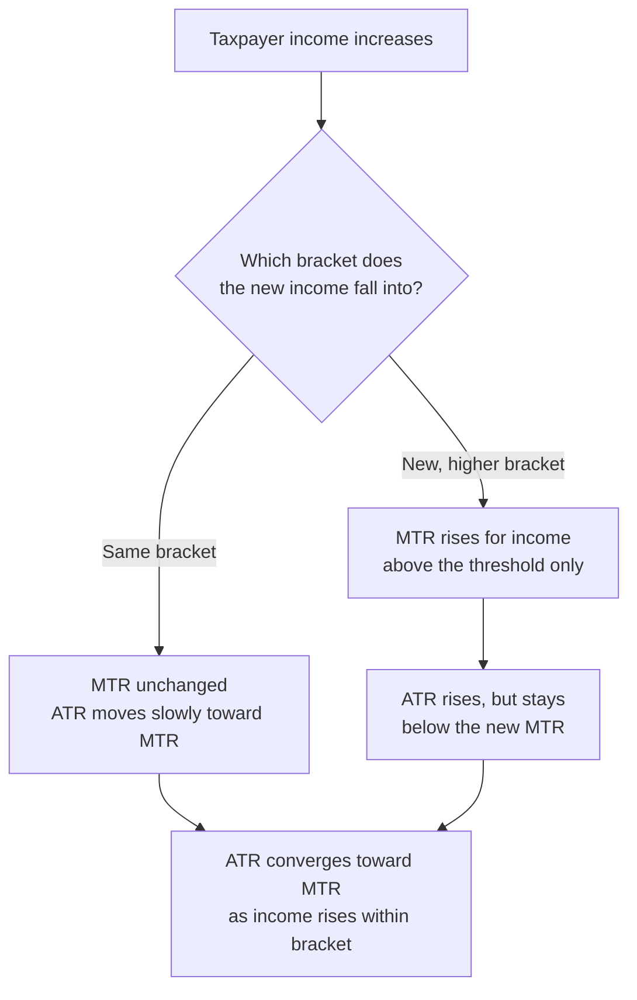

## Tax Structures: Progressive, Regressive, Proportional

### Overview

Tax structures are classified by how the average tax rate changes as the tax base (typically income) increases. This classification is central to distributive analysis in public economics, since it determines how the tax burden is shared across the income distribution independent of the total revenue raised.

### Core Definitions

**Key Points**

- The classification depends on the behavior of the **average tax rate** (ATR), not the **marginal tax rate** (MTR), though the two are related.
- $ATR = \dfrac{T(Y)}{Y}$, where $T(Y)$ is total tax liability and $Y$ is income (or the relevant base).
- $MTR = \dfrac{dT(Y)}{dY}$, the tax owed on the next dollar earned.

| Structure | Definition | ATR Behavior |
| --- | --- | --- |
| Progressive | ATR rises as $Y$ increases | $\dfrac{d(ATR)}{dY} > 0$ |
| Proportional | ATR constant across $Y$ | $\dfrac{d(ATR)}{dY} = 0$ |
| Regressive | ATR falls as $Y$ increases | $\dfrac{d(ATR)}{dY} < 0$ |

**[Inference]** A tax can be locally progressive over one income range and locally regressive over another; real-world classifications typically describe the dominant pattern across the relevant range of the distribution rather than a universal property of the tax.

### Progressive Taxation

A progressive tax structure imposes a higher average tax rate on higher-income taxpayers. This is most commonly implemented through a **marginal rate bracket system**.

#### Bracket Mechanics

In a bracketed system, each dollar of income falling within a given bracket is taxed at that bracket's marginal rate — not the taxpayer's entire income at their top rate (a common misconception).

**Example**

Suppose a simplified schedule:

| Bracket | Marginal Rate |
| --- | --- |
| $0 – $10,000 | 10% |
| $10,000 – $40,000 | 20% |
| $40,000+ | 30% |

For a taxpayer earning $50,000:

$$T = (0.10)(10{,}000) + (0.20)(30{,}000) + (0.30)(10{,}000)$$

$$T = 1{,}000 + 6{,}000 + 3{,}000 = 10{,}000$$

$$ATR = \frac{10{,}000}{50{,}000} = 20\%$$

For comparison, a taxpayer earning $20,000 owes:

$$T = (0.10)(10{,}000) + (0.20)(10{,}000) = 1{,}000 + 2{,}000 = 3{,}000$$

$$ATR = \frac{3{,}000}{20{,}000} = 15\%$$

Since the higher-income taxpayer's ATR (20%) exceeds the lower-income taxpayer's ATR (15%), the schedule is progressive.

#### Mechanisms That Produce Progressivity

- **Graduated marginal rate brackets**: rates rise at higher income thresholds, as above.
- **Personal exemptions and standard deductions**: a fixed, income-independent amount exempted from tax makes even a single flat marginal rate produce a progressive ATR, since the exemption is a larger proportional offset for lower incomes.
- **Refundable tax credits**: credits phased in at low incomes (e.g., earned income tax credits) can push the ATR negative at the bottom of the distribution.
- **Phase-outs of deductions/credits at high income**: raise the effective marginal rate on upper-income taxpayers beyond the statutory bracket rate.

### Proportional Taxation

A proportional (flat) tax applies a single constant rate to the entire base, so ATR = MTR at every income level.

**Example**

A flat tax of 15% on all income:

$$T(Y) = 0.15 Y$$

For $Y = \$20{,}000$: $T = \$3{,}000$, $ATR = 15\%$.

For $Y = \$200{,}000$: $T = \$30{,}000$, $ATR = 15\%$.

The ATR is identical (15%) at both income levels — the defining feature of proportionality.

**[Inference]** Pure proportional taxes are relatively rare in real-world personal income tax systems; they are more commonly observed in flat corporate tax rates or certain flat-rate consumption taxes, though even these can behave regressively relative to income once consumption/income ratios are considered (see below).

### Regressive Taxation

A regressive tax takes a smaller share of income as income rises. Few taxes are regressive *by statutory design*; regressivity more commonly emerges when a tax with a uniform or capped structure is evaluated **as a share of income** rather than as a share of the tax's own base.

#### Common Sources of Regressivity

- **Uniform excise/sales taxes on necessities**: A flat sales tax rate on food or fuel takes a larger share of a low-income household's total income, since such households spend a higher proportion of income on these goods (lower savings rate). This is regressivity relative to income, even though the tax rate itself is proportional relative to the transaction.
- **Capped taxes**: Payroll taxes (e.g., Social Security-style taxes) that apply only up to a wage cap are regressive above the cap, since earnings beyond it face an effective marginal — and average — rate of zero on the capped tax.
- **Flat per-unit (specific) taxes**: A fixed dollar amount per unit of a good (e.g., a fixed cigarette tax per pack) is regressive relative to income if lower-income consumers spend a larger income share on the taxed good.

**Example**

A payroll tax of 12% applied only to the first $50,000 of wages:

| Worker | Annual Wage | Taxable Wages | Tax Paid | ATR (relative to total wage) |
| --- | --- | --- | --- | --- |
| A | $50,000 | $50,000 | $6,000 | 12.0% |
| B | $200,000 | $50,000 (capped) | $6,000 | 3.0% |

Worker B's effective average rate (3.0%) is far below Worker A's (12.0%), despite B earning four times as much — a textbook regressive pattern driven by the cap.

### Visualizing the Three Structures

**(svg_diagram)** Average tax rate as a function of income under each structure.

<svg xmlns="http://www.w3.org/2000/svg" viewBox="0 0 640 400" font-family="sans-serif">
<text x="320" y="24" text-anchor="middle" font-size="16" font-weight="bold">Average Tax Rate vs. Income (svg_diagram)</text>

<line x1="80" y1="340" x2="580" y2="340" stroke="black" stroke-width="2" />
<line x1="80" y1="340" x2="80" y2="50" stroke="black" stroke-width="2" />
<text x="590" y="345" font-size="13">Income</text>
<text x="40" y="45" font-size="13">ATR</text>

<path d="M 100 300 Q 300 260 560 100" fill="none" stroke="#1f77b4" stroke-width="2.5" />
<text x="440" y="110" font-size="13" fill="#1f77b4">Progressive</text>

<line x1="100" y1="220" x2="560" y2="220" stroke="#2ca02c" stroke-width="2.5" />
<text x="450" y="212" font-size="13" fill="#2ca02c">Proportional</text>

<path d="M 100 150 Q 300 200 560 300" fill="none" stroke="#d62728" stroke-width="2.5" />
<text x="440" y="315" font-size="13" fill="#d62728">Regressive</text>
</svg>

### Measuring Progressivity Formally

**Key Points**

- Simple bracket inspection is insufficient for comparing complex real-world systems; economists use summary indices.

#### Musgrave-Thin Index

Compares pre-tax and post-tax Gini coefficients:

$$MT = \frac{1 - G_{after}}{1 - G_{before}}$$

Values of $MT > 1$ indicate the tax system reduces inequality (progressive in effect); $MT = 1$ indicates no change; $MT < 1$ indicates the system increases inequality.

#### Kakwani Index

Compares the concentration coefficient of tax payments ($C_T$) to the Gini coefficient of pre-tax income ($G_{before}$):

$$K = C_T - G_{before}$$

- $K > 0$: progressive (tax payments are more concentrated among high earners than income itself)
- $K = 0$: proportional
- $K < 0$: regressive

**[Inference]** The Kakwani index captures the "structural" progressivity of the tax (how tax liability is distributed relative to income) but does not by itself measure the redistributive *impact*, which also depends on the average tax rate/revenue scale — this is why it is often used alongside the Musgrave-Thin or Reynolds-Smolensky index for a complete picture.

### Marginal vs. Average Rates: A Persistent Source of Confusion

**Key Points**

- In a progressive bracket system, $MTR \geq ATR$ at every income level (the marginal rate on the last dollar earned is always at least as high as the average rate on all dollars).
- In a proportional system, $MTR = ATR$ everywhere.
- The common claim that "earning more can push you into a lower net income" (bracket-jump anxiety) is a misunderstanding of marginal bracket mechanics — only income *within* a bracket is taxed at that bracket's rate, so pre-tax income increases never reduce post-tax income under a standard marginal system. **[Inference]** This can still occur when means-tested benefits or non-marginal "cliff" thresholds are involved (e.g., losing an entire benefit at a single income cutoff), which is a distinct phenomenon from marginal bracket taxation.

### Real-World Classification Nuances

| Consideration | Effect on Classification |
| --- | --- |
| Time horizon | Consumption taxes appear more regressive measured against *annual* income than against *lifetime* income, since annual income understates income for those temporarily below their lifetime average (e.g., students, retirees) |
| Tax vs. transfer combined | A regressive tax paired with progressive transfers (e.g., VAT + targeted rebates) can produce an overall progressive net fiscal system |
| Statutory vs. economic incidence | A tax may be statutorily proportional but economically regressive/progressive once incidence shifts the burden between parties of different income levels |
| Behavioral responses | High-income taxpayers often have greater capacity for tax avoidance/deferral, which can flatten the *effective* progressivity relative to the *statutory* schedule |

### Related Topics

- Marginal tax rate schedules and bracket creep
- Tax incidence and shifting
- Gini coefficient and Lorenz curve construction
- Reynolds-Smolensky index of redistributive effect
- Refundable tax credits and negative income tax design
- Value-added tax (VAT) regressivity and rebate mechanisms
- Lifetime vs. annual income incidence analysis
- Effective marginal tax rates under means-tested benefit phase-outs