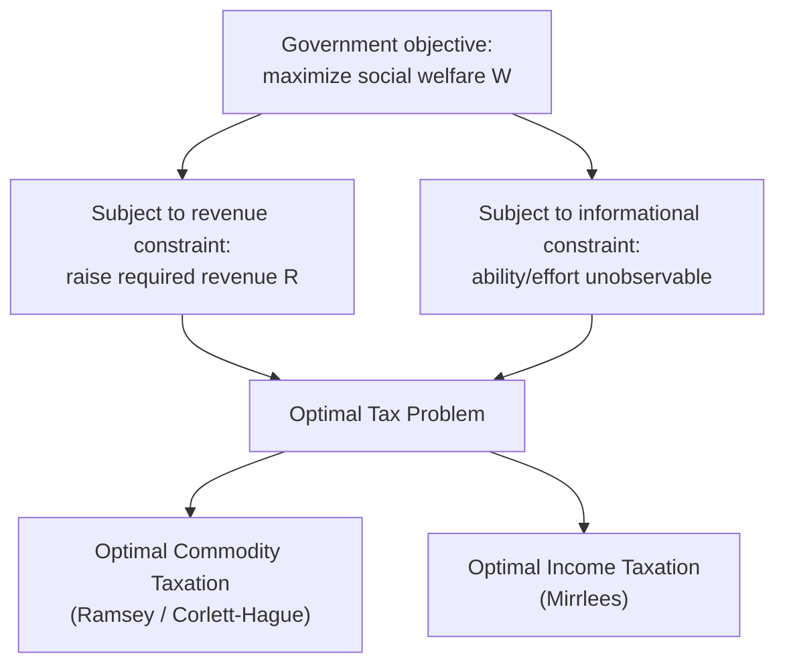

## Optimal Taxation Theory

### Overview

Optimal taxation theory studies how to design tax systems that maximize a social objective (typically a social welfare function) subject to a government revenue requirement and the constraint that the government cannot directly observe individuals' underlying characteristics (ability, preferences) — only their observable choices (income, consumption). The field formalizes the equity-efficiency trade-off into constrained optimization problems with precise, often counterintuitive, solutions.

### The General Optimal Tax Problem

**Key Points**

- The government chooses a tax instrument (commodity tax rates, an income tax schedule, etc.) to maximize social welfare $W$, a function of individual utilities, subject to:
  1. A **revenue constraint**: the tax system must raise a required amount of revenue $R$.
  2. An **informational constraint**: the government can only tax observable variables (income, purchases) — not unobservable ones (innate ability, effort, leisure).
- The interaction between social welfare weighting (equity) and the behavioral responses induced by taxation (efficiency) generates the core trade-offs of the field.

### Optimal Commodity Taxation: The Ramsey Problem

The Ramsey problem asks: given that lump-sum taxation is unavailable, how should the government set tax rates across multiple goods to raise a fixed revenue while minimizing total excess burden (efficiency-only objective, no equity weighting)?

#### The Ramsey Rule

The optimal set of tax rates $\{t_i\}$ satisfies the condition that the proportional reduction in compensated demand is equal across all taxed goods:

$$\frac{\Delta Q_i^c}{Q_i} = -\lambda \quad \text{for all } i$$

where $\Delta Q_i^c$ is the compensated (Hicksian) change in quantity demanded for good $i$, and $\lambda$ is a constant common to all goods (reflecting the marginal cost of public funds).

#### Inverse Elasticity Rule

For goods with independent demands (no cross-price effects), this simplifies to:

$$t_i \propto \frac{1}{\varepsilon_i}$$

where $\varepsilon_i$ is the own-price elasticity of demand for good $i$. Goods with more inelastic demand should be taxed at higher rates, since taxing them generates less behavioral distortion per dollar of revenue raised.

**Example**

Suppose two goods: bread ($\varepsilon = -0.2$) and restaurant meals ($\varepsilon = -1.5$). The inverse elasticity rule implies:

$$\frac{t_{bread}}{t_{meals}} = \frac{1/0.2}{1/1.5} = \frac{5}{0.667} \approx 7.5$$

Pure efficiency logic calls for taxing bread roughly 7.5 times more heavily than restaurant meals — a conclusion in direct tension with vertical equity, since bread is a necessity consumed disproportionately by lower-income households.

#### Corlett-Hague Extension

When goods have cross-price relationships with leisure (which cannot itself be taxed directly, since hours of leisure are not easily observable/taxable), the **Corlett-Hague rule** states that goods complementary with leisure should be taxed more heavily than goods complementary with labor/market work, as an indirect way of taxing leisure.

**[Inference]** This principle is a key theoretical basis for arguments favoring higher taxes on goods enjoyed primarily during leisure time (e.g., recreational goods) relative to goods that are inputs into market work, though its practical application is limited by measurement difficulty and other policy considerations (e.g., regressivity, administrative cost).

### Optimal Income Taxation: The Mirrlees Model

James Mirrlees's 1971 model addresses the case where the government wants to redistribute income but cannot observe individuals' innate earning ability directly — only their realized income, which is a function of both ability and effort (labor supply choice).

#### Model Structure

- Individuals differ in an unobservable ability parameter $n$ (wage rate per unit of labor).
- Each individual chooses labor supply $L$ to maximize utility $u(c, L)$ subject to their budget constraint, where consumption $c = wL - T(wL)$ and $w$ is their wage.
- The government chooses a nonlinear tax schedule $T(Y)$ to maximize a social welfare function $W = \int G(u_n) f(n) \, dn$, where $G(\cdot)$ reflects social welfare weighting (concave $G$ implies preference for redistribution).
- **Incentive compatibility constraint**: because ability is unobservable, the tax schedule must be such that no individual wants to mimic a lower-ability type by working less and earning less (this is what prevents the government from simply taxing high-ability people at 100% and redistributing freely).

#### Key Theoretical Results

**Key Points**

- **Zero marginal tax rate at the top**: Under certain conditions (bounded ability distribution, single top earner), the optimal marginal tax rate on the highest-ability individual is zero. This is a knife-edge theoretical result: taxing the very top earner's marginal dollar creates a pure distortion with no offsetting redistributive gain from taxing anyone *above* them, since no one is above them. **[Inference]** This result is highly sensitive to the assumed shape of the ability distribution (specifically, whether it has an unbounded upper tail) and is generally regarded as a limiting theoretical case rather than a direct policy prescription — with an unbounded Pareto-tailed distribution, optimal top rates can instead be substantial and roughly constant.
- **Zero marginal tax rate at the bottom** (under certain formulations): the individual with the lowest ability, if they are meant to work at all in the optimum, similarly faces a zero marginal rate at their earnings level.
- **Marginal tax rates in between are strictly positive** and shaped by the interaction of the social welfare weights and the ability distribution's density and hazard rate.
- The **optimal marginal tax rate formula** (in one standard formulation) can be expressed as:

$$T'(y) = \frac{1 - G(n)}{1 - F(n)} \cdot \frac{1 + \frac{1}{\varepsilon}}{n \cdot f(n)} \cdot (\text{social welfare weighting term})$$

**[Unverified]** The exact functional form varies across different presentations of the Mirrlees framework depending on modeling choices (e.g., quasi-linear vs. general utility, discrete vs. continuous ability types); the qualitative insight — that optimal marginal rates depend on the elasticity of labor supply, the density/hazard rate of the ability distribution, and the social marginal welfare weight of those above a given income — is the more robust and widely cited takeaway than any single closed-form expression.

#### Determinants of the Optimal Marginal Rate

| Factor | Effect on Optimal Marginal Rate |
| --- | --- |
| Higher elasticity of labor supply ($\varepsilon$) | Lower optimal marginal rate (greater efficiency cost of taxation) |
| Greater social preference for redistribution (more concave $G$) | Higher optimal marginal rate |
| Higher density of taxpayers at a given income (thick part of distribution) | Higher optimal marginal rate at that point (more revenue extracted per unit distortion) |
| Thinner upper tail of ability distribution | Lower optimal top marginal rate |

### The Atkinson-Stiglitz Theorem

**Key Points**

- A related and highly influential result: if individuals differ only in ability (and not in preferences over which goods to consume) and the government has access to a nonlinear income tax, then **differential commodity taxation adds no welfare benefit** beyond the optimal nonlinear income tax alone — a uniform consumption/VAT tax is optimal.
- Intuition: the income tax already captures ability differences through observed earnings; taxing consumption goods differentially does nothing additional to separate high- and low-ability types if preferences over goods are unrelated to ability.
- **[Inference]** This theorem provides a theoretical foundation for arguments in favor of broad-based, uniform-rate value-added taxes over commodity-specific excise taxes for redistributive purposes — with the important caveat that its assumptions (weak separability between goods and leisure, no preference heterogeneity correlated with ability) are strong and often violated in practice (e.g., if leisure-complementary goods exist, as in the Corlett-Hague framework, differential taxation regains a role).

### Optimal Taxation of Capital Income

**Key Points**

- The **Chamley-Judd result** in a class of dynamic optimal taxation models finds that the optimal long-run tax rate on capital income is zero, since taxing capital distorts the intertemporal consumption/savings margin in a way that compounds over an infinite horizon, eventually imposing an unbounded efficiency cost relative to labor taxation.
- **[Inference]** This result has been substantially qualified in later literature (e.g., models with heterogeneous agents, borrowing constraints, or finite horizons often find a positive optimal capital tax), and it is widely regarded within the field as a long-run/steady-state theoretical benchmark rather than a direct guide to short- or medium-run capital tax policy.

### Practical Departures from Pure Optimal Tax Theory

Real-world tax system design incorporates considerations beyond the stylized optimal tax models:

- **Administrative and compliance costs**: optimal tax models generally abstract from the costs of enforcing complex, differentiated tax schedules.
- **Tax avoidance and evasion responses**: the "elasticity of taxable income" used in applied optimal tax calibration captures not just real labor supply changes but also avoidance/timing/reporting responses, which are often more elastic than real behavioral responses.
- **Political economy constraints**: theoretically optimal schedules (e.g., a zero top rate) may be politically infeasible or viewed as inequitable independent of the model's welfare criterion.
- **Multiple margins of adjustment**: applied models increasingly incorporate not just the intensive margin (hours/effort) but the extensive margin (labor force participation decision), which can favor different rate structures (e.g., the case for negative marginal rates or wage subsidies at the bottom via the EITC, motivated by extensive-margin responses).

### Related Topics

- Elasticity of taxable income (ETI) estimation
- Extensive vs. intensive margin labor supply responses
- Diamond-Mirrlees production efficiency theorem
- Optimal taxation with heterogeneous preferences
- Tax competition and capital mobility in open economies
- Behavioral public economics and optimal taxation
- Political economy constraints on optimal tax design
- Negative income tax and universal basic income proposals