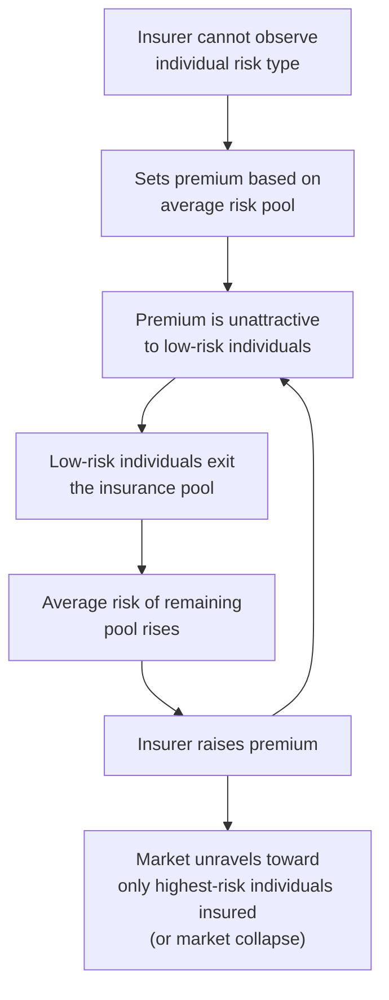
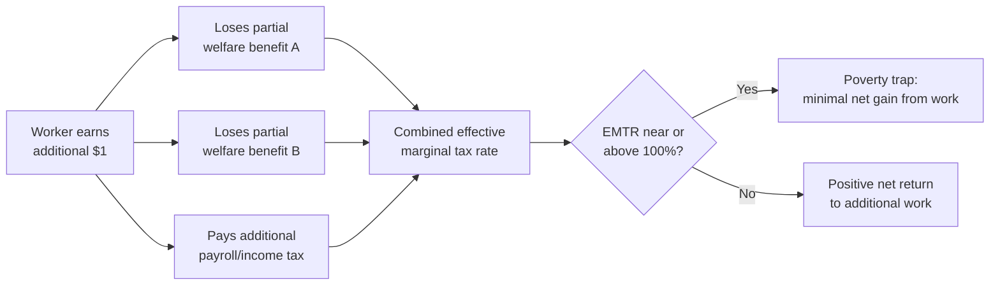

## Social Insurance and Welfare Programs

### Overview

Social insurance and welfare programs are government interventions designed to address market failures in insurance provision (social insurance) and to redistribute resources toward those with low income or high need (welfare/means-tested programs). While often discussed together, they rest on distinct economic rationales, have different eligibility structures, and generate different behavioral responses.

### Conceptual Distinction: Social Insurance vs. Welfare

| Dimension | Social Insurance | Welfare (Means-Tested) |
| --- | --- | --- |
| Primary rationale | Correcting failures in private insurance markets | Redistribution toward low-income/high-need individuals |
| Eligibility basis | Occurrence of an insurable event (job loss, disability, old age) | Income/asset level below a threshold |
| Funding mechanism | Often payroll/dedicated contributions, contributory | General tax revenue |
| Examples | Unemployment insurance, Social Security (old-age), workers' compensation | Cash welfare (TANF-style programs), food assistance, means-tested housing subsidies |
| Political framing | Often perceived as "earned" | Often perceived as "need-based," subject to different political dynamics |

**[Inference]** This distinction is analytically useful but not absolute in practice — many real-world programs blend features of both categories (e.g., disability insurance has both an insurable-event trigger and effectively means-tests via work capacity).

### The Economic Rationale for Social Insurance

**Key Points**

- Private insurance markets can fail to provide adequate coverage against certain risks due to two canonical market failure mechanisms: **adverse selection** and **moral hazard**.
- Government-provided social insurance, typically financed through mandatory participation, addresses adverse selection by pooling risk across the entire population (including low-risk individuals who might otherwise opt out of a voluntary private market).

#### Adverse Selection

When insurers cannot fully observe individual risk types, high-risk individuals disproportionately purchase insurance (since it is a better deal for them), driving up premiums, which in turn drives out lower-risk individuals — a phenomenon that can lead to market unraveling (the "death spiral").

**Mandatory social insurance** solves this by requiring universal (or near-universal) participation, preventing low-risk individuals from exiting the pool.

#### Moral Hazard

Once insured, individuals may change behavior in ways that increase the likelihood or cost of the insured event (e.g., reduced job search effort while receiving unemployment benefits, since the cost of continued unemployment is partially offset by benefits).

**Key Points**

- Moral hazard creates the central efficiency cost of social insurance, analogous to the excess burden of taxation.
- The **optimal social insurance problem** is a trade-off between the **consumption-smoothing/insurance value** of benefits (valuable because individuals are risk-averse) and the **moral hazard cost** (distorted behavior — e.g., prolonged unemployment duration, reduced job search intensity).

#### Baily-Chetty Formula for Optimal Unemployment Insurance

A canonical result in the social insurance literature expresses the optimal unemployment insurance replacement rate as a function of the consumption-smoothing benefit and the elasticity of unemployment duration with respect to benefits:

$$\frac{b}{1-b} \approx \frac{\gamma \cdot \varepsilon_{D,b}}{1}$$

Where the optimal benefit level balances:

- **Insurance value**: proportional to the coefficient of relative risk aversion ($\gamma$) and the consumption drop experienced during unemployment.
- **Moral hazard cost**: proportional to the elasticity of unemployment duration with respect to the benefit level ($\varepsilon_{D,b}$).

**[Inference]** The precise closed-form expression of this formula varies across presentations in the literature (Baily 1978, Chetty 2006, and subsequent refinements), but the core qualitative insight — that a larger consumption drop upon job loss argues for more generous benefits, while a larger behavioral response to benefits argues for less generous benefits — is the robust, widely cited takeaway.

### Major Categories of Social Insurance Programs

#### Unemployment Insurance (UI)

- Provides temporary income replacement to workers who lose jobs involuntarily.
- **Key design parameters**: replacement rate (benefit as % of prior wage), maximum benefit duration, waiting period, experience rating (whether employer contributions reflect their layoff history).
- **Efficiency concern**: benefit generosity and duration have been empirically linked to longer unemployment spells (moral hazard on the job-search margin), though the magnitude of this effect is debated and appears to vary with labor market conditions (e.g., smaller effects during recessions when job availability, not search effort, is the binding constraint).

#### Old-Age/Retirement Insurance (e.g., Social Security-style systems)

- Addresses the risk that individuals under-save for retirement (due to myopia, uncertainty about lifespan, or capital market imperfections) and the risk of outliving one's savings (longevity risk), which private annuity markets address only imperfectly due to adverse selection.
- **Financing structures**:
  - **Pay-as-you-go (PAYGO)**: current workers' contributions fund current retirees' benefits.
  - **Funded systems**: contributions are invested and accumulate to fund the contributor's own future benefits.
- **Key trade-off**: PAYGO systems are exposed to demographic risk (a shrinking ratio of workers to retirees strains the system's finances), while funded systems are exposed to financial market risk.

#### Disability Insurance

- Insures against the risk of losing earnings capacity due to illness or injury.
- **Design challenge**: disability status is difficult to verify objectively, creating both potential moral hazard (marginal cases choosing not to work) and the risk of denying benefits to genuinely disabled individuals — a classic type I/type II error trade-off in program design.

#### Health Insurance

- Addresses adverse selection (healthy individuals opting out of a voluntary market, described above) and protects against catastrophic, low-probability, high-cost health events that individuals are typically unable to self-insure against.
- **[Inference]** The specific institutional design of public health insurance systems (single-payer, mandated private insurance with subsidies, hybrid models) varies substantially across countries and is a distinct, actively debated area of applied public economics beyond the core insurance-market-failure rationale.

### Means-Tested Welfare Programs

**Key Points**

- Unlike social insurance, means-tested programs are triggered by low income/assets rather than an insurable event, and are typically funded from general revenue rather than dedicated contributions.
- The central design challenge is structuring **benefit phase-out rates** to balance targeting efficiency (concentrating benefits on those most in need) against work disincentives created by high effective marginal tax rates as benefits phase out.

#### The Benefit Reduction Rate and the "Poverty Trap"

If a welfare benefit $B$ is reduced by $\tau$ cents for every additional dollar earned, the effective marginal tax rate facing a low-income worker includes this benefit reduction on top of any statutory income/payroll tax:

$$EMTR = t_{income} + t_{payroll} + \tau_{benefit}$$

**Example**

Consider a worker eligible for a $500/month benefit that phases out at 50 cents per dollar earned, combined with a 15% payroll tax:

$$EMTR = 0.15 + 0.50 = 0.65$$

For every additional dollar earned, the worker keeps only $0.35 — a 65% effective marginal tax rate, often *higher* than the marginal rate faced by much higher-income taxpayers. When multiple means-tested programs (housing assistance, food assistance, healthcare subsidies) phase out simultaneously over overlapping income ranges, effective marginal rates can approach or exceed 100%, creating a **poverty trap**: a range of income over which working more yields little or no net gain in disposable income.

#### Policy Responses to the Poverty Trap

- **Gradual phase-out rates**: lowering $\tau$ reduces the disincentive but extends benefits further up the income distribution, raising program cost and reducing targeting efficiency — a direct instance of the equity-efficiency trade-off.
- **Earnings subsidies / negative income tax structures**: programs like the Earned Income Tax Credit (EITC) phase **in** with earnings over an initial range (creating a negative effective marginal rate, encouraging labor force entry) before phasing out at higher incomes — explicitly designed to address the extensive-margin (work/don't work) decision rather than only the intensive margin (hours worked).
- **Categorical eligibility / time limits**: restricting eligibility duration or population (e.g., work requirements, time-limited benefits) trades off insurance/support value against efficiency and target-population coverage.

### EITC-Style Program Structure

**Example**

A stylized EITC schedule has three regions:

| Region | Earnings Range | Effect on EMTR |
| --- | --- | --- |
| Phase-in | $0 – $10,000 | Negative EMTR (credit rises with earnings) — encourages entering the labor force |
| Plateau | $10,000 – $15,000 | Zero EMTR from the credit (flat maximum credit) |
| Phase-out | $15,000 – $40,000 | Positive EMTR (credit declines with earnings) — some work disincentive on the intensive margin, but empirically found to be outweighed by the extensive-margin labor force participation effect for the target population in much of the empirical literature |

**[Inference]** The empirical consensus that EITC-style credits increase labor force participation (extensive margin) while having comparatively small effects on hours conditional on working (intensive margin) is well-supported in the literature for the U.S. context specifically; the generalizability of these magnitudes to other countries' labor markets and program designs is less certain.

### Comparing Insurance Value and Efficiency Cost Across Programs

| Program | Insurance/Redistributive Value | Primary Efficiency Concern |
| --- | --- | --- |
| Unemployment insurance | Consumption smoothing during job loss | Extended unemployment duration |
| Old-age insurance | Longevity/myopia risk protection | Earlier retirement, reduced pre-retirement savings |
| Disability insurance | Earnings-capacity loss protection | Marginal cases exiting labor force |
| Means-tested cash/food assistance | Poverty alleviation, consumption floor | High effective marginal rates at phase-out |
| EITC/wage subsidies | Poverty alleviation via earnings supplementation | Modest intensive-margin work disincentive in phase-out range |

### Related Topics

- Adverse selection and the Rothschild-Stiglitz model of insurance markets
- Moral hazard and optimal unemployment insurance duration
- Universal Basic Income vs. targeted means-tested transfers
- Social Security solvency and demographic transition
- Health insurance mandates and community rating
- Earned Income Tax Credit empirical incidence studies
- Cross-national comparison of welfare state models
- Behavioral responses to benefit cliffs vs. smooth phase-outs