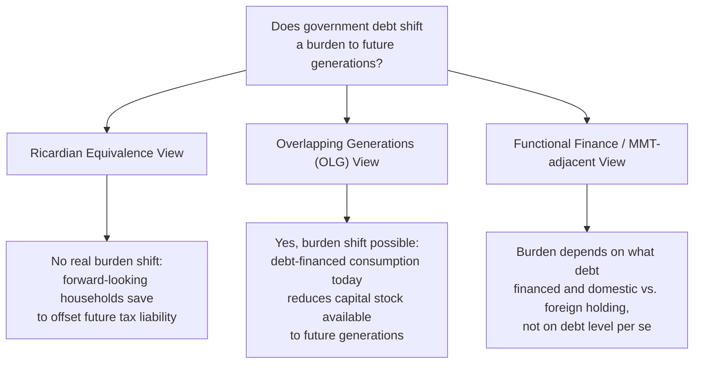

## Public Debt and Intergenerational Equity

### Overview

Public debt analysis examines how government borrowing shifts fiscal burdens across time and across generations, and under what conditions such shifting represents a genuine economic burden versus a pure accounting transfer. This topic sits at the intersection of macroeconomic public finance and normative questions about fairness between current and future taxpayers.

### The Basic Government Budget Constraint

**Key Points**

- In any period, government spending $G$ must be financed by taxes $T$, borrowing (change in debt $\Delta D$), or money creation (typically set aside in real-economy models).

$$G_t = T_t + \Delta D_t$$

- The stock of debt evolves according to:

$$D_{t+1} = D_t (1 + r) + G_t - T_t$$

where $r$ is the interest rate on government debt. A **primary deficit** occurs when $G_t > T_t$ (excluding interest payments); a persistent primary deficit combined with $r$ above the growth rate of the tax base causes the debt-to-GDP ratio to grow explosively absent future adjustment.

#### Debt Sustainability Condition

A commonly used sustainability benchmark examines the relationship between the interest rate $r$ and the economy's growth rate $g$:

$$\frac{D_{t+1}}{Y_{t+1}} \approx \frac{D_t}{Y_t} \cdot \frac{1+r}{1+g} - \frac{PB_t}{Y_t}$$

where $PB_t$ is the primary balance (surplus if positive) and $Y_t$ is GDP.

- If $r < g$, the debt-to-GDP ratio can stabilize or fall even with modest primary deficits, since GDP growth outpaces the debt's interest accumulation.
- If $r > g$, sustained primary surpluses are required to prevent the debt-to-GDP ratio from rising without bound.

**[Inference]** Whether $r$ is expected to remain below or above $g$ over long horizons is a matter of ongoing empirical and theoretical debate among economists, sensitive to assumptions about future growth, monetary policy, and global capital markets; it is not a settled parameter that can be taken as a stable long-run fact.

### Does Public Debt Burden Future Generations? Competing Views

This is the central normative and analytical question in the topic, and economic theory offers several distinct — and partially conflicting — frameworks.

#### Ricardian Equivalence

**Key Points**

- Proposed by David Ricardo and formalized by Robert Barro: if households are fully forward-looking, have infinite (or dynastic, bequest-linked) planning horizons, and capital markets are perfect, then a debt-financed tax cut today has **no effect on aggregate consumption or intergenerational welfare**, because rational households anticipate the future tax liability implied by the debt and increase private saving by an offsetting amount.
- Under strict Ricardian equivalence, debt and taxes are equivalent methods of financing a given path of government spending — the *timing* of taxation is irrelevant, only the *path of spending* matters.

**Conditions required for Ricardian equivalence to hold exactly:**

- Households have infinite horizons or operate as if connected to future generations via altruistic bequests (parents' utility depends on children's welfare).
- No borrowing constraints (households can borrow against future income as freely as the government).
- Taxes are lump-sum (non-distortionary).
- No uncertainty about future tax incidence (households know who will pay).

**[Inference]** Empirical tests of Ricardian equivalence have produced mixed results; most public finance economists regard *strict* Ricardian equivalence as a useful theoretical benchmark rather than an accurate description of real household behavior, since several of its required conditions (particularly the absence of borrowing constraints and the assumption of finite/non-altruistic household horizons) are commonly violated in practice — implying debt-financed policy likely has *some* real effect on aggregate consumption and intergenerational distribution, though the empirical magnitude remains actively debated.

#### Overlapping Generations (OLG) Framework

**Key Points**

- In the Diamond OLG model, distinct generations coexist (e.g., "young" workers and "old" retirees) with finite lifespans and no operative bequest motive linking them.
- In this framework, debt-financed government spending or transfers **can** shift real resources across generations: if debt-financed consumption or transfers to a current generation reduce national saving, this can crowd out capital accumulation, leaving a smaller capital stock — and correspondingly lower wages and output — for future generations.
- This is the standard theoretical basis for the claim that "debt burdens future generations": not because future taxpayers must literally repay bondholders (which is a transfer *within* the future generation, from taxpayers to bondholders, largely a wash if debt is domestically held), but because reduced national saving today can reduce the capital stock inherited by tomorrow.

#### Domestic vs. Externally Held Debt

**Key Points**

- The economic character of "future generations paying for today's debt" differs substantially depending on whether debt is held domestically or by foreign creditors.
- **Domestically held debt**: future interest/principal payments are a transfer from future domestic taxpayers to future domestic bondholders (who may be the same generation, or their heirs) — a distributional issue *within* the future generation, not a net drain of resources from the country as a whole (net national burden is limited primarily to the crowding-out/capital-stock channel and the deadweight loss of future distortionary taxation used to service the debt).
- **Externally held debt**: future interest/principal payments represent a real transfer of resources out of the domestic economy to foreign creditors — a more direct and unambiguous burden on future domestic residents as a group.

| Debt Holder | Nature of Future Burden |
| --- | --- |
| Domestic households | Internal transfer (taxpayers → bondholders); net burden mainly via crowding-out and tax distortion costs |
| Foreign creditors | Real resource outflow; more directly reduces future domestic consumption possibilities |

### What the Debt Was Used to Finance Matters

**Key Points**

- The "golden rule of public finance" perspective distinguishes between debt used to finance **current consumption** versus debt used to finance **productive public investment** (infrastructure, education, R&D) that raises future productive capacity.
- Debt-financed investment that generates a future return exceeding the interest cost can leave future generations *better off* even while inheriting the debt, since they also inherit the productive asset it financed.
- **[Inference]** In practice, distinguishing "investment" spending from "consumption" spending in government budgets is often contested and can be subject to political relabeling incentives, which limits the direct applicability of a strict golden-rule budgeting framework as a hard constraint, even though the underlying economic distinction (does the spending build future productive capacity, or not) remains conceptually sound.

### Tax Smoothing Rationale for Debt

**Key Points**

- Beyond intergenerational distribution, a distinct efficiency-based rationale for debt (associated with Robert Barro's tax-smoothing theory) holds that since the excess burden of taxation rises with the *square* of the tax rate, it is more efficient to finance temporary spending spikes (wars, recessions) with debt and spread the resulting tax burden evenly over time, rather than sharply raising tax rates temporarily.

$$\text{Excess burden} \propto t^2$$

Since $(t_1)^2 + (t_2)^2 > 2 \cdot \bar{t}^2$ when $t_1 \neq t_2$ (by convexity), smoothing the tax rate across periods at a constant $\bar{t}$ minimizes total excess burden for a given total revenue requirement across time — providing an efficiency (not just intergenerational fairness) rationale for debt finance of temporary spending needs.

### Generational Accounting

**Key Points**

- **Generational accounting** is a methodology (developed by Auerbach, Gokhale, and Kotlikoff) that attempts to measure the net lifetime fiscal burden (present value of taxes paid minus transfers received) facing different generations under current policy, including unfunded future obligations (e.g., pension and health program promises) not captured by conventional debt statistics.
- This approach highlights that conventional government debt figures can substantially understate the true intergenerational fiscal burden when large unfunded entitlement promises exist, since these are economically similar to debt (a promise to pay in the future) but are not counted as debt on standard government balance sheets.
- **[Inference]** Generational accounting estimates are highly sensitive to the discount rate and demographic/economic growth assumptions used, and different studies applying the methodology to the same country can produce materially different quantitative conclusions about the size of the intergenerational imbalance, even while agreeing on its qualitative direction.

### Policy Levers Affecting Intergenerational Distribution

| Lever | Effect on Intergenerational Distribution |
| --- | --- |
| Debt-financed tax cuts (non-Ricardian setting) | Shifts burden toward future generations via reduced national saving/capital stock |
| Debt-financed public investment | Ambiguous/potentially favorable if return exceeds interest cost |
| Pre-funding entitlement programs (raising current contributions) | Shifts burden toward current generation, reduces future imbalance |
| Raising the retirement age / benefit formula adjustments | Shifts burden of demographic transition toward current near-retirees or future retirees, depending on design |
| Explicit debt reduction (running primary surpluses) | Shifts burden toward current taxpayers, reduces future debt service burden |

### Related Topics

- Ricardian equivalence: theory and empirical tests
- Overlapping generations (OLG) models in macroeconomics
- Debt sustainability analysis and the $r$ vs. $g$ debate
- Tax smoothing and optimal debt issuance over the business cycle
- Generational accounting methodology and criticisms
- Sovereign debt crises and default risk
- Unfunded entitlement liabilities (pensions, healthcare)
- Golden rule of public finance and capital budgeting for governments