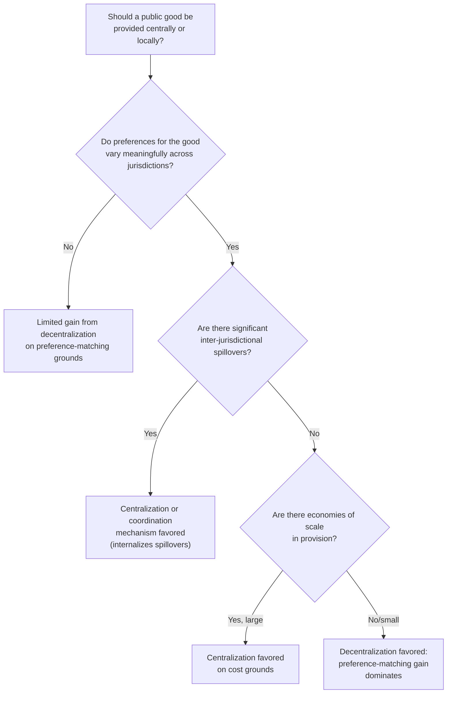
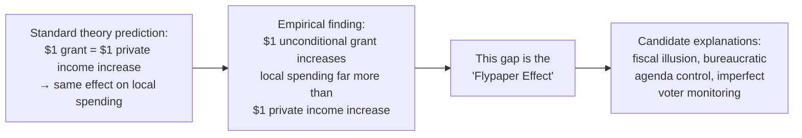

## Fiscal Federalism and Local Public Finance

### Overview

Fiscal federalism examines how public sector functions — taxation, spending, and regulation — should be allocated across levels of government (national, state/provincial, local), and how these levels interact fiscally through mechanisms like intergovernmental transfers and tax competition. Local public finance applies these principles specifically to sub-national jurisdictions, incorporating the distinctive features of household and firm mobility across localities.

### The Theory of Fiscal Decentralization

**Key Points**

- The foundational question is: which government functions are best assigned to which level, and why?
- The classical framework, associated with Wallace Oates's **Decentralization Theorem**, holds that in the absence of cost savings from centralized provision or significant inter-jurisdictional spillovers, welfare is maximized (or at least not reduced) by having each jurisdiction provide the level of a public good that matches the preferences of its own residents, rather than a uniform national level.

#### The Decentralization Theorem: Formal Intuition

If residents of different jurisdictions have heterogeneous preferences for a local public good, and a uniform national provision level $\bar{g}$ must apply to all jurisdictions under centralization, welfare loss occurs whenever $\bar{g}$ deviates from a jurisdiction's preferred level $g_i^*$. Decentralized provision allows each jurisdiction to set $g_i = g_i^*$, eliminating this preference-mismatch loss — provided there are no spillovers or scale economies that would favor centralization instead.

#### Musgrave's Three Functions and Assignment to Government Levels

Richard Musgrave's classic tripartite division of government functions maps unevenly onto centralization/decentralization:

| Function | Best-Suited Level | Rationale |
| --- | --- | --- |
| Stabilization (macroeconomic policy) | National/Central | Local governments cannot run independent monetary policy; fiscal stimulus by a single locality "leaks" heavily to other jurisdictions via trade, limiting local effectiveness |
| Distribution (redistributive transfers) | National/Central | Generous local redistribution invites the mobility problem (below): redistributive jurisdictions attract low-income in-migrants and drive out high-income tax base, undermining the policy |
| Allocation (public goods provision) | Can be efficiently decentralized | Local preferences vary; local governments can match provision to local demand (Tiebout logic, below) |

**[Inference]** This assignment framework is a normative benchmark from public finance theory; actual constitutional and institutional arrangements across countries diverge from it in practice for historical, political, and administrative-capacity reasons.

### The Tiebout Model: "Voting with Your Feet"

**Key Points**

- Charles Tiebout (1956) proposed that if there are many local jurisdictions offering different bundles of local public goods and corresponding tax/property price levels, and households are mobile, then households will sort themselves into jurisdictions matching their preferences — analogous to consumers choosing among differentiated products in a market.
- Under idealized conditions, this sorting process can achieve an efficient allocation of local public goods **without** requiring the government to elicit true preferences directly (solving the free-rider problem that plagues national public goods provision), since residential choice itself reveals preferences.

#### Conditions Required for the Tiebout Mechanism to Work

- **Full mobility**: households can costlessly move to their preferred jurisdiction.
- **Perfect information**: households know the tax/service bundle offered by every jurisdiction.
- **Many jurisdictions**: enough variety of tax/service bundles to allow close preference matching.
- **No inter-jurisdictional spillovers**: benefits of local public goods are contained within the jurisdiction.
- **No scale economies in provision**: average cost of provision does not fall with jurisdiction size (otherwise there is pressure toward fewer, larger jurisdictions).
- A financing mechanism (often modeled as a **head tax** or, more realistically, property taxation) that ties the cost of local services to residency.

**[Inference]** These conditions are demanding and rarely fully satisfied in reality (moving costs are substantial, information about local service quality is imperfect, and zoning/land-use regulation itself is often used to engineer sorting) — the Tiebout model is generally treated in the field as a stylized efficiency benchmark and organizing framework for empirical work (e.g., property value capitalization studies) rather than a literal description of observed household mobility.

### Property Taxation as the Local Financing Instrument

#### The "Benefit Tax" View vs. the "Capital Tax" View

**Key Points**

- Two competing theoretical views of the economic incidence of local property taxes:
  - **Benefit view**: under Tiebout-style sorting, the property tax functions like a benefit tax/user charge for local public services, capitalized into property values — those who consume more local services (via larger/higher-value property) pay proportionally more, and the tax is essentially non-distortionary in the same way a market price is.
  - **Capital tax (traditional) view**: the property tax is a tax on capital (structures) that reduces the after-tax return to capital broadly, with incidence falling on capital owners generally (not just local residents), since capital is mobile across jurisdictions and the tax reduces the aggregate return to capital investment nationally.
- **[Inference]** Most modern treatments in the field regard these two views as applying to different components of the tax rather than being strictly competing: the portion of the property tax that varies *above* the jurisdiction-average rate (reflecting above-average local service provision) behaves more like a benefit tax capitalized into local land/property values, while the *average* national property tax rate behaves more like a general capital tax with broader incidence — this synthesis is sometimes called the "new view" of property tax incidence.

#### Tax Capitalization

**Key Points**

- **Capitalization** refers to the process by which the discounted present value of future local tax liabilities and service benefits becomes embedded in current property prices.
- If a jurisdiction raises its property tax rate without a corresponding increase in service quality, theory (and considerable empirical evidence) suggests property values in that jurisdiction should fall, since a buyer's willingness to pay reflects the after-tax, after-service value of residing there.

$$\Delta V \approx -\frac{\Delta T}{r}$$

where $\Delta V$ is the change in property value, $\Delta T$ is the change in the annual net tax burden (tax minus incremental service value), and $r$ is the discount rate — a standard perpetuity capitalization approximation.

### Inter-Jurisdictional Competition and Its Consequences

#### Tax Competition

**Key Points**

- When capital and, to a lesser extent, high-income mobile residents can relocate across jurisdictions, local governments face pressure to keep tax rates competitive to retain (or attract) tax base, since capital/high earners can exit a high-tax jurisdiction for a lower-tax one.
- This can lead to a **"race to the bottom"** concern: jurisdictions may underprovide public goods and under-tax mobile capital relative to the socially efficient level, since each jurisdiction does not internalize that its tax cuts attract base *away from* other jurisdictions (a fiscal externality).
- **[Inference]** The empirical magnitude and welfare implications of local/regional tax competition are actively debated; some public finance economists view competitive pressure as a beneficial discipline on government efficiency (analogous to market competition disciplining firms), while others emphasize the race-to-the-bottom underprovision concern — the balance of evidence appears to depend substantially on the specific tax base and jurisdictional context studied.

#### Fiscal Externalities and Spillovers

- **Benefit spillovers**: when a jurisdiction's public good (e.g., a regional park, a local university) benefits non-residents who do not contribute to its financing, the providing jurisdiction tends to underprovide relative to the socially efficient level (a free-rider problem across jurisdictions).
- **Corrective mechanism**: matching grants from a higher level of government (see below) can internalize these spillovers by lowering the effective local cost of provision in proportion to the spillover benefit.

### Intergovernmental Transfers (Grants)

**Key Points**

- Transfers from central/state governments to local governments are used to address vertical fiscal imbalances (mismatches between a government level's revenue-raising capacity and expenditure responsibilities), horizontal equity (differences in fiscal capacity across localities), and spillover correction.

| Grant Type | Structure | Primary Purpose |
| --- | --- | --- |
| Unconditional (block) grant | Lump-sum transfer, no spending restriction | General revenue support, reduces vertical imbalance |
| Conditional non-matching grant | Fixed transfer, must be spent on a specified category | Encourages spending on a category without price distortion, subject to a "flypaper" effect (below) |
| Conditional matching grant | Central government matches a fraction of local spending on a category (e.g., $1 for every $2 the locality spends) | Lowers the effective local price of the subsidized good, directly addressing spillovers by internalizing external benefit |
| Equalization grant | Formula-based transfer favoring lower-fiscal-capacity jurisdictions | Horizontal equity across jurisdictions with different tax bases |

#### The Flypaper Effect

**Key Points**

- Standard consumer theory predicts that an unconditional grant of size $X$ to a local government should have the same effect on local public spending as an equivalent increase of $X$ in local residents' private income (since both simply relax the local budget constraint by the same amount) — money is fungible.
- Empirically, however, unconditional grants are consistently found to increase local public spending by substantially more than an equivalent increase in local private income would — "money sticks where it hits." This anomaly is termed the **flypaper effect**.
- **[Inference]** Several explanations have been proposed for the flypaper effect (fiscal illusion among voters about the true cost of grant-funded spending, agenda-setting power of local bureaucrats/officials who prefer larger budgets, imperfect voter monitoring), but there is no full consensus in the literature on which mechanism dominates, and the phenomenon's robustness across different grant programs and countries remains an active empirical research area.

### Local Public Goods and the Free-Rider Problem Within Jurisdictions

**Key Points**

- Even within a single local jurisdiction, standard public goods theory applies: local public goods (parks, local roads, local policing to the extent non-excludable) are subject to free-riding in preference revelation, motivating collective (governmental) rather than purely voluntary/market provision.
- The **Samuelson condition** for efficient public goods provision — that the sum of marginal rates of substitution across all consumers equal the marginal cost of provision — applies at the local level, with the Tiebout mechanism offering one (imperfect) channel for approximating this condition without direct preference elicitation.

$$\sum_{i=1}^{n} MRS_i = MC$$

### Fiscal Federalism Design Trade-offs Summary

| Design Choice | Efficiency Consideration | Equity Consideration |
| --- | --- | --- |
| More decentralization | Better preference-matching (Tiebout), but risk of spillover underprovision and race-to-the-bottom | Can exacerbate horizontal inequity across jurisdictions with different tax bases |
| More centralization | Internalizes spillovers, exploits scale economies | Can improve horizontal equity, but sacrifices local preference-matching |
| Matching grants | Directly corrects spillover-driven underprovision | Favors jurisdictions with higher local spending capacity to begin with |
| Equalization grants | Can distort incentives if formula is poorly designed (e.g., penalizing local tax effort) | Directly targets horizontal equity across jurisdictions |

### Related Topics

- Tiebout sorting: empirical tests and capitalization studies
- Property tax incidence: benefit view vs. new view
- Optimal design of intergovernmental grant formulas
- Fiscal externalities and tax competition models (Zodrow-Mieszkowski)
- Local public goods and club theory (Buchanan)
- School finance equalization and local funding disparities
- Metropolitan fragmentation and local government consolidation debates
- Yardstick competition among local governments