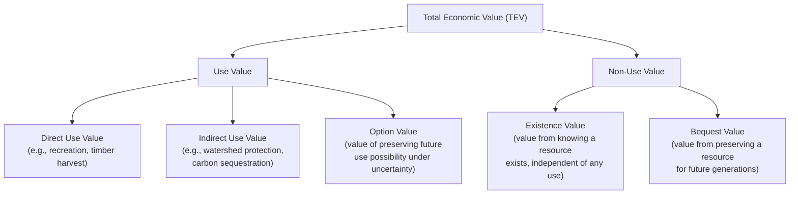

## Valuing Environmental Goods and Externalities

### Overview

Environmental goods (clean air, biodiversity, scenic landscapes) and externalities (pollution, congestion) typically lack market prices because they are not directly bought and sold. Valuing them is essential for cost-benefit analysis of environmental policy, yet requires specialized non-market valuation methods, since standard revealed-price approaches are unavailable. This topic covers the taxonomy of environmental values and the primary methodologies economists use to estimate them.

### The Problem: Why Environmental Goods Lack Market Prices

**Key Points**

- Many environmental goods are **public goods** (non-excludable, non-rivalrous) or possess strong **externality** characteristics, meaning no individual has an incentive to reveal their true willingness to pay through ordinary market transactions.
- Absent a price signal, environmental goods are systematically at risk of being under-provided (if a public good) or over-produced as an externality's damage cost (if a "bad," like pollution) unless deliberately priced or regulated.

### Taxonomy of Total Economic Value

**Key Points**

- A central conceptual framework in environmental economics decomposes the total economic value (TEV) of an environmental resource into **use values** and **non-use values**, since standard market valuation captures only a subset of these components.

| Value Category | Definition | Example |
| --- | --- | --- |
| Direct use value | Value from direct physical interaction/consumption | Fishing, hiking, timber extraction |
| Indirect use value | Value from ecosystem services supporting other activities | Wetlands filtering water, forests sequestering carbon |
| Option value | Value of retaining the choice to use a resource in the future, given uncertainty about future demand or supply | Preserving a wilderness area that may become valuable for future recreation or medicine |
| Existence value | Value derived purely from knowledge that a resource exists | Willingness to pay to know a species is not extinct, even absent any intention to view it |
| Bequest value | Value derived from preserving a resource for future generations | Willingness to pay to preserve a wilderness area for one's descendants |

**[Inference]** Existence and bequest values (jointly sometimes called "non-use" or "passive use" values) are conceptually well established in the literature but are also the most methodologically contested to measure empirically, since by definition they leave no behavioral trace (no observed trip, no observed purchase) — this is a key reason stated-preference methods (below) were developed, despite their own limitations.

### Revealed Preference Methods

Revealed preference methods infer the value of an environmental good from observed market behavior in a *related* market, exploiting the fact that the environmental good, while itself unpriced, affects decisions in markets that are priced.

#### Hedonic Pricing Method

**Key Points**

- Exploits variation in the price of a marketed good (typically housing) that is a **bundle** of characteristics, some of which include environmental attributes (air quality, proximity to a hazardous site, scenic view, noise level).
- By regressing property prices on a vector of structural, locational, and environmental characteristics, the implicit price of the environmental attribute can be estimated as the coefficient on that attribute, holding other characteristics constant.

$$P = \beta_0 + \beta_1 X_{structural} + \beta_2 X_{locational} + \beta_3 X_{environmental} + \epsilon$$

The estimated $\beta_3$ represents the **marginal implicit price** of the environmental attribute — the amount an additional unit of it (e.g., one fewer unit of an air pollutant) is capitalized into property values.

**Example**

If a hedonic regression finds that a one-unit increase in a fine particulate matter (PM2.5) concentration reduces average home values by $3,000 in a given housing market, this implicit price can be used to estimate the aggregate value of an air quality improvement policy across all affected homes in that market, all else equal.

**Key limitations:**

- Requires that housing markets are in equilibrium and that households have full information about and can adjust their location choice freely with respect to the environmental attribute (a demanding assumption, similar to the mobility/information conditions underlying the Tiebout model).
- Only captures values that are capitalized into the priced good (housing) — it will miss non-use values held by individuals who do not live near the resource (e.g., someone with existence value for a wilderness area they never expect to visit or live near).
- **[Inference]** Hedonic estimates can be sensitive to model specification (which characteristics are included, functional form assumed), and omitted-variable bias is a persistent methodological concern if unobserved neighborhood characteristics are correlated with the environmental attribute of interest.

#### Travel Cost Method

**Key Points**

- Used primarily to value recreational sites (parks, lakes, hiking trails) by treating the time and money cost of traveling to the site as an implicit "price" of the recreational experience, then estimating a demand curve for visits as a function of this travel cost.
- By observing how visitation rates vary with travel cost (which naturally varies since different visitors travel from different distances), a demand function for site visits can be estimated, and consumer surplus computed as a measure of the recreational use value of the site.

$$V = f(TC, X)$$

where $V$ is number of visits, $TC$ is travel cost (including the opportunity cost of time), and $X$ is a vector of other demand determinants (income, substitute site availability, demographics).

**Key limitations:**

- Captures only **direct use value** (recreational visits) — entirely misses non-use values.
- Valuing travel time (a key input cost) is methodologically contested — is it valued at the visitor's full wage rate, a fraction of it, or zero if travel is itself enjoyable (a "joint production" problem when travel is part of the recreational experience rather than a pure cost)?
- **[Inference]** Multi-purpose trips (where a visitor stops at several sites on one journey) complicate the attribution of travel cost to any single site, and various apportionment methods used in the literature can produce materially different value estimates for the same site.

### Stated Preference Methods

Stated preference methods directly ask survey respondents about their valuation of an environmental good through hypothetical (but carefully structured) scenarios, since revealed preference methods cannot capture non-use values.

#### Contingent Valuation Method (CVM)

**Key Points**

- Presents survey respondents with a hypothetical scenario describing a specific environmental change (e.g., restoring a wetland, preventing a species extinction) and elicits their willingness to pay (WTP) for the change, or willingness to accept (WTA) compensation for foregoing it.
- **Elicitation formats** include open-ended WTP questions, payment card formats, and dichotomous choice (referendum-style: "would you be willing to pay $X?" with $X$ randomized across respondents) — the latter is generally regarded as less prone to certain biases and more incentive-compatible.

**Example**

A CVM study asking "Would you be willing to pay $50 per year in additional taxes to fund a program that would prevent [a specific wetland] from being drained for development?" administered to a random sample, with the dollar amount varied across respondent subgroups, allows estimation of a WTP distribution via the proportion answering "yes" at each price point.

**Key methodological concerns:**

- **Hypothetical bias**: since no real payment occurs, respondents may state a different WTP than they would reveal in an actual transaction (typically found to overstate true WTP, though the direction and magnitude vary across studies).
- **Strategic bias**: respondents may misrepresent their true valuation if they believe doing so will influence the policy outcome or their actual payment obligation.
- **Embedding effect / scope insensitivity**: stated WTP for a subset of an environmental good (e.g., saving one lake) is sometimes found not to differ meaningfully from WTP for the larger whole (e.g., saving all lakes in a region) — a finding inconsistent with standard consumer theory, in which value should generally scale with quantity/scope.
- **WTP-WTA disparity**: empirically, elicited willingness to accept compensation for a loss is often substantially larger than willingness to pay to prevent the same loss, a finding related to loss aversion in behavioral economics and in tension with the standard theoretical prediction (under weak income effects) that WTP and WTA should be approximately equal for small changes.

**[Inference]** These methodological concerns have been debated extensively since a prominent 1993 NOAA panel (convened partly in response to the Exxon Valdez oil spill litigation) evaluated CVM's reliability for natural resource damage assessment; the panel's recommendations (e.g., use of dichotomous choice formats, conservative design features) are widely cited as a methodological benchmark, but the underlying debate over CVM's validity for measuring true economic value — particularly passive-use value — has not been fully resolved in the field and CVM remains among the more contested valuation methods in applied environmental economics.

#### Choice Experiments (Discrete Choice / Conjoint Analysis)

**Key Points**

- An alternative stated-preference approach in which respondents choose among several hypothetical alternatives (e.g., different policy packages), each described by a bundle of attributes (cost, environmental outcome levels, other features), across repeated choice tasks.
- By varying attribute levels systematically across choice tasks (an experimental design), researchers can estimate the implicit marginal value of each individual attribute, including the cost attribute, from which an implicit WTP for other attributes can be derived (WTP for attribute $=$ ratio of that attribute's coefficient to the cost coefficient in a discrete choice model).

$$WTP_k = -\frac{\beta_k}{\beta_{cost}}$$

**[Inference]** Choice experiments are often viewed as offering some advantages over single-scenario contingent valuation (e.g., reduced scope insensitivity, since attribute levels vary explicitly across tasks, and richer attribute-level information), but they share several of CVM's core concerns (hypothetical bias, respondent cognitive burden from complex choice tasks) and are not universally regarded as fully resolving them.

### Benefit Transfer

**Key Points**

- Given the cost and time required for primary valuation studies, policymakers frequently use **benefit transfer**: applying value estimates from an existing study (the "study site") to a new policy context (the "policy site") with adjustment for differences in population characteristics, income, and site attributes.
- **Key validity concern**: benefit transfer accuracy depends heavily on the similarity between the study site and policy site; transferring values across substantially different contexts (e.g., different countries, different income levels, different ecosystem types) introduces potentially large and difficult-to-quantify error.

### Valuing Externalities: Marginal Damage and the Efficient Level of Pollution

**Key Points**

- Once a marginal value/damage estimate is obtained (via any of the above methods), it can be used to characterize the socially efficient level of an externality-generating activity, following the standard Pigouvian framework: the efficient level occurs where marginal private benefit equals marginal social cost (private cost plus marginal external damage).

$$MPB(Q) = MPC(Q) + MD(Q)$$

**(svg_diagram)** Standard graphical representation of the efficient pollution level relative to the unregulated market outcome.

<svg xmlns="http://www.w3.org/2000/svg" viewBox="0 0 640 420" font-family="sans-serif">
<text x="320" y="24" text-anchor="middle" font-size="16" font-weight="bold">Efficient Level of Externality-Generating Output (svg_diagram)</text>
<line x1="80" y1="360" x2="580" y2="360" stroke="black" stroke-width="2" />
<line x1="80" y1="360" x2="80" y2="50" stroke="black" stroke-width="2" />
<text x="590" y="365" font-size="13">Q</text>
<text x="65" y="45" font-size="13">$</text>

<line x1="120" y1="80" x2="540" y2="320" stroke="#1f77b4" stroke-width="2" />
<text x="545" y="325" font-size="12" fill="#1f77b4">MPB = MSB</text>

<line x1="120" y1="320" x2="540" y2="140" stroke="#2ca02c" stroke-width="2" />
<text x="545" y="140" font-size="12" fill="#2ca02c">MPC</text>

<line x1="120" y1="360" x2="480" y2="90" stroke="#d62728" stroke-width="2" />
<text x="440" y="95" font-size="12" fill="#d62728">MSC = MPC + MD</text>

<circle cx="400" cy="210" r="4" fill="black" />
<text x="405" y="200" font-size="12">Qm (unregulated)</text>
<line x1="400" y1="210" x2="400" y2="360" stroke="black" stroke-width="1" stroke-dasharray="2,2" />

<circle cx="300" cy="240" r="4" fill="black" />
<text x="225" y="255" font-size="12">Q* (efficient)</text>
<line x1="300" y1="240" x2="300" y2="360" stroke="black" stroke-width="1" stroke-dasharray="2,2" />

<polygon points="300,240 400,210 400,275" fill="orange" fill-opacity="0.4" stroke="orange" stroke-width="1" />
<text x="335" y="245" font-size="11" fill="#8a4b00">DWL from overproduction</text>
</svg>

### Comparison of Valuation Methods

| Method | Value Types Captured | Data Requirement | Key Weakness |
| --- | --- | --- | --- |
| Hedonic pricing | Use value (capitalized in housing/wages) | Housing sale/rental data, environmental attribute data | Misses non-use value; requires market equilibrium and mobility |
| Travel cost | Direct recreational use value | Visitor survey/travel data | Misses non-use value; travel time valuation ambiguity |
| Contingent valuation | Use and non-use value (in principle) | Original survey design and administration | Hypothetical/strategic bias; scope insensitivity |
| Choice experiments | Use and non-use value (in principle) | Original survey design with experimental attribute variation | Hypothetical bias; respondent cognitive burden |
| Benefit transfer | Whatever the source study captured | Existing study data, no new primary collection | Context-transfer validity |

### Related Topics

- Pigouvian taxation and the social cost of carbon
- Cost-benefit analysis and discount rate selection for long-horizon environmental projects
- Coase theorem and property-rights approaches to externalities
- Cap-and-trade and market-based environmental regulation
- Natural resource damage assessment and legal applications of CVM
- Ecosystem services valuation frameworks
- Behavioral anomalies in environmental valuation (WTP-WTA gap, loss aversion)
- Green national accounting and adjusted net savings measures