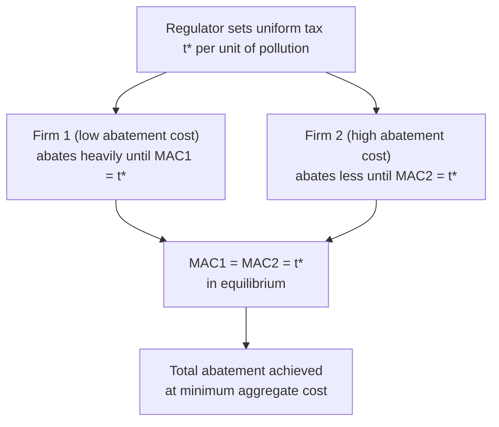
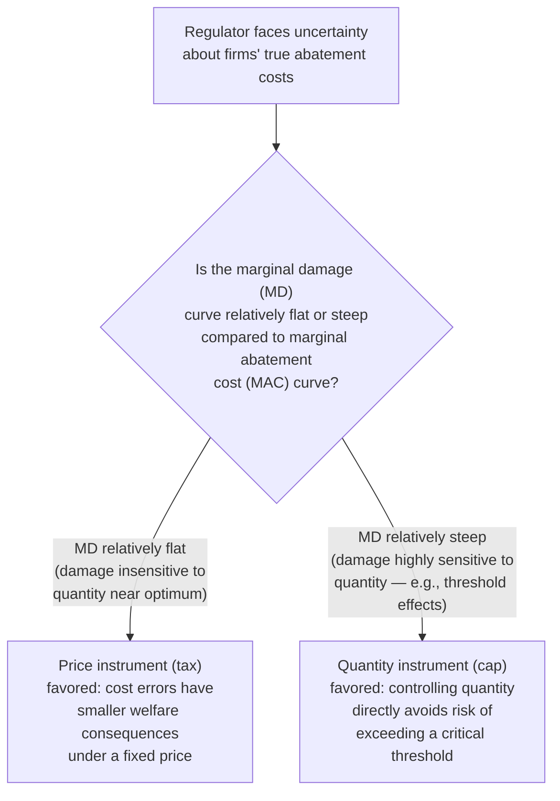

## Pigouvian Taxes and Cap-and-Trade Systems

### Overview

Pigouvian taxes and cap-and-trade systems are the two dominant market-based instruments for correcting externalities, particularly environmental pollution. Both aim to internalize external costs into private decision-making, but they differ fundamentally in which variable (price or quantity) the regulator fixes directly, with significant implications for efficiency under uncertainty, revenue generation, and political economy.

### The Externality Problem: Why Intervention Is Needed

**Key Points**

- In an unregulated market with a negative production or consumption externality, private agents equate marginal private benefit (MPB) to marginal private cost (MPC), ignoring the marginal external damage (MD) imposed on third parties.
- This produces an inefficiently high quantity of the externality-generating activity: $Q_{market} > Q^*$, where $Q^*$ is the socially efficient quantity satisfying $MPB = MPC + MD$.

### Pigouvian Taxes

#### Core Mechanism

**Key Points**

- Named for Arthur Pigou, a Pigouvian tax sets a per-unit tax $t^*$ on the externality-generating activity exactly equal to the marginal external damage evaluated at the efficient quantity $Q^*$:

$$t^* = MD(Q^*)$$

- This tax raises the effective private marginal cost faced by the polluter to $MPC + t^*$, inducing the firm to voluntarily reduce output/emissions to $Q^*$, since it now internalizes the externality through the tax price signal.
- Critically, the regulator does **not** need to know each individual firm's abatement cost function to achieve an efficient outcome — the tax provides a uniform price signal, and firms with different abatement costs will each independently choose their own cost-minimizing response.

#### Static Efficiency Property: Cost-Effectiveness Across Heterogeneous Firms

**Key Points**

- When multiple firms have different marginal abatement cost (MAC) curves, a uniform Pigouvian tax achieves the cost-effective allocation of abatement automatically: each firm abates up to the point where its own marginal abatement cost equals the tax rate, $MAC_i = t^*$ for all firms $i$.
- Since all firms equate their MAC to the same tax rate, all firms' marginal abatement costs are equalized across firms in equilibrium — this is precisely the condition for total abatement to be achieved at minimum aggregate cost (any other allocation of the same total abatement across firms would cost more in aggregate, since it's possible to reduce total cost by shifting abatement from a high-MAC firm to a low-MAC firm).

#### Worked Example

**Example**

Suppose marginal external damage is linear: $MD(Q) = 2Q$, and the unregulated market equilibrium is at $Q_{market} = 100$, while the efficient quantity is $Q^* = 60$.

$$t^* = MD(Q^*) = 2(60) = 120$$

A tax of $120 per unit induces firms to reduce output from 100 to 60 units, achieving the efficient outcome, and additionally raises tax revenue of $120 \times 60 = \$7{,}200$, which can be used to fund other government spending or reduce other distortionary taxes (the "double dividend" possibility, discussed below).

### Cap-and-Trade (Tradable Permit) Systems

#### Core Mechanism

**Key Points**

- Under cap-and-trade, the regulator sets a fixed aggregate quantity limit (the "cap") on total emissions, typically equal to the efficient quantity $Q^*$ (or a chosen policy target), and issues tradable permits summing to that cap.
- Firms must hold a permit for each unit of pollution emitted; firms with low abatement costs will find it cheaper to abate and sell surplus permits, while firms with high abatement costs will find it cheaper to buy additional permits rather than abate — a competitive permit market establishes an equilibrium permit price $p^*$.
- In equilibrium, this permit price plays the same allocative role as a Pigouvian tax: every firm abates until its own $MAC_i = p^*$, again equalizing marginal abatement costs across firms and achieving the same cost-effective allocation of abatement as a tax, for a given total abatement level.

#### Permit Allocation Methods

| Allocation Method | Mechanism | Distributional/Revenue Implication |
| --- | --- | --- |
| Auctioning | Firms purchase permits in a government-run auction | Generates government revenue, similar to a tax |
| Free allocation (grandfathering) | Permits distributed to firms gratis, often based on historical emissions | No direct government revenue; transfers scarcity rents to incumbent firms |
| Hybrid | Combination of auctioned and freely allocated permits | Blends revenue generation with transitional support for regulated industries |

**Key Points**

- Under the **Coase theorem** logic (assuming negligible transaction costs), the initial allocation of permits does not affect the efficiency of the final abatement outcome — the same $Q^*$ and cost-minimizing distribution of abatement across firms results regardless of whether permits are auctioned or given away freely, since firms will trade to the efficient allocation either way.
- The initial allocation **does**, however, have significant distributional consequences: free allocation transfers substantial economic rents to permit recipients (historically often incumbent polluting firms), while auctioning captures this value as public revenue.

### Price Instrument vs. Quantity Instrument: The Weitzman Analysis

**Key Points**

- Under conditions of full information about both marginal abatement costs and marginal damages, a Pigouvian tax set at $t^* = MD(Q^*)$ and a cap set at $Q^*$ produce **identical** outcomes (same quantity, same implicit/explicit price).
- Martin Weitzman's seminal 1974 analysis showed that under **uncertainty** about firms' abatement costs (a near-universal real-world condition, since regulators rarely know firms' true cost functions with precision), the choice between a price instrument (tax) and a quantity instrument (cap) is no longer neutral — the relative slopes of the marginal benefit (damage) and marginal cost (abatement cost) curves determine which instrument produces smaller expected welfare loss when costs turn out different than anticipated.

#### Intuition and Formal Condition

- If marginal abatement costs turn out **higher** than expected:
  - Under a **tax** (fixed price), firms simply pay more in tax and abate somewhat less than planned, but the *quantity* outcome adjusts — deviating from $Q^*$ by an amount determined by the cost surprise.
  - Under a **cap** (fixed quantity), firms are forced to achieve the same abatement regardless of the cost surprise, potentially at a much higher realized cost than anticipated — the *cost* outcome bears the full brunt of the surprise.
- Weitzman's formal result: the tax is preferred (produces lower expected deadweight loss from the cost uncertainty) when the **slope of the marginal damage curve is flatter than the slope of the marginal abatement cost curve** ($|MD'| < |MAC'|$); the cap is preferred when the reverse holds.
- **Intuition for stock pollutants** (e.g., greenhouse gases, where damage depends on cumulative atmospheric concentration built up over long periods): the marginal damage curve is typically very flat in the short run (one year's emissions barely change the damage from the existing stock), which is a commonly cited argument in the literature favoring a carbon tax over a rigid short-term emissions cap for this class of pollutant. **[Inference]** This is a widely cited theoretical implication of the Weitzman framework rather than a universally agreed policy conclusion; real-world carbon policy design also weighs other considerations (political feasibility, revenue use, international coordination, interaction with existing cap-and-trade systems) not captured in the basic price-versus-quantity model.

### Hybrid Instruments

**Key Points**

- Recognizing the price-vs-quantity trade-off, several hybrid mechanisms have been developed to capture benefits of both approaches:
  - **Price ceiling ("safety valve")**: a cap-and-trade system with a maximum permit price at which the regulator will sell unlimited additional permits, preventing permit prices from rising above a specified threshold if abatement costs turn out higher than expected.
  - **Price floor**: a minimum auction/permit price below which the regulator will not issue new permits or will withdraw permits from the market, preventing the permit price (and thus abatement incentive) from collapsing if costs turn out lower than expected or demand for permits falls (e.g., due to a recession reducing output).
  - **Combined ceiling and floor** ("price collar"): bounds the permit price within a range, blending price-instrument and quantity-instrument properties.

### The Double Dividend Hypothesis

**Key Points**

- The **double dividend hypothesis** proposes that using Pigouvian tax revenue to reduce other pre-existing distortionary taxes (e.g., labor income taxes) can yield two benefits simultaneously: (1) the direct environmental benefit from reduced pollution, and (2) an efficiency gain from reducing the excess burden of the distortionary tax that is cut.
- **[Inference]** The double dividend hypothesis has been extensively debated in the public finance and environmental economics literature; a widely cited distinction is between a "weak" form (revenue recycling to cut distortionary taxes is better than lump-sum rebating the same revenue — generally accepted) and a "strong" form (the combined policy yields a net efficiency gain even ignoring the environmental benefit — considerably more contested, since the Pigouvian tax itself interacts with the pre-existing tax system through a "tax interaction effect" that can offset or even reverse the efficiency gain from revenue recycling, depending on parameter values).

### Comparison Table: Tax vs. Cap-and-Trade

| Dimension | Pigouvian Tax | Cap-and-Trade |
| --- | --- | --- |
| Instrument fixed directly | Price (per-unit tax rate) | Quantity (aggregate emissions cap) |
| Outcome fixed with certainty | Marginal abatement cost per unit | Total emissions quantity |
| Outcome variable under cost uncertainty | Total emissions quantity varies | Permit price varies |
| Revenue | Direct tax revenue to government | Revenue if auctioned; rents to firms if freely allocated |
| Cost-effectiveness across firms | Yes — equalizes MAC across firms | Yes — equalizes MAC across firms via permit trading |
| Preferred under Weitzman analysis when... | MD curve relatively flat vs. MAC curve | MD curve relatively steep vs. MAC curve |
| Administrative/political considerations | "Tax" framing can face greater political resistance in some contexts | Framing as a "cap" with tradable rights can be more politically palatable in some contexts; requires functioning permit market infrastructure |

### Practical Implementation Considerations

**Key Points**

- **Monitoring and enforcement**: both instruments require credible measurement of emissions/output; monitoring costs can favor one instrument over another depending on the pollutant and industry (e.g., point-source industrial emissions vs. diffuse non-point-source pollution).
- **Market power in permit markets**: if a dominant firm holds significant market power in the permit market, the resulting permit price and allocation can deviate from the competitive cost-effective outcome — a consideration generally not present in a straightforward tax instrument.
- **Banking and borrowing provisions**: many real-world cap-and-trade systems allow firms to bank unused permits for future use (or, less commonly, borrow against future allocations), which smooths compliance costs over time and introduces an intertemporal dimension absent from a static Pigouvian tax model.
- **[Inference]** The empirical performance of real-world implementations (e.g., the EU Emissions Trading System, various U.S. regional cap-and-trade programs, and existing national carbon tax regimes) relative to the stylized theoretical predictions above has been extensively studied, but drawing firm general lessons is complicated by each program's specific design features (allocation method, coverage scope, price collar provisions, banking rules), making program-specific empirical analysis more informative than reliance on the basic theoretical model alone.

### Related Topics

- Weitzman's prices vs. quantities framework: extensions and applications
- Carbon tax design: revenue recycling and border carbon adjustments
- Emissions trading system design (EU ETS, RGGI, California cap-and-trade)
- Double dividend hypothesis and tax interaction effects
- Coase theorem and transaction costs in permit markets
- Social cost of carbon estimation methodologies
- Market power and strategic behavior in permit markets
- Stock vs. flow pollutants and dynamic efficiency considerations