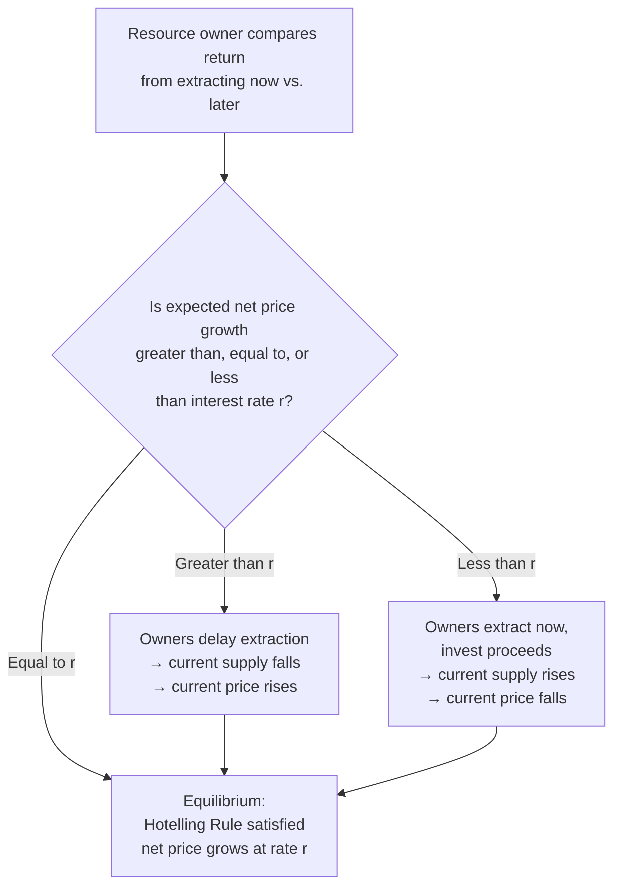
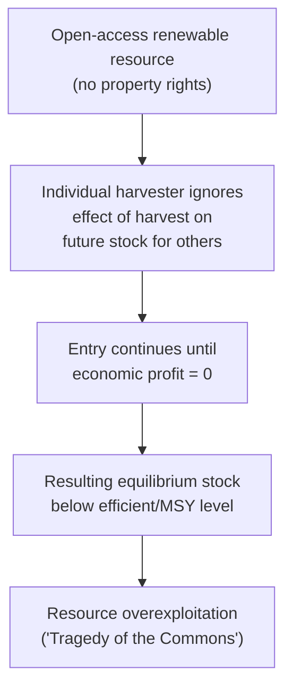

## Renewable versus Non-Renewable Resource Economics

### Overview

Resource economics studies the efficient extraction and management of natural resources over time, distinguishing fundamentally between **non-renewable resources** (fixed, exhaustible stocks like oil, minerals, and coal) and **renewable resources** (stocks capable of natural regeneration, like fisheries, forests, and groundwater). The core analytical challenge in both cases is intertemporal optimization: because resource use today affects availability tomorrow, static efficiency conditions must be replaced by dynamic ones.

### Non-Renewable Resource Economics

#### The Hotelling Rule

**Key Points**

- Named for Harold Hotelling (1931), the Hotelling Rule characterizes the efficient extraction path for a non-renewable resource under idealized conditions: perfect competition, no extraction costs, and a known, fixed total stock.
- The rule states that the **net price (or "royalty," or "scarcity rent")** of the resource — the market price minus marginal extraction cost — must grow at exactly the rate of interest (discount rate) $r$ along an efficient extraction path:

$$\frac{d(P_t - MC_t)}{dt} \cdot \frac{1}{(P_t - MC_t)} = r$$

Or, in discrete-time form:

$$\frac{(P_{t+1} - MC_{t+1}) - (P_t - MC_t)}{P_t - MC_t} = r$$

#### Intuition Behind the Hotelling Rule

**Key Points**

- A resource owner holding a unit of an exhaustible resource in the ground is implicitly holding an asset. In equilibrium, the owner must be indifferent between extracting and selling the resource today versus leaving it in the ground and extracting it later.
- If the resource's net price were expected to grow **faster** than the interest rate, owners would have an incentive to leave more in the ground today (postpone extraction) to capture the higher future return, reducing current supply, which would push the current price up until the growth rate matches $r$.
- If the net price were expected to grow **slower** than $r$, owners would extract and sell now, investing the proceeds at the market interest rate instead, increasing current supply and pushing the current price down until equilibrium is restored.
- This process ensures that, in equilibrium, the resource owner earns the same rate of return ($r$) whether holding the resource in the ground or holding a financial asset — the resource in the ground is priced like any other asset.

#### Worked Example

**Example**

Suppose the current net price (price minus marginal extraction cost) of a barrel of a resource is $40, and the relevant interest rate is 5% per year.

Under the Hotelling Rule, the net price one year hence should be:

$$P_1 - MC_1 = (P_0 - MC_0)(1 + r) = 40 \times 1.05 = \$42$$

Two years hence:

$$P_2 - MC_2 = 40 \times (1.05)^2 = \$44.10$$

If extraction costs are assumed constant at, say, $10/barrel, market price itself would follow the same growth path: $50, $52, $54.10, and so on.

#### Complications to the Basic Hotelling Model

| Real-World Factor | Effect on the Basic Hotelling Prediction |
| --- | --- |
| Extraction costs rising with cumulative extraction (stock-dependent costs) | Net price growth path becomes flatter than the pure Hotelling prediction, since costs rise as easily accessible reserves are depleted first |
| New reserve discoveries | Effectively expands the resource stock, resetting/lowering the trajectory of scarcity rent |
| Technological change reducing extraction cost | Can offset or reverse the expected price rise predicted by pure scarcity |
| Market power (e.g., cartel behavior) | A monopolist/cartel extracts more slowly than a competitive market (restricting output raises price), altering the extraction path from the competitive Hotelling benchmark |
| Backstop technology (a substitute available at a known cost ceiling) | Caps how high the resource price can rise before demand shifts entirely to the substitute, bounding the extraction path |

**[Inference]** Empirical tests of the Hotelling Rule using historical resource price data have found decidedly mixed support for the simple net-price-grows-at-rate-r prediction; this is widely attributed in the literature to the real-world complications above (cost changes, discoveries, market structure, and demand shifts) rather than being interpreted as invalidating the underlying optimization logic — the theoretical framework remains foundational for understanding the *qualitative* forces at work even where the precise quantitative prediction does not hold cleanly in observed data.

#### Optimal Depletion and the Backstop Technology

**Key Points**

- In models incorporating a backstop technology (a substitute resource or technology available in unlimited quantity at a constant marginal cost $P_b$, e.g., synthetic fuels or renewable energy as a backstop for fossil fuels), the resource price rises along the Hotelling path until it reaches $P_b$, at which point extraction of the exhaustible resource ceases (or becomes uneconomical) and the market fully transitions to the backstop.
- This generates a smooth, continuous transition in efficient models — the exhaustible resource is *not* efficiently extracted down to a hard physical zero at an infinite price, but rather phased out as it approaches cost-parity with the substitute.

### Renewable Resource Economics

#### The Biological Growth Function

**Key Points**

- Renewable resources (most commonly modeled via fisheries) are characterized by a stock $X_t$ that grows according to a biological growth function $G(X)$, commonly modeled with a logistic (S-shaped) growth curve:

$$G(X) = rX\left(1 - \frac{X}{K}\right)$$

where $r$ is the intrinsic growth rate and $K$ is the **carrying capacity** (the maximum stock the environment can sustain).

- Growth is zero at $X = 0$ (no population to reproduce) and at $X = K$ (population at carrying capacity, resource-constrained), and is maximized at some intermediate stock level, typically $X = K/2$ under the standard logistic form — this maximum growth point defines the **Maximum Sustainable Yield (MSY)**.

**(svg_diagram)** Logistic growth curve illustrating maximum sustainable yield.

<svg xmlns="http://www.w3.org/2000/svg" viewBox="0 0 640 380" font-family="sans-serif">
<text x="320" y="24" text-anchor="middle" font-size="16" font-weight="bold">Logistic Growth and Maximum Sustainable Yield (svg_diagram)</text>
<line x1="80" y1="320" x2="580" y2="320" stroke="black" stroke-width="2" />
<line x1="80" y1="320" x2="80" y2="50" stroke="black" stroke-width="2" />
<text x="590" y="325" font-size="13">Stock X</text>
<text x="35" y="45" font-size="13">Growth G(X)</text>

<path d="M 100 320 Q 330 60 560 320" fill="none" stroke="#1f77b4" stroke-width="2.5" />

<circle cx="330" cy="95" r="4" fill="black" />
<line x1="330" y1="95" x2="330" y2="320" stroke="black" stroke-width="1" stroke-dasharray="2,2" />
<text x="300" y="335" font-size="12">K/2 (MSY stock)</text>
<text x="335" y="90" font-size="12">MSY (max growth)</text>

<text x="90" y="335" font-size="12">0</text>

<text x="555" y="335" font-size="12">K</text>

</svg>

#### Open-Access Resources and the Tragedy of the Commons

**Key Points**

- When a renewable resource is **open-access** (no property rights or entry restriction — anyone can harvest), individual harvesters ignore the effect of their harvesting on the resource stock available to others and to their own future harvests, leading to systematic overexploitation relative to the socially efficient level.
- Under open access, entry continues until economic profit is driven to zero (harvesters enter as long as revenue exceeds cost), which typically occurs at a stock level **below** both the maximum sustainable yield stock and the economically efficient (rent-maximizing) stock — this is the classic **"tragedy of the commons"** (Hardin, 1968; formalized economically by Gordon, 1954, and Scott, 1955).

#### The Efficient (Rent-Maximizing) Harvest Level

**Key Points**

- The economically efficient steady-state harvest level maximizes the discounted present value of resource rents (harvest revenue minus harvest cost) over time, not simply the biological maximum sustainable yield.
- The efficient steady-state stock level satisfies a modified "golden rule"-type condition analogous to the Hotelling Rule, sometimes expressed as:

$$G'(X^*) - \frac{c'(X^*)}{p - c(X^*)} \cdot G(X^*) = r$$

where $G'(X)$ is the marginal biological growth rate, $c(X)$ is the marginal harvest cost (typically a decreasing function of stock, since harvest becomes easier when the stock is more abundant), and $r$ is the discount rate.

- **Key insight**: the efficient stock level is generally **below** the MSY stock level when the discount rate is positive and extraction costs fall with stock, because harvesters have some incentive to draw down the stock further than the pure biological optimum in order to realize present value gains — but the efficient stock remains **above** the open-access equilibrium stock, since efficient management still accounts for the value of the resource stock as a capital asset, which open access entirely ignores.

| Stock Level Concept | Relative Position |
| --- | --- |
| Carrying capacity ($K$) | Highest — no harvesting |
| Maximum Sustainable Yield stock ($K/2$, under standard logistic form) | Biologically-focused benchmark |
| Efficient (rent-maximizing) steady-state stock | Generally below MSY stock (with positive discount rate, cost-dependent), but above open-access stock |
| Open-access equilibrium stock | Lowest — resource rents fully dissipated |

**[Inference]** The precise ranking between the MSY stock and the efficient stock depends on the specific cost structure assumed (particularly whether harvest cost depends on stock level) and the discount rate; in some parameterizations of the model the efficient stock can be closer to, at, or even (in edge cases with very low discount rates and strongly stock-dependent costs) above the MSY stock — the general qualitative point that open access produces the most severe overexploitation relative to both benchmarks is the more robust conclusion.

#### Policy Instruments for Renewable Resource Management

| Instrument | Mechanism | Key Consideration |
| --- | --- | --- |
| Individual Transferable Quotas (ITQs) | Assigns tradable harvest rights (shares of a total allowable catch) to individual harvesters | Analogous to cap-and-trade; can achieve efficient allocation of harvest across heterogeneous harvesters, but raises initial-allocation distributional questions |
| Total Allowable Catch (TAC) with limited entry | Regulator sets an aggregate harvest limit and restricts the number of licensed harvesters | Reduces overcapacity but can still generate a "race to fish" if quotas are not individually allocated |
| Harvest taxes/landing fees | Tax per unit harvested, raising the effective cost of harvesting | Functions similarly to a Pigouvian tax on resource depletion; sets an effective price on harvest rights |
| Property rights / territorial use rights (TURFs) | Assigns exclusive rights over a defined area to an individual or community | Internalizes the stock externality directly by removing the "commons" aspect |
| Seasonal closures / gear restrictions | Direct regulation of harvest timing/method | Administratively simpler but often less economically efficient than rights-based approaches, since it does not directly address the underlying incentive problem |

### Comparing Non-Renewable and Renewable Resource Frameworks

| Dimension | Non-Renewable Resources | Renewable Resources |
| --- | --- | --- |
| Core dynamic constraint | Fixed, finite stock (no regeneration) | Stock regenerates via biological/natural growth process |
| Central efficiency rule | Hotelling Rule: net price grows at rate $r$ | Modified golden rule balancing biological growth against discounting and cost |
| Key market failure without intervention | Generally less prone to "tragedy of commons" if property rights exist, since owner has full incentive to manage the asset value | Highly prone to tragedy of the commons under open access, since no single agent's harvest decision reflects the stock externality on others |
| Long-run outcome under efficient management | Eventual depletion or transition to backstop technology | Sustainable steady-state harvest is achievable, potentially indefinitely |
| Canonical example | Oil, natural gas, mineral ores | Fisheries, forests (with regrowth), groundwater aquifers (partially renewable) |

### Related Topics

- Hotelling Rule empirical testing and critiques
- Backstop technologies and resource transition dynamics
- Individual Transferable Quota (ITQ) system design and case studies
- Tragedy of the commons: theory and property-rights solutions
- Forestry economics and optimal rotation (Faustmann formula)
- Groundwater and aquifer management as a hybrid renewable/exhaustible resource
- Resource cartels and market power in extraction (e.g., OPEC modeling)
- Bioeconomic modeling of multi-species fisheries