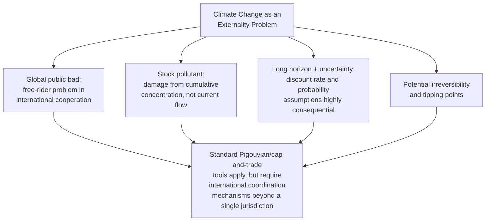
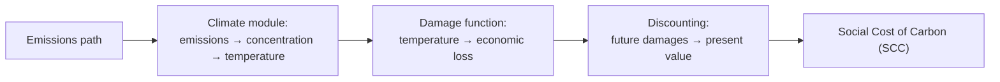
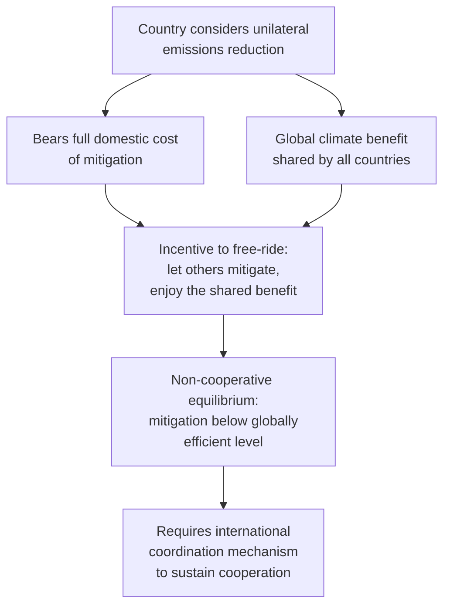

## The Economics of Climate Change

### Overview

Climate change economics applies the tools of externality theory, resource economics, and dynamic optimization to the specific and unusually challenging case of greenhouse gas (GHG) emissions: a global, stock-based, long-horizon externality characterized by deep uncertainty, potential irreversibility, and significant intergenerational and international dimensions. This topic synthesizes several strands covered elsewhere (Pigouvian taxation, non-renewable resources, discounting) into the specific analytical apparatus developed for climate policy.

### Why Climate Change Is a Distinctive Externality Problem

**Key Points**

- Climate change combines several features that individually complicate standard externality analysis, and jointly make it an unusually difficult policy problem:

| Feature | Complication Introduced |
| --- | --- |
| Global public bad | Emissions from any country affect the global climate; no single country can solve the problem unilaterally, creating a severe free-rider problem in international cooperation |
| Stock pollutant | Damage depends on the *cumulative atmospheric concentration* of GHGs built up over centuries, not the current flow of emissions — today's emissions have effects persisting far into the future |
| Very long time horizon | Damages unfold over decades to centuries, making the choice of discount rate unusually consequential for policy conclusions (see below) |
| Deep uncertainty | Climate sensitivity (the temperature response to a given atmospheric concentration), damage functions, and the possibility of catastrophic/tipping-point outcomes are all subject to substantial scientific and economic uncertainty |
| Irreversibility | Some physical impacts (species extinction, ice sheet loss) and some atmospheric processes are effectively irreversible on human timescales |
| Global equity dimension | Historical emitters (largely industrialized nations) differ from those most vulnerable to damages (often developing nations), raising distinct international equity questions beyond standard intergenerational equity |

### The Social Cost of Carbon (SCC)

**Key Points**

- The **Social Cost of Carbon** is the central quantitative concept in climate economics: the present value of all future economic damages caused by emitting one additional ton of CO2 (or CO2-equivalent) today.
- Formally, the SCC is the marginal external damage $MD(Q^*)$ from the Pigouvian framework, specifically adapted to a pollutant whose damages accrue as a discounted stream over a very long future horizon:

$$SCC = \sum_{t=0}^{T} \frac{D_t(\Delta \text{emissions})}{(1+r)^t}$$

where $D_t$ is the incremental damage in year $t$ attributable to the marginal ton of emissions, discounted back to the present at rate $r$.

- Under the standard Pigouvian logic, the SCC represents the theoretically efficient per-ton carbon tax (or, equivalently, the value that should be used to evaluate the benefit side of any policy that reduces emissions in cost-benefit analysis).

#### Integrated Assessment Models (IAMs)

**Key Points**

- SCC estimates are typically generated using **Integrated Assessment Models (IAMs)**, which combine a simplified representation of the climate system (translating emissions into atmospheric concentration and temperature change) with an economic damage function (translating temperature change into economic losses) and a growth/discounting framework.
- Prominent IAMs referenced in the literature include DICE (Dynamic Integrated Climate-Economy model, developed by William Nordhaus), FUND, and PAGE — each embodies different structural assumptions about damage functions, climate sensitivity, and discounting.
- **[Inference]** SCC estimates produced by different IAMs, or even the same IAM under different parameter assumptions (particularly the discount rate and the shape of the damage function at high temperatures), vary enormously — spanning roughly an order of magnitude or more across commonly cited studies — reflecting the deep structural uncertainty in this modeling exercise rather than a settled, narrow point estimate; policymakers and researchers should treat any single reported SCC figure as sensitive to these underlying modeling choices rather than as a precise, uncontested number.

### The Central Role of the Discount Rate

**Key Points**

- Because climate damages unfold over centuries, the choice of discount rate is arguably the single most consequential parameter in climate-economic modeling — small differences in the assumed rate compound over long horizons into very large differences in the present value of future damages, and thus in the resulting SCC and recommended policy stringency.
- The **Ramsey discounting formula** decomposes the social discount rate into components:

$$r = \rho + \eta g$$

where $\rho$ is the **pure rate of time preference** (the rate at which utility from future generations' consumption is discounted purely for being in the future, independent of consumption growth), $\eta$ is the elasticity of marginal utility of consumption (reflecting both risk aversion and the strength of the desire to smooth consumption across time/generations), and $g$ is the expected growth rate of per-capita consumption.

#### The Stern-Nordhaus Debate

**Key Points**

- A landmark and widely cited debate in climate economics concerns the appropriate choice of $\rho$: the Stern Review (2006) used a very low pure rate of time preference (close to zero, reflecting an ethical view that discounting future generations' welfare purely for the reason that they live later is difficult to justify), leading to a high estimated SCC and support for aggressive near-term mitigation.
- Critics, notably William Nordhaus, argued for a higher $\rho$ closer to rates implied by observed market interest rates and revealed societal behavior, which produces a substantially lower SCC and supports a more gradual mitigation path.
- **[Inference]** This disagreement is not primarily a dispute over facts but over a fundamentally **normative/ethical** question — how much weight should be given to the welfare of future generations relative to the present — layered onto genuine empirical uncertainty about future growth rates ($g$); this is widely recognized in the field as a case where the "positive economics" of climate modeling cannot be fully separated from underlying value judgments about intergenerational ethics, and reasonable economists continue to disagree on the appropriate parameter choice.

### Climate Change as a Stock Pollutant: Implications for Policy Instrument Choice

**Key Points**

- As introduced in the Pigouvian tax vs. cap-and-trade topic, the Weitzman price-versus-quantity framework has a specific and often-cited application to climate policy: because the marginal damage from a *given year's* emissions is very flat in the short run (the climate system responds to cumulative stock, not any single year's flow), many economists have argued this favors a **carbon tax** (price instrument) over a rigid annual emissions cap (quantity instrument) for cost-uncertainty reasons.
- **[Inference]** This argument, while influential, is one input among several in the broader carbon-tax-vs-cap-and-trade policy debate; considerations such as political feasibility, revenue predictability, ease of linking with other jurisdictions' systems, and the political salience of a fixed emissions target versus a fixed price have all featured prominently in actual policy design choices across different countries and are not resolved purely by the Weitzman framework.

### Uncertainty, Tipping Points, and Catastrophic Risk

**Key Points**

- Standard cost-benefit / expected-value approaches to climate policy can understate the case for mitigation if there is a meaningful probability of low-probability, high-consequence ("fat-tailed") catastrophic outcomes — a concern raised prominently by economist Martin Weitzman in his "dismal theorem" work.
- The **dismal theorem** argues that under sufficiently fat-tailed uncertainty about catastrophic outcomes combined with certain assumptions about risk aversion, expected-value cost-benefit analysis can become an inappropriate policy tool, since the expected value of the analysis can be dominated by extremely unlikely but extremely severe tail outcomes, pushing toward a more precautionary policy stance than standard expected-value SCC calculations would suggest.
- **[Inference]** The dismal theorem and its policy implications remain contested within the economics profession; critics have questioned some of its specific mathematical assumptions (regarding the exact shape of the tail and the specification of the utility function), while proponents view it as capturing a real and underappreciated feature of catastrophic climate risk that conventional IAM-based SCC estimates may not adequately reflect — this is an area of active methodological debate rather than settled consensus.

### International Cooperation and the Free-Rider Problem

**Key Points**

- Because the climate is a global commons, any individual country's unilateral emissions reduction benefits the entire world while imposing the full domestic cost only on that country — a textbook incentive for free-riding that undermines voluntary international cooperation absent an enforcement mechanism.
- This structure is often analyzed using game-theoretic frameworks (e.g., as a repeated prisoner's dilemma or public goods game among nations), where the non-cooperative (Nash) outcome involves less mitigation than the internationally efficient level, and sustaining cooperation requires credible mechanisms (side payments, sanctions for non-compliance, reputational/relational incentives in repeated interaction) to overcome the free-rider incentive.
- **Border carbon adjustments (BCAs)**: proposed and increasingly implemented tariffs on imports from countries with less stringent carbon pricing, intended to address both competitiveness concerns for domestic industry and "carbon leakage" (production, and associated emissions, shifting to jurisdictions with weaker climate policy).

### Policy Instruments Applied to Climate

| Instrument | Application to Climate Specifically |
| --- | --- |
| Carbon tax | Direct per-ton price on emissions, set ideally near the estimated SCC; favored by many economists per the Weitzman stock-pollutant argument above |
| Cap-and-trade (emissions trading) | Aggregate emissions cap with tradable permits; implemented at scale in systems such as the EU Emissions Trading System |
| Renewable portfolio standards / subsidies | Quantity mandates or price subsidies for low-carbon technology, often justified partly by additional market failures beyond the emissions externality itself (e.g., innovation spillovers/learning-by-doing external to the innovating firm) |
| Border carbon adjustments | Tariff-based mechanism to address carbon leakage and competitiveness under asymmetric international carbon pricing |
| Direct regulation (fuel economy standards, technology mandates) | Command-and-control approach; generally less cost-effective than price/quantity market instruments in standard theory, but sometimes favored for administrative simplicity, distributional reasons, or additional co-benefits |

### Related Topics

- Integrated Assessment Models: DICE, FUND, and PAGE model comparisons
- Ramsey discounting and the Stern-Nordhaus debate in depth
- Weitzman's dismal theorem and fat-tailed climate risk
- Carbon leakage and border carbon adjustment mechanisms
- International climate agreements and game theory (Paris Agreement, Kyoto Protocol)
- Innovation market failures and clean technology policy
- Climate damage function specification and empirical estimation
- Just transition and international climate equity considerations