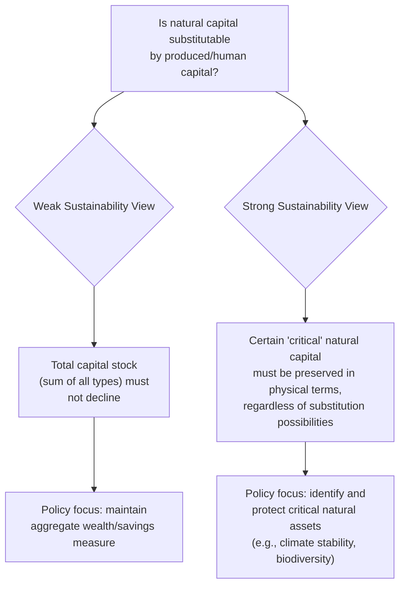
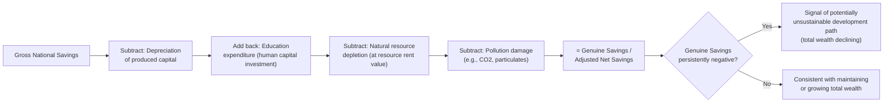

## Sustainable Development and Green Accounting

### Overview

Sustainable development economics examines how to characterize and measure whether an economy's development path can be maintained over time without depleting the underlying capital base — natural, produced, human, and social — needed to sustain future welfare. Green accounting refers to the family of measurement frameworks developed to adjust conventional national income accounts (like GDP) for resource depletion and environmental degradation, since standard GDP does not capture changes in a nation's underlying capital stocks.

### Defining Sustainability: Weak vs. Strong Sustainability

**Key Points**

- A foundational distinction in the sustainability literature concerns whether different forms of capital are treated as substitutable for one another.

| Concept | Core Assumption | Implication |
| --- | --- | --- |
| Weak sustainability | Natural capital and produced (manufactured/human) capital are substitutable; what matters is that the *total* capital stock (natural + produced + human) does not decline over time | Depleting natural capital is acceptable if the proceeds are reinvested in produced or human capital of equivalent value |
| Strong sustainability | Certain forms of natural capital are non-substitutable (e.g., critical ecosystem services, biodiversity, climate stability) and must be maintained in physical terms regardless of produced capital accumulation | Some natural capital stocks require protection as a constraint independent of aggregate capital value |

**[Inference]** Most mainstream environmental economics analysis (including the green accounting frameworks below) operates within the weak sustainability paradigm, since it is more tractable to aggregate into a single monetary index; the strong sustainability perspective is more closely associated with ecological economics and ecology-adjacent fields, and the degree of substitutability actually appropriate for different types of natural capital remains a genuinely contested empirical and ethical question rather than one with a settled answer.

### The Hartwick Rule

**Key Points**

- The **Hartwick Rule** (John Hartwick, 1977) provides a specific operational criterion, within the weak sustainability framework, for maintaining constant consumption indefinitely in an economy that depends partly on a non-renewable resource: **invest all resource rents (scarcity rents earned from extracting the non-renewable resource) into produced (reproducible) capital.**

$$I_t = R_t$$

where $I_t$ is net investment in produced capital and $R_t$ is the resource rent earned from non-renewable resource extraction in period $t$ (extraction revenue minus extraction cost).

- If this rule is followed exactly (and under specific technical conditions — e.g., a Cobb-Douglas-type production technology and efficient resource extraction following the Hotelling Rule), a constant level of consumption can theoretically be sustained forever, even as the non-renewable resource stock is progressively depleted to exhaustion, because the produced capital stock (funded by reinvested resource rents) grows to substitute for the shrinking natural resource input.

**Example**

An economy earns $10 billion in annual resource rents (net of extraction cost) from oil extraction. Under the Hartwick Rule, this entire $10 billion should be channeled into net investment — building infrastructure, machinery, education, or other productive capital — rather than being consumed. Over time, as oil reserves diminish, the accumulated produced capital stock (funded by these reinvested rents) substitutes for the declining resource input, in principle allowing consumption to remain constant indefinitely.

**[Inference]** The Hartwick Rule is a highly stylized theoretical result relying on strong assumptions (perfect substitutability between capital types consistent with weak sustainability, efficient markets, specific production function forms); it is widely used as a conceptual benchmark and a normative guide for resource-revenue management (e.g., informing the logic behind sovereign wealth funds that invest resource revenues rather than spending them on current consumption) rather than as a literal, directly implementable policy formula, since real economies violate several of its underlying technical assumptions.

### Genuine Savings (Adjusted Net Savings)

**Key Points**

- **Genuine Savings** (also called Adjusted Net Savings) is an empirical indicator, developed and published notably by the World Bank, operationalizing the Hartwick Rule logic into a measurable sustainability indicator for actual countries.
- It is calculated by taking conventional Gross National Savings and making a series of adjustments:

$$GS = (GNS - D) + EdEx - RD - PD - CD$$

Where:

- $GNS$ = Gross National Savings
- $D$ = Depreciation of produced (fixed) capital
- $EdEx$ = Education expenditure (added back, treated as investment in human capital rather than consumption)
- $RD$ = Depletion of natural resources (energy, minerals, forests) valued at resource rents
- $PD$ = Damage from pollution (notably a monetized estimate of CO2 and particulate damage)
- $CD$ = Depreciation of other natural capital (net forest depletion beyond sustainable harvest, etc.)

**Key Points on interpretation:**

- A **persistently negative Genuine Savings rate** is interpreted, within the weak sustainability framework and subject to its assumptions, as a signal that a country's total wealth (across all capital types) is declining — a warning indicator of an unsustainable development path, even if conventional GDP growth appears positive.
- This is a key diagnostic value of the metric: it can flag cases where GDP growth is being achieved partly by liquidating natural capital (e.g., unsustainable resource extraction or deforestation) rather than through genuine wealth creation — a pattern conventional national accounts do not reveal.

### Green GDP and Environmentally Adjusted National Accounts

**Key Points**

- **Green GDP** refers to attempts to adjust conventional GDP directly for environmental costs, most commonly by subtracting monetized estimates of natural resource depletion and pollution damage from standard GDP or Net National Product (NNP).

$$Green\ NNP = NNP - (\text{Resource Depletion}) - (\text{Pollution Damage})$$

- Conceptually, this connects to the theoretical result (from capital theory, associated with Weitzman's 1976 work on national income accounting) that Net National Product, properly and comprehensively measured to include changes in *all* capital stocks (produced, natural, human), represents the maximum sustainable level of consumption an economy could maintain indefinitely — making a comprehensively adjusted NNP a theoretically well-grounded, if practically demanding, sustainability indicator.

#### Practical and Methodological Challenges

**Key Points**

- **Valuation difficulty**: monetizing natural resource depletion and pollution damage requires exactly the non-market valuation methods discussed elsewhere (hedonic pricing, contingent valuation, etc.), each carrying its own significant uncertainty and methodological contestation.
- **Incomplete coverage**: most green accounting exercises to date have been able to incorporate only a subset of natural capital changes (commonly energy/mineral depletion, net forest depletion, and CO2 damage) due to data and valuation constraints, while excluding harder-to-value natural capital changes such as biodiversity loss, ecosystem service degradation, or soil depletion.
- **[Inference]** Because of this incomplete coverage, published Green GDP or Genuine Savings figures for any given country generally should be interpreted as a *partial* and likely *conservative* (understated) measure of total natural capital depreciation, rather than a comprehensive account of all environmental costs — a limitation widely acknowledged within the field, though the practical magnitude of the resulting understatement for any specific country is difficult to establish with precision given the very valuation gaps causing the omission in the first place.
- **Political sensitivity**: several country-level attempts to formally implement Green GDP as an official national statistic (most notably in China in the mid-2000s) faced significant political and methodological controversy and were scaled back or discontinued, illustrating the practical institutional challenges of adopting these measures as headline policy indicators alongside or in place of conventional GDP.

### Comparing Sustainability and Green Accounting Frameworks

| Framework | What It Measures | Primary Use |
| --- | --- | --- |
| Hartwick Rule | Theoretical investment rule (invest resource rents in produced capital) | Conceptual benchmark; informs sovereign wealth fund policy design |
| Genuine Savings (Adjusted Net Savings) | Empirical, cross-country comparable savings rate adjusted for capital depreciation across types | World Bank flagship sustainability indicator; early-warning diagnostic |
| Green GDP / Green NNP | Direct environmental adjustment to national income flow measures | Country-specific national accounting adjustment; more data- and valuation-intensive |
| Ecological footprint (related, non-monetary approach) | Physical measure of resource consumption relative to biocapacity | Complementary physical indicator, avoids monetary valuation challenges but sacrifices direct economic interpretability |

**[Inference]** The ecological footprint approach and related physical (non-monetary) sustainability indicators are sometimes used as a complement to the monetary green accounting frameworks above precisely because they sidestep the valuation controversies inherent in monetizing natural capital, though they introduce their own methodological debates (e.g., aggregation across very different resource types into a single "footprint" unit) and are generally considered a distinct methodological tradition rather than a strict alternative measuring the same underlying concept.

### Sustainable Development Goals and Broader Measurement Frameworks

**Key Points**

- Beyond the specifically economic green accounting frameworks above, broader multidimensional sustainability measurement frameworks (such as the UN Sustainable Development Goals indicator framework) incorporate social and institutional dimensions of sustainability (poverty, health, education, governance) alongside environmental dimensions, reflecting a view that sustainable development involves more than the capital-substitution logic underlying weak sustainability economic models alone.
- **[Inference]** The relationship between these broader multidimensional frameworks and the narrower economic green accounting measures discussed above is generally treated in the literature as complementary rather than competing — the economic measures (Genuine Savings, Green GDP) aim for a single aggregated monetary indicator amenable to time-series and cross-country comparison, while multidimensional frameworks preserve disaggregated information across many distinct social and environmental indicators at the cost of not producing a single summary statistic.

### Related Topics

- Weak vs. strong sustainability debates in ecological economics
- Sovereign wealth funds and resource revenue management (e.g., Norway's Government Pension Fund model)
- Weitzman's theorem on NNP as a sustainability indicator
- Non-market valuation methods underlying green accounting adjustments
- Ecological footprint and planetary boundaries frameworks
- Natural capital accounting standards (e.g., UN SEEA — System of Environmental-Economic Accounting)
- Intergenerational equity and the capital-substitution debate
- Case studies in national green accounting implementation and political challenges