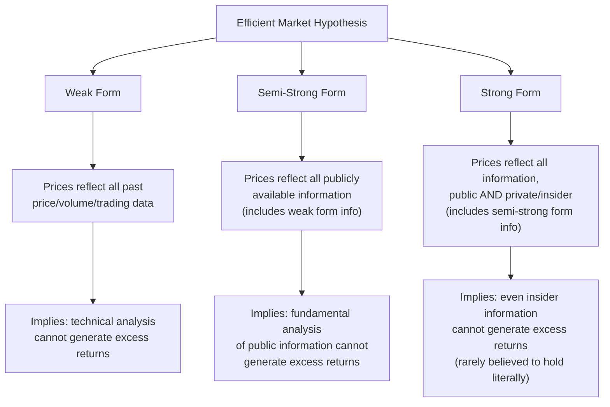
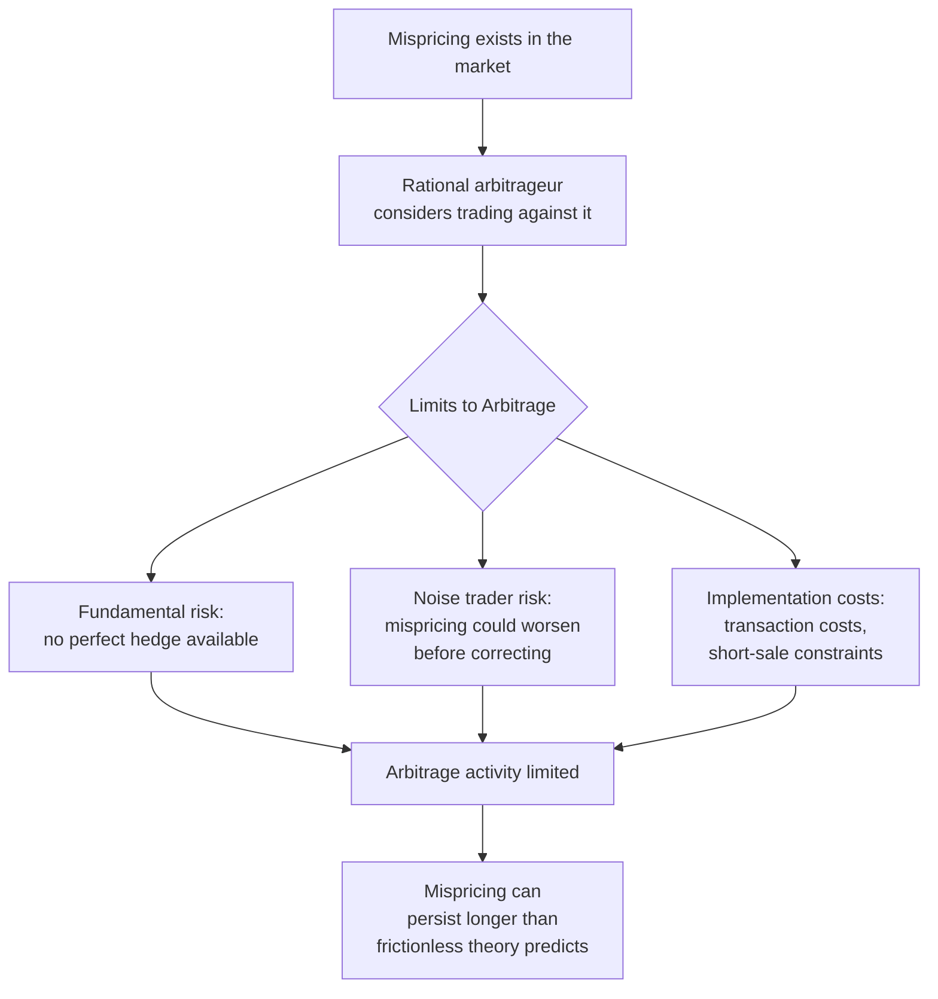

## Efficient Market Hypothesis and Anomalies

### Overview

The Efficient Market Hypothesis (EMH) is the foundational theory in financial economics asserting that asset prices fully reflect available information, making it impossible to systematically "beat the market" on a risk-adjusted basis using that information. Decades of subsequent empirical research have identified a range of persistent anomalies that appear to challenge strict forms of the hypothesis, motivating both refinements to EMH and the rise of behavioral finance as an alternative or complementary framework.

### The Efficient Market Hypothesis: Core Statement

**Key Points**

- Formalized principally by Eugene Fama (1970), EMH holds that in an efficient market, security prices at any time fully reflect all available information, such that prices adjust rapidly and (on average) correctly to new information as it arrives.
- A key implication: since current prices already incorporate all available information, price changes should be driven only by *new*, unpredictable information — implying that price movements should approximate a **random walk**, and that no trading strategy based on existing information should be able to generate risk-adjusted excess returns (returns above what is justified by the asset's risk) on a persistent basis.

### The Three Forms of Market Efficiency

**Key Points**

- Fama distinguished three nested forms of the hypothesis, differing in the information set assumed to be reflected in prices.

| Form | Information Set Reflected in Prices | Implication if True |
| --- | --- | --- |
| Weak form | Historical price and trading volume data | Technical analysis (chart patterns, momentum trading rules based on past prices) cannot generate persistent excess returns |
| Semi-strong form | All publicly available information (financial statements, news, economic data) plus weak-form information | Fundamental analysis of public information cannot generate persistent excess returns; prices adjust rapidly to public news announcements |
| Strong form | All information, public and private (including insider information) plus semi-strong form information | Even those with privileged private information cannot generate persistent excess returns |

**[Inference]** The strong form is generally regarded within the field as empirically implausible and is rarely defended as a literal description of actual markets — legal restrictions on insider trading exist precisely because insider information is widely believed to convey a genuine trading advantage, which would be impossible under strict strong-form efficiency; the more actively debated and empirically tested forms in the literature are the weak and semi-strong forms.

### Theoretical Foundations Supporting EMH

**Key Points**

- **Arbitrage**: if a mispricing exists (an asset's price deviates from its fundamental value), rational arbitrageurs can profit by trading against it, and their trading activity should push the price back toward fundamental value — this competitive arbitrage process is the core economic mechanism argued to enforce efficiency.
- The hypothesis does not require that *every* investor be rational; it requires only that enough capital is deployed by sufficiently well-informed, rational arbitrageurs to correct mispricings introduced by less-informed or irrational traders (sometimes called "noise traders").

#### Joint Hypothesis Problem

**Key Points**

- A crucial and often underappreciated methodological point (emphasized by Fama himself): market efficiency can never be tested in isolation — any empirical test of EMH is necessarily a **joint test** of (1) market efficiency and (2) a specific assumed asset pricing model used to define "normal" or risk-adjusted expected returns.
- If an empirical anomaly (an apparent excess return) is found, it can always be interpreted in one of two ways: either markets are genuinely inefficient, **or** the asset pricing model used to define the expected/normal return was misspecified (omitting a relevant risk factor), making the "abnormal" return actually a fair compensation for an unmodeled risk.
- **[Inference]** This joint hypothesis problem is widely regarded in the field as a fundamental and largely irresolvable methodological limitation on definitively proving or disproving market efficiency through empirical anomaly-testing alone — it is a key reason why the debate over specific anomalies (below) often centers on whether they represent genuine inefficiency or missing risk factors, rather than being cleanly resolved by the data.

### Empirical Anomalies Challenging EMH

An anomaly, in this context, is an empirical pattern in asset returns that appears difficult to reconcile with standard efficient-market/rational-asset-pricing models (most commonly benchmarked against the Capital Asset Pricing Model, CAPM).

#### Cross-Sectional Anomalies (Predictable Differences Across Stocks)

| Anomaly | Description |
| --- | --- |
| Size effect | Small-capitalization stocks have historically earned higher average returns than large-capitalization stocks, even after adjusting for CAPM beta |
| Value effect | Stocks with high book-to-market ratios (or low price-to-earnings ratios) — "value" stocks — have historically outperformed "growth" stocks (low book-to-market) with similar risk, after CAPM adjustment |
| Momentum effect | Stocks that have performed well over the past 3–12 months tend to continue outperforming over the subsequent 3–12 months, and past losers tend to continue underperforming — a pattern in tension with the random-walk implication of weak-form efficiency |
| Low-volatility anomaly | Stocks with lower historical volatility or beta have, in some studies, earned returns comparable to or higher than higher-volatility/higher-beta stocks, in tension with the standard risk-return trade-off predicted by CAPM |

**[Inference]** The size and value effects, discovered and popularized substantially through work by Fama and French, were themselves eventually incorporated into an expanded asset pricing model (the Fama-French three-factor and later five-factor models) that treats "size" and "value" as compensated risk factors rather than pure inefficiencies — illustrating the joint hypothesis problem directly: what first appeared as an anomaly relative to CAPM was subsequently reinterpreted by much of the field as compensation for risk exposures omitted from the original CAPM specification, though momentum has proven comparatively more resistant to this risk-based reinterpretation and remains more commonly discussed as a candidate genuine anomaly, including in behavioral finance explanations.

#### Time-Series and Calendar Anomalies

| Anomaly | Description |
| --- | --- |
| January effect | Historically documented tendency for small-cap stock returns to be unusually high in January, particularly early January, relative to other months |
| Day-of-the-week effect | Historically documented pattern of different average returns on different days of the week (e.g., lower or negative average Monday returns in some studies) |
| Post-earnings announcement drift (PEAD) | Stock prices have been found to continue drifting in the direction of an earnings surprise for weeks to months after the announcement, rather than adjusting immediately — directly in tension with semi-strong form efficiency's prediction of rapid price adjustment to public news |

**[Inference]** Several calendar anomalies (the January effect and day-of-week effect in particular) are widely reported in the literature to have weakened or diminished substantially in the years following their initial discovery and publication — a pattern consistent with the idea that publicizing an anomaly allows arbitrageurs to trade it away (a form of "anomaly decay"), which is sometimes cited as indirect support for the underlying efficient-markets logic even when a specific historical anomaly is confirmed to have existed; post-earnings announcement drift, by contrast, has been more persistently documented across different time periods and markets and is generally treated as a more robust anomaly in the literature.

#### Aggregate Market-Level Anomalies

| Anomaly | Description |
| --- | --- |
| Excess volatility | Aggregate stock market prices have been found in influential studies (notably Robert Shiller's work) to be more volatile than can be justified by subsequent variation in fundamentals (dividends/earnings) under a simple efficient-markets present-value model with constant discount rates |
| Equity premium puzzle | The historical excess return of equities over risk-free assets appears too large to be explained by standard models of investor risk aversion at plausible risk-aversion parameter values (Mehra and Prescott, 1985) |
| Closed-end fund puzzle | Closed-end mutual funds often trade at market prices that differ (frequently at a discount) from the net asset value of their underlying holdings, despite the underlying assets typically being liquid and their value directly observable — difficult to reconcile with a simple efficient-pricing view |

**[Inference]** Excess volatility findings remain a genuinely contested area: subsequent research has proposed that time-varying discount rates (rather than constant ones, as in Shiller's original tests) can rationalize a substantial portion of observed volatility within efficient-markets-consistent frameworks, though whether this fully accounts for the empirical excess volatility finding or only partially does so remains actively debated rather than settled.

### Behavioral Finance Explanations for Anomalies

**Key Points**

- Behavioral finance offers psychology-grounded explanations for several anomalies, generally invoking systematic departures from full rationality among at least a subset of market participants, combined with **limits to arbitrage** that prevent rational traders from fully correcting the resulting mispricing.

| Behavioral Concept | Proposed Link to Anomaly |
| --- | --- |
| Overconfidence and self-attribution bias | Proposed contributor to momentum (investors underreact initially to news, then overreact as trends are extrapolated) |
| Loss aversion / disposition effect | Tendency of investors to hold losing positions too long and sell winning positions too early, a pattern distinct from but related to explanations of momentum and reversal patterns |
| Anchoring and underreaction | Proposed explanation for post-earnings announcement drift: investors underreact to the full information content of an earnings surprise, causing prices to adjust gradually rather than immediately |
| Representativeness heuristic | Proposed contributor to overreaction-based reversal patterns, as investors extrapolate recent trends too strongly when forming expectations |

#### Limits to Arbitrage

**Key Points**

- A key reason behavioral mispricings are argued to persist despite the presence of rational arbitrageurs is that real-world arbitrage is costly and risky, not the frictionless, riskless process assumed in idealized efficient-markets theory.
- Specific limits include: **fundamental risk** (the mispricing might not have a perfect hedge, exposing the arbitrageur to residual risk), **noise trader risk** (a mispricing can worsen before it corrects, potentially forcing an arbitrageur with a finite horizon or capital constraint to exit at a loss before the correction occurs — associated with the DeLong, Shleifer, Summers, and Waldmann noise trader model), and **implementation costs** (transaction costs, short-selling constraints and costs, that limit how aggressively arbitrageurs can trade against a mispricing).

### The Current State of the EMH Debate

**Key Points**

- Contemporary financial economics does not typically frame the question as a binary "EMH is true" or "EMH is false"; rather, most researchers in the field regard markets as exhibiting a substantial, though incomplete, degree of informational efficiency — gross mispricings are rare and rapidly arbitraged, particularly in highly liquid markets with low transaction costs, while more persistent and harder-to-arbitrage anomalies (especially those requiring difficult-to-execute strategies, long holding periods, or exposure to hard-to-hedge risk) can and do coexist with a broadly informationally efficient market.
- **[Inference]** Given the joint hypothesis problem discussed above, this remains an area of genuine and unresolved debate among specialists — reasonable economists differ on how much of the observed anomaly literature reflects genuine, exploitable inefficiency versus missing risk factors or data-mining/multiple-testing artifacts in the vast empirical anomaly literature (a concern often referred to as the "factor zoo" problem, given the very large number of proposed return-predicting factors published in recent decades), and this framing should not be read as the field having converged on a single settled resolution.

### Related Topics

- Fama-French three-factor and five-factor asset pricing models
- Behavioral finance foundations: prospect theory and heuristics
- Noise trader models and limits to arbitrage (DeLong-Shleifer-Summers-Waldmann)
- The "factor zoo" and multiple-testing concerns in empirical asset pricing
- Excess volatility and time-varying discount rate models
- Equity premium puzzle: proposed resolutions
- Post-earnings announcement drift: mechanisms and persistence
- Random walk theory and technical analysis critique