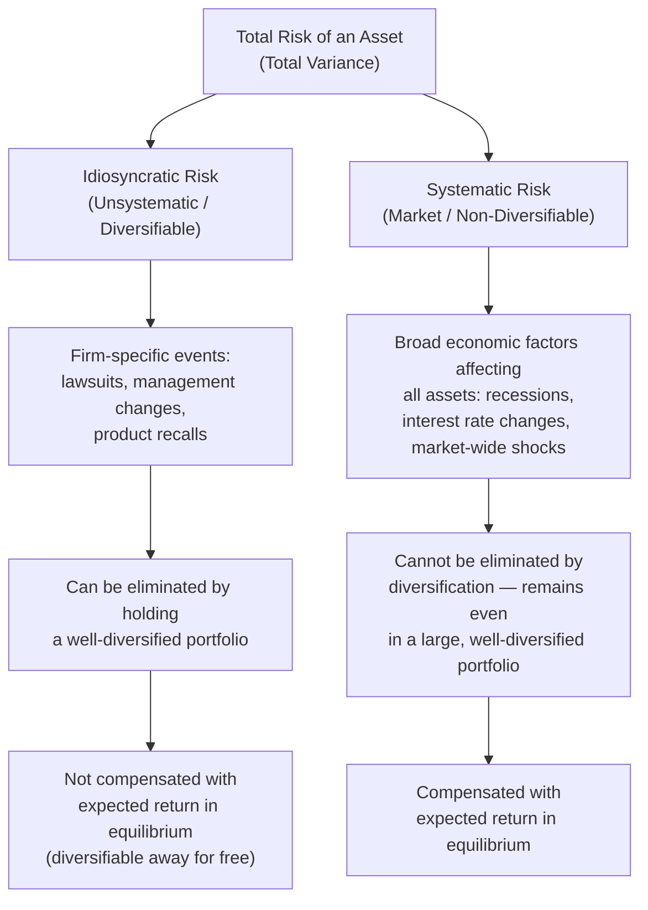
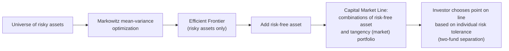

## Asset Pricing and Risk-Return Tradeoffs

### Overview

Asset pricing theory studies how financial assets are valued in equilibrium, centered on the principle that investors demand compensation for bearing risk, and that this compensation should depend specifically on the *type* of risk borne — particularly the portion of risk that cannot be eliminated through diversification. This topic covers the foundational risk-return frameworks (portfolio theory, CAPM) and their multi-factor extensions.

### Diversification and the Distinction Between Risk Types

**Key Points**

- A central insight of modern portfolio theory (Harry Markowitz, 1952) is that combining imperfectly correlated assets into a portfolio reduces total portfolio risk (variance) below the weighted average of the individual assets' risks, without necessarily sacrificing expected return — the foundation of the benefit of diversification.
- This leads to a critical distinction between two components of an individual asset's total risk:

- **Key implication for pricing**: because idiosyncratic risk can be eliminated at no cost simply by holding a diversified portfolio, rational investors should not require (and competitive markets should not provide) additional expected return purely for bearing idiosyncratic risk. Only **systematic risk** — risk that persists even in a well-diversified portfolio — should command a risk premium in equilibrium.

### The Capital Asset Pricing Model (CAPM)

#### Core Formula

**Key Points**

- The CAPM (developed independently by Sharpe, Lintner, and Mossin in the 1960s, building on Markowitz's portfolio theory) formalizes the systematic-risk-pricing logic into a single-factor model:

$$E(R_i) = R_f + \beta_i \left[E(R_m) - R_f\right]$$

Where:

- $E(R_i)$ = expected return on asset $i$
- $R_f$ = risk-free rate
- $E(R_m)$ = expected return on the market portfolio
- $\beta_i$ = the asset's sensitivity to market-wide (systematic) risk

#### Beta as the Measure of Systematic Risk

**Key Points**

- Beta is formally defined as:

$$\beta_i = \frac{Cov(R_i, R_m)}{Var(R_m)}$$

- Beta measures how much an individual asset's return tends to move with the overall market: $\beta = 1$ implies the asset moves in line with the market on average; $\beta > 1$ implies amplified sensitivity to market movements (more systematic risk than the market portfolio); $\beta < 1$ implies dampened sensitivity; $\beta < 0$ (comparatively rare) implies the asset tends to move opposite to the market, providing a hedging benefit.

**Example**

If the risk-free rate is 3%, the expected market return is 9% (an equity risk premium of 6%), and a stock has $\beta = 1.4$:

$$E(R_i) = 0.03 + 1.4(0.09 - 0.03) = 0.03 + 1.4(0.06) = 0.03 + 0.084 = 0.114$$

The CAPM predicts an expected return of 11.4% for this stock, reflecting its above-market (amplified) exposure to systematic risk.

#### The Security Market Line (SML)

**Key Points**

- Graphically, the CAPM relationship is depicted as the **Security Market Line**, plotting expected return against beta — a straight line intersecting the vertical axis at $R_f$ with slope equal to the market risk premium $[E(R_m) - R_f]$.
- Under CAPM, all correctly priced assets should lie exactly on the SML in equilibrium; an asset plotting above the line would offer more expected return than its systematic risk justifies (undervalued, expected to be bid up until it returns to the line), and an asset plotting below the line would be overvalued relative to its risk.

**(svg_diagram)** The Security Market Line and CAPM equilibrium relationship.

<svg xmlns="http://www.w3.org/2000/svg" viewBox="0 0 640 400" font-family="sans-serif">
<text x="320" y="24" text-anchor="middle" font-size="16" font-weight="bold">Security Market Line (svg_diagram)</text>
<line x1="90" y1="340" x2="580" y2="340" stroke="black" stroke-width="2" />
<line x1="90" y1="340" x2="90" y2="50" stroke="black" stroke-width="2" />
<text x="590" y="345" font-size="13">Beta (β)</text>
<text x="45" y="45" font-size="13">E(R)</text>

<circle cx="90" cy="300" r="3" fill="black" />
<text x="40" y="304" font-size="12">Rf</text>

<line x1="90" y1="300" x2="560" y2="90" stroke="#1f77b4" stroke-width="2.5" />
<text x="450" y="130" font-size="13" fill="#1f77b4">Security Market Line (SML)</text>

<circle cx="300" cy="200" r="4" fill="black" />
<text x="305" y="195" font-size="12">Market (β=1)</text>
<line x1="300" y1="200" x2="300" y2="340" stroke="black" stroke-width="1" stroke-dasharray="2,2" />
<text x="290" y="355" font-size="12">1</text>

<circle cx="420" cy="105" r="4" fill="green" />
<text x="425" y="100" font-size="11" fill="green">Undervalued (above SML)</text>

<circle cx="200" cy="270" r="4" fill="red" />
<text x="205" y="285" font-size="11" fill="red">Overvalued (below SML)</text>
</svg>

#### Key Assumptions Underlying CAPM

**Key Points**

- All investors are mean-variance optimizers (concerned only with expected return and variance of their portfolio).
- All investors share homogeneous expectations about asset returns, variances, and covariances.
- Frictionless markets: no transaction costs or taxes, assets are infinitely divisible, unrestricted short-selling and borrowing/lending at the risk-free rate.
- All investors hold some combination of the risk-free asset and the single market portfolio (the **two-fund separation theorem**), implying the market portfolio itself must be mean-variance efficient in equilibrium.

**[Inference]** Nearly every one of these assumptions is understood within the field to be a simplification that does not hold precisely in real markets (investors have heterogeneous beliefs, borrowing at the risk-free rate is not universally available, transaction costs exist); CAPM is generally taught and used as a foundational theoretical benchmark and a still-widely-used practical approximation (e.g., in corporate finance for estimating a cost of equity capital) rather than as an empirically exact description of observed returns, a point reinforced by the empirical anomaly evidence discussed below.

### Empirical Performance and Critiques of CAPM

**Key Points**

- Empirical tests of CAPM (a long literature beginning with early tests by Black, Jensen, and Scholes in 1972, and Fama and MacBeth in 1973) have found that the simple relationship between beta and average returns is considerably weaker than the model predicts, and that other firm characteristics (not captured by beta alone) appear to have meaningful power to predict average returns — the size and value anomalies discussed in the efficient markets context are the clearest examples.
- This empirical shortfall motivated the development of **multi-factor asset pricing models**, which add additional risk factors beyond market beta to better explain the cross-section of average returns.

### Multi-Factor Models

#### Arbitrage Pricing Theory (APT)

**Key Points**

- Stephen Ross's Arbitrage Pricing Theory (1976) provides a more general theoretical foundation than CAPM for multi-factor pricing, deriving expected returns from a no-arbitrage condition rather than the specific mean-variance equilibrium assumptions of CAPM:

$$E(R_i) = R_f + \beta_{i,1} F_1 + \beta_{i,2} F_2 + \dots + \beta_{i,k} F_k$$

where $F_1, \ldots, F_k$ are risk premia associated with $k$ systematic risk factors (unspecified by the theory itself — APT does not identify which factors matter, only that a linear multi-factor structure should hold under no-arbitrage).

#### Fama-French Three-Factor Model

**Key Points**

- Building empirically on the observed size and value anomalies, Fama and French (1993) proposed a three-factor model adding two factors to the CAPM market factor:

$$E(R_i) - R_f = \beta_{i,M}[E(R_m) - R_f] + \beta_{i,SMB} \cdot SMB + \beta_{i,HML} \cdot HML$$

Where:

- $SMB$ ("Small Minus Big") = the historical return spread between small-cap and large-cap portfolios, capturing the size factor.
- $HML$ ("High Minus Low") = the historical return spread between high book-to-market (value) and low book-to-market (growth) portfolios, capturing the value factor.

#### Fama-French Five-Factor Model

**Key Points**

- A subsequent extension (Fama and French, 2015) added two further factors:
  - $RMW$ ("Robust Minus Weak") — a profitability factor, capturing the empirical return spread between firms with high versus low operating profitability.
  - $CMA$ ("Conservative Minus Aggressive") — an investment factor, capturing the empirical return spread between firms with conservative versus aggressive investment/asset growth patterns.

| Model | Factors Included |
| --- | --- |
| CAPM | Market risk premium only |
| Fama-French 3-Factor | Market, Size (SMB), Value (HML) |
| Fama-French 5-Factor | Market, Size, Value, Profitability (RMW), Investment (CMA) |
| Carhart 4-Factor (a common alternative extension) | Fama-French 3-Factor + Momentum |

**[Inference]** Whether these additional empirical factors represent genuine priced systematic risks (consistent with an efficient-markets, rational risk-based interpretation) or are better explained by persistent behavioral mispricings not fully arbitraged away (per the limits-to-arbitrage literature) remains a substantive and unresolved debate in asset pricing — this is the same joint hypothesis problem discussed in the efficient markets context, applied specifically to these factor models; both interpretations have substantial adherents in the academic literature, and the factors' strong explanatory power in the specific historical samples used to construct them does not by itself resolve the interpretive question.

### The Risk-Return Trade-off in Portfolio Construction

#### The Efficient Frontier

**Key Points**

- For any given set of available risky assets, the **efficient frontier** represents the set of portfolios offering the highest possible expected return for each level of risk (standard deviation), derived from Markowitz mean-variance optimization.
- Adding a risk-free asset to the investment universe transforms the efficient frontier into a straight line (the **Capital Allocation Line** or, when using the market portfolio specifically, the **Capital Market Line**) extending from the risk-free rate through the tangency portfolio of risky assets — investors then choose their preferred risk level by allocating between the risk-free asset and this single tangency (optimal risky) portfolio, which is the two-fund separation result underlying CAPM.

#### Sharpe Ratio

**Key Points**

- A widely used measure of risk-adjusted return, the Sharpe Ratio evaluates a portfolio's excess return per unit of total risk (standard deviation):

$$Sharpe\ Ratio = \frac{E(R_p) - R_f}{\sigma_p}$$

Under CAPM logic, the tangency (market) portfolio should have the highest attainable Sharpe Ratio among all risky asset combinations, since it is the portfolio all rational mean-variance investors would optimally combine with the risk-free asset.

### Comparison of Core Asset Pricing Frameworks

| Framework | Theoretical Basis | Number of Risk Factors | Key Limitation |
| --- | --- | --- | --- |
| Markowitz Portfolio Theory | Mean-variance optimization | N/A (portfolio construction framework, not itself a pricing model) | Requires estimating a full covariance matrix; sensitive to input estimation error |
| CAPM | Equilibrium with homogeneous, mean-variance investors | 1 (market beta) | Empirically weak explanatory power for cross-sectional average returns; restrictive assumptions |
| APT | No-arbitrage condition | Unspecified $k$ factors (theory-agnostic on identity) | Does not specify which factors matter, limiting direct testability without auxiliary factor choices |
| Fama-French Models | Empirically motivated factor construction | 3 or 5 (market + empirically identified factors) | Factor interpretation (risk-based vs. behavioral) remains contested; risk of data-mined/spurious factors ("factor zoo") |

### Related Topics

- Markowitz mean-variance portfolio optimization mathematics
- Fama-French factor construction methodology and data
- Behavioral asset pricing and limits to arbitrage
- Consumption-based asset pricing models (CCAPM)
- Cost of capital estimation in corporate finance using CAPM
- The equity premium puzzle and risk-aversion calibration
- Factor investing and "smart beta" strategies in practice
- Intertemporal asset pricing and stochastic discount factors