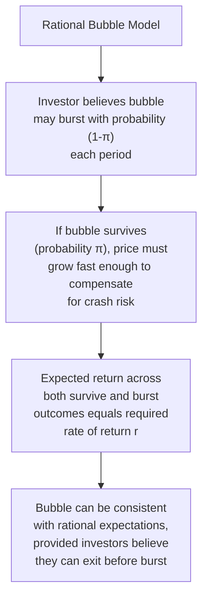
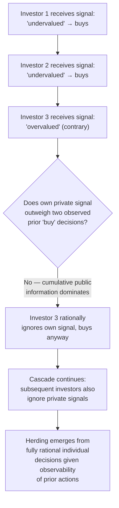
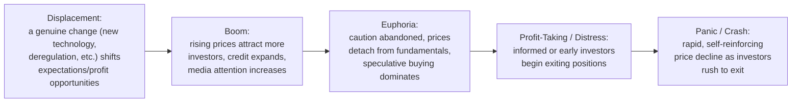

## Behavioral Finance: Bubbles and Herding

### Overview

Behavioral finance examines how psychological biases and social dynamics among market participants can generate systematic, persistent deviations of asset prices from fundamental value — most dramatically in the form of speculative bubbles and their subsequent crashes. This topic covers the psychological mechanisms underlying herding behavior, the theoretical models explaining how rational and irrational behavior can jointly sustain bubbles, and the empirical anatomy of bubble episodes.

### Defining a Bubble

**Key Points**

- An asset price **bubble** is generally characterized as a sustained period in which an asset's market price substantially exceeds its fundamental value (the present value of the asset's expected future cash flows, appropriately discounted), typically followed by a sharp price correction (a "crash") back toward or below fundamental value.
- **[Inference]** Definitively identifying a bubble *in real time* — as opposed to in retrospect after a crash has occurred — is genuinely difficult and contested in the literature, since it requires confidently estimating "fundamental value," which itself depends on uncertain future cash flow and discount rate assumptions; this measurement difficulty is a recurring theme in debates over whether specific historical episodes (e.g., the dot-com era, various housing markets) constituted bubbles at the time or only appear so with hindsight.

### Rational Bubble Models

**Key Points**

- Not all bubble theories require investor irrationality. A **rational bubble** can theoretically exist even among fully rational, forward-looking investors if each investor believes there is a sufficiently high probability that the price will continue rising (compensating for a smaller probability of a crash), such that the expected return remains consistent with equilibrium pricing.
- Formally, a rational bubble component $B_t$ can be appended to the fundamental value $F_t$: $P_t = F_t + B_t$, where the bubble component is expected to grow at the required rate of return $r$ as long as it persists:

$$E_t[B_{t+1}] = (1+r)B_t$$

- This can be consistent with rational expectations if investors assign some probability $\pi$ each period to the bubble surviving (continuing to grow) and probability $(1-\pi)$ to it bursting (collapsing to zero), with the growth rate during the surviving state calibrated so that the *expected* return matches $r$ across both possible outcomes — a "greater fool" dynamic that can nonetheless be internally consistent with rational expectations, provided each investor rationally believes they can exit before the eventual burst.

**[Inference]** Rational bubble models are theoretically elegant but face substantial empirical and conceptual challenges — for instance, standard transversality/no-arbitrage conditions in infinite-horizon models can rule out rational bubbles under certain technical assumptions, and it is difficult to construct empirical tests that cleanly distinguish a rational bubble from an unobserved shift in fundamentals; most applied discussions of historical bubble episodes draw more heavily on behavioral (limited-rationality) mechanisms than on pure rational bubble theory, though the rational framework remains an important benchmark in the theoretical literature.

### Herding Behavior

**Key Points**

- **Herding** refers to the tendency of individuals to align their decisions with the observed decisions of others, rather than acting solely on their own independent information or analysis. Herding is a key behavioral mechanism proposed to amplify and sustain bubble dynamics.

#### Information-Based (Rational) Herding: Informational Cascades

**Key Points**

- One important class of herding models shows that herding can arise even among fully rational, self-interested individuals through an **informational cascade**: if early actors' decisions are publicly observable, later actors may rationally choose to ignore their own private information and instead imitate the observed behavior of predecessors, if the cumulative weight of observed prior decisions outweighs the informational value of their own signal.
- **Illustrative mechanism**: consider a sequence of investors each with a private, imperfect signal about whether an asset is under- or overvalued. If the first two investors happen to receive signals suggesting the asset is undervalued and both buy, a third investor — even one who privately receives a signal suggesting the opposite — may rationally conclude that the two prior "buy" decisions collectively contain more information than their single contrary signal, and therefore also buy, disregarding their own information. Once this occurs, the cascade becomes self-reinforcing: a fourth investor observes three consistent prior decisions and finds it rational to follow suit regardless of their own signal, and so on.

- **Key fragility of informational cascades**: because the cascade is driven by early actors' decisions rather than the accumulation of genuine new information (since later actors stop contributing their own private signals to the public information pool once the cascade begins), cascades can be based on very little actual underlying information and are consequently fragile — a single piece of sufficiently strong new public information can reverse the cascade abruptly, a dynamic often invoked to help explain the suddenness of bubble crashes.

#### Reputation-Based Herding

**Key Points**

- A distinct herding mechanism applies particularly to professional money managers: if a manager's performance is evaluated relative to peers or a benchmark, and career/reputational consequences for underperforming *differently* from peers are asymmetric (deviating from the herd and being wrong is penalized more than following the herd and being wrong collectively), managers may rationally choose to mimic peer behavior (holding similar portfolios) even absent an informational cascade mechanism, purely to avoid the reputational risk of being a conspicuous outlier.
- **[Inference]** This reputation-based mechanism is generally treated in the literature as a distinct, complementary channel from informational cascades — both are grounded in individually rational responses to institutional incentives rather than pure psychological error, and both are commonly cited (alongside genuinely behavioral/psychological herding driven by non-rational biases) as contributing causes of correlated, herd-like trading behavior in practice.

#### Behavioral/Psychological Herding

**Key Points**

- Beyond the rational mechanisms above, purely psychological drivers of herd-like behavior are also proposed, including:
  - **Social proof / conformity bias**: a general human tendency to view an action as more correct or appropriate the more other people are observed doing it.
  - **Fear of missing out (FOMO)**: emotionally driven anxiety about being excluded from perceived widely-shared gains, which can motivate participation in a rising market independent of any careful fundamental analysis.
  - **Extrapolative expectations**: forming expectations about future price changes primarily by extrapolating recent observed price trends, rather than by reference to underlying fundamentals — closely related to the representativeness heuristic discussed in the anomalies literature.

### The Anatomy of a Bubble: A Stylized Framework

**Key Points**

- A commonly referenced descriptive framework (associated with economic historian Charles Kindleberger, building on Hyman Minsky's financial instability framework) characterizes bubble episodes as unfolding through a sequence of stages.

| Stage | Characteristic Behavior |
| --- | --- |
| Displacement | A genuine underlying shift (technological innovation, financial deregulation, new market access) creates plausible new profit opportunities |
| Boom | Prices rise on genuine initial fundamentals-based demand; increasing media coverage and credit availability draw in a wider set of investors |
| Euphoria | Valuations become increasingly disconnected from any plausible fundamental justification; narratives emphasizing "this time is different" become widespread; new, inexperienced investors enter in large numbers |
| Profit-taking / Distress | Sophisticated or early investors begin quietly reducing positions; initial signs of price weakness or negative news begin to appear |
| Panic / Crash | Selling accelerates and becomes self-reinforcing (sometimes amplified by leverage/margin calls forcing further sales), with the price decline often considerably faster than the preceding run-up |

**[Inference]** This staged framework is a widely used descriptive and pedagogical heuristic for organizing historical bubble narratives (frequently applied retrospectively to episodes such as the Dutch tulip mania, the dot-com bubble, and pre-2008 housing markets), but it is a qualitative historical pattern rather than a strict predictive model with quantitatively precise stage transitions — it does not, by itself, allow reliable real-time prediction of when a given boom will transition into euphoria or when a crash will occur.

### Limits to Arbitrage in Bubble Contexts

**Key Points**

- As in the broader efficient markets/anomalies discussion, a central question is why rational arbitrageurs do not simply short an overvalued bubble asset and correct the mispricing. The same **limits to arbitrage** mechanisms apply with particular force during bubbles:
  - **Synchronization risk**: an individual arbitrageur cannot know exactly when other arbitrageurs will also act to correct the mispricing, and shorting "too early" (before the bubble bursts) can result in substantial losses even if the ultimate direction of the bet is correct — famously summarized in the (commonly attributed, though its exact provenance is debated) observation that markets can remain irrational longer than an individual trader can remain solvent.
  - **Short-selling constraints**: borrowing costs, limited stock availability for shorting, and regulatory restrictions can make it costly or impossible to bet against an overvalued asset at scale.
  - **Career/institutional risk for professional managers**: analogous to reputation-based herding, a fund manager who shorts a popular rising asset and is wrong (even temporarily) faces asymmetric career risk relative to a manager who simply follows the crowd.

### Comparing Rational and Behavioral Bubble/Herding Mechanisms

| Mechanism | Requires Investor Irrationality? | Core Driver |
| --- | --- | --- |
| Rational bubble model | No | Rational pricing of ongoing crash risk with sufficiently high survival probability |
| Informational cascade | No | Rational inference from observing others' decisions, given limited private information |
| Reputation-based herding | No | Asymmetric career/reputational incentives around benchmark-relative performance |
| Psychological herding (social proof, FOMO, extrapolation) | Yes | Cognitive biases and social/emotional influences on decision-making |
| Limits to arbitrage | N/A (a constraint on correction, not a cause of mispricing) | Synchronization risk, short-sale constraints, career risk preventing rational correction |

### Related Topics

- Minsky's Financial Instability Hypothesis
- Historical bubble case studies (Dutch tulip mania, South Sea Bubble, dot-com bubble, 2008 housing bubble)
- Informational cascades: formal Bikhchandani-Hirshleifer-Welch model
- Prospect theory and loss aversion in investor decision-making
- Noise trader models and DeLong-Shleifer-Summers-Waldmann framework
- Margin requirements, leverage, and crash amplification mechanisms
- Behavioral biases: overconfidence, representativeness, and extrapolation
- Systemic risk and macroprudential regulation following asset bubbles