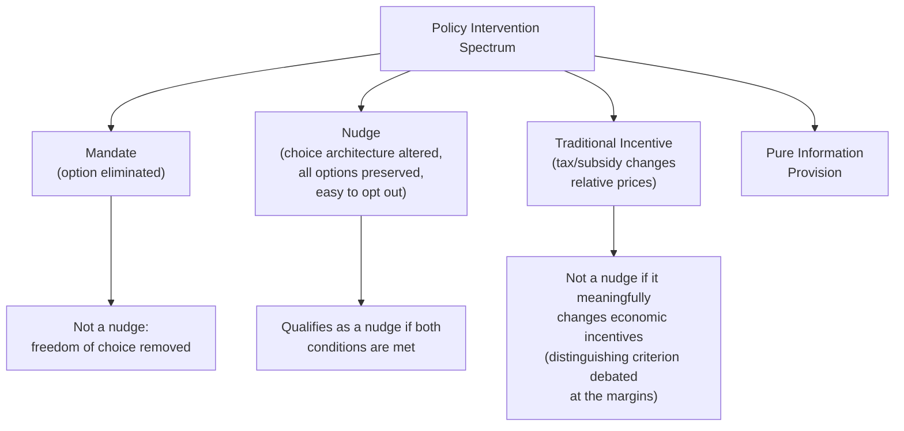
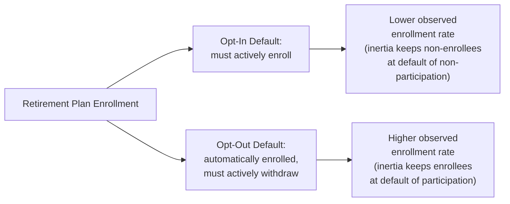
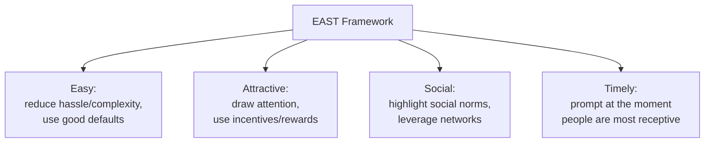

## Nudge Theory and Choice Architecture

### Overview

Nudge theory studies how the design of the environment in which decisions are made — the "choice architecture" — systematically influences the choices people make, even without restricting options or changing economic incentives. Developed primarily by Richard Thaler and Cass Sunstein, this framework applies findings from behavioral economics and psychology to public policy and organizational design, offering an alternative to both pure laissez-faire and traditional mandate-based regulation.

### Defining a Nudge

**Key Points**

- A **nudge**, as originally defined by Thaler and Sunstein, is any aspect of choice architecture that alters people's behavior in a predictable way without forbidding any options or significantly changing their economic incentives.
- Two defining criteria distinguish a nudge from other policy tools:
  1. It must **preserve freedom of choice** — all original options remain available.
  2. It must be **low-cost and easy to avoid** — a person who wants to opt out of the nudge's influence should be able to do so with minimal effort.

**[Inference]** The boundary between a "nudge" and a more traditional economic incentive is not always sharp in practice — a very small tax or subsidy could arguably satisfy the "preserves choice, doesn't significantly change incentives" criteria at some threshold, and this borderline has been a subject of definitional debate within the behavioral policy literature rather than having a single universally agreed dividing line.

### Libertarian Paternalism: The Underlying Philosophy

**Key Points**

- Nudge theory is grounded in the philosophical stance Thaler and Sunstein term **libertarian paternalism**: the view that it is legitimate (and often beneficial) for choice architects (governments, employers, institutions) to deliberately steer people's choices in directions expected to improve their welfare (the paternalistic component), provided that people remain free to choose differently if they wish (the libertarian component).
- This position is explicitly motivated by empirical behavioral economics findings suggesting that people frequently do not act as the fully rational, self-interested optimizers assumed in standard economic models — instead exhibiting systematic cognitive biases, self-control problems, and reliance on heuristics — such that a "neutral" or architecture-free choice environment is, in this view, not actually achievable, since *some* default or framing must always be chosen by the designer of any decision environment.

**[Inference]** The claim that choice architecture neutrality is impossible (that some default must always be set) is a foundational and generally well-accepted premise within the nudge literature; however, the broader normative claim that it is therefore appropriate for institutions to *deliberately* select architecture to steer outcomes toward what the architect judges to be the person's own welfare is a distinct, more contested philosophical position, and has drawn substantive critique from various political and philosophical perspectives (including concerns about paternalism, manipulation, and who gets to define "welfare" — addressed further below).

### Core Choice Architecture Tools

#### Default Options

**Key Points**

- Perhaps the most extensively studied and empirically robust nudge: because changing a default requires deliberate action (opting out), and many people exhibit **status quo bias** and **inertia**, the choice of default option has been found in numerous studies to substantially affect the ultimate distribution of choices made, even though switching away from the default typically remains simple.

**Example**

A commonly cited empirical illustration involves retirement savings plan enrollment: under an "opt-in" default (employees must actively enroll to participate), enrollment rates in employer-sponsored retirement plans have been found in various studies to be substantially lower than under an "opt-out" default (employees are automatically enrolled unless they actively choose to withdraw) — despite the *actual* economic choice being formally identical (employees remain fully free to select either outcome under either default structure).

#### Framing Effects

**Key Points**

- The way information or a choice is **framed** — even while the underlying substantive options remain unchanged — has been found to influence decisions, connecting to prospect theory's finding that people evaluate outcomes relative to a reference point and respond differently to logically equivalent gain-framed versus loss-framed descriptions of the same outcome.
- **Example structure**: describing a medical treatment as having a "90% survival rate" versus a "10% mortality rate" conveys mathematically identical information but has been found in behavioral studies to elicit different responses from both patients and, in some studies, medical professionals — generally with the gain-framed ("survival") description eliciting more favorable evaluations than the logically equivalent loss-framed ("mortality") description.

#### Simplification

**Key Points**

- Reducing the complexity of a choice environment — fewer options, clearer presentation, reduced administrative/procedural burden — can improve decision quality and increase take-up of a given option, since excessive complexity can itself function as an unintentional (and often regressive) barrier, disproportionately affecting those with less time, information, or capacity to navigate complicated choice environments.
- **[Inference]** This connects to a broader finding in behavioral economics, sometimes framed in terms of a "sludge" concept (a term also popularized by Thaler), where excessive friction or complexity in a choice process can function as an implicit nudge *against* an option, even absent any explicit restriction — this is a widely cited concept in the literature for describing frictions that work against a person's own stated interests (e.g., an overly complex benefit application process suppressing take-up), though "sludge" as applied to any specific real-world administrative process can be a matter of interpretation about whether the friction serves a legitimate verification purpose or is genuinely excessive.

#### Social Norms and Social Proof

**Key Points**

- Providing information about what other people typically do (a descriptive social norm) has been found in a range of studies to influence individual behavior, connecting to the social-proof/conformity psychological mechanisms discussed in the herding literature.
- **Example**: informing households that their energy consumption is higher than the average of comparable neighboring households has been used in behavioral "home energy report" programs and studied as a mechanism to reduce energy consumption, without any change in the actual price of electricity.

#### Salience and Reminders

**Key Points**

- Increasing the salience of relevant information (making it more prominent, timely, or attention-grabbing) or providing well-timed reminders has been used and studied as a tool to improve follow-through on previously stated intentions — addressing what behavioral economists term the "intention-action gap," where people form a genuine intention to act (e.g., to pay a bill, attend an appointment, save more) but fail to follow through due to limited attention or forgetting rather than a change of preference.

### The EAST Framework (Applied Behavioral Insights Summary)

**Key Points**

- A widely cited practical summary framework, developed by the UK's Behavioural Insights Team ("the Nudge Unit"), condenses much of the above into four practical design principles for effective behavioral interventions: interventions are generally more effective when they make the desired behavior **Easy**, **Attractive**, **Social**, and **Timely** (EAST).

### Applications in Public Policy

| Domain | Example Nudge Application |
| --- | --- |
| Retirement savings | Automatic enrollment defaults; "Save More Tomorrow" programs committing future salary increases to savings |
| Public health | Simplified, visually salient nutrition labeling; default portion sizes; organ donation opt-out registration systems |
| Tax compliance | Reminder letters citing peer/local compliance norms to increase voluntary tax payment |
| Energy conservation | Comparative home energy usage reports relative to neighbors |
| Education | Simplified financial aid application processes; reminder texts to students/parents about deadlines |
| Environmental policy | Default settings on printers (double-sided) or thermostats favoring lower resource use |

### Critiques of Nudge Theory

**Key Points**

- **Autonomy and manipulation concerns**: critics argue that nudges, by design, exploit psychological biases rather than appealing to a person's deliberative rational faculties, raising a philosophical question of whether this constitutes a form of manipulation even when the stated intent is benevolent — since the technique's effectiveness relies precisely on bypassing careful conscious deliberation.
- **Who defines "welfare"?**: libertarian paternalism presumes the choice architect can identify what outcome is genuinely in the individual's own interest; critics note this presumes a degree of confidence about individual welfare that may not always be warranted, and raises concern about the potential for architects (public or private) to nudge toward outcomes serving the architect's own interests under the guise of paternalistic benevolence.
- **Effect size and replication concerns**: as with the broader behavioral economics literature, some specific nudge effects reported in early or highly publicized studies have faced replication challenges or been found to have smaller effect sizes in later, larger-scale field trials than initially reported — a concern connected to the broader replication crisis discussion across social science disciplines.
- **Distributional and equity considerations**: the effectiveness of some nudges (e.g., those relying on financial literacy or the ability to process complex framed information) may vary systematically across different populations, raising questions about whether nudge-based policy design could have uneven welfare effects across different socioeconomic or demographic groups.
- **Transparency principle as a proposed safeguard**: Thaler and Sunstein themselves proposed a "publicity principle" as a normative safeguard — a nudge should be one that the choice architect would be willing to publicly disclose and defend, on the reasoning that a nudge that could not withstand public scrutiny if revealed is more likely to be an illegitimate manipulation than a benevolent nudge.

**[Inference]** These critiques are actively discussed within both the academic behavioral economics/policy literature and broader public discourse; there is no single resolved consensus on where the line between legitimate choice architecture and problematic manipulation lies, and reasonable scholars within economics, philosophy, and public policy continue to disagree on the appropriate scope and limits of nudge-based policy — this remains a normatively contested area rather than one with a settled professional consensus, distinct from the more empirically established finding that choice architecture does, in fact, systematically influence behavior.

### Related Topics

- Prospect theory and reference-dependent preferences
- Status quo bias and default effects: empirical literature
- The EAST framework and applied "nudge unit" case studies
- Sludge and administrative burden in public benefit programs
- Libertarian paternalism: philosophical critiques and defenses
- Replication crisis considerations in behavioral economics
- Behaviorally-informed regulation vs. traditional command-and-control policy
- Dual-process theory (System 1 / System 2) and its policy implications