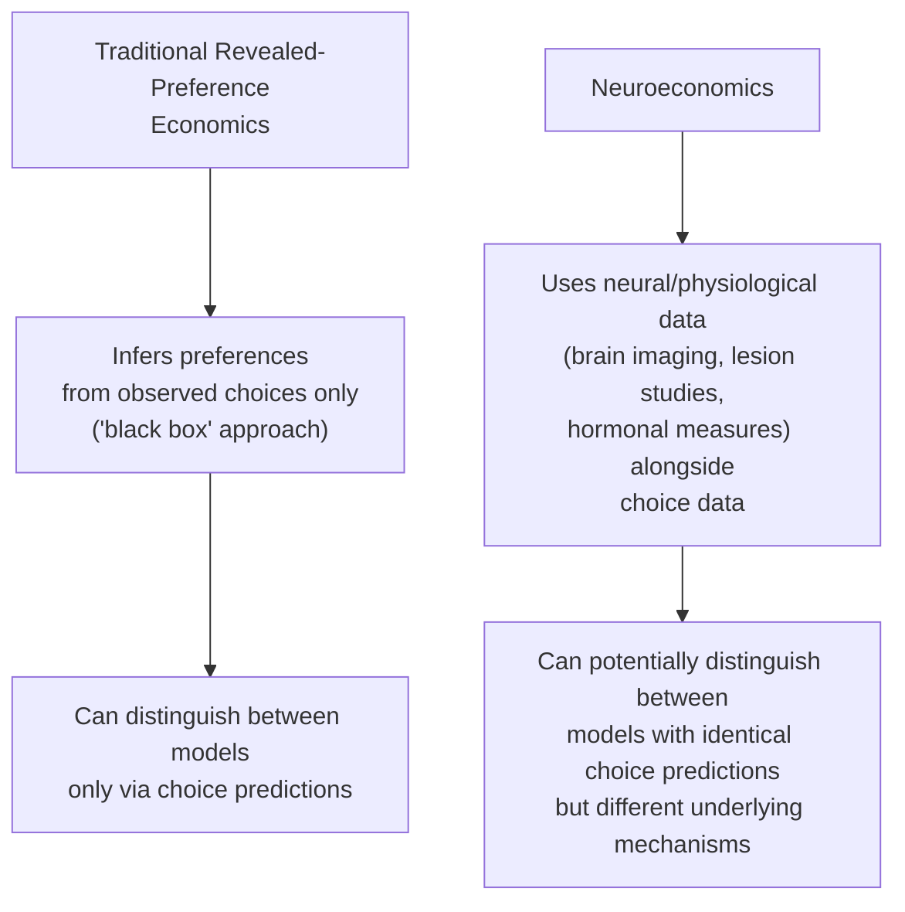
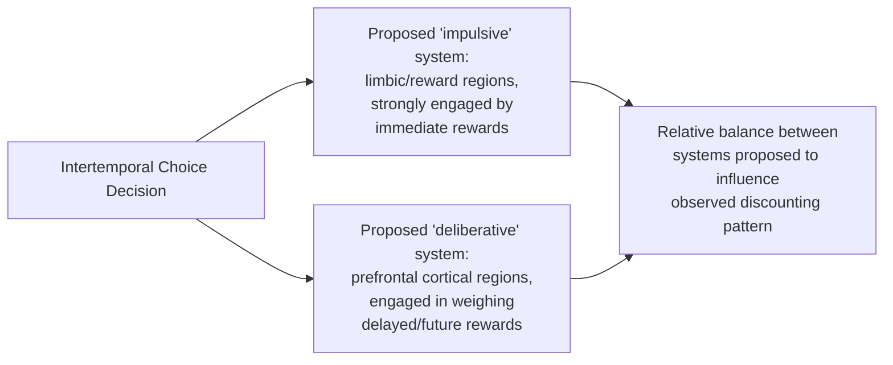

## Neuroeconomics: Decision-Making and the Brain

### Overview

Neuroeconomics is an interdisciplinary field combining neuroscience, psychology, and economics to study the neural mechanisms underlying economic decision-making. Rather than treating preferences and choice as a "black box" inferred solely from observed behavior (the traditional revealed-preference approach in economics), neuroeconomics uses tools such as brain imaging and lesion studies to investigate the biological processes generating decisions, aiming to provide a mechanistic foundation for — and in some cases challenge or refine — behavioral and standard economic models of choice.

### Motivation: Why Bring Neuroscience Into Economics?

**Key Points**

- Traditional economic theory is largely **behaviorist** in methodology: it infers preferences from observed choices without making claims about the internal cognitive or biological process generating those choices (the "as if" methodology — models are judged by predictive accuracy, not by whether they describe actual internal decision mechanisms).
- Neuroeconomics proponents argue that opening this "black box" can: (1) help adjudicate between competing economic models that make identical behavioral predictions but imply different underlying processes, (2) provide independent, process-level evidence for behavioral phenomena (e.g., loss aversion, hyperbolic discounting) that are otherwise inferred only indirectly from choice data, and (3) potentially improve predictive power by incorporating biological constraints and mechanisms directly into economic models.

**[Inference]** The value and appropriate role of neuroeconomic evidence within mainstream economics remains a genuinely debated methodological question — some economists (including prominent skeptics) have argued that neural data is largely irrelevant to economic theory's core purpose of predicting behavior, since economic models are validated by their behavioral predictions rather than their neural realism, while proponents argue that mechanistic evidence can discipline model-building and resolve otherwise indistinguishable competing theories; this is not a settled methodological dispute, and reasonable researchers across economics and neuroscience continue to hold differing views on how central neuroeconomic evidence should be to economic theory going forward.

### Key Neural Substrates Studied in Economic Decision-Making

**Key Points**

- Neuroeconomic research has associated economic decision-making with activity in several brain regions, most prominently:

| Brain Region | Commonly Associated Function in Decision Research |
| --- | --- |
| Ventral striatum (including nucleus accumbens) | Associated with reward anticipation and processing, including monetary reward |
| Prefrontal cortex (particularly ventromedial and dorsolateral regions) | Associated with valuation, self-control, and integration of costs/benefits in deliberative choice |
| Amygdala | Associated with processing of risk, fear, and emotional/affective responses relevant to loss aversion |
| Insula | Associated with processing of aversive or risky outcomes, and interoceptive/bodily-state signals proposed to inform decisions |

**[Inference]** The mapping between specific brain regions and specific economic functions described in the neuroeconomics literature is considerably more provisional and contested than a simple region-to-function table might suggest — most of these regions are understood to participate in multiple, overlapping cognitive processes rather than serving a single dedicated economic function, and the field has faced methodological critique (discussed further below) regarding the interpretive leap from localized neural activation to specific psychological or economic constructs (a concern sometimes referred to in the broader neuroscience methodology literature as the risk of "reverse inference").

### Neuroeconomic Evidence for Behavioral Phenomena

#### Loss Aversion and the Amygdala/Striatum

**Key Points**

- Neuroeconomic studies have examined whether the behavioral finding of loss aversion (losses looming larger than equivalent gains, central to prospect theory) has an identifiable neural signature — for instance, examining whether neural responses to anticipated or realized losses in reward-related brain regions are asymmetrically larger in magnitude than responses to equivalent-sized gains.
- **[Inference]** Findings in this specific area of the literature have been mixed, with some studies reporting neural asymmetries consistent with behavioral loss aversion and others failing to find a clean, consistent neural correlate; this is an area of active and unresolved empirical investigation rather than one with a single confirmed neural mechanism for loss aversion.

#### Intertemporal Choice and Dual-System Models

**Key Points**

- A prominent and influential line of neuroeconomic research has examined intertemporal choice (the trade-off between smaller-sooner and larger-later rewards) using a proposed **dual-system framework**, associating relatively more "impulsive" valuation of immediate rewards with limbic/reward-related brain systems and relatively more "patient," deliberative valuation with prefrontal cortical regions.
- This research has been used to provide a proposed neural account of **hyperbolic discounting** (the behavioral finding that people's implicit discount rates are higher over short horizons close to the present than over longer horizons further in the future, in contrast to the constant discount rate assumed in standard exponential discounting models) — the idea being that immediate rewards may engage a distinct, more strongly weighted neural valuation system than delayed rewards.

**[Inference]** This dual-system neural account of hyperbolic discounting, while influential and widely cited in early neuroeconomics literature (notably associated with a prominent 2004 study by McClure, Laibson, Loewenstein, and Cohen), has also faced subsequent methodological critique and has not been uniformly replicated or confirmed across all follow-up studies; the strict two-system dichotomy is generally regarded within contemporary neuroeconomics as a considerable simplification of what is likely a more continuously graded and distributed set of neural valuation processes, rather than a fully settled, confirmed dual-system architecture.

#### Social Preferences and Fairness

**Key Points**

- Neuroeconomic studies using economic games such as the Ultimatum Game (where one player proposes a division of a sum and a second player can accept or reject it, with rejection resulting in both players receiving nothing) have examined neural responses to perceived unfair offers, with some studies reporting activation in regions associated with disgust/aversive processing (e.g., the anterior insula) in response to unfair proposals, proposed as a potential neural correlate of the documented behavioral tendency to reject unfair offers even at a direct monetary cost to the rejecting player (a finding difficult to reconcile with a narrowly self-interested rational-choice model).

### Methodological Approaches in Neuroeconomics

| Method | Description | Key Strength | Key Limitation |
| --- | --- | --- | --- |
| Functional MRI (fMRI) | Measures blood-oxygen-level-dependent (BOLD) signal as a proxy for regional neural activity during decision tasks | Good spatial resolution; widely used, large existing literature | Indirect (measures blood flow, not neurons directly); limited temporal resolution; correlational, not causal |
| Lesion studies | Examine decision-making in patients with damage to specific brain regions | Can provide more direct evidence of a region's necessity for a given function (closer to causal inference) | Rare, heterogeneous patient populations; damage often not cleanly localized to a single region |
| Single-neuron recording (primarily in animal models) | Directly records electrical activity of individual neurons | High temporal and spatial precision at the cellular level | Limited applicability to complex human economic decisions; ethical/practical constraints on human studies |
| Psychophysiological measures (skin conductance, pupil dilation, hormone assays) | Measures peripheral physiological correlates of arousal/affective state during decisions | Non-invasive, lower cost than imaging | Provides only indirect, low-resolution signal about specific decision-relevant neural processes |
| Transcranial magnetic/direct current stimulation (TMS/tDCS) | Temporarily and reversibly disrupts or modulates activity in a targeted brain region | Allows more direct causal testing of a region's role (temporarily "lesioning" a specific area) | Limited spatial precision and depth of effect; interpretation of behavioral changes still requires care |

### Methodological Critiques of Neuroeconomics

**Key Points**

- **Reverse inference problem**: inferring a specific cognitive process (e.g., "the person felt regret") from observed activation in a brain region merely because that region has been *associated* with that process in prior studies is a form of reasoning (reverse inference) that critics argue is often statistically and logically weaker than commonly presented, since most brain regions are engaged by multiple distinct cognitive processes, not a single one.
- **Small sample sizes and statistical power**: neuroimaging studies, particularly earlier work in the field, have often used relatively small sample sizes, raising concerns (shared with the broader psychology/neuroscience replication crisis discussion) about statistical power and the reliability of specific reported findings.
- **Correlational nature of most neural evidence**: the majority of neuroeconomic evidence (particularly fMRI-based) is correlational, documenting an association between neural activity and choice behavior rather than establishing that the neural activity causally drives the choice — a limitation partially, though not fully, addressed by lesion and stimulation-based methods.
- **The "so what" question for economic theory**: even when a robust neural correlate of a behavioral phenomenon is established, critics have questioned what additional predictive or explanatory value this adds beyond the behavioral finding itself, since economic policy and modeling ultimately concern predicting and explaining choices, which can in principle be modeled directly from choice data without reference to the underlying neural mechanism.

**[Inference]** These methodological critiques are widely acknowledged within the neuroeconomics field itself, and contemporary neuroeconomic research has generally moved toward more rigorous designs (larger samples, pre-registration, greater use of causal methods like TMS and lesion studies) partly in response; nonetheless, the broader question of how much neuroeconomic evidence should influence mainstream economic theory and policy design remains genuinely unresolved and is approached differently across different sub-communities within economics and neuroscience.

### Neuroeconomics in Relation to Behavioral Economics

| Dimension | Behavioral Economics | Neuroeconomics |
| --- | --- | --- |
| Primary data source | Observed choices, often from controlled experiments or field data | Neural, physiological, and choice data combined |
| Primary goal | Document and model systematic deviations from standard rational-choice predictions | Identify underlying biological/neural mechanisms generating choices, including but not limited to behavioral deviations |
| Relationship to standard economic theory | Generally treated as extending/amending standard models with psychologically richer assumptions | Aims to provide a mechanistic, biological foundation potentially informing model-building at a more basic level |
| Methodological maturity/consensus | Well-established subfield with substantial integration into mainstream economics (e.g., Nobel recognition for Kahneman, Thaler) | Newer, more methodologically contested subfield with less consensus on its appropriate role within economics |

### Related Topics

- Prospect theory and its proposed neural correlates
- Hyperbolic discounting: behavioral evidence and the dual-system debate
- Ultimatum game and neuroeconomic studies of fairness
- Reverse inference and methodological critiques in cognitive neuroscience
- Dopamine and reward prediction error models in economic learning
- Neuroeconomics of risk and ambiguity aversion
- Replication crisis considerations in neuroimaging research
- Philosophy of economic methodology: "as if" rationality vs. mechanistic realism