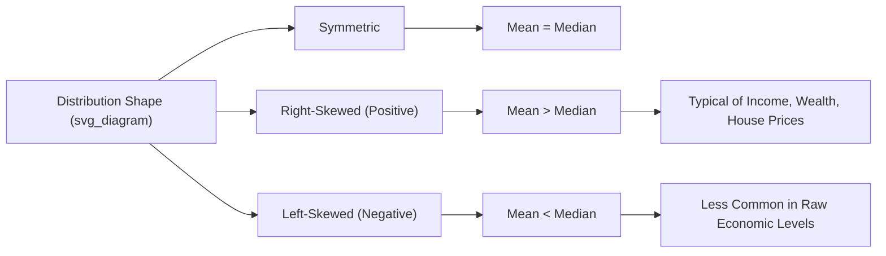

## Descriptive Statistics for Economic Data

### Overview

Descriptive statistics summarize and characterize the essential features of economic datasets — central tendency, dispersion, shape, and relationships between variables — before any inferential or causal analysis is attempted. In econometrics, careful descriptive analysis is a prerequisite step: it reveals data quality issues, distributional peculiarities (skewness, outliers, heteroskedasticity), and relationships that inform model specification.

**Key Points**

- Descriptive statistics are summary measures computed directly from observed data, distinct from inferential statistics, which draw conclusions about a broader population from a sample.
- Economic data frequently exhibits properties (skewness in income/wealth, non-stationarity in time series, heteroskedasticity) that make naive application of standard summary statistics misleading without diagnostic checks.
- The choice between mean vs. median, or standard deviation vs. interquartile range, is not merely stylistic — it materially affects interpretation for skewed economic variables like income and wealth.

### Measures of Central Tendency

#### Mean (Arithmetic Average)

$$\bar{x} = \frac{1}{n}\sum_{i=1}^{n} x_i$$

The mean is the most common summary of central tendency but is **sensitive to outliers and skewness** — a property with major practical consequences in economics.

**Example**: In a sample of 10 households with annual incomes of $30k, $32k, $35k, $38k, $40k, $42k, $45k, $48k, $50k, and $500k (one very high earner), the mean income is $86k — a figure that misrepresents the typical household, since 9 of 10 households earn well below this amount. This is precisely why income distributions are almost always reported using the median alongside, or instead of, the mean.

#### Median

The median is the middle value when data is sorted in ascending order (or the average of the two middle values for even $n$). It is **robust to outliers**, making it the standard summary statistic for skewed economic variables like income, wealth, and house prices.

**Example**: Using the same 10-household sample above, the median (average of the 5th and 6th sorted values, $40k and $42k) is $41k — a far more representative measure of the "typical" household's income than the $86k mean.

#### Mode

The most frequently occurring value(s) in a dataset. Less commonly used for continuous economic variables (e.g., GDP, income) but relevant for categorical/discrete economic data (e.g., most common household size, most frequently chosen product category in survey data).

#### Choosing Between Mean and Median

| Situation | Preferred Measure | Rationale |
| --- | --- | --- |
| Symmetric distribution, no major outliers | Mean | Uses all data points; standard in most regression contexts |
| Income or wealth distributions | Median | Highly right-skewed by high earners; mean overstates typical experience |
| Housing prices | Median | Small number of very high-value properties skew the mean upward |
| Comparing central bank inflation targets | Mean (of price index changes) | Aggregation properties matter more than robustness to outliers in this context |

### Measures of Dispersion

#### Variance and Standard Deviation

$$\sigma^2 = \frac{1}{n}\sum_{i=1}^{n}(x_i - \bar{x})^2 \quad \text{(population variance)}$$

$$s^2 = \frac{1}{n-1}\sum_{i=1}^{n}(x_i - \bar{x})^2 \quad \text{(sample variance)}$$

The denominator $n-1$ in the sample variance formula is **Bessel's correction**; it adjusts for the fact that using the sample mean $\bar{x}$ (rather than the unknown true population mean) in the sum of squared deviations introduces a slight downward bias, and this correction ensures the sample variance is an unbiased estimator of the population variance.

Standard deviation, $s = \sqrt{s^2}$, expresses dispersion in the **same units as the original variable**, making it more interpretable than variance for communicating spread (e.g., "$5,000" rather than "25,000,000 dollars-squared").

#### Coefficient of Variation

$$CV = \frac{s}{\bar{x}}$$

A unit-free, relative measure of dispersion, useful for comparing variability across variables measured in different units or scales — for example, comparing the relative volatility of a country's inflation rate versus its GDP growth rate, which are on different numeric scales.

#### Interquartile Range (IQR)

$$IQR = Q_3 - Q_1$$

The difference between the 75th percentile ($Q_3$) and 25th percentile ($Q_1$). Like the median, the IQR is **robust to outliers**, making it the natural companion measure of spread when the median is used as the central tendency measure for skewed economic data.

**Example**: For a right-skewed wealth distribution, reporting "median wealth = $120,000, IQR = $95,000" gives a more robust picture of the middle 50% of the population's wealth spread than reporting the standard deviation, which would be heavily inflated by a small number of extremely wealthy households.

### Measures of Shape

#### Skewness

$$\text{Skewness} = \frac{\frac{1}{n}\sum_{i=1}^{n}(x_i - \bar{x})^3}{s^3}$$

- **Positive (right) skew**: Long tail extends to the right; mean > median. Characteristic of income, wealth, firm size, and house price distributions, where a small number of very high values pull the mean upward.
- **Negative (left) skew**: Long tail extends to the left; mean < median. Less common in raw economic level variables but can appear in variables like standardized test score gaps or bounded satisfaction indices near a ceiling.
- **Zero skew**: Symmetric distribution (e.g., the normal distribution).

#### Kurtosis

$$\text{Kurtosis} = \frac{\frac{1}{n}\sum_{i=1}^{n}(x_i - \bar{x})^4}{s^4}$$

Measures the "tailedness" of a distribution — the propensity for extreme values relative to a normal distribution (which has kurtosis = 3, so "excess kurtosis" is often reported as Kurtosis − 3).

- **Leptokurtic** (excess kurtosis > 0): Fat tails, more extreme outliers than normal — a well-documented feature of daily financial asset returns (stock returns, exchange rate changes), where extreme moves occur more frequently than a normal distribution would predict.
- **Platykurtic** (excess kurtosis < 0): Thinner tails, fewer extreme values than normal.

### Visualizing Distributions

Common graphical descriptive tools in economic data analysis:

- **Histograms**: Show the frequency distribution of a single variable; essential first step in detecting skewness, multimodality, or unusual data clustering (e.g., "heaping" at round numbers in self-reported income surveys).
- **Box plots**: Compactly display median, IQR, and outliers; useful for comparing a distribution's shape across categories (e.g., wage distributions by education level).
- **Scatter plots**: Reveal the bivariate relationship between two variables, often a precursor to correlation or regression analysis (e.g., GDP per capita vs. life expectancy across countries).
- **Time series (line) plots**: Reveal trend, seasonality, structural breaks, and volatility clustering in economic time series data (e.g., quarterly GDP, monthly unemployment rate).

### Illustrative Diagram: Skewness and Central Tendency Relationship

### Measures of Association Between Variables

#### Covariance

$$\text{Cov}(X,Y) = \frac{1}{n}\sum_{i=1}^{n}(x_i - \bar{x})(y_i - \bar{y})$$

Indicates the direction of the linear relationship between two variables but is **not standardized**, so its magnitude is not directly interpretable across different variable pairs (it depends on the units of $X$ and $Y$).

#### Correlation Coefficient (Pearson's $r$)

$$r = \frac{\text{Cov}(X,Y)}{s_X \cdot s_Y}$$

A standardized measure bounded between $-1$ and $+1$, indicating both the strength and direction of the **linear** relationship between two variables.

- $r = +1$: perfect positive linear relationship.
- $r = -1$: perfect negative linear relationship.
- $r = 0$: no linear relationship (does not rule out a strong *non-linear* relationship).

**Example**: A correlation of $r = 0.85$ between education years and log hourly wages in a cross-sectional survey suggests a strong positive linear association, though correlation alone does not establish that education *causes* higher wages (a foundational distinction addressed later in a course through instrumental variables and other causal identification strategies). [Inference: the "correlation is not causation" caveat is a universally accepted methodological principle in econometrics, not a controversial claim specific to this example]

**Caution — Correlation and Non-Linearity**: Pearson's $r$ only captures linear association. Two variables can have a strong, clearly patterned relationship (e.g., a U-shaped relationship between age and happiness/income found in some studies) and still show a low or near-zero Pearson correlation, because the linear-fit measure is not designed to detect that shape of relationship.

### Descriptive Statistics Specific to Economic Time Series

Time series economic data (GDP, inflation, unemployment, stock prices) requires additional descriptive considerations beyond cross-sectional data:

- **Growth rates**: Often more meaningful than levels. The period-over-period growth rate is calculated as $g_t = \frac{x_t - x_{t-1}}{x_{t-1}} \times 100\%$, and log-differences $\ln(x_t) - \ln(x_{t-1})$ are frequently used as an approximation for percentage growth rates, particularly convenient for compounding and additive decomposition over multiple periods.
- **Seasonality**: Many economic series (retail sales, unemployment claims) exhibit predictable within-year patterns; descriptive analysis often involves examining seasonally adjusted vs. unadjusted series.
- **Autocorrelation**: The correlation of a series with its own lagged values, $\text{Corr}(x_t, x_{t-k})$, is a key descriptive diagnostic for time series, indicating the degree of persistence or momentum in the data — relevant background for later study of ARIMA and other time series models.
- **Volatility clustering**: A commonly observed pattern in financial and some macroeconomic series, where periods of high volatility tend to cluster together rather than being independently distributed across time — descriptively visible in rolling standard deviation plots, and formally addressed later through ARCH/GARCH models.

### Percentiles, Quantiles, and Income Distribution Analysis

Economic analysis of income and wealth inequality relies heavily on quantile-based descriptive statistics beyond the median:

- **Quintiles/Deciles**: Dividing a population into 5 or 10 equal-sized groups ranked by income/wealth, used to construct measures like the ratio of the top decile's income share to the bottom decile's.
- **Lorenz Curve**: A graphical descriptive tool plotting the cumulative share of total income (y-axis) against the cumulative share of population, ordered from poorest to richest (x-axis). A perfectly equal distribution produces a 45-degree line; greater bowing away from this line indicates greater inequality.
- **Gini Coefficient**: Derived from the Lorenz Curve, calculated as twice the area between the 45-degree line of perfect equality and the observed Lorenz Curve. Ranges from 0 (perfect equality) to 1 (perfect inequality, one individual holds all income).

### Common Pitfalls in Descriptive Analysis of Economic Data

- **Reporting mean without checking skewness**: For income, wealth, or firm-size data, reporting only the mean without the median or a skewness statistic can materially mislead readers about "typical" values.
- **Ignoring inflation adjustment**: Comparing nominal economic values (unadjusted for inflation) across different time periods without converting to real (inflation-adjusted) terms produces misleading trend descriptions — nominal GDP growth, for example, conflates real output growth with pure price-level changes.
- **Simpson's Paradox**: A descriptive relationship observed in aggregated data can reverse or disappear when the data is disaggregated by a relevant subgroup (e.g., an aggregate wage gap trend that reverses once disaggregated by industry or region), making it important to check whether a descriptive summary is stable across natural subgroups. [Inference: whether a specific real-world aggregate reverses upon disaggregation is an empirical question that must be checked case by case; the general phenomenon itself is a well-documented statistical property]
- **Survivorship bias in economic panels**: Firms or households that exit a dataset (business failure, survey attrition) are often systematically different from those that remain, biasing descriptive summaries of the surviving sample if not accounted for.

### Conclusion

Descriptive statistics form the essential first stage of any econometric analysis, providing the summary picture of central tendency, dispersion, shape, and bivariate association that guides subsequent model choice. Because economic variables — income, wealth, firm size, financial returns — frequently violate the assumption of a well-behaved symmetric distribution, econometric practice places particular emphasis on robust statistics (median, IQR) alongside classical ones (mean, standard deviation), and on visual diagnostic tools to catch skewness, outliers, and structural patterns before inferential methods are applied.

**Next Steps**

- Probability Distributions in Econometrics (Normal, Log-Normal, Binomial)
- Inferential Statistics: Hypothesis Testing and Confidence Intervals
- Simple and Multiple Linear Regression (OLS estimation)
- Correlation vs. Causation and the Identification Problem
- Time Series Concepts: Stationarity, Autocorrelation, and ARIMA Models
- Inequality Measurement: Gini Coefficient, Lorenz Curves, and Theil Index
- Heteroskedasticity and Robust Standard Errors