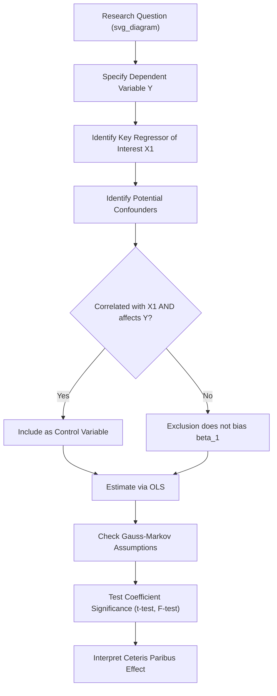

## Simple and Multiple Linear Regression

### Overview

Linear regression is the core estimation technique in econometrics for quantifying the relationship between a dependent variable and one or more explanatory variables. Simple linear regression models this relationship with a single regressor; multiple linear regression extends the framework to several regressors simultaneously, allowing researchers to estimate the effect of one variable while holding others constant — a critical feature for approximating causal inference from observational economic data.

**Key Points**

- Ordinary Least Squares (OLS) is the standard estimation method, chosen because it is the Best Linear Unbiased Estimator (BLUE) under the Gauss-Markov assumptions.
- Multiple regression allows researchers to control for confounding variables, isolating the *ceteris paribus* (all else equal) effect of a variable of interest — the central motivation for its use in applied economics.
- The validity of regression estimates depends on a specific set of assumptions; violations lead to bias, inefficiency, or invalid inference, and diagnosing these violations is a core econometric skill.

### Simple Linear Regression: Model Specification

The simple linear regression model relates a dependent variable $Y$ to a single independent variable $X$:

$$Y_i = \beta_0 + \beta_1 X_i + u_i$$

Where:

- $Y_i$ = dependent variable (the outcome being explained) for observation $i$
- $X_i$ = independent/explanatory variable for observation $i$
- $\beta_0$ = intercept (the predicted value of $Y$ when $X = 0$)
- $\beta_1$ = slope coefficient (the change in $Y$ associated with a one-unit change in $X$)
- $u_i$ = error term, capturing all factors affecting $Y_i$ other than $X_i$, including measurement error and omitted influences

**Example**: Estimating the relationship between years of education ($X$) and hourly wage ($Y$) using a cross-sectional survey. A fitted equation $\hat{wage} = 8.50 + 1.20 \cdot education$ suggests each additional year of education is associated with a $1.20 increase in predicted hourly wage, holding nothing else constant since no other regressors are included.

### Ordinary Least Squares (OLS) Estimation

OLS chooses $\hat{\beta}_0$ and $\hat{\beta}_1$ to minimize the sum of squared residuals (SSR):

$$\min_{\hat{\beta}_0, \hat{\beta}_1} \sum_{i=1}^{n}(Y_i - \hat{\beta}_0 - \hat{\beta}_1 X_i)^2$$

The resulting closed-form estimators are:

$$\hat{\beta}_1 = \frac{\sum_{i=1}^{n}(X_i - \bar{X})(Y_i - \bar{Y})}{\sum_{i=1}^{n}(X_i - \bar{X})^2} = \frac{\text{Cov}(X,Y)}{\text{Var}(X)}$$

$$\hat{\beta}_0 = \bar{Y} - \hat{\beta}_1 \bar{X}$$

The **residual** for observation $i$ is $\hat{u}_i = Y_i - \hat{Y}_i$, the difference between the observed and predicted value. OLS minimizes squared (rather than absolute) residuals partly because squaring penalizes large deviations more heavily and yields a mathematically tractable closed-form solution via calculus.

### Multiple Linear Regression: Model Specification

$$Y_i = \beta_0 + \beta_1 X_{1i} + \beta_2 X_{2i} + \cdots + \beta_k X_{ki} + u_i$$

Each coefficient $\beta_j$ is interpreted as the change in $Y$ associated with a one-unit increase in $X_j$, **holding all other included regressors constant** — the *ceteris paribus* interpretation that is the primary reason economists prefer multiple regression over a series of separate simple regressions.

**Example**: Extending the wage model with experience and a gender indicator:

$$\hat{wage} = 6.20 + 1.05 \cdot education + 0.30 \cdot experience - 1.80 \cdot female$$

Here, the coefficient on education (1.05) represents the estimated effect of an additional year of schooling on wages *holding experience and the gender indicator fixed* — distinct from, and typically smaller than, the coefficient in the simple regression above (1.20), because part of the simple regression's education coefficient was previously absorbing the correlation between education and experience/gender rather than isolating education's own effect.

### The Gauss-Markov Assumptions

OLS is BLUE (Best Linear Unbiased Estimator) under the following classical assumptions:

1. **Linearity in parameters**: The model is linear in the coefficients (though $X$ variables themselves can be transformed, e.g., $X^2$, $\ln(X)$).
2. **Random sampling**: The data $\{(X_i, Y_i)\}$ is a random sample from the population of interest.
3. **No perfect multicollinearity**: No independent variable is a perfect linear function of the others (and there is some variation in each $X$).
4. **Zero conditional mean (exogeneity)**: $E(u_i | X_{1i}, \ldots, X_{ki}) = 0$ — the error term is uncorrelated with the regressors, meaning no relevant explanatory variable is omitted that is also correlated with an included regressor.
5. **Homoskedasticity**: $\text{Var}(u_i | X_{1i}, \ldots, X_{ki}) = \sigma^2$ — constant error variance across all levels of the regressors.
6. **No autocorrelation** (relevant primarily for time series data): $\text{Cov}(u_i, u_j | X) = 0$ for $i \neq j$.

Assumptions 1–4 are required for OLS to be **unbiased**; adding assumptions 5 and 6 (homoskedasticity and no autocorrelation) allows OLS to also be the **most efficient** (lowest variance) among all linear unbiased estimators — this is the content of the Gauss-Markov theorem.

### Goodness of Fit: R-Squared

$$R^2 = 1 - \frac{SSR}{SST} = \frac{SSE}{SST}$$

Where $SST$ (total sum of squares) $= \sum(Y_i - \bar{Y})^2$, $SSR$ (sum of squared residuals) $= \sum(Y_i - \hat{Y}_i)^2$, and $SSE$ (explained sum of squares) $= \sum(\hat{Y}_i - \bar{Y})^2$, with $SST = SSE + SSR$.

$R^2$ represents the proportion of variation in $Y$ explained by the regressors, ranging from 0 to 1. A key caveat: **$R^2$ mechanically increases (or stays the same) whenever an additional regressor is added**, regardless of that regressor's true relevance, which motivates the use of **adjusted $R^2$**:

$$\bar{R}^2 = 1 - (1 - R^2)\frac{n-1}{n-k-1}$$

Adjusted $R^2$ imposes a penalty for each additional regressor, and can decrease if a newly added variable does not improve fit enough to offset the loss of a degree of freedom, making it a more appropriate comparison tool across models with different numbers of regressors than raw $R^2$.

**Caution**: A high $R^2$ does not imply that the regressors *cause* $Y$, nor does a low $R^2$ imply the model is "wrong" — in cross-sectional microeconomic data with substantial individual-level heterogeneity, even a correctly specified and causally interpretable model may have a modest $R^2$, since much of the variation in outcomes like individual wages or spending stems from factors not captured by observable regressors.

### Hypothesis Testing on Coefficients

Each estimated coefficient has an associated standard error, $SE(\hat{\beta}_j)$, used to construct a **t-statistic** for testing $H_0: \beta_j = 0$ against $H_1: \beta_j \neq 0$:

$$t = \frac{\hat{\beta}_j - 0}{SE(\hat{\beta}_j)}$$

Under the null hypothesis and standard assumptions, this statistic follows a $t$-distribution with $n - k - 1$ degrees of freedom. If $|t|$ exceeds the critical value for a chosen significance level (commonly 5%), the null hypothesis is rejected, and $X_j$ is said to have a **statistically significant** relationship with $Y$ at that significance level.

**Confidence interval** for $\beta_j$ at the 95% level:

$$\hat{\beta}_j \pm t_{0.025, \, n-k-1} \cdot SE(\hat{\beta}_j)$$

**Joint hypothesis testing**: To test whether *multiple* coefficients are simultaneously zero (e.g., $H_0: \beta_2 = \beta_3 = 0$), an **F-test** is used rather than separate t-tests, since testing coefficients one at a time does not correctly control the overall significance level of a joint claim:

$$F = \frac{(SSR_{restricted} - SSR_{unrestricted})/q}{SSR_{unrestricted}/(n-k-1)}$$

where $q$ is the number of restrictions being tested.

### Omitted Variable Bias

A central motivation for multiple regression is avoiding **omitted variable bias (OVB)** — bias that arises when a relevant variable correlated with an included regressor is left out of the model. If the true model is $Y = \beta_0 + \beta_1 X_1 + \beta_2 X_2 + u$ but $X_2$ is omitted, the simple regression coefficient on $X_1$ will be biased unless $X_2$ is uncorrelated with $X_1$:

$$E(\hat{\beta}_1^{simple}) = \beta_1 + \beta_2 \cdot \delta_1$$

where $\delta_1$ is the coefficient from regressing the omitted $X_2$ on the included $X_1$. The direction of bias depends on the signs of $\beta_2$ and $\delta_1$.

**Example**: Omitting "ability" from a wage-education regression. If ability positively affects wages ($\beta_2 > 0$) and is positively correlated with education ($\delta_1 > 0$), the simple regression of wages on education alone will produce an **upward-biased** estimate of the return to education, since part of the "ability effect" is incorrectly attributed to education. This is a classic and widely discussed example in labor economics of why the observed education-wage correlation may overstate education's true causal effect.

### Dummy (Indicator) Variables

Categorical variables are incorporated using **dummy variables** coded 0/1.

- For a binary category (e.g., gender), one dummy variable suffices, with the omitted category serving as the reference group against which the dummy's coefficient is interpreted.
- For a categorical variable with $m$ categories (e.g., region with 4 regions), $m - 1$ dummies are included to avoid the **dummy variable trap** — perfect multicollinearity that arises if all $m$ dummies are included alongside an intercept, since the dummies would then sum to 1 for every observation, exactly duplicating the intercept term.

**Interaction terms**: Multiplying a dummy by a continuous variable (e.g., $female_i \times education_i$) allows the *slope* of the continuous variable to differ by group, not just the intercept — useful for testing whether the return to education differs by gender.

### Illustrative Diagram: Regression Model Building Logic

### Functional Form Extensions

- **Log-linear models**: $\ln(Y) = \beta_0 + \beta_1 X + u$ — $\beta_1$ is interpreted (for small values) as the approximate percentage change in $Y$ for a one-unit change in $X$.
- **Log-log models**: $\ln(Y) = \beta_0 + \beta_1 \ln(X) + u$ — $\beta_1$ is interpreted directly as an **elasticity**, the percentage change in $Y$ for a 1% change in $X$, a specification widely used for estimating demand elasticities.
- **Quadratic terms**: $Y = \beta_0 + \beta_1 X + \beta_2 X^2 + u$ — allows for a non-linear (e.g., U-shaped or inverted-U) relationship, common in modeling the age-earnings profile, where earnings rise with age/experience before eventually declining or flattening.
- **Polynomial and spline extensions** allow further flexibility but risk overfitting if used without theoretical justification.

### Common Violations and Diagnostic Concerns

| Violation | Consequence | Common Diagnostic/Remedy |
| --- | --- | --- |
| Heteroskedasticity | OLS remains unbiased but no longer efficient; standard errors are invalid | Breusch-Pagan or White test; use heteroskedasticity-robust standard errors |
| Multicollinearity (high but imperfect) | Inflated standard errors, imprecise individual coefficient estimates | Variance Inflation Factor (VIF); consider dropping or combining correlated regressors |
| Omitted variable bias | Biased and inconsistent coefficient estimates | Include theoretically relevant controls; consider instrumental variables |
| Autocorrelation (time series) | OLS remains unbiased but inefficient; standard errors invalid | Durbin-Watson test; use Newey-West standard errors |
| Endogeneity (reverse causality, simultaneity) | Biased and inconsistent estimates | Instrumental variables, natural experiments, panel data methods |

[Inference: the specific diagnostic test names listed (Breusch-Pagan, White, Durbin-Watson, Newey-West) reflect standard econometric practice widely taught at the introductory-to-intermediate level; behavior and availability of specific implementations may vary across statistical software packages]

### Worked Numerical Example

Suppose a regression of monthly consumer spending ($Y$, in dollars) on monthly income ($X_1$, in thousands of dollars) and a dummy for homeownership ($X_2$, 1 = owns home) yields:

$$\hat{spending} = 450 + 62 \cdot income - 85 \cdot homeowner$$

with $R^2 = 0.61$, $n = 200$, and $SE(\hat{\beta}_{income}) = 8.5$.

- **Interpretation of $\hat{\beta}_1 = 62$**: Holding homeownership status constant, each additional $1,000 of monthly income is associated with a $62 increase in predicted monthly spending.
- **Interpretation of $\hat{\beta}_2 = -85$**: Holding income constant, homeowners are predicted to spend $85 less per month than non-homeowners, potentially reflecting that homeowners direct funds toward mortgage payments outside the "consumer spending" category being measured. [Inference: this is one plausible economic interpretation for illustration; the actual explanation for such a coefficient in real data would require further investigation, and a negative sign is not automatically evidence of any single causal story]
- **Significance test**: $t = \frac{62}{8.5} = 7.29$, which exceeds the critical value (approximately 1.96) at the 5% significance level with this sample size, so the income coefficient is statistically significant at conventional levels.
- **$R^2 = 0.61$**: Approximately 61% of the variation in monthly spending across households in this sample is explained by income and homeownership status jointly.

### Conclusion

Simple and multiple linear regression form the analytical backbone of applied econometrics, providing a tractable framework for estimating relationships between economic variables while explicitly controlling for confounding factors. The reliability of OLS estimates rests critically on the Gauss-Markov assumptions, particularly the zero conditional mean assumption — violations of which (most commonly via omitted variables or reverse causality) motivate the more advanced causal identification methods developed later in econometrics (instrumental variables, difference-in-differences, regression discontinuity).

**Related Topics**

- Gauss-Markov Theorem and Properties of OLS Estimators
- Heteroskedasticity: Detection and Robust Standard Errors
- Multicollinearity and Variance Inflation Factors
- Omitted Variable Bias and Confounding
- Instrumental Variables and Two-Stage Least Squares
- Dummy Variables, Interaction Terms, and Functional Form
- Panel Data Methods: Fixed Effects and Random Effects
- Difference-in-Differences and Natural Experiments