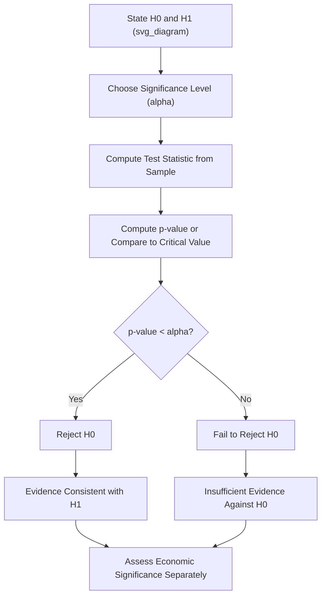

## Hypothesis Testing and Confidence Intervals

### Overview

Hypothesis testing and confidence intervals are the two core tools of statistical inference, allowing economists to draw conclusions about an unknown population parameter (a mean, a proportion, a regression coefficient) from a finite sample. Where descriptive statistics summarize the data at hand, inferential statistics quantify the uncertainty in generalizing from a sample to the broader population or data-generating process.

**Key Points**

- Hypothesis testing formally evaluates whether sample evidence is inconsistent enough with a stated null hypothesis to reject it, at a pre-specified significance level.
- A confidence interval provides a range of plausible values for a population parameter, and is generally more informative than a hypothesis test alone because it conveys magnitude and precision, not merely statistical significance.
- Statistical significance and economic/practical significance are distinct concepts: a result can be statistically significant but economically trivial, or economically important but statistically insignificant due to a small sample.

### The Logic of Hypothesis Testing

Hypothesis testing proceeds through a structured sequence:

1. **State the null hypothesis ($H_0$)**: A specific claim about a population parameter, typically representing "no effect" or a baseline (e.g., $H_0: \beta_1 = 0$, meaning the regressor has no relationship with the outcome).
2. **State the alternative hypothesis ($H_1$ or $H_a$)**: The claim that would hold if $H_0$ is false (e.g., $H_1: \beta_1 \neq 0$ for a two-sided test, or $H_1: \beta_1 > 0$ for a one-sided test).
3. **Choose a significance level ($\alpha$)**: The pre-specified probability of rejecting $H_0$ when it is actually true (commonly 1%, 5%, or 10% in economics).
4. **Compute a test statistic** from the sample data, whose distribution under $H_0$ is known (e.g., a $t$-statistic, $z$-statistic, $F$-statistic, or $\chi^2$-statistic).
5. **Compare to a critical value or compute a p-value**, and decide whether to reject or fail to reject $H_0$.

### Type I and Type II Errors

|  | $H_0$ is actually True | $H_0$ is actually False |
| --- | --- | --- |
| **Reject $H_0$** | Type I Error (probability = $\alpha$) | Correct decision (power = $1 - \beta$) |
| **Fail to reject $H_0$** | Correct decision (probability = $1 - \alpha$) | Type II Error (probability = $\beta$) |

- **Type I Error**: Rejecting a true null hypothesis (a "false positive") — concluding an effect exists when it does not.
- **Type II Error**: Failing to reject a false null hypothesis (a "false negative") — failing to detect an effect that genuinely exists.
- **Statistical power** ($1 - \beta$): The probability of correctly rejecting a false null hypothesis. Power increases with larger sample size, larger true effect size, and lower variance in the data.

There is an inherent trade-off between Type I and Type II error rates for a fixed sample size: lowering $\alpha$ (making it harder to reject $H_0$) reduces the Type I error rate but increases the Type II error rate, holding sample size and effect size fixed.

### The t-Statistic and z-Statistic

For testing a hypothesis about a single coefficient or mean, the general form of the test statistic is:

$$\text{Test Statistic} = \frac{\text{Estimate} - \text{Hypothesized Value}}{\text{Standard Error of Estimate}}$$

For a regression coefficient $\hat{\beta}_j$ testing $H_0: \beta_j = \beta_{j,0}$:

$$t = \frac{\hat{\beta}_j - \beta_{j,0}}{SE(\hat{\beta}_j)}$$

This statistic follows a $t$-distribution with $n - k - 1$ degrees of freedom (where $k$ is the number of regressors), under the null hypothesis and standard regression assumptions. As degrees of freedom grow large, the $t$-distribution converges to the standard normal ($z$) distribution, which is why large-sample tests are sometimes conducted using $z$ critical values (e.g., 1.96 for a two-sided 5% test) as an approximation.

**Example**: Testing whether the return to an additional year of education is zero, given $\hat{\beta}_{education} = 0.08$ and $SE(\hat{\beta}_{education}) = 0.015$:

$$t = \frac{0.08 - 0}{0.015} = 5.33$$

With a reasonably large sample, this far exceeds the critical value of approximately 1.96 (two-sided, 5% level), leading to rejection of $H_0: \beta_{education} = 0$ — the estimated return to education is statistically significant at conventional levels.

### P-Values

The **p-value** is the probability of observing a test statistic at least as extreme as the one calculated, *assuming the null hypothesis is true*. It is a common and often more informative alternative to a simple reject/fail-to-reject decision, since it conveys the *strength* of evidence against $H_0$.

**Decision rule**: Reject $H_0$ if the p-value is less than the chosen significance level $\alpha$.

**Common misinterpretations to avoid**:

- A p-value is **not** the probability that $H_0$ is true.
- A p-value is **not** the probability that the observed result occurred "by chance" in an unconditional sense — it is conditional on $H_0$ being true.
- A small p-value indicates the data is unusual *under the assumption $H_0$ holds*; it does not by itself measure the size or practical importance of an effect.

[Unverified: the precise philosophical interpretation of p-values remains a subject of active methodological debate among statisticians (e.g., disputes over the American Statistical Association's 2016 statement on p-values), though the technical definition and the common misinterpretations listed above are well-established and uncontroversial]

### One-Sided vs. Two-Sided Tests

- **Two-sided (two-tailed) test**: $H_1: \beta_j \neq \beta_{j,0}$ — used when there is no strong prior reason to expect the effect to run in a specific direction. The rejection region is split across both tails of the distribution.
- **One-sided (one-tailed) test**: $H_1: \beta_j > \beta_{j,0}$ or $H_1: \beta_j < \beta_{j,0}$ — used when economic theory provides a strong directional prediction. The entire rejection region is concentrated in one tail, making it easier to reject $H_0$ for a given $\alpha$ if the effect is indeed in the predicted direction.

**Caution**: Choosing a one-sided test *after* observing the sign of the estimated coefficient (rather than specifying the direction in advance based on theory) is a form of data-dependent test selection that inflates the effective Type I error rate and is considered poor econometric practice.

### Confidence Intervals

A confidence interval provides a range of values that, under repeated sampling, would contain the true population parameter a specified percentage of the time (the confidence level). The general form for a coefficient $\hat{\beta}_j$:

$$\hat{\beta}_j \pm t_{\alpha/2, \, n-k-1} \cdot SE(\hat{\beta}_j)$$

For a 95% confidence interval, $t_{\alpha/2}$ corresponds to the critical value leaving 2.5% in each tail.

**Correct interpretation**: "If we were to repeat this sampling procedure many times and construct a 95% confidence interval each time, approximately 95% of those intervals would contain the true population parameter." This is a statement about the **long-run performance of the procedure**, not a probability statement about any single, already-computed interval containing the fixed true parameter.

**Common misinterpretation to avoid**: It is incorrect to state "there is a 95% probability that the true parameter lies within this specific calculated interval" under the classical (frequentist) framework, since the true parameter is treated as a fixed (though unknown) constant, and a specific already-computed interval either does or does not contain it — the 95% refers to the reliability of the *method* across repeated applications, not a probability attached to this one realized interval. [Inference: this distinction reflects the standard frequentist interpretation taught in most introductory econometrics courses; Bayesian credible intervals, a related but philosophically distinct concept, do support a direct probability statement about the parameter, but that is a different framework not typically covered at this stage]

**Example**: A 95% confidence interval for the return to education of $[0.05, 0.11]$ indicates that, based on this sample and estimation procedure, plausible values for the true population return to education range from 5% to 11% per year of schooling, at the 95% confidence level.

### Relationship Between Confidence Intervals and Hypothesis Tests

A key equivalence: for a two-sided test at significance level $\alpha$, **reject $H_0: \beta_j = \beta_{j,0}$ if and only if $\beta_{j,0}$ falls outside the $(1-\alpha)$ confidence interval for $\beta_j$**.

This means a 95% confidence interval that does *not* contain zero is equivalent to rejecting $H_0: \beta_j = 0$ at the 5% significance level in a two-sided test — the two tools are two views of the same underlying inferential logic, but the confidence interval additionally communicates the plausible magnitude of the effect, which a simple significance test does not.

### Illustrative Diagram: Hypothesis Testing Decision Process

### Statistical Significance vs. Economic Significance

A result being statistically significant (rejecting $H_0$) does not automatically imply it is economically meaningful, and vice versa. This distinction is particularly important in economics given the frequent use of very large administrative or survey datasets.

- **Statistically significant but economically trivial**: With a very large sample size (e.g., millions of tax records), even a minuscule coefficient (e.g., a $0.02 wage effect) can be statistically significant because standard errors shrink as sample size grows, but the estimated effect may be too small to matter for policy purposes.
- **Economically important but not statistically significant**: With a small sample (e.g., 30 firms in a specialized industry study), a large and policy-relevant estimated effect may fail to reach statistical significance simply due to insufficient data to estimate it precisely, not because the true effect is absent.

**Example**: A minimum wage study using state-level administrative data covering millions of workers might find a statistically significant employment effect coefficient of $-0.002$ (implying a 0.2 percentage point employment change), which, despite its statistical significance, may be judged economically negligible relative to policy-relevant thresholds — underscoring why researchers typically report confidence intervals and discuss effect magnitude explicitly, not p-values alone.

### Testing Joint Hypotheses: The F-Test

When testing whether multiple coefficients are jointly zero (e.g., testing whether a whole set of regional dummy variables jointly matter), a series of individual t-tests is inappropriate because it does not control the overall (joint) Type I error rate correctly. Instead, an **F-test** compares a restricted model (imposing $H_0$) to an unrestricted model:

$$F = \frac{(SSR_r - SSR_{ur})/q}{SSR_{ur}/(n-k-1)}$$

where $SSR_r$ and $SSR_{ur}$ are the sum of squared residuals from the restricted and unrestricted models respectively, and $q$ is the number of restrictions being jointly tested. The resulting $F$-statistic is compared to critical values from the $F$-distribution with $(q, n-k-1)$ degrees of freedom.

### Confidence Intervals for Predictions

Beyond intervals for coefficients themselves, regression analysis distinguishes two related but distinct interval types for a predicted value at a specific $X_0$:

- **Confidence interval for the mean predicted value**: A range for the *average* $Y$ across all observations with $X = X_0$.
- **Prediction interval for an individual outcome**: A (necessarily wider) range for a *single new observation's* $Y$ value at $X = X_0$, which must account for both the uncertainty in estimating the mean *and* the inherent variability of individual observations around that mean.

### Sample Size and the Behavior of Tests

As sample size $n$ increases (holding the true effect size and population variance fixed):

- Standard errors of estimated coefficients shrink, roughly proportional to $\frac{1}{\sqrt{n}}$.
- Confidence intervals narrow, providing more precise estimates of the parameter.
- Statistical power increases, making it easier to detect a true non-zero effect and correctly reject a false $H_0$.
- This is why very large "big data" economic datasets (e.g., administrative tax or Census records) tend to produce statistically significant results even for very small effect sizes — reinforcing the importance of examining confidence interval width and effect magnitude, not p-values in isolation.

### Common Pitfalls

- **Multiple testing / data mining**: Running many hypothesis tests on the same dataset (e.g., testing dozens of potential regressors for significance) inflates the overall probability of a false positive somewhere in the set, unless a correction (e.g., Bonferroni adjustment) or pre-registered hypothesis is used.
- **Confusing "fail to reject" with "accept"**: Failing to reject $H_0$ is not equivalent to proving $H_0$ is true — it may simply reflect insufficient statistical power (e.g., a small sample) to detect a real effect.
- **P-hacking**: Selectively choosing model specifications, subsamples, or hypothesis directions after seeing results in order to obtain statistical significance undermines the validity of the reported p-values and is a recognized threat to the credibility of empirical economic research. [Inference: the term "p-hacking" and concern over its prevalence reflect an active and well-documented methodological discussion in applied economics and other empirical social sciences, rather than a universally quantified problem with a single agreed-upon severity]

### Conclusion

Hypothesis testing and confidence intervals together form the standard toolkit for quantifying uncertainty in econometric estimation, translating a single point estimate from a finite sample into a rigorous statement about what can and cannot be concluded about the broader population parameter. Sound econometric practice emphasizes reporting confidence intervals and effect magnitudes alongside — not instead of — p-values and significance decisions, since statistical significance alone does not establish economic importance, and vice versa.

**Next Steps**

- Simple and Multiple Linear Regression (OLS foundations)
- The Central Limit Theorem and Sampling Distributions
- Type I/Type II Errors and Statistical Power Analysis
- F-Tests and Joint Hypothesis Testing
- Multiple Testing Corrections (Bonferroni, False Discovery Rate)
- Bayesian Inference and Credible Intervals (contrast with frequentist confidence intervals)
- Publication Bias and the Replication Crisis in Empirical Economics