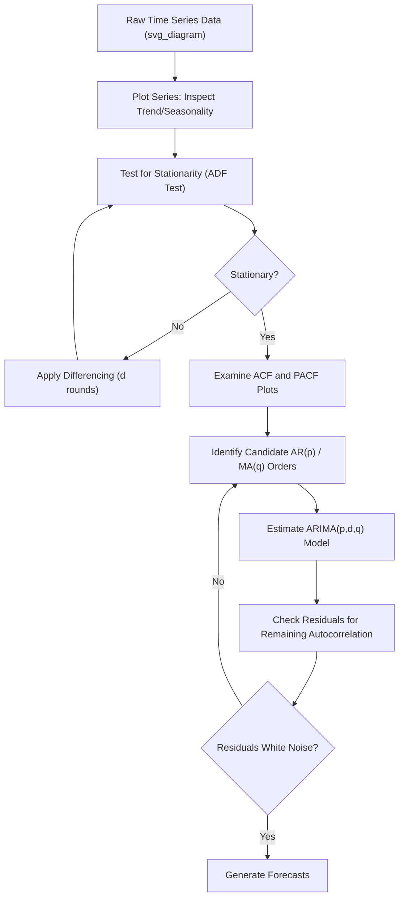

## Time Series Analysis and Forecasting Basics

### Overview

Time series analysis studies data collected sequentially over time (GDP, inflation, stock prices, unemployment) where the temporal ordering itself carries information — observations close in time tend to be correlated with each other in ways that standard cross-sectional regression assumptions do not accommodate. Time series econometrics develops specialized tools to model trend, seasonality, persistence, and volatility, and to produce forecasts of future values.

**Key Points**

- Time series data violates the cross-sectional assumption of independent observations; adjacent observations are typically correlated (autocorrelated), requiring specialized estimation and inference methods.
- Stationarity — whether a series' statistical properties (mean, variance, autocorrelation) are stable over time — is the central organizing concept in time series analysis, since most classical techniques require it or a transformation to achieve it.
- Forecasting accuracy and model validity depend heavily on correctly identifying a series' underlying data-generating process (trend, seasonality, cycles, and irregular/random components).

### Components of a Time Series

A time series is typically decomposed into four conceptual components:

1. **Trend ($T_t$)**: The long-run, gradual increase or decrease in the series' level over time (e.g., the secular upward trend in real GDP due to productivity growth).
2. **Seasonality ($S_t$)**: Regular, predictable fluctuations tied to the calendar (e.g., retail sales spiking every December, unemployment claims rising predictably around specific times of year).
3. **Cyclical component ($C_t$)**: Longer, less regular fluctuations tied to the business cycle (expansions and recessions), typically spanning multiple years with no fixed periodicity, distinguishing it from seasonality.
4. **Irregular/random component ($I_t$)**: Residual, unpredictable fluctuation remaining after removing trend, seasonal, and cyclical components — analogous to the error term in a cross-sectional regression.

These components combine either **additively** ($Y_t = T_t + S_t + C_t + I_t$) or **multiplicatively** ($Y_t = T_t \times S_t \times C_t \times I_t$), with the multiplicative form often more appropriate when seasonal fluctuations grow proportionally with the trend level (common in nominal economic series).

### Stationarity

A time series is (weakly/covariance) **stationary** if its mean, variance, and autocovariance structure do not depend on time:

$$E(Y_t) = \mu \quad \text{(constant for all } t\text{)}$$

$$\text{Var}(Y_t) = \sigma^2 \quad \text{(constant for all } t\text{)}$$

$$\text{Cov}(Y_t, Y_{t-k}) = \gamma_k \quad \text{(depends only on lag } k\text{, not on } t\text{)}$$

**Why stationarity matters**: Most classical time series models (ARMA, and the inferential theory behind OLS applied to time series) rely on stationarity to ensure that estimated parameters converge to stable, meaningful population values and that standard hypothesis testing procedures remain valid. Applying standard regression techniques to non-stationary series without adjustment can produce **spurious regression** — a well-documented problem (associated with Granger and Newbold, 1974) in which two entirely unrelated non-stationary series can appear strongly and "significantly" correlated purely due to shared trending behavior, not any genuine relationship. [Unverified: the specific attribution and publication year for the foundational spurious regression literature should be checked if cited precisely in academic work, though the phenomenon itself is a standard, well-established concept in time series econometrics]

**Random walk (a common non-stationary process)**:

$$Y_t = Y_{t-1} + \varepsilon_t$$

A random walk has a variance that grows with $t$ ($\text{Var}(Y_t) = t\sigma^2$), violating the constant-variance requirement of stationarity, and its best forecast for any future period is simply its current value (a property sometimes summarized as the series having "no memory" of a fixed mean to revert to).

### Testing for Stationarity: The Augmented Dickey-Fuller (ADF) Test

The ADF test formally tests $H_0$: the series has a **unit root** (is non-stationary, e.g., resembles a random walk) against $H_1$: the series is stationary. The test regression takes the form:

$$\Delta Y_t = \alpha + \beta Y_{t-1} + \sum_{i=1}^{p}\gamma_i \Delta Y_{t-i} + \varepsilon_t$$

Rejecting $H_0$ (finding $\beta$ significantly less than zero, using specialized Dickey-Fuller critical values rather than standard $t$-distribution values) provides evidence the series is stationary. [Unverified: exact critical value tables and specific ADF test variants depend on whether a trend/intercept is included; consult current statistical software documentation for precise implementation details]

### Differencing and Achieving Stationarity

A common non-stationary series can often be transformed into a stationary one via **differencing**:

$$\Delta Y_t = Y_t - Y_{t-1}$$

If a series requires $d$ rounds of differencing to become stationary, it is said to be **integrated of order $d$**, denoted $I(d)$. A stationary series is $I(0)$; a random walk is typically $I(1)$ (stationary after one difference).

**Example**: The level of nominal GDP is generally non-stationary (it trends upward over time), but the *growth rate* of GDP (approximately the first difference of log GDP) is much closer to stationary, fluctuating around a relatively stable mean — which is precisely why economists typically model and forecast GDP *growth rates* rather than GDP *levels* directly.

### Autocorrelation and Partial Autocorrelation

**Autocorrelation Function (ACF)**: Measures the correlation between $Y_t$ and its lagged value $Y_{t-k}$:

$$\rho_k = \frac{\text{Cov}(Y_t, Y_{t-k})}{\text{Var}(Y_t)}$$

**Partial Autocorrelation Function (PACF)**: Measures the correlation between $Y_t$ and $Y_{t-k}$ *after removing the linear effect of the intermediate lags* $Y_{t-1}, \ldots, Y_{t-k+1}$.

The ACF and PACF plots are the primary diagnostic tools for identifying the appropriate order of an ARMA model: an AR($p$) process theoretically has a PACF that cuts off sharply after lag $p$, while an MA($q$) process has an ACF that cuts off sharply after lag $q$ — a pattern used in the classical **Box-Jenkins methodology** for model identification.

### Autoregressive (AR) Models

An AR($p$) model expresses the current value as a linear function of its own past $p$ values:

$$Y_t = c + \phi_1 Y_{t-1} + \phi_2 Y_{t-2} + \cdots + \phi_p Y_{t-p} + \varepsilon_t$$

**Example — AR(1) model**: $Y_t = 0.05 + 0.80 Y_{t-1} + \varepsilon_t$. The coefficient $\phi_1 = 0.80$ indicates strong **persistence** — a shock to $Y$ decays gradually, with roughly 80% of any deviation from the long-run mean carrying over to the next period. For stationarity of an AR(1) process, $|\phi_1| < 1$ is required; a value at or above 1 in absolute terms implies the shock's effect never fully dies out (a unit root, as in the random walk case above).

### Moving Average (MA) Models

An MA($q$) model expresses the current value as a linear function of current and past forecast errors (shocks):

$$Y_t = \mu + \varepsilon_t + \theta_1 \varepsilon_{t-1} + \cdots + \theta_q \varepsilon_{t-q}$$

Unlike AR models, MA models have an inherently finite memory — a shock's direct effect on $Y_t$ mechanically disappears after $q$ periods, since only the $q$ most recent error terms enter the equation.

### ARMA and ARIMA Models

**ARMA($p,q$)**: Combines autoregressive and moving average components:

$$Y_t = c + \phi_1 Y_{t-1} + \cdots + \phi_p Y_{t-p} + \varepsilon_t + \theta_1 \varepsilon_{t-1} + \cdots + \theta_q \varepsilon_{t-q}$$

**ARIMA($p,d,q$)** ("Autoregressive Integrated Moving Average"): Extends ARMA to non-stationary series by first applying $d$ rounds of differencing, then fitting an ARMA($p,q$) model to the differenced series. This is the standard general-purpose univariate time series forecasting framework, formalized by Box and Jenkins (1970). [Unverified: exact publication year and edition details for the original Box-Jenkins text vary slightly across citations]

### Illustrative Diagram: Time Series Model Selection Workflow

### Seasonal Adjustment

Many economic series exhibit strong, predictable seasonal patterns that can obscure the underlying trend/cyclical signal of interest (e.g., raw monthly retail sales spike every December regardless of the underlying business cycle position). **Seasonal adjustment** procedures remove this predictable seasonal component, producing series like "seasonally adjusted annual rate" (SAAR) figures commonly reported for U.S. GDP and employment data.

- **SARIMA models** extend ARIMA with explicit seasonal AR and MA terms, denoted ARIMA($p,d,q$)($P,D,Q$)$_s$, where $s$ is the seasonal period (e.g., 12 for monthly data, 4 for quarterly data).
- Statistical agencies commonly use specialized seasonal adjustment procedures (historically including methods in the X-13ARIMA-SEATS family maintained by the U.S. Census Bureau) to produce official seasonally adjusted statistics. [Unverified: specific software/procedure names and current agency practices should be verified against current official documentation, as methodologies are periodically updated]

### Forecast Evaluation

Common metrics for assessing out-of-sample forecast accuracy, comparing forecasted values $\hat{Y}_t$ to actual realized values $Y_t$ over a holdout period:

$$\text{Mean Absolute Error (MAE)} = \frac{1}{n}\sum_{t=1}^{n}|Y_t - \hat{Y}_t|$$

$$\text{Root Mean Squared Error (RMSE)} = \sqrt{\frac{1}{n}\sum_{t=1}^{n}(Y_t - \hat{Y}_t)^2}$$

$$\text{Mean Absolute Percentage Error (MAPE)} = \frac{100\%}{n}\sum_{t=1}^{n}\left|\frac{Y_t - \hat{Y}_t}{Y_t}\right|$$

RMSE penalizes large forecast errors more heavily than MAE (due to squaring), making the choice between them dependent on whether large errors are considered disproportionately costly in the specific forecasting application. A critical methodological principle: forecast accuracy should be evaluated using **out-of-sample** data (a holdout period not used in model estimation) rather than in-sample fit, since in-sample fit statistics (like $R^2$) can be artificially improved by overfitting a model to historical noise, which does not translate into genuine forecasting skill on new data.

### Structural Breaks and Regime Changes

Economic time series are frequently subject to **structural breaks** — sudden shifts in the underlying data-generating process due to policy changes, financial crises, or other major shocks (e.g., the shift in inflation dynamics around a major central bank policy regime change, or the sharp deviation in economic time series during the 2020 pandemic period). Standard time series models estimated over a period spanning a structural break can produce poor forecasts, since the estimated parameters may reflect an average of two genuinely different regimes rather than either regime accurately. The Chow test is a classical statistical tool for testing whether a suspected break date produces a statistically significant change in model parameters. [Inference: the general concept of structural breaks and the Chow test as a detection tool are standard and well-established in time series econometrics; identifying the specific break date in real-world data is often itself an empirical and sometimes contested exercise]

### Volatility Modeling: ARCH and GARCH (Brief Introduction)

Standard ARMA-type models assume constant (homoskedastic) error variance, but many financial and some macroeconomic series exhibit **volatility clustering** — periods of high volatility followed by more high volatility, and calm periods followed by more calm. **ARCH** (Autoregressive Conditional Heteroskedasticity, Engle 1982) and its generalization **GARCH** (Bollerslev 1986) explicitly model the *variance* of the error term as a function of past squared errors (and past variances, in the GARCH case), providing time-varying volatility forecasts — a technique extensively used in financial econometrics for risk management and options pricing applications. [Unverified: specific model variant names and attributions beyond the foundational ARCH/GARCH papers should be checked if precise citation is required]

### Vector Autoregression (VAR): Brief Introduction

While AR/ARMA models are **univariate** (modeling one series using only its own past), a **Vector Autoregression (VAR)** models several time series jointly, allowing each variable to depend on its own past values *and* the past values of the other variables in the system:

$$Y_t = c + A_1 Y_{t-1} + \cdots + A_p Y_{t-p} + \varepsilon_t$$

where $Y_t$ is now a vector of multiple variables (e.g., GDP growth, inflation, and interest rates jointly). VAR models are widely used in macroeconomics to study the dynamic interrelationships between key variables and to conduct **impulse response analysis** — tracing out the predicted effect of a shock to one variable on the future paths of all variables in the system.

### Conclusion

Time series analysis provides the specialized toolkit needed to model data where temporal ordering and persistence are central features, addressing challenges (non-stationarity, autocorrelation, seasonality, volatility clustering) that standard cross-sectional regression methods are not designed to handle. The ARIMA framework remains a foundational univariate forecasting workhorse, while extensions like SARIMA, GARCH, and VAR address seasonality, time-varying volatility, and multivariate dynamics respectively — together forming the core methodology economists use to both understand historical economic dynamics and produce forward-looking forecasts.

**Related Topics**

- Stationarity, Unit Roots, and the Augmented Dickey-Fuller Test
- Box-Jenkins Methodology for ARIMA Model Identification
- Seasonal Adjustment Techniques (SARIMA, X-13ARIMA-SEATS)
- Vector Autoregression (VAR) and Impulse Response Functions
- ARCH/GARCH Models and Financial Volatility Forecasting
- Cointegration and Error Correction Models
- Structural Break Detection (Chow Test, CUSUM tests)
- Granger Causality Testing