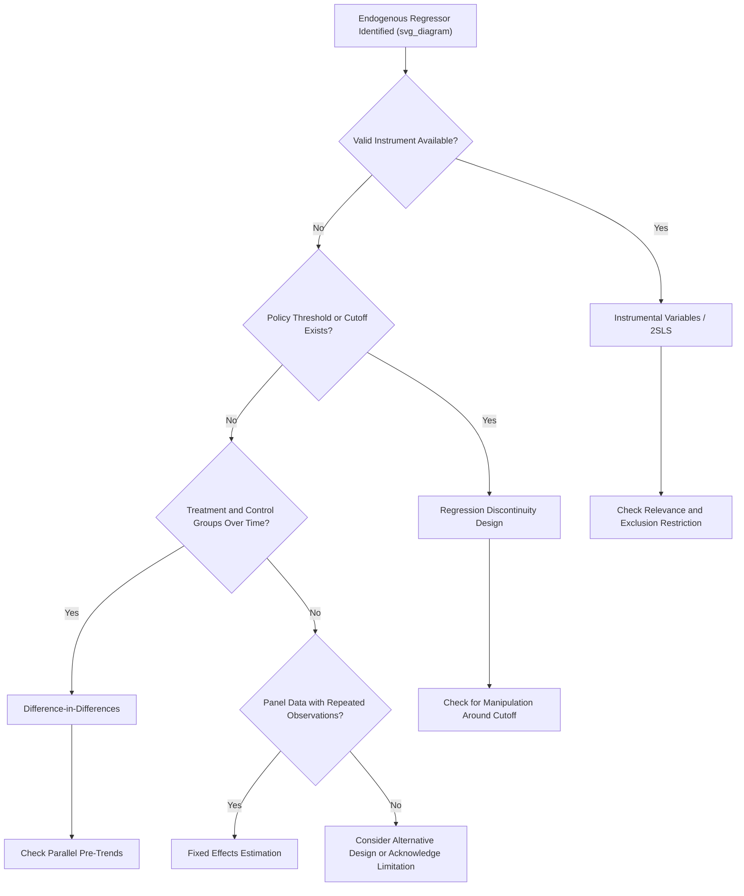

## Causal Inference: Instrumental Variables and Natural Experiments

### Overview

Causal inference addresses the central challenge of applied econometrics: distinguishing genuine causal relationships from mere correlation when controlled experiments are typically infeasible for most economic questions. Instrumental variables (IV) and natural experiments are two closely related strategies economists use to approximate the conditions of a randomized controlled trial using observational data, exploiting sources of variation that are plausibly unrelated to confounding factors.

**Key Points**

- The fundamental obstacle to causal inference in observational data is **endogeneity** — correlation between a regressor of interest and the error term, arising from omitted variables, reverse causality, or measurement error.
- Instrumental variables estimation isolates variation in an endogenous regressor that is driven by a source (the instrument) unrelated to the outcome except through that regressor.
- Natural experiments exploit real-world events or policy discontinuities that create as-if-random variation in a variable of interest, without a researcher having actually designed and implemented a randomized experiment.

### The Endogeneity Problem

Ordinary Least Squares estimates $\hat{\beta}_1$ are unbiased and consistent only if the zero conditional mean assumption holds: $E(u_i | X_i) = 0$. This assumption is violated — producing **endogeneity** — through three principal channels:

1. **Omitted variable bias**: A relevant variable, correlated with $X$ and also affecting $Y$, is left out of the model (e.g., "ability" omitted from a wage-education regression).
2. **Reverse causality (simultaneity)**: $Y$ also causes $X$, not only the reverse (e.g., higher crime rates might lead a city to hire more police, while more police might also reduce crime — the regression of crime on police staffing conflates both directions).
3. **Measurement error**: If $X$ is measured with error, the OLS coefficient on the mismeasured variable is generally biased toward zero (attenuation bias) under classical measurement error assumptions.

In each case, $\text{Cov}(X, u) \neq 0$, and OLS produces a biased and inconsistent estimate of the true causal effect, regardless of sample size.

### The Instrumental Variables (IV) Solution

An instrument $Z$ is a variable that satisfies two conditions relative to the endogenous regressor $X$ and outcome $Y$:

1. **Relevance**: $Z$ is correlated with the endogenous variable $X$, i.e., $\text{Cov}(Z, X) \neq 0$.
2. **Exogeneity (exclusion restriction)**: $Z$ affects $Y$ *only* through its effect on $X$, and is uncorrelated with the error term $u$, i.e., $\text{Cov}(Z, u) = 0$.

The exclusion restriction is fundamentally **untestable** using the data at hand — it must be argued for on institutional or theoretical grounds, and is almost always the most contested assumption in any applied IV study. [Inference: this characterization of the exclusion restriction's untestability and its central role in IV critique is standard and widely agreed upon in econometrics, though the *plausibility* of any specific proposed instrument is a case-by-case judgment subject to genuine scholarly disagreement]

### Two-Stage Least Squares (2SLS)

The most common IV estimator, **Two-Stage Least Squares (2SLS)**, proceeds as follows:

**First stage**: Regress the endogenous variable $X$ on the instrument $Z$ (and any exogenous control variables $W$):

$$X_i = \pi_0 + \pi_1 Z_i + \pi_2 W_i + v_i$$

Obtain the fitted values $\hat{X}_i$, which represent the portion of variation in $X$ that is explained by the instrument (and controls) — by construction, this predicted component is uncorrelated with $u$ if the exclusion restriction holds.

**Second stage**: Regress the outcome $Y$ on the fitted values $\hat{X}_i$ (and the same controls $W$):

$$Y_i = \beta_0 + \beta_1 \hat{X}_i + \beta_2 W_i + \varepsilon_i$$

The resulting $\hat{\beta}_1$ is the **2SLS/IV estimate** of the causal effect of $X$ on $Y$, using only the "clean" (instrument-driven) variation in $X$ rather than all of its variation, some of which may be contaminated by endogeneity.

**Important note**: Standard errors from a manually implemented "two separate OLS regressions" approach are incorrect, because the second stage does not account for the estimation uncertainty in the first stage; dedicated 2SLS routines in statistical software compute the correct standard errors automatically. [Unverified: exact standard error correction formulas and default software behavior may vary slightly across statistical packages and should be verified against current documentation]

### The Simple IV (Wald) Estimator

When there is a single binary instrument and single endogenous regressor, the IV estimate reduces to the intuitive **Wald estimator**:

$$\hat{\beta}_1^{IV} = \frac{\bar{Y}_{Z=1} - \bar{Y}_{Z=0}}{\bar{X}_{Z=1} - \bar{X}_{Z=0}}$$

This is the ratio of the "reduced-form" effect of the instrument on the outcome to the "first-stage" effect of the instrument on the endogenous regressor — conceptually, the causal effect of $X$ on $Y$ scaled by how strongly $Z$ moves $X$.

### Classic Example: Angrist and Krueger (1991) — Quarter of Birth as an Instrument

A canonical application: estimating the causal return to education, where education is endogenous (correlated with unobserved ability, motivation, family background).

- **Instrument**: Quarter of birth. Compulsory schooling laws in the U.S. historically required students to remain in school until a specific birthday, while school entry age was determined by calendar-year cutoffs — meaning students born in different quarters of the year accumulated slightly different amounts of schooling before being legally eligible to drop out.
- **Relevance**: Quarter of birth is correlated with total years of completed education, through this school-entry-age and compulsory-schooling-law mechanism.
- **Exclusion restriction (the contested assumption)**: Quarter of birth is assumed to affect earnings *only* through its effect on education, not through any other channel (e.g., not through birth-season effects on health or cognitive development).

This study is widely cited as an influential and creative early application of IV to a classic labor economics question, though the validity of the exclusion restriction (whether quarter of birth genuinely has no direct effect on earnings through channels other than education) has been debated in subsequent literature. [Unverified: specific numerical estimates from this or related studies are not reproduced here, and any precise coefficient figures should be verified against the original source if cited]

### Weak Instruments

An instrument is considered **weak** if $\text{Cov}(Z,X)$ is small — i.e., the first-stage relationship between the instrument and the endogenous regressor is not strong. Weak instruments cause serious problems:

- IV estimates become highly imprecise (large standard errors), even in large samples.
- IV estimates can be severely biased in finite samples, and this bias can be in the *same direction* as the OLS bias the instrument was meant to correct, sometimes making 2SLS worse than simply running OLS.
- A common diagnostic rule of thumb involves examining the first-stage **F-statistic**, with F-statistics well below roughly 10 historically flagged as indicating a weak instrument concern, though the appropriate threshold and precise critical values have been refined in later methodological work. [Unverified: this "rule of thumb" threshold is widely cited in applied work but represents an approximation rather than a universally agreed-upon precise cutoff, and more recent econometric literature has proposed refinements to weak-instrument diagnostics]

### Overidentification and Testing

When there are more instruments than endogenous regressors (**overidentification**), the model is said to be overidentified, and a formal test (e.g., the Sargan or Hansen J-test) can assess whether the *additional* instruments produce estimates consistent with each other. Passing this test is **not** proof that the exclusion restriction holds — it only checks internal consistency among the instruments used, and all instruments could still share a common violation of the exclusion restriction that the test cannot detect.

### Natural Experiments: Concept and Rationale

A **natural experiment** exploits a real-world event, policy change, or institutional rule that generates variation in a variable of interest resembling — but not created by — a randomized experiment. Unlike a laboratory or field experiment, the researcher does not control assignment, but argues that assignment is "as good as random" with respect to the outcome of interest, conditional on the research design.

Common types of natural experiments include:

- **Policy discontinuities**: A policy applies above/below a specific threshold (e.g., age, income, test score), creating comparable groups just above and below the cutoff.
- **Geographic discontinuities**: A policy or boundary differs sharply across an administrative border, while other relevant factors (climate, culture) are similar on both sides.
- **Timing-based discontinuities**: A policy is implemented at a specific date, allowing comparison of otherwise similar periods just before and after.
- **Lottery-based or quasi-random administrative rules**: Cases where administrative rules (e.g., a rule assigning entities to a program via lottery due to oversubscription) create genuinely random or as-if-random assignment.

### Regression Discontinuity Design (RDD)

RDD exploits a situation where treatment assignment changes discontinuously at a known threshold of a "running variable" $R$ (e.g., a test score cutoff for scholarship eligibility):

$$Y_i = \beta_0 + \beta_1 D_i + f(R_i - c) + \varepsilon_i$$

where $D_i = 1$ if $R_i \geq c$ (the cutoff), $0$ otherwise, and $f(\cdot)$ is a flexible function of the running variable's distance from the cutoff. The core identifying assumption is that individuals just above and just below the cutoff are **similar in all respects except treatment status**, so any discontinuous jump in the outcome at the cutoff can be attributed to the causal effect of treatment.

**Example**: Estimating the effect of receiving a merit scholarship (awarded to students scoring above a specific test-score threshold) on subsequent college graduation rates, comparing students who scored just above versus just below the cutoff — students on either side of a narrow window around the cutoff are argued to be otherwise comparable, differing essentially only in the "as-if-random" luck of scoring on one side of the threshold versus the other.

**Key RDD validity checks**: Researchers typically test for a discontinuity in the *density* of the running variable at the cutoff (McCrary density test) — evidence that individuals are able to manipulate their position relative to the cutoff (e.g., strategically retaking a test to cross a threshold) would undermine the as-if-random assumption underlying RDD.

### Difference-in-Differences (DiD)

DiD compares the change in outcomes over time between a **treatment group** (affected by a policy) and a **control group** (unaffected), differencing out both time-invariant group differences and common time trends:

$$\hat{\beta}_{DiD} = (\bar{Y}_{treat,after} - \bar{Y}_{treat,before}) - (\bar{Y}_{control,after} - \bar{Y}_{control,before})$$

Equivalently estimated via regression:

$$Y_{it} = \beta_0 + \beta_1 Treat_i + \beta_2 Post_t + \beta_3 (Treat_i \times Post_t) + \varepsilon_{it}$$

where $\beta_3$, the coefficient on the interaction term, is the DiD estimate of the treatment effect.

**Key identifying assumption — Parallel Trends**: In the *absence* of the treatment, the treatment and control groups would have followed parallel trends over time. This assumption is not directly testable for the post-treatment period (since we cannot observe the treatment group's untreated counterfactual), but is commonly assessed by examining **pre-trends** — checking whether the two groups exhibited similar trends in the periods *before* treatment, as supportive (though not conclusive) evidence.

**Example**: Card and Krueger's (1994) study comparing employment in fast-food restaurants in New Jersey (which raised its minimum wage) versus neighboring Pennsylvania (which did not) is a widely cited application of the DiD design to estimate the employment effect of a minimum wage increase. [Unverified: specific numerical findings from this study should be verified against the original source if cited precisely, as this remains a debated and extensively re-examined study in labor economics]

### Illustrative Diagram: Causal Inference Strategy Selection

### Fixed Effects Estimation (Related Panel Data Approach)

When panel data (repeated observations on the same units over time) is available, **fixed effects estimation** can control for all **time-invariant** unobserved confounders at the unit level (e.g., a country's unchanging geography, or an individual's innate ability), by including a dummy variable for each unit (or equivalently, demeaning each variable by its unit-specific average):

$$Y_{it} = \beta_0 + \beta_1 X_{it} + \alpha_i + \varepsilon_{it}$$

where $\alpha_i$ is the unit-specific fixed effect. This addresses omitted variable bias arising from *time-invariant* confounders, but does **not** solve endogeneity arising from **time-varying** confounders or reverse causality — a key limitation relative to IV and natural experiment approaches, which is why fixed effects and IV/natural-experiment designs are often viewed as complementary rather than substitute strategies.

### Comparison of Causal Inference Strategies

| Method | Core Identifying Assumption | Best Suited For | Key Vulnerability |
| --- | --- | --- | --- |
| Instrumental Variables (2SLS) | Instrument relevance + exclusion restriction | Endogenous regressor with a plausible external instrument | Exclusion restriction is untestable; weak instruments |
| Regression Discontinuity | No manipulation around a sharp threshold | Policies with clear eligibility cutoffs | Limited to effects "local" to the cutoff; manipulation of running variable |
| Difference-in-Differences | Parallel trends absent treatment | Policy changes affecting some groups/regions but not others | Violated parallel trends; anticipation effects |
| Fixed Effects (Panel) | No time-varying omitted confounders | Repeated observations on same units over time | Cannot address time-varying confounders or reverse causality |

### Internal vs. External Validity

- **Internal validity**: The degree to which a causal estimate is valid *for the specific sample and context studied* — the primary concern IV, RDD, and DiD designs are built to protect.
- **External validity**: The degree to which a causal estimate generalizes beyond the specific sample to other populations, time periods, or settings.
- A notable tension: IV estimates via 2SLS technically identify a **Local Average Treatment Effect (LATE)** — the causal effect specifically for the subpopulation whose behavior is affected by the instrument (sometimes called "compliers") — which may not equal the **Average Treatment Effect (ATE)** for the entire population, raising external validity questions even when internal validity (for the compliant subpopulation) is strong. [Inference: the LATE/ATE distinction and its implications for external validity represent a well-established theoretical result in the IV literature (associated with Imbens and Angrist's work), though the practical importance of this gap varies by application and is a matter of ongoing methodological discussion]

### Conclusion

Instrumental variables and natural experiment designs (RDD, DiD, and related panel methods) represent the primary toolkit modern applied economists use to approximate causal identification without a true randomized controlled trial. Each strategy rests on a distinct, context-specific identifying assumption — the exclusion restriction for IV, no-manipulation for RDD, parallel trends for DiD — none of which is directly testable from the data alone, meaning that the credibility of any causal claim ultimately rests on the plausibility of institutional and theoretical arguments supporting these assumptions, not on statistical technique alone.

**Next Steps**

- Randomized Controlled Trials (RCTs) in Development and Labor Economics
- Local Average Treatment Effects (LATE) and the Imbens-Angrist Framework
- Regression Discontinuity Design: Sharp vs. Fuzzy RDD
- Difference-in-Differences Extensions: Staggered Adoption and Modern Estimators
- Panel Data Methods: Fixed Effects vs. Random Effects
- Weak Instrument Diagnostics and Robust Inference
- Synthetic Control Methods for Comparative Case Studies