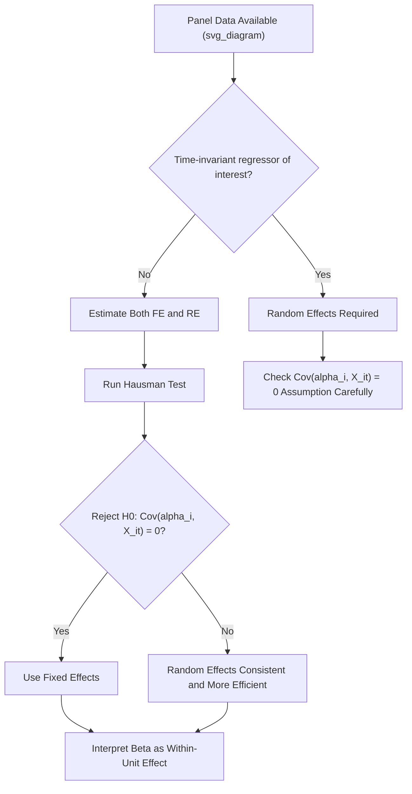

## Panel Data Methods

### Overview

Panel data (also called longitudinal data) combines cross-sectional and time series dimensions, observing the same units — individuals, firms, countries — repeatedly over multiple time periods. This structure allows econometricians to control for unobserved, time-invariant heterogeneity across units, a capability unavailable in purely cross-sectional or purely time-series data, making panel methods a central tool for approximating causal inference in observational economic data.

**Key Points**

- The defining advantage of panel data is the ability to control for **time-invariant unobserved heterogeneity** using fixed effects, addressing a specific and common source of omitted variable bias.
- The choice between fixed effects and random effects estimation hinges on whether unobserved unit-specific effects are correlated with the included regressors — a question formally addressed by the Hausman test.
- Panel data also enables the study of dynamics (how outcomes evolve over time within the same unit) and increases statistical power through a larger effective sample size ($N \times T$ observations).

### Structure of Panel Data

Panel data indexes observations by both unit $i$ (e.g., a person, firm, or country) and time period $t$ (e.g., a year), yielding the general model:

$$Y_{it} = \beta_0 + \beta_1 X_{it} + \alpha_i + \varepsilon_{it}$$

- $Y_{it}$: outcome for unit $i$ at time $t$
- $X_{it}$: explanatory variable(s) for unit $i$ at time $t$
- $\alpha_i$: unit-specific, **time-invariant** unobserved effect (e.g., a firm's inherent management quality, a country's fixed geographic characteristics, an individual's innate ability)
- $\varepsilon_{it}$: idiosyncratic error term, varying across both units and time

**Balanced vs. unbalanced panels**: A **balanced panel** has the same number of time periods observed for every unit; an **unbalanced panel** has varying numbers of observations per unit (e.g., due to firms entering/exiting the sample, or survey attrition), which requires additional care regarding whether the pattern of missingness is itself related to the outcome (non-random attrition).

### Why Panel Data Helps: The Omitted Variable Bias Problem

In cross-sectional data, if $\alpha_i$ (unobserved heterogeneity) is correlated with $X_{it}$, OLS estimates of $\beta_1$ are biased — the classic omitted variable bias problem. Panel data's key advantage is that, because the *same unit* is observed multiple times, its time-invariant unobserved characteristics can be differenced out or explicitly modeled, **without needing to measure $\alpha_i$ directly**.

**Example**: Estimating the effect of minimum wage laws ($X_{it}$) on state-level employment ($Y_{it}$) using a panel of U.S. states over multiple years. States differ in many unmeasured, largely time-invariant ways (local labor market culture, industry composition, geography) that could be correlated with both their minimum wage policy choices and their employment levels. Panel methods allow these state-specific, time-invariant factors to be controlled for without explicitly measuring each one.

### Fixed Effects (FE) Estimation

The **fixed effects model** treats $\alpha_i$ as a fixed, unit-specific parameter to be controlled for, most commonly implemented via the **within transformation** (demeaning):

$$Y_{it} - \bar{Y}_i = \beta_1(X_{it} - \bar{X}_i) + (\varepsilon_{it} - \bar{\varepsilon}_i)$$

where $\bar{Y}_i = \frac{1}{T}\sum_t Y_{it}$ is the unit-specific average over time. This transformation **removes $\alpha_i$ entirely** (since it is constant over time for a given unit and thus cancels out in the demeaning), and OLS is then applied to the demeaned data.

An equivalent and computationally identical approach is the **Least Squares Dummy Variable (LSDV)** estimator, which includes a separate dummy variable for each unit $i$ directly in the regression — conceptually clearer but computationally less efficient for panels with many units.

**Key property**: Fixed effects estimation identifies $\beta_1$ using only **within-unit variation over time** — it effectively asks, "when this specific unit's $X$ changed over time, how did its $Y$ change?" — and consequently, it **cannot estimate the effect of any variable that does not vary within a unit over the observed time period** (e.g., a country's fixed geographic location, or gender in a short panel where individuals do not change gender), since such variables are perfectly absorbed into $\alpha_i$ and effectively dropped by the demeaning transformation.

### Random Effects (RE) Estimation

The **random effects model** treats $\alpha_i$ as a random variable, uncorrelated with the regressors $X_{it}$, and drawn from a distribution with mean zero:

$$Y_{it} = \beta_0 + \beta_1 X_{it} + (\alpha_i + \varepsilon_{it})$$

Here, $\alpha_i$ is absorbed into a composite error term rather than removed, and the model is estimated via **Generalized Least Squares (GLS)**, which accounts for the correlation this composite error structure induces across time periods for the same unit.

**Key assumption**: Random effects requires $\text{Cov}(\alpha_i, X_{it}) = 0$ — the unobserved unit-specific effect must be uncorrelated with the regressors. If this assumption holds, random effects is **more efficient** (produces smaller standard errors) than fixed effects, because it uses both within-unit *and* between-unit variation in $X$ to estimate $\beta_1$, rather than only within-unit variation.

### Fixed Effects vs. Random Effects: The Core Trade-off

|  | Fixed Effects | Random Effects |
| --- | --- | --- |
| Handles $\text{Cov}(\alpha_i, X_{it}) \neq 0$? | Yes — consistent regardless | No — biased and inconsistent if correlation exists |
| Efficiency (if RE assumption holds) | Less efficient | More efficient (smaller standard errors) |
| Can estimate time-invariant regressors? | No — perfectly collinear with $\alpha_i$, dropped | Yes |
| Uses which variation in $X$? | Within-unit variation only | Both within- and between-unit variation |

This is a genuine bias-efficiency trade-off: fixed effects sacrifices efficiency for robustness to correlation between $\alpha_i$ and $X$; random effects gains efficiency but only remains valid (consistent) if that correlation is genuinely absent.

### The Hausman Test

The **Hausman specification test** formally tests $H_0: \text{Cov}(\alpha_i, X_{it}) = 0$ (random effects assumption holds) against $H_1$: correlation exists (random effects is inconsistent), by comparing the fixed effects and random effects coefficient estimates:

$$H = (\hat{\beta}_{FE} - \hat{\beta}_{RE})' [\text{Var}(\hat{\beta}_{FE}) - \text{Var}(\hat{\beta}_{RE})]^{-1} (\hat{\beta}_{FE} - \hat{\beta}_{RE})$$

Under $H_0$, both FE and RE are consistent, but RE is efficient, so the two estimates should be similar (differing only by sampling noise). Under $H_1$, FE remains consistent but RE does not, so a statistically significant difference between the two sets of estimates provides evidence against the random effects specification.

**Practical interpretation**: Rejecting $H_0$ (a significant Hausman test statistic) is generally taken as support for using fixed effects; failing to reject provides support for the more efficient random effects estimator, though many applied economists default to fixed effects regardless when there is a strong *a priori* theoretical reason to suspect $\alpha_i$ is correlated with regressors (e.g., unobserved firm management quality plausibly correlated with almost any firm-level regressor of interest). [Inference: this practical tendency toward defaulting to fixed effects in applied work reflects common practice described in econometrics teaching and applied research discussions, rather than a universally quantified statistic about researcher behavior]

### Illustrative Diagram: Panel Data Model Selection

### Two-Way Fixed Effects

Panel models frequently include **two-way fixed effects** — both unit fixed effects $\alpha_i$ and time fixed effects $\lambda_t$:

$$Y_{it} = \beta_0 + \beta_1 X_{it} + \alpha_i + \lambda_t + \varepsilon_{it}$$

The time fixed effects $\lambda_t$ absorb any factor that affects **all units equally in a given period** (e.g., a nationwide recession, a global commodity price shock, a change in federal policy affecting all states simultaneously) — controlling for these alongside unit fixed effects is standard practice in modern applied panel work, particularly in difference-in-differences-style designs implemented with panel data.

**Example**: In a panel of firms across years studying the effect of a firm-level investment tax credit on capital expenditure, unit fixed effects control for time-invariant firm characteristics (industry, management quality baseline), while time fixed effects control for economy-wide shocks (recessions, interest rate cycles) affecting all firms in a given year — isolating variation driven specifically by firm-level changes in the tax credit relative to both the firm's own history and the broader economic environment in that year.

### Clustered Standard Errors

A critical practical consideration in panel data: observations from the **same unit** across different time periods are typically correlated (serially correlated errors), violating the classical assumption of independent errors. Using standard (non-adjusted) OLS or fixed-effects standard errors in this setting can severely understate the true uncertainty, leading to spuriously small standard errors and overstated statistical significance.

The standard remedy is **clustered standard errors**, which allow for arbitrary correlation of errors *within* a cluster (typically the unit $i$) while assuming independence *across* clusters:

$$\widehat{\text{Var}}(\hat{\beta}) = (X'X)^{-1}\left(\sum_{g=1}^{G} X_g' \hat{u}_g \hat{u}_g' X_g\right)(X'X)^{-1}$$

where $g$ indexes clusters (commonly the panel unit). Clustering at the unit level has become close to a default requirement in modern applied panel econometrics practice, given how commonly serial correlation within units arises in real economic panel data. [Unverified: while clustering at the unit level is extremely widely recommended, the specific choice of clustering level (e.g., unit vs. a broader group) depends on the research design and remains a judgment call discussed in applied methodology literature]

### First-Differencing as an Alternative to Fixed Effects

An alternative method for eliminating $\alpha_i$, particularly common with only two time periods ($T=2$), is **first-differencing**:

$$\Delta Y_{it} = Y_{it} - Y_{i,t-1} = \beta_1(X_{it} - X_{i,t-1}) + (\varepsilon_{it} - \varepsilon_{i,t-1}) = \beta_1 \Delta X_{it} + \Delta\varepsilon_{it}$$

Like the within-transformation, differencing eliminates the time-invariant $\alpha_i$. For $T=2$, first-differencing and the standard fixed-effects (within) estimator are numerically identical; for $T > 2$, they generally differ, and the appropriate choice depends on the assumed structure of serial correlation in $\varepsilon_{it}$ (fixed effects is more efficient under no serial correlation, while first-differencing can be preferable if the errors follow a random walk).

### Dynamic Panel Models and the Nickell Bias

A common extension includes a **lagged dependent variable** as a regressor:

$$Y_{it} = \beta_0 + \rho Y_{i,t-1} + \beta_1 X_{it} + \alpha_i + \varepsilon_{it}$$

This introduces a specific econometric complication: because $Y_{i,t-1}$ is mechanically correlated with $\alpha_i$ (through the same demeaning process used to remove $\alpha_i$), standard fixed-effects estimation of dynamic panel models is **biased in finite samples**, a problem known as **Nickell bias** (Nickell, 1981), which does not vanish as $N \to \infty$ for fixed $T$ (it only vanishes as $T \to \infty$). Specialized estimators — notably the **Arellano-Bond GMM estimator** — were developed specifically to address this bias by using appropriately lagged variables as internal instruments. [Unverified: while the existence and general nature of Nickell bias is well-established, specific technical details of GMM-based corrections should be verified against current specialized panel econometrics references if implementation detail is required]

### Panel Data and Causal Inference: Strengths and Limits

Panel fixed-effects methods are frequently grouped alongside instrumental variables, RDD, and difference-in-differences as core causal inference tools, but they address a **specific and limited** source of endogeneity:

- **What fixed effects solves**: Omitted variable bias from **time-invariant** unobserved confounders (e.g., an individual's stable personality traits, a country's fixed geography).
- **What fixed effects does NOT solve**: Bias from **time-varying** unobserved confounders (e.g., a firm's evolving unobserved local business conditions that change year to year and happen to correlate with the regressor of interest), or reverse causality/simultaneity between $X$ and $Y$.

This distinction is important: researchers sometimes describe fixed effects panel regressions as providing a causal estimate more loosely than is fully justified, when in fact residual time-varying confounding may remain — a limitation that motivates combining panel fixed effects with an explicit natural-experiment source of variation (e.g., a difference-in-differences design implemented within a panel fixed-effects framework) when a genuinely convincing causal claim is the goal.

### Worked Example: Fixed Effects in Practice

Consider a panel of 50 countries observed over 20 years, studying the relationship between trade openness ($X_{it}$, measured as trade-to-GDP ratio) and GDP per capita growth ($Y_{it}$):

$$Y_{it} = \beta_0 + \beta_1 X_{it} + \alpha_i + \lambda_t + \varepsilon_{it}$$

- $\alpha_i$ controls for each country's time-invariant characteristics (geography, historical institutions established long before the sample period, distance from major trade routes).
- $\lambda_t$ controls for global shocks affecting all countries in a given year (global financial crises, worldwide commodity price swings, global technology diffusion trends).
- The identified $\hat{\beta}_1$ reflects: within a given country, as its trade openness increased or decreased relative to its own historical average (and relative to the global trend that year), how did its growth rate change? This is a fundamentally different — and generally more credible — question than the cross-sectional comparison of "do countries with higher trade openness have higher growth," which would be heavily confounded by cross-country differences in geography, institutions, and history.
- Standard errors should be clustered at the country level to account for likely serial correlation in each country's growth shocks over the 20-year period.

### Conclusion

Panel data methods provide a powerful and widely used tool for addressing omitted variable bias from time-invariant unobserved heterogeneity, without requiring an external instrument or a natural experiment. The fixed effects vs. random effects choice — formally guided by the Hausman test but often resolved by the underlying research design's theoretical assumptions — determines whether the analysis prioritizes robustness to unobserved correlation or statistical efficiency. Panel fixed effects remain, however, a partial solution to causal inference: they address time-invariant confounding specifically, and are frequently combined with difference-in-differences, instrumental variables, or other natural-experiment designs to address remaining time-varying endogeneity concerns.

**Related Topics**

- Difference-in-Differences and Two-Way Fixed Effects Designs
- The Hausman Test and Specification Testing
- Clustered and Robust Standard Errors
- Dynamic Panel Models and the Arellano-Bond GMM Estimator
- Nickell Bias in Dynamic Panels
- Instrumental Variables and Natural Experiments
- Unbalanced Panels and Attrition Bias