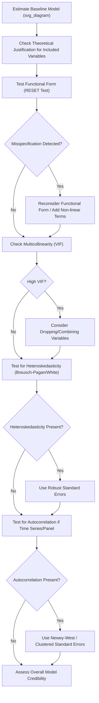

## Model Specification and Common Econometric Pitfalls

### Overview

Model specification is the process of choosing which variables to include, in what functional form, and under what structural assumptions, when building an econometric model. Even with a technically correct estimation method, a **misspecified model** — one that omits relevant variables, includes irrelevant ones, imposes the wrong functional form, or violates key structural assumptions — produces biased, inconsistent, or misleading results. This topic surveys the major categories of specification error and the diagnostic tools used to detect them.

**Key Points**

- Specification error is distinct from estimation error: even a perfectly executed OLS or IV procedure produces unreliable results if applied to a fundamentally misspecified model.
- Many pitfalls (omitted variables, wrong functional form, multicollinearity, heteroskedasticity) are individually well understood, but they frequently co-occur and interact in real applied work, requiring a systematic diagnostic workflow rather than checking issues in isolation.
- No single test can "prove" a model is correctly specified; econometric practice instead relies on a combination of theory-driven model building, robustness checks, and diagnostic tests to build a case for a model's credibility.

### Omitted Variable Bias (Revisited in Specification Context)

Omitting a relevant variable that is correlated with an included regressor biases the coefficient on that regressor:

$$E(\hat{\beta}_1^{misspecified}) = \beta_1 + \beta_2 \cdot \delta_1$$

where $\beta_2$ is the true effect of the omitted variable and $\delta_1$ is the coefficient from regressing the omitted variable on the included one. This is the single most consequential specification error in applied economics, because the bias does not diminish with larger sample sizes — it is a bias in the estimator itself, not a matter of insufficient data.

**Practical detection challenge**: Omitted variable bias cannot be directly tested using only the data at hand, since the omitted variable is, by definition, not observed. Detection instead relies on theoretical reasoning about what confounders are likely to exist, sensitivity analysis (checking how much the coefficient of interest changes as additional plausible controls are added), and, where feasible, natural experiment or instrumental variable designs that do not require observing the confounder directly.

### Irrelevant Variables (Overspecification)

The mirror-image problem: including variables that do **not** belong in the true model.

- Including an irrelevant variable does **not** bias the coefficients on the other (correctly included) variables, provided the irrelevant variable is genuinely unrelated to the outcome after controlling for the true regressors.
- However, it **does reduce estimation efficiency** (inflates standard errors on the other coefficients), particularly if the irrelevant variable is correlated with the variables of genuine interest — a cost distinct from, but related to, the multicollinearity problem discussed below.
- Including many irrelevant variables based on statistical fishing (adding variables simply because they raise $R^2$) also raises the risk of overfitting, particularly in samples with a limited number of observations relative to the number of candidate regressors.

### Functional Form Misspecification

Assuming an incorrect functional relationship between variables — e.g., imposing linearity when the true relationship is non-linear — produces biased and inconsistent estimates of the underlying relationship, even absent any omitted variable problem.

**Common functional form issues**:

- **Missing non-linear terms**: If the true relationship between $X$ and $Y$ is quadratic (e.g., the classic inverted-U relationship between age/experience and earnings) but only a linear term is included, the model will systematically over- or under-predict $Y$ across different ranges of $X$.
- **Incorrect transformation choice**: Choosing between levels, logs, or growth rates has substantive implications — a log-linear model imposes a constant *percentage* effect, while a linear model imposes a constant *absolute* effect, and these are genuinely different economic claims about the relationship.
- **Structural breaks in the relationship**: The true relationship between $X$ and $Y$ may differ across subgroups or time periods (e.g., the relationship between monetary policy and inflation may differ across a low-inflation versus high-inflation regime), and a single pooled specification imposing one functional form across the entire sample may misrepresent both regimes.

**Diagnostic tool — RESET test (Ramsey Regression Equation Specification Error Test)**: Tests for general functional form misspecification by checking whether powers of the fitted values ($\hat{Y}^2, \hat{Y}^3, \ldots$) have significant explanatory power when added back into the original regression — significant results suggest the original functional form is misspecified in some way, though the test does not indicate the specific correction needed. [Unverified: implementation details and exact critical value conventions for the RESET test may vary slightly across statistical software; verify against current documentation if precise application is required]

### Multicollinearity

**Multicollinearity** refers to a high (but not perfect) linear correlation among independent variables in a regression.

- **Perfect multicollinearity** (an exact linear relationship between regressors, e.g., including both a variable and its exact rescaled duplicate) makes OLS estimation mathematically impossible (the $X'X$ matrix is not invertible).
- **High (imperfect) multicollinearity** does not bias OLS coefficients, but inflates their standard errors, making individual coefficients imprecisely estimated and statistically insignificant even when the *joint* explanatory power of the correlated variables is strong.

**Diagnostic — Variance Inflation Factor (VIF)**:

$$VIF_j = \frac{1}{1 - R_j^2}$$

where $R_j^2$ is the R-squared from regressing $X_j$ on all other independent variables in the model. A commonly cited rule of thumb flags $VIF_j > 10$ (equivalently, $R_j^2 > 0.90$) as indicating problematic multicollinearity, though this threshold is a convention rather than a strict statistical rule. [Unverified: the VIF > 10 threshold is a widely taught convention in applied econometrics texts, but its appropriateness can depend on the specific research context, and some methodological discussions propose more conservative or context-dependent thresholds]

**Practical remedies**: Dropping one of the highly correlated variables (at the cost of potential omitted variable bias if it is genuinely relevant), combining correlated variables into a single index, collecting additional data to increase variation, or simply accepting the imprecision if the research question specifically requires disentangling closely related variables and no better data is available.

### Heteroskedasticity

Heteroskedasticity occurs when the variance of the error term is **not constant** across observations: $\text{Var}(u_i | X_i) \neq \sigma^2$ (a constant).

- OLS coefficients remain **unbiased and consistent** under heteroskedasticity — the point estimates themselves are not the problem.
- However, the standard **OLS standard errors become invalid** (typically biased, most commonly understated), leading to incorrect hypothesis test conclusions and confidence intervals that do not have their nominal coverage rate.

**Common economic examples**: Household expenditure data frequently shows heteroskedasticity, with higher-income households exhibiting greater absolute variability in spending than lower-income households; firm-level data often shows greater variability in outcomes (profits, growth rates) among larger firms than smaller ones.

**Diagnostic tests**: The **Breusch-Pagan test** and **White test** formally test the null hypothesis of homoskedasticity against heteroskedasticity of an unspecified form.

**Standard remedy**: Rather than attempting to "fix" heteroskedasticity through transformation in most modern applied work, the standard practice is to use **heteroskedasticity-robust standard errors** (sometimes called White standard errors or Huber-White standard errors), which produce valid inference without requiring the researcher to correctly specify the exact form of the heteroskedasticity.

### Autocorrelation (Serial Correlation)

Relevant primarily in time series and panel contexts: autocorrelation occurs when error terms are correlated across observations, most commonly across adjacent time periods: $\text{Cov}(u_t, u_{t-1}) \neq 0$.

- Like heteroskedasticity, autocorrelation leaves OLS coefficients unbiased but invalidates standard errors — again typically biased downward, overstating the precision of estimates and understating true uncertainty.
- **Diagnostic**: The **Durbin-Watson test** is a classical diagnostic for first-order autocorrelation, though it has known limitations (e.g., it is not valid in models including a lagged dependent variable, a common specification in dynamic models).
- **Remedy**: **Newey-West standard errors** (heteroskedasticity and autocorrelation consistent, "HAC" standard errors) provide valid inference in the presence of both heteroskedasticity and autocorrelation of an unspecified form, without requiring the researcher to fully model the error structure.

### Illustrative Diagram: Specification Diagnostic Workflow

### Endogeneity as a Specification Issue

While often treated as a distinct topic (see instrumental variables and natural experiments), endogeneity is fundamentally a specification problem: it arises when the *true* data-generating process includes feedback, simultaneity, or omitted factors that the specified model does not account for. Recognizing potential endogeneity — through careful reasoning about the underlying economic mechanism, not merely running statistical tests — is often the most consequential specification judgment a researcher makes, since no amount of correct standard-error adjustment (robust, clustered, or otherwise) addresses bias in the coefficient itself.

### Measurement Error

If a regressor $X$ is measured with **random, classical measurement error** (error uncorrelated with the true value and independent across observations), the OLS coefficient on the mismeasured variable is biased **toward zero** — a pattern known as **attenuation bias**:

$$\text{plim}(\hat{\beta}_1) = \beta_1 \cdot \frac{\sigma_{X^*}^2}{\sigma_{X^*}^2 + \sigma_{e}^2}$$

where $X^*$ is the true (unobserved) value, $X = X^* + e$ is the observed mismeasured value, and $\sigma_e^2$ is the variance of the measurement error. This ratio is always less than 1, meaning the estimated coefficient is systematically pulled toward zero relative to the true effect.

**Important caveat**: This clean attenuation result relies on the **classical measurement error assumptions** (error uncorrelated with the true value, mean zero, and — critically — measurement error only in the regressor, not the dependent variable). Measurement error in the **dependent variable** that is uncorrelated with regressors does not bias coefficients (it is absorbed into the error term and only affects precision), a materially different consequence from measurement error in a regressor. Non-classical measurement error (e.g., systematic misreporting correlated with the true value, common in self-reported survey data on sensitive topics like income) can produce bias in either direction, not necessarily toward zero. [Inference: the general attenuation bias formula under strictly classical assumptions is a well-established textbook result; real-world measurement error in economic survey data frequently does not satisfy the full classical assumptions, making the direction of bias an empirical question in many applied contexts]

### Sample Selection Bias

Arises when the sample analyzed is not representative of the population of interest, due to a selection process related to the outcome being studied.

**Classic example — Heckman's wage regression problem**: Estimating the determinants of wages using only data on **employed** individuals excludes those who chose not to work, who may systematically differ (e.g., those with very low market wage offers relative to their reservation wage) — potentially biasing the estimated relationship between education/experience and wages if the decision to work is itself correlated with unobserved wage-relevant characteristics. The **Heckman two-step correction** (Heckman, 1979) was developed specifically to address this form of selection bias by explicitly modeling the selection process alongside the outcome equation. [Unverified: specific technical implementation details of the Heckman correction should be verified against current specialized references if precise application is required]

**Other common selection bias contexts**: Survivorship bias in firm-level panels (only surviving firms remain in the dataset), attrition in longitudinal surveys (respondents who drop out may differ systematically from those who remain).

### Simultaneity Bias

Distinct from, but related to, reverse causality: **simultaneity** occurs when two or more variables in a system are jointly (simultaneously) determined, such that a variable treated as an explanatory regressor is itself partly determined by the outcome within the same time period.

**Classic example**: Estimating a supply curve using observed price and quantity data — but observed market price and quantity are jointly determined by the *intersection* of supply and demand, meaning a regression of quantity on price alone conflates movements along the supply curve with movements along the demand curve, without additional structure (e.g., instruments that shift one curve but not the other) to disentangle them. This is one of the historical motivating examples for the development of instrumental variables and simultaneous equations methods in econometrics.

### Data Mining and Specification Search

A methodological (rather than purely statistical) pitfall: **specification searching** — trying many different combinations of variables, functional forms, or subsamples and reporting only the specification that produces the most favorable (e.g., most statistically significant, or theoretically preferred) results.

- This practice inflates the effective Type I error rate well beyond the nominal significance level used for any single reported test, since the reported result was implicitly selected from many attempted specifications.
- **Pre-registration** of hypotheses and analysis plans (borrowed from experimental science practice) and **robustness checks across multiple reasonable specifications** (rather than presenting only the single "best" one) are commonly recommended practices to mitigate this concern in modern applied economics. [Inference: growing emphasis on pre-registration and robustness reporting reflects an observable trend in recent applied economics methodology discussions, though adoption varies considerably by subfield and is not a universal standard practice across all of economics]

### Summary Table: Pitfalls, Symptoms, and Remedies

| Pitfall | Effect on Coefficients | Effect on Standard Errors | Common Remedy |
| --- | --- | --- | --- |
| Omitted variable bias | Biased, inconsistent | N/A (bias dominates) | Add theoretically relevant controls; IV/natural experiment |
| Irrelevant variables | Unbiased | Inflated (less efficient) | Remove based on theory, not just significance |
| Wrong functional form | Biased, inconsistent | N/A (bias dominates) | RESET test; add non-linear terms; reconsider transformation |
| Multicollinearity (imperfect) | Unbiased | Inflated | VIF check; drop/combine variables |
| Heteroskedasticity | Unbiased | Invalid (often understated) | Robust standard errors |
| Autocorrelation | Unbiased | Invalid (often understated) | Newey-West / clustered standard errors |
| Measurement error (classical, in $X$) | Biased toward zero | Affected via biased coefficient | IV; improved data collection |
| Sample selection bias | Biased, inconsistent | N/A (bias dominates) | Heckman correction; reconsider sample definition |
| Simultaneity | Biased, inconsistent | N/A (bias dominates) | Instrumental variables; structural/simultaneous equations models |

### Conclusion

Sound econometric practice requires treating model specification as an active, theory-guided process rather than a mechanical step preceding estimation. While diagnostic tests (RESET, VIF, Breusch-Pagan, Durbin-Watson, Hausman) provide valuable formal checks, no combination of tests can substitute for careful economic reasoning about the likely sources of omitted variables, simultaneity, and selection in a given empirical context — the most damaging specification errors (omitted variables, simultaneity, sample selection) are often precisely those that are hardest to detect using the data alone, and instead require institutional knowledge, theoretical grounding, and, where possible, a genuinely credible source of exogenous variation.

**Related Topics**

- Instrumental Variables and the Correction of Endogeneity
- Heteroskedasticity-Robust and Clustered Standard Errors
- The Heckman Selection Model
- Simultaneous Equations Models and Identification
- Panel Data Fixed Effects as a Specification Tool
- Model Selection Criteria (AIC, BIC) and Overfitting
- Robustness Checks and Pre-Registration in Empirical Economics