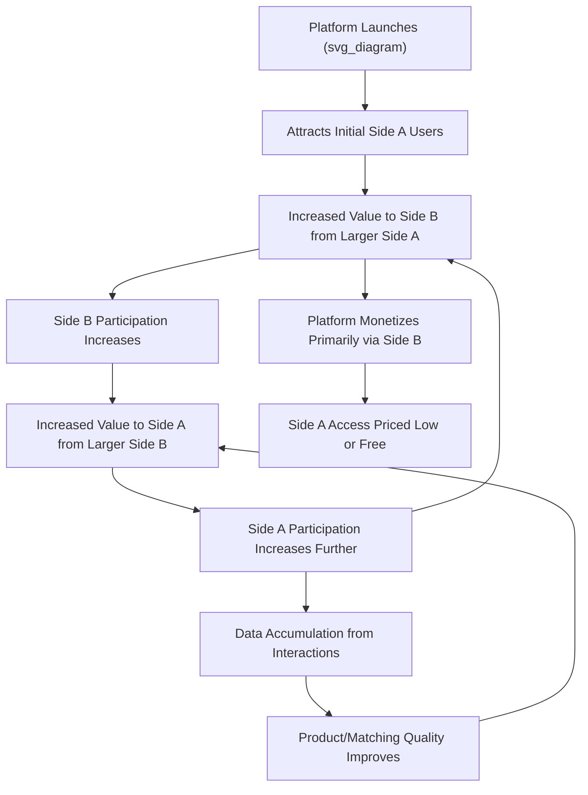

## The Economics of Technology and Digital Platforms

### Overview

The economics of digital platforms studies markets organized around intermediary firms — search engines, social networks, ride-sharing apps, e-commerce marketplaces — that connect multiple distinct groups of users to each other rather than simply selling a product directly to consumers. This subfield draws heavily on the theory of two-sided (and multi-sided) markets, network effects, and the economics of information goods, departing in important ways from the standard single-sided market models used in traditional industrial organization.

**Key Points**

- Platforms are defined by their role as intermediaries facilitating interaction between two or more distinct user groups, whose value to each other creates indirect network effects central to platform economics.
- Digital goods and platform-based markets frequently exhibit strong economies of scale, near-zero marginal costs of distribution, and winner-take-most (or winner-take-all) dynamics not typically present in traditional physical-goods markets.
- Competition policy for platforms raises distinctive analytical challenges, since traditional market definition and pricing analysis tools were developed primarily for single-sided markets with straightforward per-unit pricing.

### Two-Sided and Multi-Sided Markets

A **two-sided market** connects two distinct groups of users who need each other but cannot easily transact without an intermediary — the platform.

**Classic examples**:

- **Payment cards**: Connecting cardholders (consumers) and merchants who accept the card.
- **Ride-sharing platforms**: Connecting riders and drivers.
- **Search engines and social media**: Connecting users (who consume content/search results) and advertisers (who pay to reach those users).
- **Operating systems and app stores**: Connecting end users and third-party app developers.

The foundational theoretical work on two-sided markets, notably by Jean-Charles Rochet and Jean Tirole (2003, 2006), formalized the key insight that platform pricing decisions cannot be analyzed side-by-side independently — the price charged to one side affects participation on that side, which affects the value delivered to the other side, requiring the platform to consider both sides jointly when setting prices. [Unverified: specific publication years and precise theoretical claims should be verified against the original Rochet-Tirole papers if cited with technical precision]

### Network Effects (Network Externalities)

A **network effect** exists when the value a user derives from a good or platform depends on the number of other users of that good or platform.

- **Direct (same-side) network effects**: The value of a good increases with the number of *same-side* users (e.g., a telephone network becomes more valuable to each existing user as more people join the same network, since they can call more people).
- **Indirect (cross-side) network effects**: The value of the platform to one side depends on the number of participants on the *other* side (e.g., a ride-sharing app becomes more valuable to riders as more drivers join, reducing wait times, and more valuable to drivers as more riders join, increasing their earning opportunities).

**Formalizing cross-side network effects**: If $U_R$ is a rider's utility from the platform and $N_D$ is the number of drivers, a simple representation is:

$$U_R = v_R + f(N_D)$$

where $v_R$ is the rider's baseline valuation and $f(N_D)$ is increasing in the number of drivers, capturing the idea that more drivers (shorter wait times, better matching) directly raises rider value. A symmetric relationship typically holds for driver utility as a function of the number of riders.

**The chicken-and-egg problem**: A new platform entering a two-sided market with strong cross-side network effects faces a critical challenge — attracting one side requires already having the other side present, but attracting that other side requires already having the first side. Platforms commonly address this through strategies such as subsidizing one side heavily at launch (e.g., offering free or discounted services to early drivers/riders), starting with a single-sided use case before expanding, or launching first in a geographically or demographically concentrated market to reach a critical mass more quickly. [Inference: these are widely discussed strategic responses in platform strategy literature and business case studies; the effectiveness of any specific strategy in a given market is an empirical question that varies by context]

### Platform Pricing: The Two-Sided Pricing Structure

A defining and often counterintuitive feature of platform markets is that the **profit-maximizing price structure frequently involves charging one side very little (or even subsidizing it) while charging the other side more**, even absent traditional cost-based justifications for the price difference.

**Illustrative logic**: Suppose Side A (e.g., consumers) generates strong positive cross-side network effects for Side B (e.g., merchants/advertisers), but Side B's presence does not equally benefit Side A at the margin. The platform may find it optimal to price below cost (or even free) to Side A in order to attract a large user base, then monetize primarily through Side B, who benefits substantially from access to that large user base and is willing to pay accordingly.

**Examples of asymmetric platform pricing**:

- Search engines and social media platforms typically provide free access to end users while monetizing through advertisers.
- Many payment card networks historically charge cardholders relatively little (or offer rewards) while charging merchants a per-transaction fee.
- Some B2B software platforms charge software vendors/developers a fee for API/platform access while providing the core service free to end consumers.

**Important distinction**: This pricing asymmetry does **not** by itself indicate predatory pricing or anticompetitive behavior — it can be, and frequently is, a straightforward profit-maximizing response to differing price sensitivities and cross-side network effect magnitudes across the two sides, a key reason traditional antitrust price-cost tests (e.g., pricing below marginal cost as evidence of predation) require substantial adaptation when applied to platform markets. [Inference: this framing reflects the mainstream economic analysis of two-sided market pricing found in the platform economics literature; specific antitrust legal standards and their application to real cases remain actively debated and vary by jurisdiction]

### Economies of Scale and Near-Zero Marginal Cost

Many digital products exhibit a cost structure fundamentally different from traditional physical goods: **high fixed costs of initial creation, but very low (often near-zero) marginal cost of serving an additional user**.

$$\text{Average Cost} = \frac{\text{Fixed Cost}}{Q} + \text{Marginal Cost}$$

As $Q$ (the number of users) grows, average cost falls continuously toward the near-zero marginal cost, since the large fixed cost is spread across an ever-larger user base — a pattern of **strong economies of scale** that can persist across a much wider output range than in traditional manufacturing.

**Example**: Developing a software application or a streaming media catalog requires substantial upfront investment (development, content licensing, initial infrastructure), but once built, serving an additional user typically costs very little in server bandwidth and storage — a cost structure that rewards scale aggressively and can make it very difficult for a smaller competitor to match the cost efficiency of an established larger platform.

### Data as an Economic Input and "Data Network Effects"

Digital platforms frequently generate and use behavioral data from user interactions to improve their product (e.g., better search relevance, better content recommendations, better matching algorithms), creating what is sometimes termed a **data network effect** or **learning effect**: more users generate more data, which improves the product, which attracts more users — a feedback loop related to, but analytically distinct from, direct network effects, since the mechanism runs through product improvement rather than direct user-to-user interaction value.

**Economic and policy significance**: This dynamic has been central to debates about whether data accumulation itself constitutes a durable competitive advantage or "moat" for incumbent platforms, and whether this justifies specific policy interventions (e.g., data portability requirements, mandated interoperability) distinct from traditional antitrust remedies. [Unverified: the precise magnitude and persistence of data-driven competitive advantages is an actively debated empirical question in the platform economics and competition policy literature, without clear consensus on how strong or durable this specific mechanism is across different platform types]

### Illustrative Diagram: Two-Sided Platform Dynamics

### Winner-Take-Most Market Dynamics

The combination of strong network effects, economies of scale, and (often) low switching costs for initial adoption can produce **winner-take-most (or winner-take-all) market structures**, where a single platform captures a dominant share of a given market segment, rather than the more fragmented competitive structures typical of traditional industries.

**Contributing factors**:

- Strong same-side and cross-side network effects reward scale, since a larger platform is mechanically more valuable to each user than a smaller competing platform.
- Low marginal costs allow the dominant platform to expand output without the capacity constraints that might otherwise limit market share in a traditional industry.
- **Switching costs and multi-homing costs**: If users find it costly or inconvenient to use multiple competing platforms simultaneously (**multi-homing**) or to switch from one platform to another (e.g., due to accumulated data, social connections, or learned interface familiarity), this further entrenches an early leader's position.

**Countervailing factors**: Multi-homing is not always costly — many users of ride-sharing apps, food delivery platforms, or e-commerce marketplaces do use multiple competing platforms simultaneously, which can meaningfully limit a single platform's ability to extract excessive value or degrade quality, since dissatisfied users can readily switch marginal usage share to a competitor. The degree of winner-take-most dynamics is therefore not uniform across all platform markets, but depends on the specific strength of network effects and multi-homing costs in that particular market. [Inference: this nuanced, market-specific view is standard in the platform economics literature, though characterizing any particular real-world platform market's competitive intensity is an empirical question subject to ongoing analysis and debate]

### Platform Competition Policy Challenges

Digital platforms raise several distinctive antitrust and competition policy questions relative to traditional industries:

- **Market definition difficulty**: Standard market definition tools (e.g., the hypothetical monopolist test, examining whether a firm could profitably raise price by a small amount) are complicated by multi-sided pricing, since a platform might profitably lower price on one side (even below cost) while raising it on the other, making a single-sided price analysis potentially misleading.
- **"Free" services and consumer harm assessment**: Traditional antitrust analysis often centers on price effects, but many platform services are provided at a zero monetary price to end users, requiring alternative frameworks for assessing consumer harm (e.g., analyzing effects on data privacy, product quality, or the advertiser side of the market instead).
- **Self-preferencing concerns**: Platforms that both operate a marketplace and compete as a seller/participant within that same marketplace (e.g., an e-commerce platform that also sells its own private-label products alongside third-party sellers) raise concerns about whether the platform advantages its own offerings in ways that harm competition — a concern that has featured prominently in recent competition policy discussions and enforcement actions in multiple jurisdictions. [Unverified: specific ongoing or recent regulatory and legal proceedings evolve continuously; for current status of any specific case or regulation, a web search for up-to-date information would be needed rather than relying on potentially dated general knowledge]
- **Interoperability and data portability mandates**: Proposed as potential remedies to reduce switching costs and lower barriers to entry against an entrenched incumbent, though implementation raises its own technical and economic trade-offs (e.g., balancing interoperability against privacy and security considerations).

### The "Attention Economy" and Advertising-Based Business Models

Many platforms monetize primarily through advertising, effectively selling access to user attention rather than charging users directly — a model with distinctive economic features:

- **Zero monetary price does not mean zero cost to users**: Users "pay" through attention, data provision, and exposure to advertising, an economically real (though non-monetary) cost that standard consumer surplus measures based on market prices do not directly capture.
- **Potential misalignment of incentives**: Because platform revenue in an advertising model depends on user engagement and attention (time spent, interaction frequency) rather than directly on a price users are willing to pay for the underlying content, this can create an incentive structure where maximizing engagement is prioritized over other dimensions of user welfare — a concern raised extensively in public discourse and some academic literature regarding social media platform design, though the extent, mechanisms, and appropriate policy response remain genuinely contested. [Unverified: claims about specific welfare effects of engagement-optimized platform design are an active area of ongoing empirical research and public debate, not a settled empirical consensus, and reasonable analysts disagree on both the magnitude of any such effect and the appropriate regulatory response]

### Platform Governance and the "Regulator" Role of Private Platforms

Platforms that host third-party content or transactions (app stores, social media, marketplaces) often exercise substantial private governance authority — setting rules for what content, products, or behavior is permitted, and enforcing those rules through content moderation, product delisting, or account suspension. This raises economic and policy questions about the platform's dual role as both **market participant** (in some cases) and **de facto private regulator** of that same market, a tension that has become a significant focus of both economic analysis and public policy debate regarding appropriate platform accountability and transparency standards. [Unverified: this is an active and evolving area of both economic scholarship and legislative/regulatory activity across multiple countries; current specifics should be verified via web search for up-to-date developments]

### Digital Goods and Zero Marginal Cost Pricing Strategies

Beyond platforms specifically, digital goods more broadly (software, streaming media, digital content) exhibit pricing strategies adapted to near-zero marginal cost:

- **Freemium models**: Offering a basic version free while charging for premium features, leveraging the near-zero cost of serving free-tier users to build a large user base, a portion of which converts to paying customers.
- **Subscription models**: Converting one-time purchase economics into recurring revenue, often favored for digital content/software given the low marginal cost of continued access provision.
- **Price discrimination via bundling and tiering**: Because digital goods can be costlessly replicated and customized, platforms can implement more granular price discrimination (e.g., regional pricing, tiered feature access) than is typically feasible for physical goods, extracting a larger share of consumer surplus while potentially expanding overall access relative to a single uniform price.

### Conclusion

The economics of digital platforms extends and adapts core microeconomic and industrial organization concepts — market structure, pricing, competition — to address the distinctive features of multi-sided markets: cross-side network effects, near-zero marginal costs, data-driven feedback loops, and winner-take-most dynamics. These features generate both substantial consumer benefits (free or low-cost access to valuable services, rapid innovation, large-scale matching efficiency) and genuine policy challenges (market definition difficulties, self-preferencing concerns, attention-economy incentive questions) that remain the subject of active economic research and evolving regulatory approaches across jurisdictions.

**Next Steps**

- Two-Sided Market Theory (Rochet-Tirole Framework)
- Network Effects and Critical Mass Dynamics
- Antitrust and Competition Policy for Digital Markets
- The Economics of Information Goods and Zero Marginal Cost
- Price Discrimination and Bundling Strategies
- Data Privacy Economics and Regulation
- Platform Governance and Content Moderation Policy
- Gig Economy Labor Markets and Platform Work