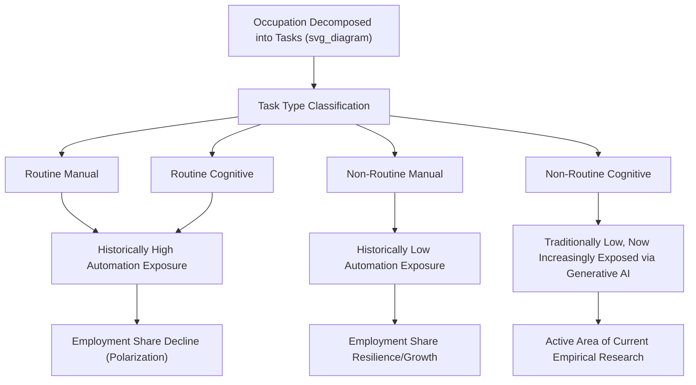

## Automation, Artificial Intelligence, and the Future of Work

### Overview

The economics of automation and artificial intelligence examines how labor-saving and labor-augmenting technologies affect employment, wages, the composition of tasks within occupations, and the overall structure of labor markets. Unlike earlier waves of automation, which primarily displaced routine manual and clerical tasks, generative AI and related technologies extend automation's reach into cognitive, creative, and communication-intensive tasks previously considered relatively insulated from technological substitution, prompting substantial revision of standard labor economics frameworks and an active, rapidly evolving empirical research literature.

**Key Points**

- The task-based framework — distinguishing occupations by their *task content* rather than treating them as monolithic units — is the dominant modern approach to analyzing automation's labor market effects, replacing earlier occupation-level analyses.
- Automating technologies can be either **labor-substituting** (directly replacing human task performance) or **labor-augmenting** (increasing worker productivity without full task replacement), and the net effect on employment and wages depends critically on which mechanism dominates for a given task and worker skill level.
- Empirical evidence on generative AI's labor market effects through late 2025/early 2026 remains genuinely mixed and is an active area of ongoing research, with some studies finding modest positive or null aggregate effects and others finding measurable declines in demand for highly exposed and substitutable tasks — this is a live, unsettled empirical question rather than a topic with a single settled consensus finding.

### The Task-Based Framework

Building on foundational work by Daron Acemoglu, David Autor, and coauthors, the modern approach to automation economics decomposes jobs into constituent **tasks** rather than treating "occupations" as fixed, indivisible units:

$$Y = \int_{0}^{1} y(i) \, di$$

where each task $i$ can be performed by either labor or capital/technology, and the equilibrium allocation of tasks between labor and machines depends on relative costs and comparative advantage — closely analogous to the Ricardian trade framework, but applied to the allocation of tasks between humans and machines *within* an economy rather than goods production *between* countries.

**Key implication**: A given occupation is rarely "fully automated" all at once. Instead, automation typically proceeds task-by-task within occupations, and an occupation's net exposure to automation depends on what share of its constituent tasks are technically automatable and economically worthwhile to automate at current technology and relative factor costs.

### Labor-Substituting vs. Labor-Augmenting Technology

- **Labor-substituting (automating) technology**: Directly performs tasks previously done by workers, reducing labor demand for those specific tasks (e.g., robotic assembly line automation replacing manual assembly tasks; AI-generated first-draft content replacing routine writing tasks).
- **Labor-augmenting (complementary) technology**: Increases the productivity of workers performing a task, without eliminating the need for human involvement in that task (e.g., AI-assisted coding tools that help programmers write code faster without eliminating the programming role itself; diagnostic AI tools that augment, rather than replace, physician judgment).

**Net effect ambiguity**: Even a single technology can be simultaneously substituting for some tasks/workers and augmenting for others, depending on skill level and task specifics. Recent empirical work distinguishes this heterogeneity explicitly: occupations and tasks classified as more "automation-prone" have tended to show declining labor demand and simplified skill requirements in some studies, while occupations classified as more "augmentation-prone" have shown increases in demand and rising skill complexity, though findings vary across studies and datasets.

### Historical Precedent: Prior Waves of Automation

Economic history provides useful — though imperfect — precedent for reasoning about technology-driven labor market transitions:

- **Industrial Revolution (mechanization of manufacturing)**: Initially displaced specific skilled craft occupations (e.g., hand-loom weavers) while eventually creating substantial new employment in factory-based production and entirely new industries, though the transition imposed severe short-run hardship on displaced workers and their communities.
- **Mid-to-late 20th century automation (routine task substitution)**: Autor, Levy, and Murnane's (2003) influential framework documented that computerization primarily substituted for **routine** tasks (both manual, like assembly-line work, and cognitive, like bookkeeping) while complementing **non-routine** tasks (both manual, like janitorial or personal care work, and cognitive/analytical, like managerial or professional judgment tasks) — a pattern often summarized as job **polarization**, with employment growth concentrated at both the high-skill/high-wage and low-skill/low-wage ends of the distribution, and relative decline in routine, middle-skill occupations. [Unverified: specific publication details for this foundational paper should be verified if cited with precision; the general routine-task polarization finding itself is a well-established and widely replicated pattern in labor economics through the early 2000s-2010s period]
- **Key distinction for the current AI wave**: Generative AI's capabilities extend into tasks — writing, translation, coding, image generation, customer communication, basic analysis — that were previously considered **non-routine cognitive** tasks and were expected, under the prior routine-biased framework, to be relatively insulated from automation. This represents a meaningful departure from the historical pattern and is a central reason the current wave is analyzed as potentially distinct from prior automation episodes, rather than simply an extension of them. [Inference: this characterization of generative AI's departure from the prior routine/non-routine distinction is a widely discussed framing in the recent economics literature, though how fully and how quickly this departure will manifest in realized labor market outcomes remains an open empirical question]

### Illustrative Diagram: Task-Based Automation Framework

### Current Empirical Evidence on Generative AI (as of early 2026)

The empirical literature on generative AI's labor market effects has expanded rapidly since the late-2022 release of widely accessible large language model tools, and findings across studies are genuinely mixed rather than converging on a single consistent picture. Selected strands of this evolving evidence, current as of early 2026:

- **Aggregate labor market indicators**: Some broad studies analyzing U.S. survey and administrative data have found no clear relationship between AI exposure and aggregate unemployment through mid-to-late 2025, and one analysis using December 2025 data found generative AI usage had reached over a third of U.S. workers, alongside small positive average wage effects and no statistically significant aggregate declines in job openings or employment in AI-exposed occupations.
- **Occupation- and firm-level administrative data**: In contrast, other studies using detailed administrative payroll records have documented measurable relative employment declines in the most AI-exposed occupations following the release of widely accessible generative AI tools, and corresponding declines in job postings for more substitutable roles.
- **Online freelance/gig labor markets**: Several studies focusing specifically on online freelance platforms have found more consistent evidence of negative effects on employment and earnings in highly automatable task categories — particularly writing, translation, and certain visual/image-creation freelance work — with the sharpest declines concentrated in short-term contract work and among novice-level freelancers, while some higher-skilled workers in AI-complementary technical roles (e.g., machine learning programming) have seen increased demand.
- **Cross-national evidence**: A study linking Danish administrative employment records to survey-reported generative AI tool usage across a set of exposed occupations found essentially no measurable effect on earnings or hours worked through 2024, illustrating that findings can differ meaningfully depending on the country, time horizon, and specific occupations studied.
- **Confounding concerns**: Some researchers have raised the methodological concern that AI-exposed occupations tend to be concentrated in macroeconomically rate-sensitive sectors (such as information and finance), meaning that observed employment declines attributed to AI exposure in some studies may be partly or substantially confounded by broader macroeconomic conditions (e.g., interest rate cycles) rather than reflecting AI's causal effect in isolation.

**Overall assessment**: As of early 2026, the weight and interpretation of this evidence remains actively contested among researchers, with the most consistent finding across studies being that effects are highly **heterogeneous** — varying substantially by task type, skill level, sector, contract structure (freelance vs. traditional employment), and time horizon — rather than showing a single uniform aggregate effect in either direction. [Unverified: this is a fast-moving area of empirical research; the specific studies, findings, and figures summarized here reflect the state of published and working-paper evidence as of early 2026 search results, and the field's overall assessment may continue to shift as more data accumulates and longer time horizons become available for study]

### Skill-Biased and "Ability-Biased" Technological Change

The traditional **skill-biased technological change (SBTC)** framework holds that technology tends to complement higher-skilled (often college-educated) workers while substituting for lower-skilled workers, contributing to rising wage inequality between skill groups since the late 20th century. Emerging generative AI evidence complicates this framework in at least one notable respect: some studies suggest generative AI tools may disproportionately raise the productivity of **lower-performing or less-experienced** workers within a given task category (a "leveling" effect on performance dispersion within a task), even as, separately, it may reduce overall labor demand for the least-skilled workers in categories where the task itself is highly automatable — meaning the skill-bias implications of this technology wave may not map cleanly onto the traditional SBTC pattern, and could differ by whether the analysis focuses on within-task performance dispersion versus across-occupation labor demand effects. [Unverified: this is an emerging and actively debated finding in the recent economics literature rather than an established consensus, and the balance of these within-task versus across-occupation effects on overall inequality remains an open empirical question]

### Productivity Effects and the "Complementarity" Case

A significant strand of the economic argument for AI's positive labor market potential rests on **productivity complementarity**: AI tools that augment worker capabilities can raise output per worker-hour without necessarily reducing total employment, particularly if increased productivity lowers the effective price of the good/service produced, thereby increasing overall demand for it (an application of the broader economic principle sometimes summarized, somewhat loosely, as the "productivity effect" partially offsetting the direct "displacement effect" of automation — a distinction formalized in the Acemoglu-Restrepo task-based automation framework). [Inference: the "displacement effect vs. productivity effect" framing is a standard analytical distinction in the modern automation economics literature associated with Acemoglu and Restrepo's work; whether the productivity effect fully, partially, or negligibly offsets displacement in the specific case of generative AI is precisely the open empirical question the current research literature is attempting to resolve]

### Macroeconomic and Growth Implications

Beyond individual labor market effects, several official and academic analyses have raised the prospect that AI could drive **divergent economic growth trajectories** across countries, analogous to earlier major industrial and technological transitions, with countries possessing greater compute capacity, capital investment capacity, and innovation ecosystem strength potentially capturing disproportionate growth benefits. However, the empirical case for attributing recent cross-country growth differentials specifically to AI (as opposed to other cyclical, fiscal, or geopolitical factors) remains limited as of early 2026, given the short observation window available since generative AI's widespread deployment and the difficulty of isolating its specific contribution from other simultaneous macroeconomic forces. Some international policy analyses have also emphasized that AI-driven divergence concerns extend beyond aggregate growth to **distributional effects** both within and between countries. [Unverified: these are characterizations of an active area of ongoing policy analysis and academic debate as of early 2026; given the rapid pace of change in this area, a fresh web search is recommended for the most current assessments if this content is being used at a later date]

### Policy Responses Under Discussion

Economic and policy discussions regarding automation and AI's labor market effects have generated several recurring proposed policy responses, each with distinct economic trade-offs:

- **Universal Basic Income (UBI)**: Proposed as a response to potential widespread technological unemployment, providing an unconditional income floor; economic debate centers on funding mechanisms, potential labor supply disincentive effects, and whether it is a well-targeted response relative to alternatives given the currently mixed evidence on aggregate employment effects.
- **Retraining and active labor market policies**: Government-funded skills retraining programs aimed at helping displaced workers transition into growing occupations; effectiveness evidence from prior automation waves is itself mixed, and the speed of AI-driven task change may challenge the traditional retraining timeline.
- **Robot/automation taxes**: Proposed taxes specifically on automating capital investment, intended to slow the pace of labor displacement or fund transition support; economists disagree substantially on whether such taxes would be efficient or would simply discourage productivity-enhancing investment without meaningfully protecting the specific workers affected.
- **Portable benefits and labor market institution reform**: Proposals to detach benefits (healthcare, retirement) from specific employer relationships, motivated partly by the rise of gig and platform-based work patterns that automation and AI-related labor market restructuring may accelerate.
- **Data and AI governance measures**: Broader regulatory discussions regarding AI transparency, labor market impact disclosure requirements, and worker input into AI deployment decisions have also featured in recent policy discourse. [Unverified: the specific status of any of these policy proposals in any given jurisdiction changes frequently; verify current legislative and regulatory status via web search if precise, current policy detail is required]

### Measuring AI Exposure: Methodological Approaches

Researchers use several distinct approaches to measure an occupation's or task's "exposure" to AI-driven automation, each with different strengths and limitations:

- **Expert/algorithmic task-content ratings**: Classifying occupations by the share of constituent tasks judged (by human experts or algorithmic text analysis of job descriptions) to be technically performable by current AI capabilities.
- **Revealed usage data**: Directly measuring which tasks and occupations show actual AI tool usage in practice (e.g., analysis of anonymized conversation data from AI assistant platforms, or self-reported survey usage), which captures realized adoption rather than only theoretical technical feasibility.
- **Job posting and hiring pattern analysis**: Tracking changes in job posting volume, required skills, and wage offers for occupations classified by AI exposure level, using online job board data.

**Important methodological caution**: These approaches can produce different exposure rankings and, consequently, different empirical conclusions about labor market effects, since "technically automatable" and "actually being automated in practice at a given point in time" are conceptually distinct and need not coincide, particularly during an early adoption period.

### Conclusion

The economics of automation and artificial intelligence has moved decisively toward a task-based analytical framework that recognizes automation as a task-level, rather than occupation-level, phenomenon, with net labor market effects depending on the balance between direct displacement and productivity-driven complementarity effects. Unlike earlier, more settled findings regarding prior automation waves' role in routine-task polarization, the empirical evidence specifically regarding generative AI's labor market effects remains genuinely unsettled and rapidly evolving as of early 2026 — characterized by substantial heterogeneity across studies, sectors, skill levels, and time horizons, making this an area where current research findings should be treated as provisional and subject to revision as more post-adoption data accumulates over a longer time horizon.

**Related Topics**

- The Acemoglu-Restrepo Task-Based Automation Model
- Skill-Biased Technological Change and Wage Inequality
- Job Polarization and the Routine-Task Hypothesis (Autor, Levy, Murnane)
- The Economics of Digital Platforms and Gig Work
- Universal Basic Income: Economic Arguments and Evidence
- Active Labor Market Policies and Retraining Program Effectiveness
- Historical Technological Transitions (Industrial Revolution Labor Market Effects)
- Measuring AI Exposure and Adoption in Economic Research