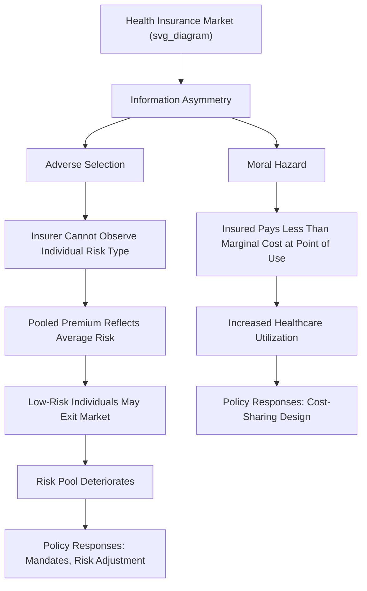

## Healthcare Economics

### Overview

Healthcare economics applies microeconomic and public finance theory to the production, financing, and distribution of medical care. The field is distinguished from standard commodity markets by a set of structural features — pervasive information asymmetry, third-party payment, uncertainty over illness onset, and market failures in insurance — that cause the standard competitive market model to break down and motivate extensive government intervention across virtually every country's healthcare system.

**Key Points**

- Health insurance markets are structurally prone to two distinct failures — adverse selection and moral hazard — both arising from asymmetric information between insurers, insured individuals, and healthcare providers.
- The demand for healthcare is fundamentally a **derived demand for health itself**, and is complicated by the fact that consumers (patients) often do not directly bear the marginal cost of the care they consume, weakening standard price-based demand discipline.
- Because of these distinctive market failures, virtually no country relies on a purely private, unregulated market to allocate healthcare, and international healthcare systems vary primarily in the specific *combination* of public and private financing and provision mechanisms chosen, rather than in whether some form of intervention exists at all.

### Why Healthcare Markets Differ From Standard Competitive Markets

Kenneth Arrow's foundational 1963 paper, "Uncertainty and the Welfare Economics of Medical Care," identified several structural features of healthcare markets that violate the assumptions required for a competitive market to produce efficient outcomes:

1. **Uncertainty of illness**: Individuals face genuine uncertainty about when illness will strike and how severe or costly treatment will be, creating demand for insurance as a mechanism for risk-pooling.
2. **Information asymmetry between patient and physician**: Patients typically possess far less medical knowledge than providers, creating an unusual **agency relationship** in which the physician acts as an advisor influencing the patient's own demand decisions — a structural feature largely absent from standard consumer goods markets.
3. **Barriers to entry into the medical profession**: Licensing requirements restrict supply, distinguishing physician labor markets from the free-entry assumption of perfectly competitive markets.
4. **Product uncertainty and non-standardization**: The quality and appropriateness of a given medical treatment for a given patient is often genuinely uncertain even to well-informed providers, complicating both the patient's own evaluation of quality and, separately, the standard external quality-verification mechanisms available in other markets. [Unverified: exact wording and full scope of Arrow's original argument should be checked against the primary source if cited with technical precision, though the substance of these market-failure categories is a foundational and uncontroversial starting point in the health economics literature]

### The Physician Agency Problem and Supplier-Induced Demand

Because patients typically cannot independently assess what care they need, physicians act as the patient's **agent**, recommending treatment on the patient's behalf. This agency relationship creates the possibility of **supplier-induced demand (SID)**: the concern that providers, who often benefit financially from providing more services (particularly under fee-for-service payment models), may recommend more treatment than is medically necessary, exploiting the patient's inability to independently verify the appropriate quantity or type of care.

**Economic significance**: If supplier-induced demand exists to a meaningful degree, standard assumptions that demand curves reflect genuine consumer preferences and needs (rather than partly reflecting provider financial incentives) are undermined, complicating both empirical demand estimation and policy analysis of healthcare spending growth. The magnitude of supplier-induced demand in real-world healthcare markets remains a genuinely disputed empirical question in the health economics literature, with some studies finding substantial evidence for it in specific contexts (e.g., certain surgical procedures with high physician-to-population ratios) and others finding more limited effects. [Unverified: the extent of supplier-induced demand is an actively debated empirical question without clear field-wide consensus on its overall magnitude across different healthcare systems and specialties]

### Adverse Selection in Health Insurance Markets

**Adverse selection** arises when one party to a transaction (the insured individual) has private information about their own risk type that the other party (the insurer) does not observe, and this information asymmetry distorts the market.

**Mechanism**: If insurers cannot distinguish high-risk from low-risk individuals and must charge a single pooled premium, that premium reflects the *average* risk in the insured population. At this pooled price, low-risk individuals may find insurance unattractively priced relative to their own low expected costs and choose to forgo coverage (or purchase less generous coverage), leaving a progressively higher-risk pool of remaining purchasers — potentially triggering a self-reinforcing cycle in which premiums rise and progressively healthier individuals exit, sometimes referred to as an **adverse selection death spiral** in the most severe theoretical case.

**Formal illustration**: If the insurer sets premium $P = E[\text{Cost} | \text{pooled population}]$, but individuals know their own risk type $\theta_i$, only those with $E[\text{Cost}|\theta_i] \geq P$ (or close to it, given risk aversion) find purchasing worthwhile at that price, shifting the realized risk pool's average cost upward relative to the full population, in a mechanism formally analyzed in Akerlof's (1970) "market for lemons" framework, applied to insurance by Rothschild and Stiglitz (1976).

**Market responses to adverse selection**:

- **Risk-based underwriting**: Insurers attempt to gather information (medical history, risk factor screening) to price policies according to individual risk, though this can undermine risk-pooling for the sick and raises equity concerns.
- **Mandates**: Requiring universal participation (e.g., an individual mandate to purchase insurance) prevents low-risk individuals from selectively opting out, stabilizing the risk pool by design rather than through pricing alone.
- **Community rating with risk adjustment**: Prohibiting risk-based pricing (community rating) while using a separate risk-adjustment mechanism to compensate insurers who enroll a disproportionately sicker population, attempting to preserve both broad access and insurer financial viability simultaneously.

### Moral Hazard in Health Insurance

**Moral hazard** in health insurance refers to the tendency for insured individuals to consume more healthcare (or take less care to prevent illness) than they would if they bore the full marginal cost themselves, because insurance reduces the price they face at the point of use.

**Ex-ante vs. ex-post moral hazard**:

- **Ex-ante moral hazard**: Reduced incentive to engage in preventive/risk-reducing behavior (e.g., diet, exercise, safety precautions) because insurance cushions the financial consequences of illness or injury.
- **Ex-post moral hazard**: Increased consumption of healthcare services once illness or injury has occurred, because the insured individual pays only a fraction of the marginal cost (or none, under full coverage) — generally considered the more significant and more extensively studied form of moral hazard in the health economics literature.

**The RAND Health Insurance Experiment**: A landmark large-scale randomized study (conducted in the 1970s–1980s) randomly assigned participants to insurance plans with varying cost-sharing levels, finding that individuals facing higher cost-sharing (coinsurance/deductibles) consumed measurably less healthcare than those with full coverage — providing direct experimental evidence of the price-sensitivity of healthcare demand, i.e., moral hazard's practical significance — while also finding that the reduced consumption at higher cost-sharing levels had little detectable effect on health outcomes for the average participant, though effects were more negative for certain vulnerable subgroups (e.g., low-income individuals with specific chronic conditions). [Unverified: specific numerical findings, exact subgroup results, and precise study dates should be verified against the original RAND study documentation if cited with technical precision, given the study's age and the extensive secondary literature discussing and re-examining its findings]

**The moral hazard-risk protection trade-off**: Health insurance design faces an inherent tension: more generous coverage (lower cost-sharing) provides greater financial risk protection against catastrophic illness costs but induces greater moral hazard (excess utilization); less generous coverage reduces moral hazard but provides less risk protection — a trade-off with no cost-free resolution, central to the economic design of optimal insurance cost-sharing structures (deductibles, coinsurance, and out-of-pocket maximums).

### Illustrative Diagram: Adverse Selection and Moral Hazard in Insurance Markets

### The Demand for Health: Grossman Model

Michael Grossman's (1972) model reframes healthcare not as a good demanded directly for its own sake, but as an **input into the production of health**, which is itself modeled as a durable capital stock that depreciates over time and can be replenished through investments including medical care, and yields both direct utility and increased productive time (as an investment good). [Unverified: precise formal specification details of the Grossman model should be verified against primary or standard health economics textbook sources if technical precision is required]

$$H_{t+1} = I_t + (1-\delta_t)H_t$$

where $H_t$ is the health capital stock at time $t$, $I_t$ is investment in health (including medical care and health-related behaviors) at time $t$, and $\delta_t$ is the depreciation rate of health capital (which typically rises with age).

**Key implication**: This framework distinguishes the **demand for healthcare** (an intermediate input) from the **demand for health** (the underlying good actually valued), explaining why healthcare demand can be highly inelastic for care that is essential to restoring a valued health stock (e.g., emergency treatment for a life-threatening condition) while being much more price-elastic for care with more discretionary or preference-sensitive value (e.g., elective procedures).

### Price Elasticity of Demand for Healthcare

Empirical estimates generally find healthcare demand to be **relatively price-inelastic** compared to many other goods, though elasticity varies substantially by type of care:

- **Emergency and acute care**: Typically highly inelastic — patients facing a medical emergency have little discretion to reduce consumption in response to price.
- **Preventive and routine care**: More price-elastic — patients have greater discretion over whether and how frequently to seek preventive services, making utilization more responsive to cost-sharing changes.
- **Elective and discretionary procedures**: Generally the most price-elastic category, given genuine discretion over both timing and whether to proceed at all.

This heterogeneity in elasticity across care types has direct implications for cost-sharing policy design: high cost-sharing applied uniformly across all care types risks discouraging valuable preventive care (which may be cost-effective or even cost-saving in the long run by avoiding more expensive downstream treatment) even while successfully reducing genuinely discretionary utilization.

### Supply-Side Considerations: Physician and Hospital Markets

- **Licensing and scope-of-practice regulation**: Restricts the supply of providers able to perform specific services, a policy generally justified on quality/safety grounds but which also raises standard economic concerns about supply restriction's effect on price and access, particularly regarding scope-of-practice limits on non-physician providers (e.g., nurse practitioners, physician assistants) who may be capable of safely providing certain services at lower cost.
- **Hospital market concentration**: Hospital mergers and increasing market concentration have been extensively studied for their effects on prices, with a substantial body of empirical research generally finding that increased hospital market concentration is associated with higher prices, though effects on quality are more mixed and studied with somewhat less consistency across the literature. [Unverified: specific magnitude estimates and precise consensus strength on quality effects should be verified against current health economics and industrial organization literature if cited with precision, as this remains an active area of ongoing empirical research]
- **Certificate-of-Need (CON) laws**: Regulations in some jurisdictions requiring providers to demonstrate a documented need before expanding capacity (e.g., building new hospital facilities or acquiring certain equipment); economic analysis of these laws generally centers on the trade-off between their stated goal (avoiding costly excess capacity) and their potential to function as an entry barrier protecting incumbent providers from competition.

### Health Insurance System Design: Comparative Approaches

| System Type | Financing Mechanism | Representative Approach | Key Economic Trade-off |
| --- | --- | --- | --- |
| Single-payer | General taxation funds a single public insurer | Often associated with Canada's Medicare system | Lower administrative costs and stronger price negotiation leverage vs. potential for longer wait times for non-emergency care |
| Social health insurance (multi-payer) | Mandatory contributions to competing, regulated non-profit or quasi-public insurers | Historically associated with Germany's statutory health insurance system | Preserves consumer choice among insurers vs. greater administrative complexity than single-payer |
| Regulated private market with subsidies | Private insurance with mandates, subsidies, and regulation (e.g., guaranteed issue, community rating) | Historically associated with elements of the U.S. Affordable Care Act marketplace structure | Preserves market competition and choice vs. greater residual risk of coverage gaps and higher administrative costs |
| Predominantly private, employer-based | Voluntary employer-sponsored insurance with limited public programs for specific populations | Historically associated with the traditional core of the U.S. employer-based system | Ties coverage to employment status, creating "job lock" concerns, vs. leveraging employer purchasing power |

[Unverified: specific system characterizations reflect general, commonly taught health economics stylizations; actual healthcare system designs are complex, vary considerably in their specific institutional details, and are subject to ongoing reform in most countries — verify current system-specific details via web search if precise, up-to-date policy description is required]

### Cost-Effectiveness Analysis and Health Technology Assessment

Given resource constraints, healthcare systems (particularly those with centralized purchasing or reimbursement decisions) frequently employ **cost-effectiveness analysis** to compare the value of different treatments, commonly using the **Quality-Adjusted Life Year (QALY)** as a standardized outcome metric that combines both quantity and quality of life gained from an intervention:

$$\text{Incremental Cost-Effectiveness Ratio (ICER)} = \frac{\text{Cost}_A - \text{Cost}_B}{\text{QALYs}_A - \text{QALYs}_B}$$

Health technology assessment bodies in some countries use an explicit or implicit cost-per-QALY threshold to guide reimbursement decisions, comparing a new treatment's ICER against this threshold to determine whether it represents sufficient value to justify public funding. This approach raises both technical questions (how to reliably measure QALYs across different conditions and populations) and normative/ethical questions (whether a single cost-per-QALY threshold appropriately values life extension and quality-of-life improvement across different patient populations and disease severities), which remain subjects of ongoing debate in health economics and bioethics. [Unverified: specific threshold values and institutional practices vary by country and are periodically revised; verify current practice for any specific jurisdiction via web search if precise current detail is required]

### Externalities in Healthcare: Vaccination as a Case Study

Certain healthcare interventions generate **positive externalities** beyond the individual recipient, most notably vaccination against communicable disease:

- An individual's vaccination decision reduces not only their own risk of infection but also the risk of transmission to others (**herd immunity** effects), meaning private vaccination decisions based only on individual cost-benefit calculation will generally be **below the socially optimal level**, since individuals do not account for the value their vaccination provides to others.
- This externality provides a standard economic rationale for public subsidization or, in some contexts, mandating of vaccination, analogous to the standard public finance case for subsidizing goods with positive externalities more broadly (paralleling the logic developed in public goods and externality theory).

### Conclusion

Healthcare economics demonstrates why the standard competitive market model, effective for allocating most ordinary goods and services, requires substantial modification when applied to medical care — a domain characterized by pervasive information asymmetry between patients, providers, and insurers, genuine uncertainty over illness, and health-specific externalities. These structural features generate the adverse selection and moral hazard problems central to insurance market design, motivate the physician agency and supplier-induced demand literature, and collectively explain why virtually every developed healthcare system relies on substantial government intervention — whether through direct public provision, mandated insurance, subsidies, or extensive regulation — rather than an unregulated private market.

**Related Topics**

- Arrow's 1963 Framework and the Foundations of Health Economics
- Adverse Selection and the Rothschild-Stiglitz Insurance Model
- Moral Hazard and Optimal Insurance Cost-Sharing Design
- The Grossman Model of Health Capital
- Comparative Health Systems: Single-Payer, Social Insurance, and Market-Based Models
- Cost-Effectiveness Analysis and QALYs in Health Technology Assessment
- Pharmaceutical Economics and Drug Pricing Policy
- Externalities and Public Health Interventions