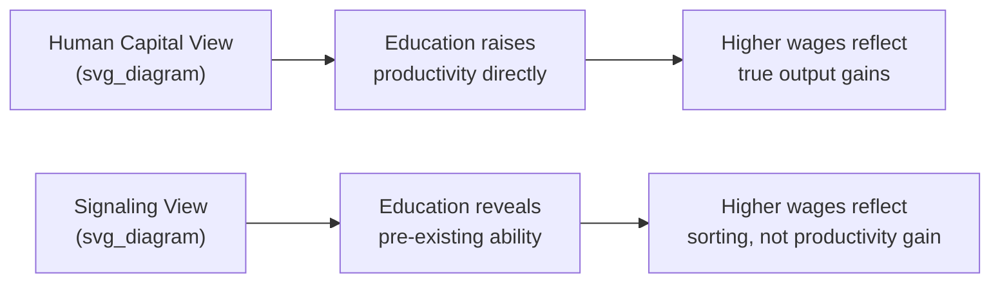
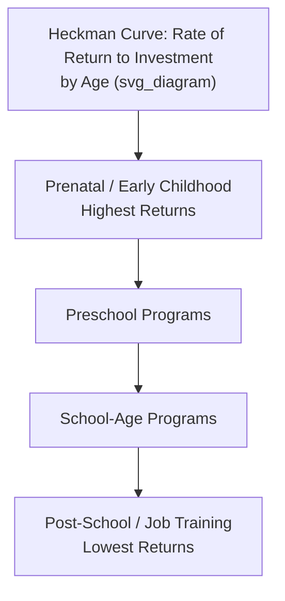

## The Economics of Education

### Introduction and Scope

The economics of education studies how individuals, households, and societies allocate scarce resources to the production and acquisition of knowledge and skills. It treats education both as a form of investment (human capital formation) and as a signal in labor markets, examining costs, benefits, financing mechanisms, and the broader social returns that justify public involvement in schooling.

### Human Capital Theory

**Key Points**

- Human capital theory (Becker, Mincer, Schultz) treats education as an investment in productive capacity, analogous to physical capital investment.
- Individuals incur costs (tuition, foregone earnings) in the present to obtain a stream of higher future earnings.
- Education raises worker productivity, which employers reward with higher wages under competitive labor markets.

The canonical formalization compares the present value of costs and benefits of an additional year of schooling. An individual invests in education up to the point where the marginal rate of return equals the market interest rate (or discount rate) on alternative investments.

$$PV = \sum_{t=1}^{n} \frac{B_t}{(1+r)^t} - C_0$$

Where $B_t$ is the earnings differential attributable to education in year $t$, $C_0$ is the upfront cost (direct plus opportunity cost), and $r$ is the discount rate. Education is undertaken if $PV > 0$.

**The Mincer Earnings Equation**

The most widely used empirical specification linking education to earnings is:

$$\ln(w_i) = \alpha + \beta S_i + \gamma_1 EXP_i + \gamma_2 EXP_i^2 + \varepsilon_i$$

Where $\ln(w_i)$ is log wages, $S_i$ is years of schooling, $EXP_i$ is labor market experience, and $\beta$ is interpreted as the private **rate of return to an additional year of schooling**. Empirically, $\beta$ typically falls in the 5–10% range across countries, though this varies by level of education, gender, and country income level. [Inference: exact magnitude is context- and data-dependent; treat cited ranges as indicative of common empirical findings rather than universal constants]

### Signaling and Screening Theory

**Key Points**

- Spence's signaling model offers an alternative to human capital theory: education may not raise productivity directly but instead signals pre-existing ability to employers.
- Under asymmetric information, high-ability workers use costly-but-attainable credentials to separate themselves from low-ability workers, since the same credential is disproportionately costly for the latter to obtain.
- This generates a "separating equilibrium" where education correlates with wages even absent any causal productivity effect.

The **sheepskin effect** — where earnings jump discontinuously at degree-completion years (e.g., 12th or 16th year of schooling) rather than rising smoothly — is often cited as evidence favoring signaling over a pure human-capital story, since a strict productivity-only account should show even bang for each schooling year regardless of credential completion. [Inference: signaling and human capital are not mutually exclusive; most economists treat observed returns as a blend of both mechanisms, and the balance between them remains actively debated]

### Private vs. Social Returns to Education

**Key Points**

- **Private return**: the increase in an individual's own earnings net of their own costs.
- **Social return**: the increase in aggregate output/welfare net of full resource costs, including externalities.
- Social returns typically diverge from private returns due to externalities and public subsidy of education costs.

**Externalities in Education**

Education is widely argued to generate positive externalities beyond the individual recipient:

- Higher aggregate productivity through knowledge spillovers among co-workers.
- Reduced crime rates and lower public health/welfare costs.
- Better-informed civic participation and more effective democratic institutions.
- Intergenerational effects: parental education strongly predicts children's education and health outcomes.

Because private agents do not capture the full social value of their schooling decisions, **the socially optimal level of education exceeds the privately optimal level** absent intervention — the classic rationale for public subsidy.

$$MSB = MPB + MEB$$

Where $MSB$ is marginal social benefit, $MPB$ is marginal private benefit, and $MEB$ is marginal external benefit. Efficient provision requires $MSB = MSC$ (marginal social cost), not merely $MPB = MPC$.

### Education as a Merit Good and Market Failures

**Key Points**

- Education is frequently classified as a **merit good**: society deems it under-consumed relative to the social optimum if left purely to individual choice, justifying compulsory schooling laws alongside subsidies.
- Several distinct market failures motivate government intervention:

| Market Failure | Mechanism | Typical Policy Response |
| --- | --- | --- |
| Positive externalities | Social benefits exceed private benefits | Subsidies, public provision |
| Capital market imperfections | Students (esp. from low-income households) cannot borrow against future earnings to finance education, since human capital cannot serve as collateral | Government-backed student loans, grants |
| Information asymmetry | Students/parents may not accurately gauge returns to schooling or quality differences across providers | Public information campaigns, accreditation systems |
| Merit good / paternalism | Underestimation of long-run private benefits (myopia), especially among minors | Compulsory schooling laws |

### Financing Models

**Public Provision and Funding**

Most countries rely on a mix of public and private funding, with primary/secondary education overwhelmingly publicly financed and provided, while tertiary education shows more cross-country variation.

- **General taxation financing**: Broad-based funding decoupled from direct beneficiary payment; common for K–12 systems.
- **Local property tax financing** (notable in the U.S.): Ties school funding to local property wealth, a major driver of within-country funding inequality across districts.
- **Voucher systems**: Government funds are allocated per-student and can be redeemed at public or approved private schools, intended to introduce competitive pressure and parental choice.
- **Income-contingent loans (ICLs)**: Used prominently in higher education (e.g., Australia's HECS, UK student loans) — repayment is tied to post-graduation income, addressing capital market failure while limiting fiscal risk to government relative to grants.

**Key Points**

- The choice between grants, loans, and tuition subsidies involves an equity–efficiency and public–private cost-sharing tradeoff.
- ICLs are often favored by economists as they mitigate default risk for low earners while preserving price signals and repayment obligations for high earners.

### Returns to Education: Empirical Estimation Challenges

**Key Points**

- A central empirical challenge is **selection bias**: individuals who obtain more education may differ systematically in unobserved ability, motivation, or family background from those who do not, biasing simple OLS estimates of $\beta$ in the Mincer equation.
- Economists use several identification strategies to isolate causal effects:

**Instrumental Variables (IV)**

Uses a variable that affects schooling but has no direct effect on earnings except through schooling. Classic instruments include:

- Compulsory schooling law changes (e.g., changes in minimum school-leaving age)
- Distance to nearest college
- Quarter of birth (Angrist and Krueger's use of compulsory attendance laws interacting with birth timing)

**Twin Studies**

Comparing earnings differences between identical twins with differing schooling levels helps net out genetic and family-background confounds. [Inference: twin-study estimates are influential in the literature but rest on the assumption that within-twin-pair schooling differences are themselves uncorrelated with unobserved ability, which remains debated]

**Regression Discontinuity Design (RDD)**

Exploits sharp cutoffs (e.g., test-score-based admission thresholds, age-based enrollment cutoffs) to compare individuals just above and below the threshold, who are plausibly similar in all respects except treatment status.

**Key Points**

- Across these strategies, causal (IV-based) estimates of returns to schooling are often found to be similar to or slightly higher than naive OLS estimates in many contexts, though results vary by setting. [Inference: this "IV > OLS" pattern is a recurring empirical finding but not universal; explanations include local average treatment effect (LATE) interpretation issues and heterogeneous treatment effects across the population, and the pattern should not be treated as a fixed law]

### Education Production Function

**Key Points**

- The education production function models student achievement/outcomes as a function of inputs: school resources, teacher quality, family/peer inputs, and student characteristics.

$$A_i = f(F_i, S_i, P_i, \alpha_i)$$

Where $A_i$ is achievement, $F_i$ is family inputs, $S_i$ is school inputs (class size, teacher quality, spending per pupil), $P_i$ is peer effects, and $\alpha_i$ is innate ability.

**Contested findings in this literature:**

- The **Coleman Report** (1966) found family background explained far more variance in student achievement than school resources — a landmark and controversial finding that shaped subsequent decades of research.
- Class size reduction effects are debated; the Tennessee STAR experiment found statistically significant achievement gains from smaller classes, particularly for disadvantaged students, but effect sizes and cost-effectiveness relative to other interventions remain contested. [Unverified: precise magnitude and generalizability of class-size effects vary substantially across studies and contexts]
- **Teacher quality** is consistently found to be one of the most important in-school factors, though it is difficult to measure directly and is often proxied via value-added models (VAMs), which themselves carry statistical and fairness critiques.

### Peer Effects and Sorting

**Key Points**

- Peer effects describe how the composition of a student's peer group affects their own outcomes — a student surrounded by higher-achieving peers may perform better, holding own ability fixed.
- Peer effects create a rationale for concerns about school segregation (by income, ability tracking, or residential sorting), since sorting can compound initial advantages/disadvantages.
- Empirically isolating peer effects is difficult due to the **reflection problem** (Manski): it is econometrically difficult to distinguish whether peers influence an individual, the individual influences peers, or both are jointly affected by shared unobserved factors.

### School Choice and Competition

**Key Points**

- Market-based reforms (charter schools, vouchers, open enrollment) aim to introduce competitive pressure among schools, theoretically improving quality and efficiency via a Tiebout-style "voting with feet" mechanism.
- Evidence on school choice effects is mixed and highly context-dependent: some studies find achievement gains for voucher/charter participants (particularly in urban, disadvantaged settings), others find null or negative effects, and general-equilibrium effects on non-participating public schools vary by design. [Unverified: results are highly sensitive to program design, regulatory context, and population studied — no single generalizable conclusion holds across all school choice programs]
- Concerns include potential cream-skimming (schools selecting higher-ability or lower-cost students) and effects on residual public-school student composition.

### Higher Education Economics

**Key Points**

- Higher education markets exhibit distinct features: high fixed costs, quality heterogeneity, credentialing/signaling roles, and significant public subsidy alongside private tuition.
- **Tuition and financial aid** interact in complex ways; "sticker price" tuition often diverges substantially from net price paid after institutional aid, particularly at need-aware private institutions.
- The **Bennett Hypothesis** posits that increases in government financial aid enable institutions to raise tuition, capturing part of the subsidy rather than passing it fully to students — this remains an actively contested empirical claim. [Unverified: evidence is mixed across studies and sectors]
- **College wage premium**: the earnings gap between college and high-school-only workers has widened substantially in most advanced economies since the 1980s, commonly attributed to skill-biased technical change increasing relative demand for high-skill labor.

### Education and Economic Growth

**Key Points**

- At the macroeconomic level, education (as a proxy for human capital stock) is a standard input in growth models.
- The augmented Solow growth model incorporates human capital alongside physical capital and labor:

$$Y = K^{\alpha} H^{\beta} (AL)^{1-\alpha-\beta}$$

Where $H$ represents the human capital stock, alongside physical capital $K$, effective labor $AL$, and output $Y$.

- Cross-country growth regressions (Barro, and others) generally find positive associations between measures of educational attainment/quality and subsequent GDP growth, though **causality is contested**: reverse causality (richer countries afford more education) and omitted-variable bias (institutional quality driving both) are persistent identification concerns. [Inference: the growth-education relationship is broadly accepted directionally but precise magnitude estimates vary widely and are sensitive to model specification]
- Later research (Hanushek and Woessmann) emphasizes that **cognitive skills/test scores**, not mere years of schooling, are more robust predictors of long-run growth — implying that education *quality*, not just *quantity*, matters substantially.

### Inequality and Intergenerational Mobility

**Key Points**

- Education is a central mechanism in the intergenerational transmission of economic status, functioning both as an equalizer (if access is broad-based) and as a stratifier (if access is unequal).
- The **Great Gatsby Curve** documents a cross-country correlation between income inequality and reduced intergenerational income mobility, with unequal access to quality education proposed as a contributing mechanism.
- Early childhood investment is emphasized in the literature (notably by James Heckman) as yielding disproportionately high returns relative to later-stage interventions, based on the argument that skill formation is dynamically complementary — early skills beget later skill acquisition.

### Cost-Benefit Analysis in Education Policy

**Example**

A government evaluates a proposed early-childhood intervention program costing $10,000 per child, expected to raise lifetime earnings by $45,000 in present-value terms, alongside reduced future costs to the criminal justice and welfare systems valued at $15,000 per participant.

$$\text{Net Social Benefit} = (45{,}000 + 15{,}000) - 10{,}000 = \$50{,}000 \text{ per participant}$$

$$\text{Benefit-Cost Ratio} = \frac{60{,}000}{10{,}000} = 6:1$$

Such benefit-cost ratios are commonly cited in the early-childhood intervention literature (e.g., Perry Preschool Project, Abecedarian Project) as evidence supporting early investment, though the specific figures are program- and study-specific and should not be generalized without caveat. [Unverified: illustrative figures above are constructed for pedagogical purposes and do not represent a specific verified study's exact estimates]

### Vocational vs. General Education

**Key Points**

- Vocational/technical education offers occupation-specific skills with typically faster labor market entry but potential higher obsolescence risk as industries evolve.
- General/academic education provides broader, more transferable skills with typically longer payoff horizons but greater adaptability to changing labor markets.
- Cross-country evidence (e.g., from apprenticeship-heavy systems like Germany's dual system) suggests vocational tracks can ease youth transitions into employment, but may be associated with reduced adaptability to technological or structural economic shifts later in careers. [Inference: tradeoffs are context-dependent on labor market structure, pace of technological change, and system design]

### Related Topics

- Human capital theory (Becker, Mincer) — deeper microeconomic foundations
- Labor economics and wage determination
- Public finance and the theory of merit goods
- Behavioral economics of educational decision-making (present bias, information frictions)
- Skill-biased technical change and automation's effect on education returns
- Comparative education systems (OECD, PISA rankings, cross-country financing models)
- Student loan markets and income-contingent repayment design
- Early childhood development economics (Heckman equation)
- Education and labor market signaling in developing economies
- The economics of teacher labor markets and compensation design