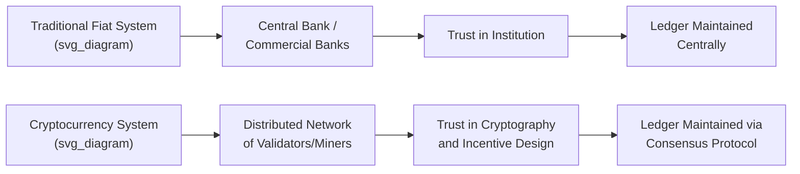
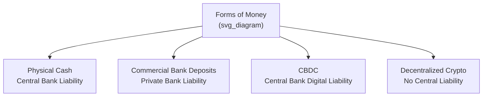

## Cryptocurrency and Digital Currency Economics

### Introduction and Scope

This topic examines cryptocurrencies and digital currencies through the lens of monetary and financial economics: what makes something function as money, how decentralized systems attempt to replicate or displace traditional monetary functions, the economic mechanisms underlying blockchain-based value systems, and the macro-financial implications of privately issued and centrally issued digital monies.

### Money: Functions and the Economic Framework

**Key Points**

- Classical monetary economics defines money by three functions: **medium of exchange**, **unit of account**, and **store of value**.
- Cryptocurrencies are evaluated against this framework to assess whether they function as "money" in the economic sense or merely as speculative assets.

| Function | Requirement | Bitcoin/Crypto Assessment |
| --- | --- | --- |
| Medium of exchange | Widely accepted, low transaction friction | Limited merchant acceptance; volatile transaction costs on some networks |
| Unit of account | Stable pricing reference | Rarely used to denominate prices due to volatility |
| Store of value | Stable purchasing power over time | Historically high volatility undermines this function; proponents argue scarcity supports long-run value |

[Inference: whether major cryptocurrencies satisfy the store-of-value function is contested among economists — proponents point to fixed supply schedules as an inflation hedge analogy to gold, while skeptics point to realized volatility far exceeding traditional stores of value; this remains an open empirical and theoretical debate rather than settled fact]

### Decentralization and Trust Mechanisms

**Key Points**

- Traditional money relies on trust in a central issuing authority (central bank) or intermediary (commercial bank) to maintain the integrity of transactions and the value of the unit.
- Cryptocurrencies attempt to substitute **cryptographic verification and distributed consensus** for institutional trust — a mechanism sometimes summarized as "trustless" or "trust-minimized" systems.
- This reflects a specific application of **mechanism design**: creating incentive structures (mining/staking rewards, transaction fees, slashing penalties) such that rational, self-interested network participants collectively maintain ledger integrity without a central coordinator.

### Consensus Mechanisms and Their Economics

**Proof of Work (PoW)**

- Miners expend real resources (computing hardware, electricity) to solve computationally difficult puzzles; the first to solve it validates the next block and earns a block reward plus transaction fees.
- Economically, PoW converts electricity and capital expenditure into network security — the cost of attacking the network (a "51% attack," acquiring majority hashing power) scales with the resources honest miners have already committed.
- Criticized for high energy consumption; Bitcoin's annualized electricity usage has been compared to that of mid-sized countries in various estimates. [Unverified: exact energy consumption estimates vary substantially by methodology and change with network hash rate and hardware efficiency over time — treat any specific figure as a point-in-time estimate, not a fixed constant]

**Proof of Stake (PoS)**

- Validators lock up ("stake") capital in the native token as collateral; validation rights and rewards are typically allocated proportional to stake, and validators face slashing (loss of staked capital) for malicious or faulty behavior.
- Economically substitutes capital-at-risk for energy expenditure as the security mechanism — the cost of attack becomes the capital required to acquire a controlling stake, rather than physical hardware and power.
- Ethereum's transition from PoW to PoS ("The Merge," 2022) is the most prominent real-world implementation, reported to reduce the network's energy consumption substantially. [Inference: relative energy savings are well-documented directionally by Ethereum Foundation sources; precise percentage figures should be verified against current primary documentation given ongoing network changes]

**Key Points**

- The choice of consensus mechanism represents a tradeoff among the "blockchain trilemma": **security, decentralization, and scalability** — improving one dimension often comes at the expense of another. [Inference: the trilemma is a widely cited heuristic in blockchain design discussions rather than a formally proven impossibility result]

### Monetary Policy of Cryptocurrencies

**Key Points**

- Unlike fiat currencies with discretionary central bank policy, many cryptocurrencies embed a **fixed, algorithmic, pre-programmed supply schedule** into their protocol.
- Bitcoin's supply follows a geometrically decreasing issuance rate via "halving" events approximately every four years, converging to a hard cap.

$$S_{max} = \sum_{i=0}^{\infty} \frac{210{,}000 \times 50}{2^i} = 21{,}000{,}000 \text{ BTC}$$

- This design reflects an explicit rejection of discretionary monetary policy in favor of rule-based, algorithmically committed scarcity — conceptually related to the economic debate between **monetary rules versus discretion** (Kydland-Prescott time-inconsistency problem), except implemented via code rather than institutional mandate.
- Critics argue fixed-supply design prevents counter-cyclical monetary response to economic shocks (i.e., no ability to expand money supply during a liquidity crisis or deflationary spiral), a core function central banks perform in modern fiat systems.

### Stablecoins

**Key Points**

- Stablecoins attempt to solve cryptocurrency price volatility by pegging value to a reference asset, typically the U.S. dollar.

| Type | Mechanism | Example Approach | Key Risk |
| --- | --- | --- | --- |
| Fiat-collateralized | Reserves held 1:1 (or near) in fiat/cash-equivalents | USDC, USDT-style models | Reserve transparency and counterparty/custodial risk |
| Crypto-collateralized | Over-collateralized with volatile crypto assets, adjusted via smart contracts | DAI-style models | Collateral value collapse triggering cascading liquidations |
| Algorithmic | Supply expansion/contraction via protocol rules to target peg, without full collateral backing | Various historical attempts | Peg failure ("death spiral") under loss of confidence |

- The **Terra/LUNA collapse (May 2022)** is a widely studied case of algorithmic stablecoin failure: the UST stablecoin's peg depended on an arbitrage mechanism with its sister token LUNA; a large UST sell-off triggered a self-reinforcing feedback loop, minting excess LUNA and collapsing both tokens' value within days. [Inference: this event is treated in the academic and policy literature as a canonical illustration of a bank-run-style dynamic ("death spiral") in algorithmic stablecoin design]
- Stablecoins raise regulatory questions analogous to those historically applied to money market funds and narrow banking: reserve adequacy, redemption risk, and systemic interconnection with traditional finance.

### Central Bank Digital Currencies (CBDCs)

**Key Points**

- A CBDC is a digital liability of the central bank itself, distinct from commercial bank deposits (which are liabilities of private banks) and from decentralized cryptocurrencies (which have no issuing authority).

- **Retail CBDCs**: accessible to the general public for everyday transactions, raising disintermediation concerns — if households can hold central bank money directly, they may withdraw deposits from commercial banks, potentially reducing bank lending capacity and increasing financial stability risk during stress periods.
- **Wholesale CBDCs**: restricted to financial institutions for interbank settlement, generally viewed as lower-risk and closer to existing real-time gross settlement (RTGS) system upgrades.
- As of recent years, multiple central banks have moved through research, pilot, or limited-launch phases (e.g., China's e-CNY, the Bahamas' Sand Dollar, and ongoing ECB digital euro investigation work); status varies significantly by jurisdiction and changes frequently. [Unverified: given the pace of policy development in this area, current implementation status by country should be verified against up-to-date central bank sources rather than treated as static]

### Price Volatility and Asset Pricing

**Key Points**

- Cryptocurrency prices exhibit substantially higher volatility than traditional asset classes (equities, bonds, fiat currencies), commonly attributed to: thin/fragmented liquidity across exchanges, speculative demand dominating use-value demand, regulatory news sensitivity, and reflexive feedback loops between price and adoption narratives.
- Traditional asset pricing models (e.g., discounted cash flow) do not map cleanly onto cryptocurrencies lacking cash flows; valuation approaches instead draw on:
  - **Network effects / Metcalfe's Law-inspired models**: value scaling with the square of active user/address count. [Speculation: empirical support for Metcalfe's Law applying cleanly to cryptocurrency valuation is contested in the academic literature and should not be treated as an established pricing model]
  - **Stock-to-flow models**: relating scarcity (existing stock relative to new production flow) to price, applied to Bitcoin by analogy to precious metals. [Speculation: stock-to-flow models for Bitcoin have faced significant predictive failures and are generally regarded skeptically in mainstream financial economics]
  - **Cost-of-production models**: relating price floors to marginal mining cost, an approach with some grounding in commodity economics but imperfect application given demand-side volatility.

### Financial Stability and Systemic Risk

**Key Points**

- Regulators and international bodies (IMF, Financial Stability Board, BIS) monitor crypto-asset market growth for spillover risk into traditional finance, particularly through:
  - **Interconnection channels**: institutional holdings of crypto assets, crypto-collateralized lending, and stablecoin reserve holdings in traditional money markets.
  - **Contagion risk**: failures in one crypto entity (exchange, lender, stablecoin) propagating to others via shared counterparty exposure — illustrated by the 2022 cascading failures across several major crypto lenders and exchanges following broad market declines.
- The **"crypto winter" of 2022** (encompassing the Terra/LUNA collapse, major lender insolvencies, and a large exchange's collapse) is frequently studied as a case illustrating maturity mismatch, opacity, and leverage risks structurally similar to traditional financial crises, occurring largely outside prudential regulatory perimeters at the time. [Inference: this characterization reflects the consensus framing in subsequent regulatory and academic post-mortems, though specific causal attribution across the various 2022 failures involves entity-specific facts]

### Transaction Costs, Scalability, and Layer 2 Economics

**Key Points**

- Base-layer blockchain transaction throughput is often low relative to traditional payment rails (e.g., card networks), creating a scalability constraint with direct economic consequences: transaction fees rise during network congestion as users bid for limited block space.
- **Layer 2 solutions** (e.g., payment channels, rollups) aim to economize on base-layer transaction costs by batching or offloading transactions, settling net positions on the base chain periodically — conceptually analogous to netting and clearing mechanisms in traditional payment systems.
- Gas fee markets function as a form of **auction mechanism**: users bid for transaction priority via fee amount, with block space acting as a scarce, congestible resource analogous to a toll road with dynamic congestion pricing. [Inference: this economic framing is a standard pedagogical analogy in the literature; specific fee market mechanism design varies by protocol]

### Regulatory and Public Policy Considerations

**Key Points**

- Key regulatory tension areas include:
  - **Classification**: whether specific crypto assets constitute securities, commodities, or a novel asset class — jurisdiction-dependent and subject to ongoing litigation and rulemaking in various countries.
  - **Consumer protection**: exchange custody practices, disclosure standards, and fraud/market manipulation enforcement.
  - **Anti-money laundering (AML) and Know-Your-Customer (KYC)**: balancing pseudonymous transaction design against financial crime prevention obligations.
  - **Taxation**: treatment of crypto transactions as property versus currency for capital gains purposes varies by jurisdiction.
- Given the fast-evolving and jurisdiction-specific nature of crypto regulation, any specific claim about current legal status in a given country should be verified against current primary regulatory sources rather than assumed static. [Unverified: regulatory frameworks in this space are subject to frequent and material change]

### Comparative Framework: Fiat vs. Cryptocurrency vs. CBDC

| Dimension | Fiat Currency | Decentralized Crypto | CBDC |
| --- | --- | --- | --- |
| Issuer | Central bank (monopoly issuance) | No central issuer (protocol-governed) | Central bank |
| Supply policy | Discretionary | Typically fixed/algorithmic | Discretionary (central bank controlled) |
| Trust basis | Institutional/legal | Cryptographic/consensus | Institutional + digital infrastructure |
| Privacy | Varies (bank intermediated) | Pseudonymous (varies by design) | Design-dependent; often debated policy tradeoff |
| Legal tender status | Yes (in issuing jurisdiction) | Rare (e.g., El Salvador's Bitcoin adoption is a notable exception) | Yes, where implemented |

### Related Topics

- Monetary policy rules vs. discretion (Kydland-Prescott time inconsistency)
- Financial regulation and systemic risk (Financial Stability Board frameworks)
- Network effects and platform economics
- Payment systems economics and real-time gross settlement (RTGS)
- Decentralized Finance (DeFi) and disintermediation of financial services
- Game theory and mechanism design in distributed systems
- Behavioral finance and speculative bubble dynamics
- Financial inclusion and digital currency access in developing economies
- Comparative central banking and digital currency pilots by jurisdiction